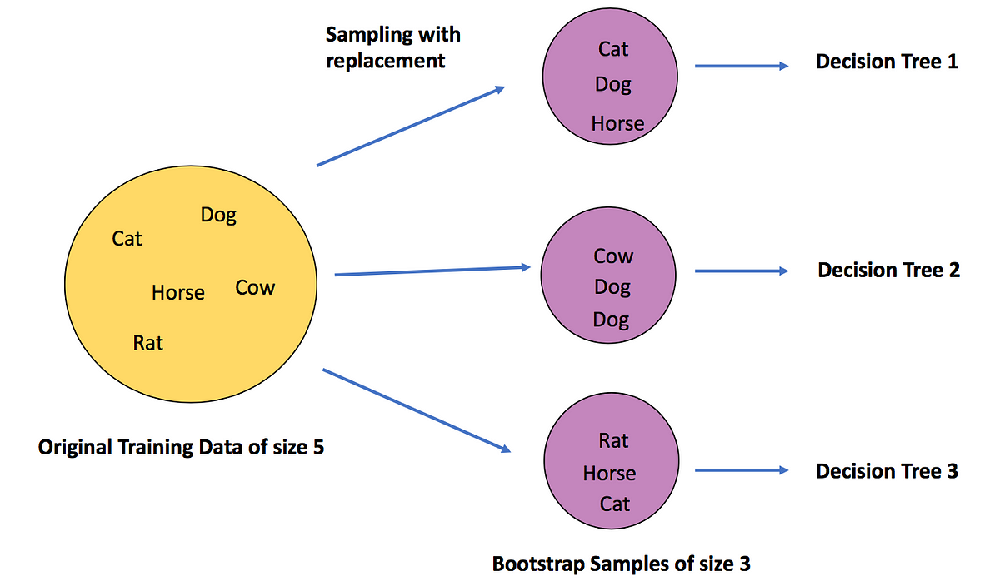

## Table of Contents

## What is Out-Of-Bag (OOB) evaluation in machine learning?

Out-Of-Bag (OOB) evaluation is a method used in machine learning, specifically with Random Forests, to estimate the performance of a model without the need for a separate validation set. When building a Random Forest, each tree is trained on a different subset of the data, and some data points are left out, or "out of the bag," for each tree. These OOB samples can be used to assess the model's performance because they were not used in the training of the particular tree that is making predictions on them.

The OOB evaluation works by having each tree in the forest predict the outcome for the samples it did not see during training. The predictions from all trees for a given sample are then combined to produce an overall prediction. This method provides a good estimate of how well the model will perform on unseen data, similar to cross-validation but without the computational cost of repeatedly splitting the data. The OOB error rate is calculated as the average error rate over all OOB samples, giving a reliable measure of the model's generalization ability.

## How does OOB evaluation differ from traditional cross-validation?

OOB evaluation and traditional cross-validation are both methods used to estimate how well a machine learning model will perform on new data. The main difference is how they use the data to make these estimates. In traditional cross-validation, the dataset is split into several parts, and the model is trained on all but one part, then tested on the left-out part. This process is repeated multiple times, with each part being left out once. This way, every data point gets a chance to be in the test set, and the results are averaged to get an overall performance estimate.

On the other hand, OOB evaluation is specifically used with Random Forests. When building a Random Forest, each tree is trained on a random subset of the data, leaving some data points out of the bag for each tree. These OOB samples are then used to evaluate the tree's performance without needing to split the data into separate training and testing sets. The performance is calculated by having each tree predict the outcome for the samples it did not see during its training, and these predictions are combined to give an overall estimate of the model's performance. This method is less computationally expensive than cross-validation because it doesn't require multiple rounds of splitting and training.

Both methods aim to give a good idea of how the model will do on new data, but OOB evaluation is simpler and faster for Random Forests, while traditional cross-validation can be used with any type of model and provides a more thorough evaluation by using all data points in the test set at some point.

## Why is OOB evaluation particularly useful in random forest algorithms?

OOB evaluation is especially handy in random forest algorithms because it lets you check how well your model is doing without needing to set aside a separate chunk of data for testing. In a random forest, each tree is built using a different random sample of the data. This means that for each tree, there are some data points it never sees, which are called the out-of-bag samples. By using these out-of-bag samples to test the tree's predictions, you can get a good idea of how your model will perform on new, unseen data.

This method saves time and effort because you don't have to do the extra work of splitting your data into training and testing sets and running the model multiple times like you would with cross-validation. Instead, OOB evaluation uses the data that's already left out during the training of each tree. This makes it a quick and efficient way to estimate your model's performance, which is why it's particularly useful in random forest algorithms.

## Can you explain the process of how OOB samples are selected in a random forest?

In a random forest, OOB samples are picked when each tree is built. Imagine you have a big bag of data points. When you make a tree, you randomly grab some of these data points from the bag, but you put each one back after you grab it. This means you might grab the same data point more than once. The data points that you don't grab for a specific tree are the OOB samples for that tree. Since you're grabbing data points randomly and with replacement, about one-third of the data points will be left out of each tree on average.

These OOB samples are super useful because they let you test how good each tree is without needing a separate test set. For each tree, you use its OOB samples to see how well it predicts. You do this for all the trees in the forest, and then you combine these predictions to get an overall idea of how the whole forest performs. This way, you can check your model's performance without the extra work of splitting your data into training and testing sets.

## What are the advantages of using OOB evaluation over other validation techniques?

OOB evaluation is a handy way to check how well your random forest model will do on new data without the need for a separate test set. In a random forest, each tree is built using a random sample of the data, and some data points are left out, or "out of the bag," for each tree. These OOB samples can be used to see how well each tree predicts, and then you can combine these predictions to get an overall idea of how the whole forest performs. This method saves time and effort because you don't have to split your data into training and testing sets and run the model multiple times like you would with cross-validation.

Another big advantage of OOB evaluation is that it's less computationally expensive than other validation techniques. With cross-validation, you have to train and test your model many times, which can be slow, especially if you have a lot of data. But with OOB evaluation, you get a good estimate of your model's performance just by using the data that's already left out during the training of each tree. This makes OOB evaluation a quick and efficient way to see how your random forest model will do on new data.

## Are there any limitations or potential biases in OOB evaluation?

OOB evaluation is a great tool for random forests, but it does have some limitations. One of the main issues is that it might not be as accurate as other methods like cross-validation. This is because OOB evaluation uses only a part of the data that was not seen by each tree, which can lead to a less reliable estimate of the model's performance compared to using all the data in a systematic way like cross-validation does.

Another potential issue with OOB evaluation is that it can be affected by the randomness in how the data is sampled for each tree. Since each tree in a random forest is built on a different random sample of the data, the OOB samples can vary a lot from tree to tree. This randomness can introduce some bias in the OOB error estimate, making it less stable than other validation techniques. However, despite these limitations, OOB evaluation remains a useful and efficient method for assessing random forest models, especially when computational resources are limited.

## How can OOB error estimates be used to assess the performance of a random forest model?

OOB error estimates are a handy way to see how well your random forest model will do on new data without needing a separate test set. In a random forest, each tree is built using a random sample of the data, and some data points are left out, or "out of the bag," for each tree. These OOB samples can be used to check how well each tree predicts, and then you combine these predictions to get an overall idea of how the whole forest performs. This method saves time and effort because you don't have to split your data into training and testing sets and run the model multiple times like you would with cross-validation.

The OOB error rate is calculated by looking at the average error rate over all the OOB samples. If your model makes a wrong prediction on an OOB sample, it adds to the error rate. By averaging these errors across all the trees, you get a good estimate of how your model will do on new data. This OOB error estimate is a useful measure of your model's generalization ability, meaning how well it can predict outcomes for data it hasn't seen before. So, if your OOB error rate is low, it's a sign that your random forest model is doing a good job and should work well on new data.

## What is the relationship between the number of trees in a random forest and the reliability of OOB estimates?

The number of trees in a random forest plays a big role in how reliable the OOB estimates are. When you have more trees, each data point gets left out of the bag less often, and it gets predicted by more trees. This means the OOB estimates become more stable and reliable because they're based on more predictions. If you have too few trees, the OOB error might jump around a lot because each tree's predictions can be quite different, and there aren't enough predictions to smooth things out.

In simple terms, the more trees you have, the better your OOB estimates will be. A good rule of thumb is to use at least a few hundred trees to make sure your OOB error estimates are as reliable as possible. This way, you can trust that the OOB error rate you get is a good measure of how well your random forest model will do on new data.

## How does OOB evaluation help in tuning hyperparameters of a random forest?

OOB evaluation is super helpful when you want to tweak the settings of a random forest to make it work better. You can change things like the number of trees, how many features each tree looks at, or how deep the trees can grow. By using OOB evaluation, you can see how these changes affect how well the model predicts without needing a separate test set. This means you can try out different settings and see right away if they make the model better or worse.

For example, if you want to find the best number of trees to use, you can build random forests with different numbers of trees and check the OOB error rate for each one. The setting that gives you the lowest OOB error rate is probably the best one to use. This way, you can fine-tune your random forest to get the best performance without the extra work of splitting your data into training and testing sets and running the model over and over again.

## Can OOB evaluation be applied to other ensemble methods besides random forests?

OOB evaluation is mostly used with random forests because of how they work. In a random forest, each tree is made with a random sample of the data, leaving some data out of the bag for each tree. These OOB samples can be used to check how well each tree predicts, and then you combine these predictions to see how the whole forest does. This method is great for random forests, but it's not as easy to use with other types of ensemble methods.

Other ensemble methods, like bagging or boosting, don't naturally create OOB samples the same way random forests do. In bagging, you might still have some data left out for each model, but it's not as straightforward to use these for evaluation like in random forests. For boosting methods, where each model is built to correct the errors of the previous ones, using OOB samples for evaluation can be tricky because the models are so closely linked. So, while OOB evaluation is really useful for random forests, it's not as commonly used or as effective with other ensemble methods.

## What are some practical considerations when implementing OOB evaluation in a machine learning pipeline?

When you're setting up OOB evaluation in your machine learning pipeline, it's important to think about how many trees you're using in your random forest. The more trees you have, the more reliable your OOB estimates will be. A good rule of thumb is to use at least a few hundred trees to make sure your OOB error estimates are as accurate as possible. This way, you can trust that the OOB error rate you get is a good measure of how well your random forest model will do on new data.

Another thing to keep in mind is how you're going to use the OOB error estimates. They can be really helpful for tuning the hyperparameters of your random forest, like the number of trees, the number of features each tree looks at, or how deep the trees can grow. By trying out different settings and checking the OOB error rate for each one, you can find the best settings for your model without needing a separate test set. This makes OOB evaluation a quick and efficient way to improve your model's performance.

## How can one interpret and act on the results obtained from OOB evaluation in a real-world scenario?

When you use OOB evaluation in a real-world scenario, you're looking at how well your random forest model will predict new data. The OOB error rate tells you the average mistake the model makes on data it hasn't seen before. If the OOB error rate is low, it's a good sign that your model is doing well and should work nicely on new data. For example, if you're using a random forest to predict whether a customer will buy a product, a low OOB error rate means your model is likely to make good guesses about future customers.

Based on the OOB error rate, you can decide what to do next. If the error rate is high, you might need to go back and tweak your model's settings, like the number of trees or how deep they can grow. You can try different settings and check the OOB error rate each time to see if it gets better. If the error rate is already low, you might feel confident enough to use your model in the real world, knowing it will likely make good predictions. This way, OOB evaluation helps you make smart choices about your model without needing a separate test set.