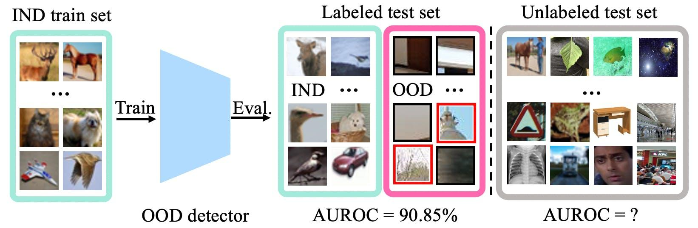

## Table of Contents

## What is Out-of-Distribution (OOD) example detection in machine learning?

Out-of-Distribution (OOD) example detection in machine learning is about spotting when a model gets data that it wasn't trained on. Imagine a model trained to recognize cats and dogs. If you show it a picture of a horse, it's an OOD example because the model hasn't seen horses during its training. The goal of OOD detection is to help the model say, "I don't know what this is," instead of guessing wrong or giving a wrong answer.

To do OOD detection, we use different methods. One common way is to check how confident the model is in its prediction. If the model isn't very sure about what it sees, it might be an OOD example. Another way is to use extra models that are trained to spot when something is different from the training data. These methods help make sure the model works well even when it sees new, unexpected things.

## Why is detecting OOD examples important in machine learning models?

Detecting Out-of-Distribution (OOD) examples is important because it helps keep machine learning models honest and reliable. When a model is given data it hasn't seen before, it might make wrong guesses. For example, if a model trained to spot cars and trucks sees a bicycle, it might wrongly say it's a car. By detecting OOD examples, the model can say, "I don't know what this is," instead of making a mistake. This makes the model more trustworthy, especially in important jobs like medical diagnosis or self-driving cars where wrong guesses can be dangerous.

Another reason OOD detection is important is that it helps keep the model's performance high. When a model keeps getting OOD data, it can start to learn the wrong things. This can make the model worse at its main job over time. By spotting OOD examples, we can stop the model from learning from bad data. This way, the model stays good at what it was trained to do, and we can also find out when we need to update the model with new training data to handle new kinds of inputs.

## What are common challenges faced when detecting OOD examples?

One big challenge in detecting OOD examples is figuring out what "out-of-distribution" really means. It's hard to draw a clear line between what the model knows and what it doesn't know. For example, if a model is trained on pictures of different dog breeds, should a picture of a wolf be considered OOD? It looks a bit like a dog, but it's not exactly what the model was trained on. This gray area makes it tricky to set up rules that catch all OOD examples without also catching some that are just a bit different but still in-distribution.

Another challenge is that OOD detection methods can sometimes be fooled. For instance, a method might look at how confident the model is in its prediction. If the model is very sure about an OOD example, it might slip through undetected. Also, some methods need a lot of extra data to work well, which can be hard to get. For example, if you want to train a model to spot OOD examples, you need examples of what OOD looks like. But if you have those examples, they're not really OOD anymore, which creates a bit of a paradox.

Lastly, OOD detection can slow down the model. Adding extra steps to check if something is OOD takes more time and computing power. This can be a problem in real-time applications where speed is important. For example, in a self-driving car, every millisecond counts, so adding OOD detection could make the car's decisions slower, which isn't safe. Balancing the need for OOD detection with the need for quick and efficient processing is a tough challenge.

## How does the DIME method approach OOD example detection?

The DIME (Distance-based Identification of Model Errors) method approaches OOD example detection by looking at how different a new example is from the examples the model was trained on. It measures this difference using something called the Mahalanobis distance. Imagine you have a bunch of points in a space, and you want to see how far a new point is from the center of those points. The Mahalanobis distance helps you do that in a smart way, taking into account how the points are spread out. If the new example is too far away based on this distance, DIME says it might be an OOD example.

DIME also uses the model's confidence to help detect OOD examples. It checks how sure the model is about its prediction for the new example. If the model isn't very confident, that's another sign that the example might be OOD. By combining the Mahalanobis distance with the model's confidence, DIME can better spot when something is out of the ordinary. This makes the model more reliable because it can say "I don't know" when it sees something it wasn't trained on.

## What are the key components of the DIME framework for OOD detection?

The DIME framework for OOD detection uses a measure called the Mahalanobis distance to figure out if a new example is different from the training data. Imagine you have a group of points in space, and you want to know how far a new point is from the center of this group. The Mahalanobis distance helps with this by considering how the points are spread out. If a new example is too far away according to this distance, DIME thinks it might be an OOD example. This distance is calculated using the mean and covariance of the features from the training data, making it a smart way to spot outliers.

Besides the Mahalanobis distance, DIME also looks at how sure the model is about its prediction for the new example. If the model isn't very confident, that's another hint that the example might be OOD. By combining the Mahalanobis distance with the model's confidence, DIME can better tell when something is out of the ordinary. This makes the model more reliable because it can say "I don't know" when it sees something it wasn't trained on, which is important for keeping the model honest and useful in real-world situations.

## Can you explain the process of training a model to detect OOD examples using DIME?

Training a model to detect OOD examples using DIME starts with understanding the data the model was trained on. First, you need to calculate the mean and covariance of the features from the training data. These are used to find the Mahalanobis distance, which helps figure out how different a new example is from the training data. The formula for the Mahalanobis distance is $$D(\mathbf{x}) = \sqrt{(\mathbf{x} - \boldsymbol{\mu})^T \boldsymbol{\Sigma}^{-1} (\mathbf{x} - \boldsymbol{\mu})}$$, where $$\mathbf{x}$$ is the new example, $$\boldsymbol{\mu}$$ is the mean of the training data, and $$\boldsymbol{\Sigma}$$ is the covariance matrix of the training data. If this distance is too big, the model thinks the example might be OOD.

Next, you also need to look at how confident the model is about its prediction for the new example. If the model isn't very sure, that's another hint that the example could be OOD. To do this, you use the model's softmax output, which gives you the probability of each class. If the highest probability is low, the model might be unsure. By combining the Mahalanobis distance with the model's confidence, DIME can better tell when something is out of the ordinary. This helps the model to be more reliable because it can say "I don't know" when it sees something it wasn't trained on, which is important for keeping the model honest and useful in real-world situations.

## What metrics are typically used to evaluate the performance of OOD detection methods?

The main metrics used to evaluate how well OOD detection methods work are the false positive rate (FPR) and the true positive rate (TPR). The FPR tells us how often the method wrongly says an in-distribution example is OOD. The TPR, also known as the recall, tells us how often the method correctly identifies an OOD example. A good OOD detection method should have a low FPR and a high TPR. This means it should rarely mistake in-distribution examples for OOD ones and should catch most of the real OOD examples.

Another important metric is the area under the receiver operating characteristic curve (AUROC). The AUROC shows how well the method can tell apart OOD examples from in-distribution ones across different thresholds. A higher AUROC means the method is better at separating the two. For example, if the AUROC is close to 1, the method is very good at spotting OOD examples. If it's close to 0.5, it's not much better than guessing randomly. These metrics help us understand how reliable and useful an OOD detection method is in real-world situations.

## How does DIME compare to other OOD detection methods like MSP and ODIN?

DIME (Distance-based Identification of Model Errors) uses the Mahalanobis distance to spot OOD examples. It looks at how different a new example is from the training data. The formula for this is $$D(\mathbf{x}) = \sqrt{(\mathbf{x} - \boldsymbol{\mu})^T \boldsymbol{\Sigma}^{-1} (\mathbf{x} - \boldsymbol{\mu})}$$. If this distance is big, DIME thinks the example might be OOD. DIME also checks how sure the model is about its prediction. If the model isn't very confident, that's another hint that the example could be OOD. This method works well because it combines the distance measure with the model's confidence, helping it to be more accurate.

MSP (Maximum Softmax Probability) and ODIN (Out-of-DIstribution detector for Neural networks) are other ways to detect OOD examples. MSP looks at the highest probability from the model's softmax output. If this probability is low, the example might be OOD. ODIN is similar to MSP but adds a bit of noise to the input to make the model more sure about in-distribution examples. This helps it tell OOD examples apart better. Compared to DIME, MSP and ODIN are simpler because they don't need to calculate the Mahalanobis distance. But DIME can be more accurate because it uses both the distance and the model's confidence to make its decision.

## What datasets are commonly used to test OOD detection algorithms?

Common datasets used to test OOD detection algorithms include CIFAR-10, CIFAR-100, and ImageNet. CIFAR-10 and CIFAR-100 are small image datasets, where CIFAR-10 has 10 classes like cats and dogs, and CIFAR-100 has 100 classes like different types of animals and vehicles. ImageNet is a much larger dataset with thousands of classes, making it good for testing how well OOD detection works on a bigger scale. These datasets help researchers see how well their OOD detection methods work on different kinds of data.

Another popular dataset is MNIST, which is made up of handwritten digits from 0 to 9. Researchers often use MNIST along with other datasets like Fashion-MNIST, which has images of clothing items, to test how well OOD detection can tell the difference between very different types of data. For example, a model trained on MNIST might see Fashion-MNIST images as OOD examples. Using these datasets helps make sure that OOD detection methods are reliable and can work well in many different situations.

## What are some practical applications of OOD detection in real-world scenarios?

OOD detection is really useful in self-driving cars. Imagine a car that's been trained to recognize other cars, bikes, and pedestrians. If it sees something it wasn't trained on, like a big balloon in the road, it needs to know that it's something new and different. OOD detection helps the car say, "I don't know what this is," instead of guessing wrong and maybe causing an accident. This makes the car safer because it can slow down or stop when it sees something unexpected, giving the driver time to take over if needed.

In healthcare, OOD detection can be a lifesaver. Doctors use machines to help diagnose diseases from things like X-rays or blood tests. If the machine sees something it hasn't been trained on, like a rare disease, it needs to tell the doctor that it's unsure. This way, the doctor knows to look closer or get a second opinion. OOD detection helps make sure the machine doesn't give wrong answers that could lead to the wrong treatment, keeping patients safer and healthier.

## How can OOD detection methods be integrated into existing machine learning pipelines?

OOD detection methods can be added to existing [machine learning](/wiki/machine-learning) pipelines by including an extra step after the model makes its prediction. For example, after the model guesses what a picture is, you can use a method like DIME to check if the picture is something the model has seen before. DIME does this by figuring out how different the new picture is from the ones used to train the model. It uses a measure called the Mahalanobis distance, which is calculated with the formula $$D(\mathbf{x}) = \sqrt{(\mathbf{x} - \boldsymbol{\mu})^T \boldsymbol{\Sigma}^{-1} (\mathbf{x} - \boldsymbol{\mu})}$$. If this distance is too big, DIME thinks the picture might be something new and different, and it tells the model to say "I don't know" instead of guessing wrong.

Another way to add OOD detection is by using simpler methods like MSP or ODIN. These methods look at how sure the model is about its guess. If the model isn't very sure, it might be looking at something it hasn't seen before. MSP checks the highest probability the model gives, and if it's low, it thinks the example might be OOD. ODIN does something similar but adds a bit of noise to the input to make the model more sure about things it knows. Adding these checks after the model's prediction helps make the whole system more reliable because it can tell when it's seeing something new and different, and it can ask for help or more data if needed.

## What are the current research directions and future challenges in OOD example detection?

Current research in OOD example detection is focusing on making methods better at telling the difference between what a model knows and what it doesn't know. Scientists are looking into new ways to measure how different a new example is from the training data. For example, they're working on improving the Mahalanobis distance, which is used in methods like DIME. The formula for Mahalanobis distance is $$D(\mathbf{x}) = \sqrt{(\mathbf{x} - \boldsymbol{\mu})^T \boldsymbol{\Sigma}^{-1} (\mathbf{x} - \boldsymbol{\mu})}$$. They're also trying to use more of the model's inner workings, like its layers and how confident it is, to spot OOD examples more accurately. Another big focus is on making OOD detection work well with less extra data, because getting lots of OOD examples can be hard.

Future challenges in OOD example detection include making these methods work faster and use less computer power. In real-life situations like self-driving cars or medical diagnosis, speed is really important. Adding OOD detection can slow things down, so researchers need to find ways to do it quickly without losing accuracy. Another challenge is making OOD detection work well in all sorts of different situations. Right now, a method might work well on one type of data but not on another. Scientists want to make OOD detection methods that can handle many different kinds of data and still spot new and different examples correctly. This means they need to keep testing and improving these methods to make them more reliable and useful in the real world.

## References & Further Reading

[1]: Hendrycks, D., & Gimpel, K. (2017). ["A Baseline for Detecting Misclassified and Out-of-Distribution Examples in Neural Networks."](https://arxiv.org/abs/1610.02136) arXiv preprint arXiv:1610.02136.

[2]: Lee, K., Lee, H., Lee, K., & Shin, J. (2018). ["A Simple Unified Framework for Detecting Out-of-Distribution Samples and Adversarial Attacks."](https://arxiv.org/abs/1807.03888) Advances in Neural Information Processing Systems 31.

[3]: Liang, S., Li, Y., & Srikant, R. (2018). ["Enhancing The Reliability of Out-of-distribution Image Detection in Neural Networks."](https://arxiv.org/abs/1706.02690) arXiv preprint arXiv:1706.02690.

[4]: DeVries, T., & Taylor, G. W. (2018). ["Learning Confidence for Out-of-Distribution Detection in Neural Networks."](https://arxiv.org/abs/1802.04865) arXiv preprint arXiv:1802.04865.

[5]: Ren, J., Liu, P., Fertig, E., Snoek, J., Poplin, R., DePristo, M., Dillon, J., & Lakshminarayanan, B. (2019). ["Likelihood Ratios for Out-of-Distribution Detection."](https://arxiv.org/abs/1906.02845) Advances in Neural Information Processing Systems 32.