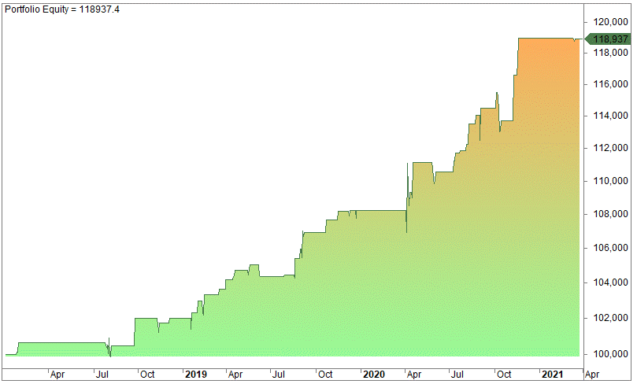

Out-of-sample (OOS) testing is an essential methodology in algorithmic trading, designed to enhance the robustness of trading strategies. By simulating how a strategy might perform in future, uncertain market conditions, OOS testing assists traders in crafting algorithms that are not only effective based on historical data but also resilient in adapting to new data streams. This process is crucial in protecting against overfitting, a common pitfall where a model becomes overly tailored to past data and captures noise instead of meaningful signals. Such models are likely to falter in live trading environments, where the data landscape is inherently different from the past.

In practical terms, OOS testing aids in forecasting the potential success and reliability of a trading strategy. By assessing a model's performance on data that it has not encountered before, traders can mitigate risk and enhance the confidence they have in their predictive models. This approach, therefore, ensures that the trading strategies are not only reflective of historical trends but are also equipped to handle the volatility and unpredictability of live markets.



Implementing OOS testing properly involves understanding how to segment historical data effectively. Typically, a dataset is divided into two parts: one for model development and optimization (the in-sample data), and another portion reserved exclusively for testing (the out-of-sample data). The insights gained from this approach allow traders to refine their models, ensuring that they are equipped to handle evolving market dynamics. Ultimately, by rigorously applying OOS testing, traders can not only minimize potential losses but also enhance the overall reliability and durability of their trading strategies in real-world conditions.

## Table of Contents

## Understanding Overfitting and Curve Fitting

Overfitting, also known as curve fitting, is a phenomenon where a trading model becomes excessively tailored to historical data, thereby capturing noise rather than significant market patterns. This adaptation to irrelevant fluctuations can cause the model to perform poorly when applied to fresh, unseen data. Overfitting is particularly problematic in [algorithmic trading](/wiki/algorithmic-trading), where robust performance across various market conditions is paramount. 

The main issue with overfitting arises because the model effectively 'learns' from the idiosyncrasies of the historical dataset instead of genuine trends. In technical terms, the model's complexity is high enough to reduce in-sample error, but this comes at the cost of increased out-of-sample error. Essentially, such a model optimizes for past performance at the expense of future generalization.

To mathematically understand overfitting, consider a model that fits a dataset $X$ with corresponding outcomes $Y$. If the model complexity is too high, it closely approximates the function $Y = f(X) + \varepsilon$, where $\varepsilon$ is the noise in the data. While this might minimize the residual sum of squares within the sample, say 
$$
\text{RSS} = \sum (Y_i - \hat{Y}_i)^2,
$$
the model's predictive power diminishes on new data because it replicates the noise ($\varepsilon$) rather than the true underlying function $f(X)$.

Out-of-sample (OOS) testing mitigates the risk of overfitting by evaluating the model on data it hasn't previously encountered. This validation strategy provides a check against models that show impressive results in-sample but falter during real-time application. By using a separate portion of historical data as an evaluation benchmark, traders can better assess the inherent adaptability of their models to future data.

Applying OOS testing involves setting aside a segment of the dataset exclusively for validation purposes, untouched by model development processes. This ensures any predictive performance observed in this phase mirrors potential real-world applicability, providing a more accurate reflection of the model's expected trading efficacy. In practice, ensuring that out-of-sample results align closely with in-sample results is a key indicator of a robust trading model, capable of withstanding diverse market conditions.

In conclusion, addressing overfitting is crucial for the development of reliable algorithmic trading strategies. Through OOS testing, traders can verify that their models capture meaningful market insights rather than circumstantial data noise, ultimately facilitating more consistent financial performance.

## What is Out of Sample Testing?

Out-of-sample (OOS) testing is a fundamental technique used in algorithmic trading to objectively assess the performance and robustness of a trading strategy. The process involves dividing historical data into two distinct sets: in-sample data and out-of-sample data. 

**In-sample data** is employed during the model development phase. Traders and analysts use this dataset to build, refine, and optimize their trading strategies. This involves analyzing historical price movements and identifying patterns or indicators that could inform future trading decisions. The goal during this phase is to create a model that appears successful based on past data.

However, a model that performs exceptionally well on in-sample data may not necessarily perform well on new, unseen data—a phenomenon linked to overfitting. To address this, **out-of-sample data** is used. This data set remains untouched during the model development phase and is reserved exclusively for testing the strategy. By evaluating the model using data it has not encountered before, traders can obtain an unbiased view of the strategy's effectiveness in simulating real-world trading scenarios.

The key advantage of OOS testing is its ability to provide a more realistic estimate of a trading model's future performance. If the model is resilient and adaptable, it should perform comparably well on both the in-sample and out-of-sample data. This indicates that the model has captured genuine market patterns rather than being overly tailored to past data noise.

Incorporating OOS testing within the strategy development lifecycle is crucial. It acts as a critical checkpoint that enables traders to gauge the robustness and adaptability of their trading models. By ensuring a model's reliability before it's deployed in live trading, OOS testing significantly enhances the likelihood of achieving consistent performance over time.

## In Sample vs. Out of Sample Testing

In-sample and out-of-sample testing are crucial processes in the development and validation of trading strategies. During the strategy development phase, in-sample data is employed to fine-tune and optimize trading models. This data segment is used intensively to adjust parameters to better fit historical market behaviors and apparent seasonal trends. The aim is to develop a model that captures the underlying patterns in the data, often referred to as 'training' the model.

Once the model has been developed using in-sample data, its performance must be assessed using out-of-sample data. This data set remains untouched during the development process and serves as an independent evaluation measure. The purpose of testing on this separate data set is to provide an unbiased assessment of the strategy’s performance by simulating future unknown market conditions. If the model performs well on out-of-sample data, it suggests that the model has successfully learned the market patterns rather than just memorizing the specific historical instances it was trained on.

Achieving comparable results across both in-sample and out-of-sample datasets increases the trader's confidence that the strategy can effectively adapt to new market conditions. A discrepancy between the in-sample and out-of-sample results often indicates overfitting, where the model is too tailored to the historical data, capturing noise rather than significant trends. Therefore, out-of-sample testing is indispensable in confirming that a trading strategy has genuine predictive power and not just optimization against historical data sets.

## Best Practices for OOS Testing

Out-of-sample (OOS) testing is a fundamental process in the validation of trading strategies, and structuring this process effectively is crucial for obtaining reliable results. One widely adopted approach is to allocate 70% of the historical data for in-sample testing and 30% for OOS testing. This division allows for comprehensive model development while preserving a substantial portion for evaluating model performance on unseen data.

An alternative approach involves a 50/50 split of the data. In certain cases, traders choose to reserve older data as the OOS portion. This method assesses a strategy's resilience across different market phases, highlighting its robustness against varying conditions. When selecting which data to allocate for OOS testing, it's essential to avoid biases such as data snooping. Strategically choosing the location and percentage of OOS data helps mitigate such biases, ensuring the evaluation accurately reflects potential live trading performance.

Moreover, using multiple OOS periods, possibly from different years or market conditions, can provide a more challenging and realistic assessment of strategy performance. Randomized OOS testing, where the OOS section is randomly selected multiple times, further enhances the robustness of the evaluation by reducing the chances of coincidental success in certain market conditions.

To implement these strategies, traders can use Python to automate data splitting. For example:

```python
import numpy as np
import pandas as pd

# Load historical data
data = pd.read_csv('historical_data.csv')
data_length = len(data)

# 70/30 Split
train_size = int(data_length * 0.7)
train_data = data[:train_size]  # In-sample data
test_data = data[train_size:]   # Out-of-sample data

# 50/50 Split
half_data = int(data_length * 0.5)
train_data_50 = data[:half_data]
test_data_50 = data[half_data:]
```

This code snippet demonstrates how to divide historical data for 70/30 and 50/50 splits, ensuring the process is systematic and reproducible. Careful consideration of these practices can greatly enhance the reliability of a trading model, ultimately aiding in its potential success in live trading conditions.

## Benefits and Pitfalls of OOS Testing

Out-of-sample (OOS) testing provides a critical safeguard against overfitting, where it serves as an integral method for evaluating the performance of trading strategies on unseen data. This form of testing improves forecasting accuracy by ensuring that models are not merely tailored to historical noise but can generalize well to future market conditions. When a trading strategy yields consistent results across both in-sample and out-of-sample data, it indicates a higher likelihood of reliable performance in live trading scenarios.

However, while OOS testing is a powerful tool, it is not without its challenges. One significant pitfall is the potential bias introduced by the selection of data periods used for OOS testing. If the chosen out-of-sample period is overly optimistic—such as a time of unusually high market stability or predictable trends—the test may fail to reveal vulnerabilities in the trading strategy. This can lead to overestimation of the strategy's effectiveness, resulting in unforeseen losses when applied to real-time trading.

Furthermore, it is crucial to use randomized OOS testing to counteract such biases. By selecting out-of-sample periods across different market conditions—ranging from bullish to bearish phases and including periods of high [volatility](/wiki/volatility-trading-strategies)—traders can better assess the robustness of their models. This method ensures a more comprehensive evaluation by exposing the strategy to a wider variety of scenarios, thereby testing its adaptability and resilience.

In conclusion, while OOS testing significantly enhances the reliability of trading models by reducing the risk of overfitting, traders should exercise caution in data selection to avoid biases. Employing randomized testing across diverse market conditions can provide a more accurate reflection of a strategy's potential performance, contributing to more consistent outcomes in live trading environments.

## Key Takeaways

Out-of-sample (OOS) testing is a critical tool in algorithmic trading for avoiding overfitting by assessing strategy performance on data it has not previously encountered. This process effectively simulates live trading conditions, providing a more realistic evaluation of a trading model's capabilities. By selecting appropriate OOS data, traders can enhance model robustness, ensuring strategies are adaptable and capable of handling unforeseen market dynamics.

Prudent human judgment in choosing the location and size of OOS data is vital. This careful selection aids in crafting more robust trading strategies, as it minimizes bias and increases the likelihood of generalizing well to new data. A thoughtful approach may involve considering different market regimes, ensuring the OOS dataset reflects diverse conditions a strategy might face.

However, relying solely on OOS testing is insufficient. While it is a strong defense against overfitting, further robustness checks, such as stress testing under extreme conditions or cross-validation, are recommended. These additional measures help set more precise expectations for the strategy's performance in live trading environments, thereby providing a more comprehensive evaluation of its reliability. Incorporating these practices leads to well-rounded analysis and better preparedness for real-world applications.

## Conclusion

Out-of-sample testing is a vital component in developing robust and adaptable algorithmic trading strategies. By providing a mechanism to evaluate model performance on data that were not part of the model development process, OOS testing helps traders anticipate how a strategy will behave in a live trading environment. This type of testing reduces the risk of overfitting, where a model might be overly tailored to historical data patterns without capturing the underlying market behaviors.

Although OOS testing cannot eliminate all risks associated with trading, it significantly decreases the likelihood of strategic failure due to overfitting. Strategies that perform well out of sample are more likely to maintain their effectiveness when subjected to real-world market conditions, characterized by uncertainty and variability. As a consequence, OOS testing acts as a safeguard, helping traders avoid strategies that merely exploit coincidental patterns in historical data.

Incorporating OOS testing within the strategy development cycle equips traders to better handle the challenges of live trading. It encourages a disciplined and structured approach, ensuring that strategies are not only theoretically sound but also practically viable. By doing so, traders improve their readiness for the unpredictable nature of financial markets, thus achieving more consistent performance over time.

## References & Further Reading

[1]: Bergstra, J., Bardenet, R., Bengio, Y., & Kégl, B. (2011). ["Algorithms for Hyper-Parameter Optimization."](https://proceedings.neurips.cc/paper/2011/file/86e8f7ab32cfd12577bc2619bc635690-Paper.pdf) Advances in Neural Information Processing Systems 24.

[2]: ["Advances in Financial Machine Learning"](https://www.amazon.com/Advances-Financial-Machine-Learning-Marcos/dp/1119482089) by Marcos Lopez de Prado

[3]: ["Evidence-Based Technical Analysis: Applying the Scientific Method and Statistical Inference to Trading Signals"](https://www.amazon.com/Evidence-Based-Technical-Analysis-Scientific-Statistical/dp/0470008741) by David Aronson

[4]: ["Machine Learning for Algorithmic Trading"](https://github.com/stefan-jansen/machine-learning-for-trading) by Stefan Jansen

[5]: ["Quantitative Trading: How to Build Your Own Algorithmic Trading Business"](https://books.google.com/books/about/Quantitative_Trading.html?id=j70yEAAAQBAJ) by Ernest P. Chan