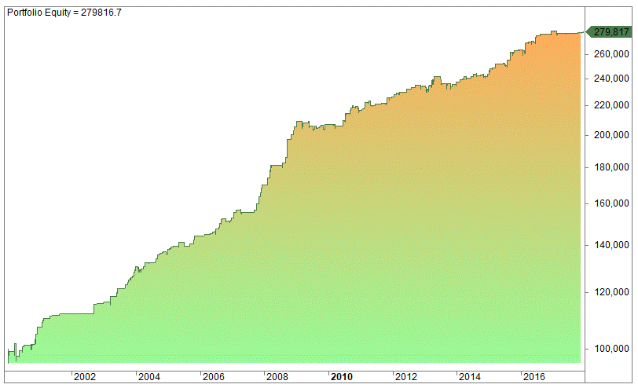

Algorithmic trading has dramatically transformed financial markets by enabling systematic and data-driven decision-making processes. Central to crafting efficient trading algorithms is the process of backtesting—a procedure that involves the division of historical data into 'in-sample' and 'out-of-sample' datasets. These datasets are pivotal for assessing and refining trading strategies to ensure robustness and adaptability to real market conditions.

Backtesting serves as an essential practice to validate the effectiveness of a trading strategy before its deployment in live trading environments. It is a methodological step where historical data is used to simulate trades and gauge how an algorithm might perform. However, a trading model that performs optimally on historical data does not necessarily guarantee success with new data. This is where out-of-sample testing becomes crucial.



Out-of-sample testing enables the evaluation of a strategy on data that was not part of the initial model training. By applying the model to new and unseen data, traders can verify that the strategy is not just tailored to past market conditions but is adaptable and resilient enough to handle future market dynamics. This form of testing is instrumental in helping traders avoid the pitfalls of overfitting—a scenario where a model displays spectacular performance on historical data by effectively memorizing it, but fails when exposed to new, unseen data.

This article focuses on exploring the methodology, significance, and best practices for effective out-of-sample testing in algorithmic trading. It aims to equip traders with practical insights and examples to execute successful out-of-sample tests, thereby enhancing their strategies’ potential for success in the ever-evolving financial markets.

## Table of Contents

## What is an Out-of-Sample Test?

An out-of-sample test is a critical evaluation approach in algorithmic trading, designed to validate the performance of a trading strategy on data that the strategy has never encountered before. This process involves a clear demarcation of historical market data into two distinct sets: the in-sample data, which is used for the development and training of the trading strategy, and the out-of-sample data, which serves as an independent dataset for testing the strategy's robustness and adaptability.

During the strategy development phase, in-sample data is utilized to identify patterns, optimize parameters, and fine-tune the strategy to achieve optimal performance based on historical trends. This dataset acts as the training ground where various models and rules are applied to capture the inherent market dynamics present in the past data. The objective is to maximize efficiency and profitability using the available historical information.

However, to ensure that the strategy's success is not merely a result of overfitting to the quirks of the historical data, it is crucial to conduct an out-of-sample test. The out-of-sample data, which remains untouched and unseen during the training phase, provides a fresh set of conditions that the strategy must tackle. By applying the trading strategy to this independent dataset, traders can objectively assess whether the strategy can generalize its decision-making process to perform effectively in different market conditions that were not part of the training phase.

The performance metrics gleaned from out-of-sample testing are vital indicators of a strategy's potential to succeed in real-world trading scenarios. If a strategy that performs well in-sample also demonstrates solid and predictable returns out-of-sample, traders can be more confident that the strategy has captured genuine market patterns rather than noise.

In practice, the division of data for in-sample and out-of-sample testing can be achieved using various techniques. A common method is to use a specific portion of the historical data up to a certain date as in-sample data and reserve the subsequent data as out-of-sample. Another technique involves the use of rolling windows, where the in-sample and out-of-sample datasets are shifted over time to evaluate performance across different timeframes.

By carefully implementing out-of-sample testing, traders can mitigate the risks associated with model overfitting and significantly enhance their confidence in the long-term viability of their trading strategies.

## Importance of Out-of-Sample Testing

Out-of-sample testing serves as a crucial component in the evaluation of an [algorithmic trading](/wiki/algorithmic-trading) strategy. Primarily, it addresses the common issue of overfitting, a situation where a model performs exceptionally well on historical data—known as the in-sample data—but fails to generalize to new, unseen data. This is akin to memorizing answers to specific questions rather than understanding the underlying concepts.

1. **Avoiding Overfitting**: Overfitting occurs when a trading strategy is excessively tailored to the noise and anomalies present in historical data. The out-of-sample test acts as a safeguard against this by ensuring that the strategy is not just optimized for past market conditions but can also adapt to future, unpredictable scenarios. A strategy that passes out-of-sample testing is more likely to possess adaptability and resilience. This is because it demonstrates that the pattern or logic employed by the algorithm is valid across different datasets and is not confined to idiosyncrasies in historical data.

2. **Increasing Confidence**: Successful out-of-sample testing contributes to increasing confidence in the long-term viability of a trading strategy. When a strategy is tested against data it has not encountered before and achieves favorable results, traders can be more assured of its robustness. This confidence is essential for both individual traders and institutional investors who rely on algorithmic strategies to manage significant sums of capital. It reduces the psychological burden and potential second-guessing that can arise in live trading situations.

3. **Scenario Testing**: Markets are dynamic and influenced by a myriad of factors, leading to varying conditions over time. In-sample tests might not cover all possible market environments—such as bull, bear, or sideways markets—because they are restricted to specific historical periods. Out-of-sample testing enables traders to simulate different market scenarios, helping to assess the strategy's performance across a broader spectrum of conditions. This comprehensive analysis ensures that the developed strategy retains its effectiveness irrespective of the market regime changes, thereby enhancing its applicability.

In summary, out-of-sample testing is vital for developing robust trading strategies. It helps avoid overfitting, builds confidence in strategy deployment, and facilitates scenario testing. By verifying that a strategy can handle both known and unknown data, traders can mitigate risks and increase their probability of success in the financial markets.

## Best Practices for Out-of-Sample Testing

### Best Practices for Out-of-Sample Testing

Out-of-sample testing is a crucial step in evaluating the robustness and effectiveness of trading strategies. Employing best practices when conducting these tests ensures that your findings are both reliable and actionable. Below are recommended practices to optimize out-of-sample testing.

**Splitting Data:** A systematic approach to dividing historical data into in-sample and out-of-sample sets is essential. One common method is the rolling window approach, which involves successively training the model on historical data and testing it on subsequent periods. This method helps ensure that both datasets reflect a range of market conditions. For example:

```python
import pandas as pd
from sklearn.model_selection import TimeSeriesSplit

# Assuming 'data' is a pandas DataFrame with a 'date' column
data = pd.read_csv('historical_trading_data.csv')
time_splits = TimeSeriesSplit(n_splits=5)

for train_index, test_index in time_splits.split(data):
    train_set, test_set = data.iloc[train_index], data.iloc[test_index]
    # Train your model on train_set
    # Test your model on test_set
```

**Maintaining Data Integrity:** To preserve the independence of out-of-sample data, it is critical to avoid any exposure to it during the strategy development phase. This practice prevents subconscious bias that could leak into the model. The best way to ensure this is to keep data partitions strictly separate and employ blinding techniques where possible.

**Using Adequate Sample Sizes:** A statistically significant sample size is paramount for meaningful out-of-sample testing. The size should be chosen based on the variability of the data and the complexity of the model. A simple rule of thumb is to allocate around 70-80% of the data to the in-sample set and 20-30% to the out-of-sample set. However, for strategies that rely on detecting rare market events, larger out-of-sample datasets may be necessary to capture these phenomena adequately.

By adhering to these best practices, traders can derive more reliable conclusions from out-of-sample tests, reducing the likelihood of overfitted models and enhancing their strategies' applicability in real-world trading scenarios.

## Common Challenges and Pitfalls

In the practice of out-of-sample testing in algorithmic trading, various challenges and pitfalls can arise, potentially compromising the validity and reliability of the testing outcomes. These challenges must be acknowledged and addressed to ensure that the trading strategies developed are robust and capable of withstanding future market scenarios.

**Data Snooping**: One of the most significant risks in out-of-sample testing is data snooping, which occurs when information from the out-of-sample dataset inadvertently influences the development of a trading strategy. This can happen when traders, consciously or unconsciously, modify their strategies based on latent insights derived from the out-of-sample data, thereby introducing a bias towards favorable outcomes. To mitigate this risk, it's crucial to maintain strict separation between in-sample and out-of-sample datasets throughout the strategy development process, ensuring that the out-of-sample data remains truly unseen until the final testing phase.

**Over-optimization**: Also known as curve fitting, over-optimization refers to the excessive tuning of a trading strategy to fit historical market data, often resulting in a strategy that performs well on past data but poorly in real-world applications. This problem arises when model parameters are adjusted to minimize errors in the in-sample dataset to the extent that the model becomes tailored to past idiosyncrasies rather than generalizable patterns. To prevent over-optimization, it is essential to strike a balance between model complexity and adaptability and to incorporate regularization techniques that penalize overly complex models.

**Choosing the Wrong Sample Size**: The selection of appropriate sample sizes for both in-sample and out-of-sample testing is critical. An unbalanced sample size—either too small or too large—can lead to skewed and unreliable performance results. An extremely small out-of-sample can limit the strategy's exposure to diverse market conditions, while an overly large one may not leave sufficient data for robust strategy development during the in-sample phase. As a rule of thumb, partitioning data using a time-based approach or other logical criteria, like the Pareto principle (80/20 rule), can often provide a balanced perspective and enhance the validity of the testing process.

Addressing these challenges requires a disciplined approach to data handling, careful strategy design, and an ongoing commitment to improving testing methodologies. By doing so, traders can enhance the credibility and effectiveness of their out-of-sample tests in predicting future performance accurately.

## Real-world Applications of Out-of-Sample Testing

Out-of-sample testing plays a crucial role in various financial and technological domains, providing significant value by ensuring the validity and robustness of models and strategies. One of the primary applications of out-of-sample testing is in portfolio management. By using data that the model has not previously encountered, portfolio managers can evaluate potential returns and risks associated with an investment strategy. This evaluation is essential before the strategy is deployed in live markets, as it helps to prevent unexpected outcomes that could arise from market [volatility](/wiki/volatility-trading-strategies) or structural changes. Out-of-sample tests enable managers to cautiously approach changes in their portfolios, thereby preserving capital and optimizing performance.

In algorithmic trading systems, out-of-sample testing is crucial for maintaining the robustness of trading strategies. Quantitative hedge funds and financial institutions rely heavily on algorithmic trading strategies to make fast, data-driven decisions. By leveraging out-of-sample tests, these organizations can identify which models are likely to perform well across a range of market conditions, safeguarding against the risks associated with overfitting to historical data. Such testing ensures that strategies maintain their predictive power when deployed in real-time trading environments.

Beyond finance, out-of-sample testing finds applications in [machine learning](/wiki/machine-learning), where it is used to validate models before they are implemented in real-world scenarios. This process involves training machine learning models on a subset of the data and testing their efficacy on previously unseen data. It ensures that these models can generalize well beyond their training data, a crucial requirement for applications ranging from autonomous driving systems to predictive analytics in various industries. By conducting out-of-sample tests, developers and researchers can confirm that their models perform reliably in practice, leading to more effective and trustworthy machine learning solutions.

## Conclusion

Out-of-sample testing is an indispensable part of developing resilient algorithmic trading strategies due to its ability to validate performance beyond historical data. This process provides a safeguard against the common pitfall of overfitting, where a strategy might appear successful when tested on past data but fails under new conditions. Although out-of-sample testing does not completely eliminate the risk of failure, it plays a crucial role in mitigating this risk by ensuring that strategies are thoroughly stress-tested.

The integration of out-of-sample testing into the strategy development process serves to enhance the robustness and adaptability of trading algorithms. By objectively verifying strategy performance across different market conditions, traders can better predict long-term viability. This robust testing framework forms a foundation for confidence in deploying strategies in live markets, where unpredictability is inherent.

Traders adopting out-of-sample testing as a standard practice are likely to increase their chances of success in the constantly evolving financial markets. The adherence to this rigorous testing standard helps ensure that only strategies demonstrating statistical significance and adaptability are implemented. Consequently, out-of-sample testing is not merely a procedural step but a strategic imperative, offering traders a competitive edge in navigating the dynamic landscape of algorithmic trading.

## References & Further Reading

[1]: Bergstra, J., Bardenet, R., Bengio, Y., & Kégl, B. (2011). ["Algorithms for Hyper-Parameter Optimization."](https://papers.nips.cc/paper/4443-algorithms-for-hyper-parameter-optimization) Advances in Neural Information Processing Systems 24.

[2]: ["Advances in Financial Machine Learning"](https://www.amazon.com/Advances-Financial-Machine-Learning-Marcos/dp/1119482089) by Marcos Lopez de Prado

[3]: ["Evidence-Based Technical Analysis: Applying the Scientific Method and Statistical Inference to Trading Signals"](https://www.amazon.com/Evidence-Based-Technical-Analysis-Scientific-Statistical/dp/0470008741) by David Aronson

[4]: ["Machine Learning for Algorithmic Trading"](https://github.com/stefan-jansen/machine-learning-for-trading) by Stefan Jansen

[5]: ["Quantitative Trading: How to Build Your Own Algorithmic Trading Business"](https://books.google.com/books/about/Quantitative_Trading.html?id=j70yEAAAQBAJ) by Ernest P. Chan