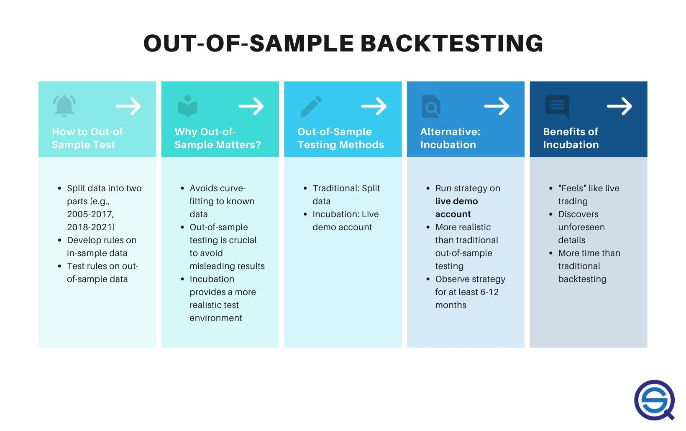

## Table of Contents

## What is an out-of-sample trading test?

An out-of-sample trading test is a way to check if a trading strategy works well on data it hasn't seen before. When you create a trading strategy, you usually use some data to build and fine-tune it. This data is called in-sample data. But to make sure the strategy is good and not just working well by chance, you need to test it on different data, which is called out-of-sample data.

In an out-of-sample test, you apply your trading strategy to this new set of data that wasn't used during the strategy's development. This helps you see if the strategy can perform well in real-world situations, where the market conditions might be different from what you used to build the strategy. If the strategy does well on out-of-sample data, it gives you more confidence that it might work well in the future.

## Why are out-of-sample tests important in trading?

Out-of-sample tests are important in trading because they help you check if your trading strategy will work in the real world. When you make a trading strategy, you use some past data to build and adjust it. But the market changes all the time, so you need to see if your strategy can still work well with new data it hasn't seen before. This new data is called out-of-sample data.

If your strategy does well on out-of-sample data, it means it's more likely to work in the future when you start using it for real trading. This gives you more confidence in your strategy. Without out-of-sample tests, you might think your strategy is good just because it worked on the data you used to build it, but it might not work well in different market conditions. So, out-of-sample tests help you avoid being fooled by good results that only happen by chance.

## How do out-of-sample tests differ from in-sample tests?

In-sample tests and out-of-sample tests are two ways to check how good a trading strategy is. In-sample tests use the same data that was used to make and adjust the strategy. This means you're testing the strategy on data it has already seen. It's like practicing with the same set of questions before a test. In-sample tests can help you fine-tune your strategy, but they don't tell you if it will work well in the future because the strategy might be too good at answering those specific questions.

Out-of-sample tests, on the other hand, use new data that the strategy hasn't seen before. This is like taking a test with completely new questions. By using out-of-sample data, you can see if your strategy can handle different market conditions. If it does well, you can feel more confident that it might work in the future. Out-of-sample tests are important because they help you avoid being tricked by good results that only happen by chance on the data you used to build the strategy.

## What are the basic steps to conduct an out-of-sample trading test?

To conduct an out-of-sample trading test, start by splitting your data into two parts: one for building your trading strategy and the other for testing it. The first part is called in-sample data, and you use it to create and fine-tune your strategy. Once you're happy with your strategy, set it aside and don't change it anymore. The second part of the data, which you haven't used yet, is called out-of-sample data. This is the new data you'll use to test your strategy.

Next, apply your trading strategy to the out-of-sample data without making any changes to it. This means you're seeing how well your strategy works on data it hasn't seen before. Look at the results to see if your strategy makes good trades and if it's profitable. If it does well, it's a good sign that your strategy might work in the future. If it doesn't do well, you might need to go back and rethink your strategy or try a different one.

## What data should be used for out-of-sample testing?

For out-of-sample testing, you should use data that your trading strategy hasn't seen before. This means you need to set aside some of your data and not use it when you're building or adjusting your strategy. This new data should be from a different time period than the data you used to create your strategy. It's important that this out-of-sample data is similar to the kind of data you expect to see in the future when you start trading for real.

The out-of-sample data should be large enough to give you a good idea of how your strategy will work. If you use too little data, you might not get a clear picture of how well your strategy will do. Also, make sure the out-of-sample data covers different market conditions, like times when the market goes up, goes down, or stays the same. This way, you can see if your strategy can handle all sorts of situations.

## How can you ensure the integrity of out-of-sample data?

To make sure your out-of-sample data stays good and useful, you need to keep it separate from the data you use to build your trading strategy. This means you should not look at or use the out-of-sample data while you're making or changing your strategy. If you do, you might accidentally make your strategy fit too well to the out-of-sample data, which would make your test less reliable. So, it's important to set aside the out-of-sample data from the start and not touch it until you're ready to test your strategy.

Also, make sure the out-of-sample data is big enough and covers different times and market conditions. This way, you can see how your strategy works in all sorts of situations, not just one kind. If the out-of-sample data is too small or only from one type of market condition, your test might not show you the full picture. By keeping your out-of-sample data separate and making sure it's varied and large enough, you can trust the results of your test more and feel confident about using your strategy in the future.

## What common pitfalls should be avoided when performing out-of-sample tests?

One common mistake when doing out-of-sample tests is peeking at the out-of-sample data while building the trading strategy. If you look at or use this data before the test, you might accidentally make your strategy fit too well to it. This can make your test results look better than they really are, which is not helpful. To avoid this, keep the out-of-sample data completely separate and don't touch it until you're ready to test your strategy.

Another pitfall is using out-of-sample data that is too small or not varied enough. If the data set is too small, you might not get a clear picture of how your strategy will work in different situations. Also, if the data only covers one type of market condition, like a bull market, you won't know if your strategy can handle other conditions, like a bear market. Make sure your out-of-sample data is big enough and includes different times and market conditions to get a good test.

Lastly, changing your strategy after seeing the out-of-sample results can also be a problem. If you keep tweaking your strategy based on the out-of-sample data, you're not really doing an out-of-sample test anymore. You're just making your strategy fit the test data, which defeats the purpose. Stick to your original strategy and use the out-of-sample test to see how it performs without making any changes.

## How do you interpret the results of an out-of-sample trading test?

When you look at the results of an out-of-sample trading test, you want to see if your trading strategy did well on data it hadn't seen before. If your strategy made good trades and was profitable during the test, that's a good sign. It means your strategy might work well in the future when you start using it for real trading. You should also check if the strategy did well in different market conditions, like when the market was going up, down, or staying the same. If it worked well in all these situations, you can feel more confident about using it.

On the other hand, if your strategy didn't do well in the out-of-sample test, it might mean you need to rethink your strategy or try a different one. Bad results could mean your strategy was too good at working with the in-sample data but not good at handling new data. It's important not to change your strategy just because it didn't do well in the test. Instead, use the test results to learn what might not work in the future and then go back to the drawing board to make a better strategy.

## What statistical measures are used to evaluate out-of-sample performance?

To check how well a trading strategy works on out-of-sample data, you can use some simple numbers to help you understand the results. One common measure is the return, which shows if your strategy made money or lost money. Another important number is the Sharpe ratio, which tells you how much return you got for the risk you took. A higher Sharpe ratio means you got more return for less risk, which is good. You can also look at the maximum drawdown, which is the biggest loss your strategy had from its highest point. A smaller maximum drawdown means your strategy didn't lose as much money at its worst time.

Another useful measure is the win rate, which tells you how often your strategy made a winning trade. A high win rate means your strategy was right more often than it was wrong. The average win and average loss can also help you see if your winning trades made more money than your losing trades lost. Lastly, you can use the Sortino ratio, which is like the Sharpe ratio but only looks at the bad risk, or downside risk. A higher Sortino ratio means your strategy did well while keeping the bad risks low. By looking at these numbers, you can get a good idea of how your strategy might work in the future.

## How can overfitting be detected and mitigated in out-of-sample tests?

Overfitting happens when a trading strategy works too well on the data used to build it but doesn't do well on new data. To spot overfitting, you can compare how your strategy does on the in-sample data, which you used to make the strategy, with how it does on the out-of-sample data, which is new data it hasn't seen before. If your strategy does much better on the in-sample data than on the out-of-sample data, it might be overfitting. Another way to check is by using a measure called the information coefficient, which looks at how well your strategy's predictions match the actual results. If the information coefficient is much lower on out-of-sample data, it's a sign of overfitting.

To fix overfitting, you can try to make your strategy simpler. This means using fewer rules or signals to make trading decisions. A simpler strategy is less likely to fit too well to the in-sample data and more likely to work well on new data. Another way to help is by using a technique called cross-validation, where you split your data into many smaller parts and test your strategy on different combinations of these parts. This can help you see if your strategy works well across different sets of data, not just the one you used to build it. By keeping your strategy simple and using cross-validation, you can reduce the chance of overfitting and make your strategy more reliable for real trading.

## What advanced techniques can enhance the reliability of out-of-sample trading tests?

One advanced technique to make out-of-sample trading tests more reliable is called walk-forward optimization. This method involves breaking your data into smaller parts and using one part to build your strategy and the next part to test it. You keep moving forward in time, building and testing your strategy on different parts of your data. This helps you see if your strategy can adapt to changing market conditions and reduces the chance of overfitting because you're always testing on new data.

Another technique is using [machine learning](/wiki/machine-learning) algorithms to help with out-of-sample testing. Machine learning can find patterns in data that might be hard for a person to see. You can train a machine learning model on your in-sample data and then test it on out-of-sample data to see if it still works well. To make sure the model doesn't overfit, you can use techniques like regularization, which keeps the model from getting too complex, and ensemble methods, which combine many simple models to make a better one. These methods can help you create a trading strategy that's more likely to work well in the future.

## How do out-of-sample tests integrate with machine learning models in trading strategies?

Out-of-sample tests are really important when you use machine learning models for trading strategies. When you make a machine learning model, you train it on some data to help it learn how to make good trading decisions. This data is called in-sample data. But to make sure the model will work well in the future, you need to test it on new data it hasn't seen before, which is called out-of-sample data. By doing this, you can see if the model can handle different market conditions and if it's not just good at working with the data it was trained on.

To use out-of-sample tests with machine learning models, you split your data into two parts. You use one part to train your model and the other part to test it. After training the model, you don't change it anymore. Then, you use the out-of-sample data to see how well the model does on new trades. If the model does well on this new data, it's a good sign that it might work well in the future. This helps you avoid overfitting, where the model is too good at working with the training data but not good at handling new data. By using out-of-sample tests, you can make your trading strategy more reliable and trustworthy.

## References & Further Reading

[1]: Bergstra, J., Bardenet, R., Bengio, Y., & Kégl, B. (2011). ["Algorithms for Hyper-Parameter Optimization."](https://papers.nips.cc/paper/4443-algorithms-for-hyper-parameter-optimization) Advances in Neural Information Processing Systems 24.

[2]: ["Advances in Financial Machine Learning"](https://www.amazon.com/Advances-Financial-Machine-Learning-Marcos/dp/1119482089) by Marcos Lopez de Prado

[3]: ["Evidence-Based Technical Analysis: Applying the Scientific Method and Statistical Inference to Trading Signals"](https://www.amazon.com/Evidence-Based-Technical-Analysis-Scientific-Statistical/dp/0470008741) by David Aronson

[4]: ["Machine Learning for Algorithmic Trading"](https://github.com/stefan-jansen/machine-learning-for-trading) by Stefan Jansen

[5]: ["Quantitative Trading: How to Build Your Own Algorithmic Trading Business"](https://books.google.com/books/about/Quantitative_Trading.html?id=j70yEAAAQBAJ) by Ernest P. Chan