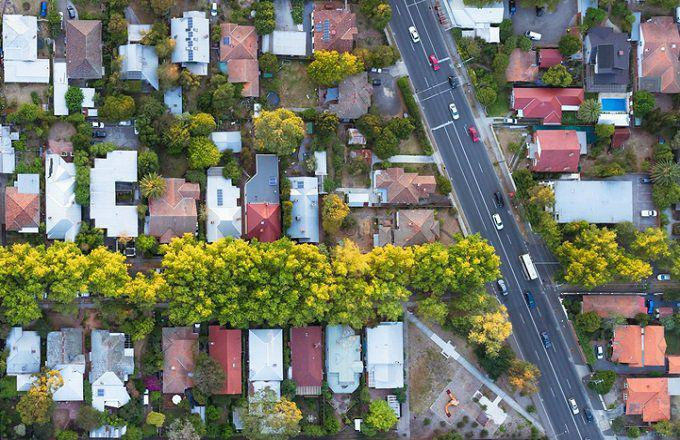

## Table of Contents

## What is out-of-state property investment?

Out-of-state property investment means buying a house or building in a different state from where you live. People do this to make money from renting out the property or selling it later for a higher price. It can be a good way to spread your investments and not put all your money in one place. However, it can also be tricky because you are far away and might not know the area well.

When you invest in property in another state, you need to do a lot of research. You should learn about the local real estate market, the neighborhoods, and the laws. It's also important to find good people to help you, like a local real estate agent and a property manager. They can help you find the right property and take care of it while you are not there. Even though it takes more work, out-of-state investing can be a smart move if you plan carefully.

## Why might someone consider investing in property out of state?

People might think about buying a house or building in another state because it can help them make more money. If they live in a place where houses are expensive, they might find cheaper properties in other states. This can mean more profit when they rent out the property or sell it later. Also, by investing in different states, they spread out their risk. If the housing market in their home state goes down, their out-of-state property might still do well.

Another reason is that some states might have better job growth or more people moving in, which can make property values go up. Someone might see a good opportunity in a growing city or town that's not in their home state. They could buy a property there and benefit from the area's growth. Plus, if they like to travel or want a vacation home, buying in another state can be a way to enjoy a new place while also making an investment.

## What are the initial steps to take when considering out-of-state property investment?

When you start thinking about buying a house or building in another state, the first thing to do is research. You need to learn about the real estate market in the state you're interested in. Look at how much houses cost, how much rent is, and if the area is growing or not. You should also find out about the local laws and taxes that could affect your investment. It's a good idea to read news and reports about the area to see if it's a good place to invest.

Next, you'll want to find a local real estate agent who knows the area well. They can help you find the right property and tell you if it's a good deal. It's also important to visit the area if you can, to see the neighborhoods and get a feel for the place. If you can't visit, you might need to rely on virtual tours and photos. Once you have a property in mind, you should talk to a property manager. They can take care of your property while you're not there, like finding tenants and fixing things that break.

## How do you research and select the right location for out-of-state investment?

When you're thinking about investing in a property out of state, the first thing to do is to research different places. You should look at things like how much houses cost, how much rent is, and if the area is growing or shrinking. Some websites can give you this information. You can also read news and reports about the area to see if it's a good place to invest. It's important to understand the local economy and job market because they affect how much people can pay for rent and how much houses might be worth in the future.

Once you have a few places in mind, you need to find out more about the neighborhoods. You can use online maps and real estate websites to see what the areas look like and what's around them, like schools and shops. Talking to a local real estate agent can help a lot because they know the area well and can tell you about good neighborhoods. If you can, visiting the place is the best way to get a feel for it. If you can't visit, you might need to rely on virtual tours and photos. Remember, the right location is one where you think the property value will go up and where you can find good tenants.

## What are the key financial considerations when investing in out-of-state properties?

When you invest in a property in another state, you need to think about the money part carefully. First, you should figure out how much money you can spend. This includes the price of the property, but also other costs like taxes, insurance, and any repairs or upgrades you might need to do. You also need to think about the money you'll spend on a property manager, who can help take care of the property since you're far away. It's important to make sure you have enough money saved up for these costs and any unexpected things that might happen.

Another big thing to consider is how much money you can make from the property. You need to look at how much rent you can charge and if it will cover your costs and give you some profit. You should also think about how much the property might be worth in the future. If the area is growing, the property value might go up, and you could make money when you sell it. But, if the area isn't doing well, you might lose money. So, it's important to do a lot of research and maybe talk to a financial advisor to make sure it's a good investment for you.

## How can you manage an out-of-state property effectively?

Managing a property in another state can be tough because you are far away. A good way to handle this is to hire a property manager who lives in the area. They can take care of finding tenants, collecting rent, and fixing any problems that come up. It's important to find a trustworthy property manager who you can talk to easily. They should give you regular updates about your property so you know what's going on, even if you're not there.

Another important thing is to use technology to help manage your property. You can use apps and websites to keep track of your money, like rent payments and bills. Some tools let you see your property from far away with cameras or virtual tours. It's also a good idea to set up a way to talk with your tenants, like email or a messaging app, so you can answer their questions quickly. By using a property manager and technology, you can take care of your out-of-state property well, even if you're not close by.

## What are the common legal and tax implications of out-of-state property ownership?

When you own a property in another state, you need to know about the legal rules there. Each state has its own laws about renting out properties and how to handle tenants. You might need to follow special rules about how much rent you can charge, how to evict someone, and what kind of lease agreements you can use. It's a good idea to talk to a local lawyer who knows these laws well. They can help you make sure you're doing everything right and not breaking any rules. If you don't follow the local laws, you could get into trouble or have to pay fines.

Taxes are another big thing to think about. When you own property in another state, you might have to pay taxes there, like property taxes and income taxes on the rent you collect. The tax rules can be different from your home state, so it's important to understand what you need to pay. You might need to file tax returns in both your home state and the state where your property is. It can get complicated, so talking to a tax advisor who knows about out-of-state properties can help a lot. They can make sure you're paying the right amount of taxes and not missing any important tax rules.

## How do you find and vet reliable local property management services?

Finding a good property manager in another state starts with asking around. You can talk to local real estate [agents](/wiki/agents), other property owners, or even join online groups where people share tips about investing in that area. They might know good property managers and can tell you about their experiences. You can also search online for property management companies in the area you're interested in. Look at their websites and read reviews from other clients to get an idea of how they work.

Once you have a list of possible property managers, you need to check them out carefully. Call them and ask questions about how they handle things like finding tenants, collecting rent, and fixing problems. It's important to know how much they charge and what services they offer. You can also ask for references from other property owners they work with. Talking to these references can give you a better idea if the property manager is reliable and good at their job. By taking your time to ask around and do your research, you can find a property manager you can trust to take care of your out-of-state property.

## What strategies can be used to maximize returns on out-of-state investments?

To make the most money from an out-of-state property, you need to pick the right place to invest. Look for areas where the economy is growing and more people are moving in. These places usually have jobs and good schools, which means more people want to rent or buy homes there. This can make your property worth more money over time. Also, try to buy the property at a good price. If you can find a house that's cheaper than others in the area, you can make more profit when you rent it out or sell it later.

Another way to get more money from your out-of-state investment is to manage it well. Hire a good property manager who knows the area and can take care of everything while you're not there. They can help find good tenants, keep the property in good shape, and make sure you're getting the rent on time. You can also use technology to keep an eye on things from far away. Keep an eye on your costs, like taxes and repairs, and try to keep them low so you can make more profit. By choosing the right place and managing your property well, you can make your out-of-state investment more successful.

## How do market trends and economic factors influence out-of-state property investments?

Market trends and economic factors play a big role in deciding if buying a property in another state is a good idea. For example, if a city is growing and more people are moving there, the demand for houses can go up. This can make property values increase, which means you could sell your property for more money later or charge more rent. On the other hand, if a city is losing jobs and people are moving away, the value of properties might go down. It's important to look at things like job growth, new businesses, and even new schools or hospitals being built because they can make an area more attractive to live in.

Economic factors like interest rates and the overall health of the economy can also affect your investment. If interest rates are low, it's easier for people to borrow money to buy houses, which can drive up property prices. But if the economy is not doing well, people might not want to buy or rent houses, which can hurt your investment. Keeping an eye on these trends and understanding how they work can help you pick the right place and time to invest in a property out of state. By doing your homework and staying updated on what's happening in the area, you can make smarter choices and hopefully make more money from your investment.

## What are the risks associated with out-of-state property investment and how can they be mitigated?

When you buy a house or building in another state, there are some risks you need to know about. One big risk is not knowing the area well. If you're far away, it can be hard to understand the local market and what's happening with property values. Another risk is that you might have trouble managing the property from a distance. Things like finding good tenants, fixing problems, and collecting rent can be harder when you're not close by. Plus, if the economy in that state goes down, your property might lose value, and you could lose money.

To make these risks smaller, you should do a lot of research before you buy. Look at the local market, talk to people who know the area, and maybe even visit if you can. Hiring a good property manager can also help a lot. They can take care of your property while you're not there, like finding tenants and fixing things that break. It's also smart to have some money saved up for emergencies, like if you need to fix something big or if you can't find a tenant for a while. By planning carefully and getting help from local experts, you can lower the risks and make your out-of-state investment safer.

## How can technology and tools assist in managing and optimizing out-of-state property investments?

Technology and tools can really help you take care of a house or building in another state. You can use apps and websites to keep track of your money, like rent payments and bills. Some tools let you see your property from far away with cameras or virtual tours. This way, you can check on your property even if you're not there. There are also apps that help you talk to your tenants easily, like email or messaging apps, so you can answer their questions quickly and keep them happy.

Another way technology helps is by giving you information about the local real estate market. You can use websites and apps to see how much houses are selling for and how much rent is in the area. This can help you make smart choices about when to buy, sell, or change the rent. By using technology, you can manage your out-of-state property better, even if you're not close by. It makes things easier and can help you make more money from your investment.

## What is Algorithmic Trading in Real Estate Investments?

Algorithmic trading, often associated with financial markets, is increasingly becoming relevant to real estate investments. This approach entails using computer algorithms to make buy, sell, or hold decisions, drawing from large sets of data to accurately predict market behaviors and optimize investment strategies.

**Analyzing Large Data Sets**

Algorithms excel at analyzing extensive data sets, a feature that is particularly beneficial in real estate where data originates from diverse sources such as property prices, economic indicators, and demographic trends. These variables influence the real estate market by affecting property demand, pricing, and overall market health. Through [machine learning](/wiki/machine-learning) techniques and statistical models, algorithms can identify patterns and predict future market movements, aiding investors in decision-making processes.

For example, suppose an algorithm is fed with data on a city's economic growth rate, employment [statistics](/wiki/bayesian-statistics), housing supply, and rental yields. It can predict whether real estate prices are likely to increase or decrease. A simple predictive model could be a linear regression where property prices ($Y$) are predicted as:

$$
Y = \beta_0 + \beta_1 \times \text{Economic Growth} + \beta_2 \times \text{Employment Rate} + \epsilon
$$

Here, $\beta$ values represent the coefficients that the algorithm learns to determine the relationship strength between property prices and influencing factors, with $\epsilon$ being the error term.

**Managing Property Portfolios and Mitigating Risks**

Algorithmic trading offers advantages in managing property portfolios by optimizing asset allocation and minimizing risks. Algorithms assess market conditions continuously to adjust investment portfolios, rebalance assets, or [exit](/wiki/exit-strategy) poorly performing properties. Risk management is enhanced as the algorithms can react instantaneously to market changes, unlike traditional investment approaches dependent on periodic manual reviews.

By simulating numerous scenarios, algorithms can forecast potential risks and calculate the Value at Risk (VaR), representing the maximum expected loss within a given confidence interval over a specific period. This quantitative assessment allows investors to make informed decisions about risk exposure and diversification.

**Challenges and Limitations**

Despite its potential, [algorithmic trading](/wiki/algorithmic-trading) in real estate is not without challenges. One limitation is the requirement of high-quality, up-to-date data from various sources, which can be difficult to acquire or integrate due to inconsistent formats and potential inaccuracies.

Moreover, the real estate market has inherent complexities — such as location specificity, regulatory environments, and unique property characteristics — which may not always be captured effectively by algorithms. Over-reliance on algorithms can lead to errors, especially when market conditions change rapidly or behave unpredictably. Furthermore, these systems necessitate substantial initial development costs and technical expertise to design, implement, and maintain the algorithmic infrastructure.

In summary, while algorithmic trading holds promise for streamlining real estate investment strategies, it requires careful management of data quality, complex market variables, and technological resources to maximize its benefits effectively.

## References & Further Reading

[1]: Galster, G. C. (2019). ["The Case for Spatially Inclusive Housing Policy in the United States."](https://press.uchicago.edu/ucp/books/book/chicago/M/bo32427403.html) Journal of Housing Economics.

[2]: Marston, S. A. (2011). ["Environment and Planning A: Economy and Space."](https://journals.sagepub.com/home/epn) SAGE Publications.

[3]: Lopez de Prado, M. (2018). ["Advances in Financial Machine Learning."](https://www.amazon.com/Advances-Financial-Machine-Learning-Marcos/dp/1119482089) Wiley.

[4]: Chan, E. P. (2008). ["Quantitative Trading: How to Build Your Own Algorithmic Trading Business."](https://github.com/ftvision/quant_trading_echan_book) John Wiley & Sons.

[5]: Poterba, J., Weil, D. N., & Shiller, R. J. (1991). ["House Price Dynamics: The Role of Tax Policy and Demography."](https://www.brookings.edu/wp-content/uploads/1991/06/1991b_bpea_poterba_weil_shiller.pdf) Brookings Papers on Economic Activity.