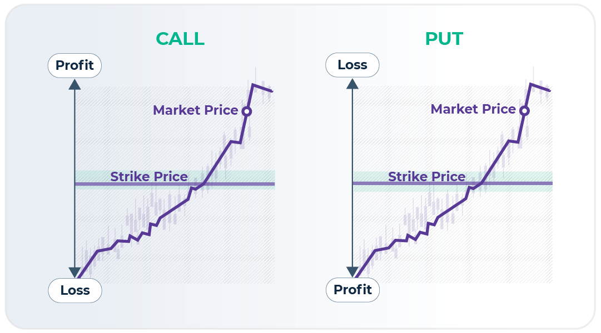

## Table of Contents

## What does 'Out Of The Money' (OTM) mean in options trading?

In options trading, 'Out Of The Money' (OTM) refers to an option that does not have any intrinsic value. This means that if you were to exercise the option right now, it would not be profitable. For a call option, it is OTM if the current stock price is below the strike price. For a put option, it is OTM if the current stock price is above the strike price. OTM options only have time value, which is the potential for the option to become profitable before it expires.

Traders often buy OTM options because they are cheaper than options that are in the money or at the money. However, these options also have a higher risk of expiring worthless because they need a significant move in the stock price to become profitable. For example, if you buy an OTM call option with a strike price of $50 when the stock is trading at $45, the stock needs to rise above $50 before the option has any value. If the stock stays below $50 until the option expires, the option will be worthless.

## How is an option classified as 'Out Of The Money'?

An option is classified as 'Out Of The Money' (OTM) when it has no intrinsic value. This means that if you used the option right now, you wouldn't make any money. For a call option, it's OTM if the current price of the stock is less than the strike price. For a put option, it's OTM if the current price of the stock is more than the strike price. So, if you have a call option with a strike price of $50 and the stock is trading at $45, that option is OTM.

OTM options only have time value, which is the hope that the stock price will move in the right direction before the option expires. These options are cheaper to buy because they are riskier. They need a big move in the stock price to become profitable. If the stock price doesn't move enough by the expiration date, the OTM option will expire worthless, and you'll lose the money you paid for it.

## What is the difference between 'Out Of The Money', 'In The Money', and 'At The Money' options?

Options in trading can be 'Out Of The Money' (OTM), 'In The Money' (ITM), or 'At The Money' (ATM). An OTM option means it has no real value if you used it right now. For a call option, it's OTM if the stock price is below the strike price. For a put option, it's OTM if the stock price is above the strike price. OTM options are cheaper to buy but they're riskier because they need a big move in the stock price to become worth something.

An ITM option has real value right now. For a call option, it's ITM if the stock price is above the strike price. For a put option, it's ITM if the stock price is below the strike price. ITM options cost more to buy but they're less risky because they already have value. An ATM option is right in the middle. It's when the stock price is the same as the strike price. ATM options are kind of a middle ground; they're not as cheap as OTM options but not as expensive as ITM options.

These terms help traders understand the potential value and risk of their options. OTM options might seem like a good deal because they're cheaper, but they're more likely to expire worthless. ITM options are safer but cost more. ATM options can go either way, depending on how the stock price moves.

## Can you explain the financial implications of buying an OTM option?

When you buy an OTM option, you're taking a chance on a big move in the stock price. These options are cheaper because they don't have any real value right now. If the stock price stays the same or doesn't move enough, your OTM option will expire worthless, and you'll lose the money you paid for it. This makes OTM options riskier because they need a significant change in the stock price to become profitable.

On the other hand, if the stock price does move in the right direction and goes past the strike price, your OTM option can become very valuable. The potential reward can be big if you guessed right about the stock's movement. But remember, the odds are against you because most OTM options end up expiring without any value. So, while OTM options can offer a big payoff, they come with a high risk of losing your investment.

## What are the potential benefits of trading OTM options?

Trading OTM options can be appealing because they are cheaper to buy than ITM or ATM options. Since they don't have any real value right now, you don't have to pay as much upfront. This lower cost means you can buy more options with the same amount of money, giving you a chance to make a bigger profit if the stock price moves in the right direction. It's like buying a lottery ticket; it doesn't cost much, but if you win, the payoff can be huge.

Another benefit of OTM options is the flexibility they offer. Because they are less expensive, you can use them to bet on big moves in the stock market without risking a lot of money. This can be useful if you have a strong feeling about where a stock is headed but you're not sure if it will happen before the option expires. OTM options let you take a shot at a big win without breaking the bank, making them a popular choice for traders who like to take risks.

## How does the time value affect the pricing of OTM options?

The time value is a big part of what makes an OTM option worth something. Even though an OTM option has no real value right now, it can still be worth something because there's still time for the stock price to move in the right direction. The longer there is until the option expires, the more time value it has. This means that OTM options with more time until they expire will be more expensive than ones that are about to expire, even if they have the same strike price.

As the expiration date gets closer, the time value of an OTM option goes down. This is because there's less time for the stock price to move enough to make the option worth something. If the stock price doesn't move in the right direction before the option expires, the time value will go to zero, and the option will expire worthless. So, the time value is like a ticking clock that affects how much you pay for an OTM option and how much risk you're taking.

## What role does implied volatility play in the valuation of OTM options?

Implied [volatility](/wiki/volatility-trading-strategies) is a big deal when it comes to figuring out how much an OTM option is worth. It's a guess about how much the stock price might move in the future. If people think the stock price could swing a lot, the implied volatility goes up. This makes OTM options more expensive because there's a bigger chance the stock price will move enough to make the option worth something before it expires. So, if you're looking at an OTM option and the implied volatility is high, you'll have to pay more for it.

On the other hand, if people think the stock price won't move much, the implied volatility goes down. This makes OTM options cheaper because there's less chance the stock price will hit the strike price before the option expires. Traders watch implied volatility closely because it can change how much they have to pay for OTM options and how likely they are to make money from them. So, implied volatility is like a weather forecast for the stock market that affects the price of OTM options.

## How do OTM options behave as the expiration date approaches?

As the expiration date of an OTM option gets closer, its value starts to change in a big way. Since OTM options don't have any real value right now, they only have time value. This time value goes down as the expiration date comes near because there's less time for the stock price to move enough to make the option worth something. If the stock price stays the same or doesn't move enough, the OTM option will lose its time value and expire worthless.

The behavior of OTM options near expiration can be really exciting or really disappointing. If the stock price starts to move in the right direction and gets close to the strike price, the value of the OTM option can go up a lot. This is because there's still a chance it could become profitable before it expires. But if the stock price doesn't move enough, the option will lose all its value and you'll lose the money you paid for it. So, as the expiration date approaches, OTM options become a race against time, making them both risky and potentially rewarding.

## What strategies involve using OTM options, and how are they implemented?

One common strategy for using OTM options is called a 'long shot' strategy. This is when you buy OTM options because they're cheap, hoping that the stock price will make a big move in the right direction before the option expires. For example, if you think a stock that's trading at $50 will jump to $60 soon, you might buy an OTM call option with a strike price of $55. If the stock does go above $55, your option can become very valuable. But if the stock stays below $55, your option will expire worthless, and you'll lose the money you paid for it. This strategy is risky but can lead to big rewards if you guess right.

Another strategy is using OTM options for hedging. This means you're trying to protect other investments you have. For instance, if you own a stock and you're worried it might drop in price, you might buy an OTM put option as insurance. If the stock price falls below the strike price of the put option, it can help offset the losses on your stock. The OTM put option is cheaper than an ITM put option, so it's a more affordable way to hedge, but it only pays off if the stock price drops a lot. This strategy helps you manage risk without spending too much money.

A third strategy involves using OTM options in a spread. This is when you buy and sell options at the same time to limit your risk. For example, you might buy an OTM call option and sell a further OTM call option. This is called a bull call spread. The OTM call you buy has a lower strike price, and the one you sell has a higher strike price. If the stock price goes up but stays between the two strike prices, you can make money. The OTM options make this strategy cheaper than using ITM options, but it also limits your potential profit. This strategy balances risk and reward, making it a popular choice for many traders.

## How can an investor manage the risk associated with OTM options?

Managing the risk of OTM options can be tricky because they're more likely to expire without any value. One way to handle this risk is by not putting all your money into OTM options. Instead, you can use them as a small part of a bigger investment plan. This way, if the OTM options don't work out, you won't lose everything. Another way to manage risk is by using OTM options to hedge other investments. For example, if you own a stock and you're worried it might go down, you can buy an OTM put option to protect yourself. This put option can help cover losses on your stock if the price drops a lot.

Another strategy to manage risk is by using OTM options in spreads. A spread involves buying and selling options at the same time, which can limit how much you can lose. For instance, in a bull call spread, you buy an OTM call option and sell another OTM call option with a higher strike price. This limits your potential profit but also caps your risk. By carefully choosing which options to buy and sell, you can create a strategy that fits your risk level. Remember, the key to managing risk with OTM options is to understand that they're risky and to use them wisely as part of a broader investment approach.

## What are the advanced considerations for pricing OTM options using option pricing models?

When you're trying to figure out the price of OTM options, option pricing models like the Black-Scholes model come into play. These models use a bunch of different things to guess how much an OTM option should cost. One big thing is the time left until the option expires. The more time there is, the more valuable the option can be because there's more time for the stock price to move in the right direction. Another important thing is implied volatility, which is a guess about how much the stock price might move in the future. If people think the stock price will swing a lot, the implied volatility goes up, making the OTM option more expensive. The model also looks at the current stock price, the strike price, and the risk-free [interest rate](/wiki/interest-rate-trading-strategies) to come up with a price.

But there's more to it than just these factors. The Black-Scholes model assumes that stock prices move in a normal way, but in real life, they can jump around a lot more than the model expects. This means that other models, like the binomial model, might be better at pricing OTM options because they can handle these big jumps better. Also, the model doesn't take into account things like big news events or changes in the market that can make stock prices move a lot. So, when you're using these models to price OTM options, you have to remember that they're just guesses based on certain assumptions. The real world can be a lot messier, so it's important to use these models as a starting point and then adjust based on what's actually happening in the market.

## How do market conditions and economic indicators influence the performance of OTM options?

Market conditions and economic indicators can have a big impact on how OTM options do. When the market is doing well and people are feeling good about the economy, the stock prices might go up a lot. This can make OTM call options more likely to become profitable because there's a better chance the stock price will go above the strike price. On the other hand, if the market is shaky or if bad economic news comes out, stock prices might drop. This can help OTM put options because there's a bigger chance the stock price will fall below the strike price. So, the overall mood of the market and economic news can change how likely it is for an OTM option to make money.

Economic indicators like unemployment rates, inflation, and interest rates also play a role. If the unemployment rate goes down, it might mean more people have money to spend, which can push stock prices up and help OTM call options. But if inflation goes up a lot, it might make people worried about the future, and stock prices could go down, helping OTM put options. Interest rates can also affect how much people want to invest in stocks. If interest rates go up, borrowing money gets more expensive, and this can slow down the economy and make stock prices fall, which can be good for OTM put options. So, keeping an eye on these economic indicators can help you guess how OTM options might do.

## What does 'Out of the Money' (OTM) mean?

An option is deemed 'out of the money' (OTM) when it lacks intrinsic value. This status is crucial in distinguishing the profitability potential of different types of options.

- **Call Options**: A call option is considered OTM when the market price of the underlying asset is lower than the strike price. In this scenario, exercising the option would not be advantageous as buying the asset at a higher price than the current market value results in a loss. This can be represented mathematically by the condition:  
$$
  \text{Market Price} < \text{Strike Price}

$$

- **Put Options**: Conversely, a put option is OTM when the market price of the underlying asset exceeds the strike price. Exercising this put option would mean selling the asset at a price lower than the current market value, which is unfavorable. This is represented by:  
$$
  \text{Market Price} > \text{Strike Price}

$$

OTM options primarily derive value from their time value, since they hold no intrinsic value until the market price moves favorably. Such options, therefore, heavily depend on significant price movements of the underlying asset before expiration to become profitable. These options are typically less expensive than 'in the money' options due to their speculative nature and higher risk.

In trading strategies, OTM options serve a unique role, often incorporated into speculative trades or complex strategies like spreads and straddles. Investors leverage OTM options to potentially capitalize on substantial returns with lower initial investment costs, although they bear the risk of the options expiring worthless if the anticipated price movement does not occur. Unlike 'at the money' and 'in the money' options, OTM options provide more significant leverage, influencing investors who predict large market swings.

## What are the key financial terms in options trading?

Options trading involves various financial terms that are fundamental to understanding the mechanics and dynamics of trading strategies. Here, we explain five key terms essential for navigating options markets: strike price, expiration date, premium, intrinsic value, and time value.

**Strike Price**: This is the predetermined price at which the underlying asset can be bought or sold when exercising the option. It is crucial in determining the option’s moneyness—whether it is in the money (ITM), at the money (ATM), or out of the money (OTM). For instance, in a call option, the option is ITM if the current market price of the underlying asset exceeds the strike price.

**Expiration Date**: This term refers to the last day on which the option holder can exercise their right to buy or sell the underlying asset. After this date, options become void and lose all their time value. Options close to expiration may experience high price volatility due to the time decay factor impacting the premium.

**Premium**: The premium is the price paid by the buyer to the seller to acquire the option contract. It is influenced by several factors, including the strike price, the underlying asset’s current market price, implied volatility, and the time remaining until expiration. The premium is the income for the option seller and the cost for the option buyer.

**Intrinsic Value**: For ITM options, the intrinsic value represents the difference between the asset's current market price and the strike price. Specifically, for a call option, it is calculated as $\text{max}(0, \text{current asset price} - \text{strike price})$. Conversely, for a put option, it is $\text{max}(0, \text{strike price} - \text{current asset price})$. OTM and ATM options have an intrinsic value of zero as they hold no immediate profit potential.

**Time Value**: An option's premium comprises intrinsic value and time value. The time value reflects the potential for the option to gain value before its expiration. It is determined by factors such as the time remaining until expiration and the volatility of the underlying asset. Typically, the longer the time until an option expires, the higher its time value, all else being equal. The formula for time value is given by:

$$
\text{Time Value} = \text{Option Premium} - \text{Intrinsic Value}
$$

In options trading, understanding these terms helps investors assess the risk-return profile of different strategies and make informed trading decisions. Each term plays a distinct role in evaluating options contracts and their potential profitability.

## References & Further Reading

[1]: Hull, J. C. (2015). ["Options, Futures, and Other Derivatives"](https://books.google.com/books/about/Options_Futures_and_Other_Derivatives_Gl.html?id=sdg2EAAAQBAJ). Pearson Education.

[2]: Shreve, S. E. (2004). ["Stochastic Calculus for Finance I: The Binomial Asset Pricing Model"](https://link.springer.com/book/10.1007/978-0-387-22527-2). Springer.

[3]: Das, S. R. (2018). ["Derivatives: Principles and Practice"](https://www.academia.edu/94069601/Derivatives_principles_and_practice). McGraw-Hill Education.

[4]: Lopez de Prado, M. (2018). ["Advances in Financial Machine Learning"](https://www.amazon.com/Advances-Financial-Machine-Learning-Marcos/dp/1119482089). Wiley.

[5]: Chan, E. (2009). ["Quantitative Trading: How to Build Your Own Algorithmic Trading Business"](https://github.com/ftvision/quant_trading_echan_book). Wiley.

[6]: Pardo, R. (2008). ["The Evaluation and Optimization of Trading Strategies"](https://www.amazon.com/Evaluation-Optimization-Trading-Strategies/dp/0470128011). Wiley.

[7]: Jansen, S. (2018). ["Machine Learning for Algorithmic Trading"](https://github.com/stefan-jansen/machine-learning-for-trading). Packt Publishing.

[8]: Haug, E. G. (2007). ["The Complete Guide to Option Pricing Formulas"](https://www.amazon.com/Complete-Guide-Option-Pricing-Formulas/dp/0786312408). McGraw-Hill.