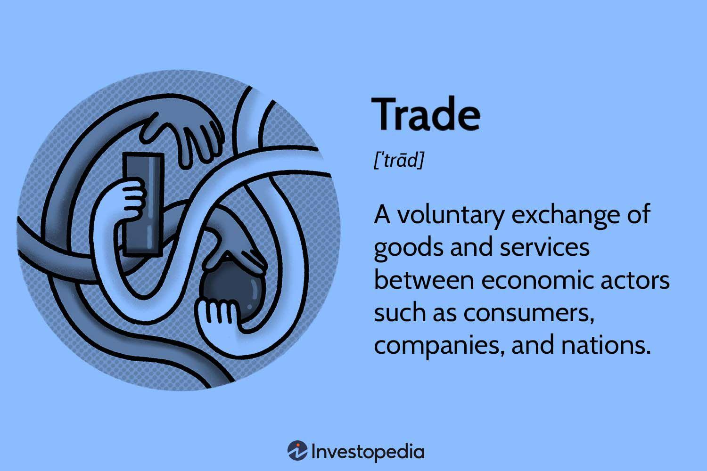

In recent years, the stock market has undergone significant transformations due to the integration of advanced trading mechanisms powered by technological advancements. Key among these innovations is the emergence of algorithmic trading, commonly referred to as 'algo trading'. This method leverages computer programs to execute trades based on a predetermined set of rules, facilitating rapid and emotion-free transactions. 

Algorithmic trading fundamentally changes how market participants interact with financial markets by automating the trading process. This automation allows for the analysis of vast amounts of market data, identification of trading opportunities, and execution of trades at speeds that far exceed human capabilities. The proliferation of high-speed internet and increased computational power has further accelerated the adoption of these sophisticated trading strategies.



The primary advantage of algo trading lies in its capacity to eliminate human biases and emotions from trading decisions, ensuring that trades are executed under predefined criteria and market conditions. This not only enhances the consistency of trading strategies but also optimizes transaction costs and execution efficiency.

In this article, the concept of out trades within the stock market trading mechanisms and the integral role of algorithmic trading in modern financial markets are explored. Understanding these elements is crucial for traders and financial institutions aiming to optimize their trading strategies and stay competitive in today's dynamic market landscape.

## Table of Contents

## Understanding Out Trades in the Stock Market

An 'out trade' refers to a situation in the stock market where a trade cannot be processed due to discrepancies in the transaction details submitted by the involved parties to the clearinghouse. This issue arises when there is conflicting information about critical aspects of the trade such as price, volume, or other specific trade parameters. These discrepancies can prevent the successful settlement of the trade, requiring further action to resolve the differences.

In the process of trade settlement, a clearinghouse acts as an intermediary to ensure that both parties fulfill their contractual obligations. When confronted with an out trade, the clearinghouse first informs the counterparties of the inconsistency. The responsibility then falls on these parties to reconcile the disparities. This reconciliation might involve reviewing trade confirmations, cross-verifying data inputs, and adjusting records to ensure accuracy and alignment of information.

To illustrate, consider a scenario where two parties agree to a trade with the transaction details as follows:

- Party A reports a trade of 100 shares at $50.
- Party B reports a trade of 100 shares but at $52.

These conflicting trade prices can lead to an out trade, as the clearinghouse identifies a mismatch in the transaction details. 

The opportunity to resolve out trades rests initially with the counterparties themselves, allowing them to correct or amend the submitted information without formal intervention. If they cannot resolve the issue independently, the matter may escalate to arbitration or require a more formal resolution process within the clearinghouse.

Efficient resolution of out trades is essential to maintaining market integrity and ensuring that trading activities proceed without unnecessary interruptions or financial discrepancies.

## Essentials of Algorithmic Trading

Algorithmic trading is an integral component of modern financial markets, providing a structured and efficient methodology for executing trades through advanced computational frameworks. Algorithms, essentially sequences of mathematical instructions or rules, orchestrate the entire trading process from data analysis to trade execution. They can swiftly analyze immense volumes of market data, potentially thousands of data points per second, to uncover trading opportunities characterized by market inefficiencies.

A fundamental aspect of [algorithmic trading](/wiki/algorithmic-trading) is its ability to perform these analyses and order executions with a level of speed and accuracy unattainable by human traders. This capability stems from high-performance computing and is crucial in a landscape where microsecond decisions can define profitability.

Algorithmic trading strategies can be diverse, tailored to various market phenomena:

1. **Trend-Following**: This strategy capitalizes on the persistence of existing market trends. Algorithms in this category monitor variables such as moving averages (e.g., 50-day or 200-day moving averages), price momentum, and support/resistance levels, executing trades in alignment with detected price movements. A simple moving average cross-over strategy can be formulated as follows in Python:

   ```python
   short_window = 40
   long_window = 100

   signals = pd.DataFrame(index=data.index)
   signals['signal'] = 0.0

   signals['short_mavg'] = data['close'].rolling(window=short_window, min_periods=1).mean()
   signals['long_mavg'] = data['close'].rolling(window=long_window, min_periods=1).mean()

   signals['signal'][short_window:] = np.where(signals['short_mavg'][short_window:] > signals['long_mavg'][short_window:], 1.0, 0.0) 
   signals['positions'] = signals['signal'].diff()
   ```

2. **Arbitrage**: Arbitrage strategies explore pricing discrepancies for the same asset across different markets, offering low-risk profit opportunities. These algorithms monitor multiple trading venues for the asset and execute simultaneous buy and sell orders to capture the spread. For instance, a triangular arbitrage strategy might analyze forex rates of three currency pairs looking for opportunistic converting sequences that enrich capital without market risk.

3. **Mean Reversion**: Mean reversion strategies operate under the hypothesis that prices oscillate around their historical mean. Such models assume that deviations from the average level, quantified as:
$$
   X_t = \mu + \phi (X_{t-1} - \mu) + \epsilon_t

$$

   where $\mu$ is the mean level, $\phi$ is the speed of reversion, and $\epsilon_t$ is a white noise term, will eventually revert to the norm. Algorithms using this model track statistical indicators such as standard deviations or z-scores over historical data sets to identify buy or sell opportunities.

Algorithmic trading encapsulates complex mathematical methodologies and requires substantial computing resources to manage the dynamic variables and constraints in real-time financial environments. Its proliferation attests to an industry-wide shift towards automated efficiency, where algorithms not only augment but also redefine traditional trading paradigms.

## Types of Algorithmic Trading Strategies

Algorithmic trading strategies can be classified into several categories, each optimized for different market conditions. These strategies leverage computer algorithms to automate the decision-making process in trading, allowing rapid and precise market interactions.

1. **Trend-Following**: Trend-following strategies identify opportunities by analyzing moving averages and price levels. The fundamental concept is to capitalize on the momentum of an asset's price in the market. For instance, if a stock's price is consistently reaching new highs, a trend-following algorithm might execute a buy order to benefit from the continued upward trend. Python can be used to implement a simple moving average crossover strategy, as shown below:

```python
import pandas as pd

# Assuming `prices` is a pandas Series of stock prices
short_window = 40
long_window = 100

signals = pd.DataFrame(index=prices.index)
signals['short_mavg'] = prices.rolling(window=short_window, min_periods=1).mean()
signals['long_mavg'] = prices.rolling(window=long_window, min_periods=1).mean()

signals['signal'] = 0.0
signals['signal'][short_window:] = np.where(signals['short_mavg'][short_window:] > signals['long_mavg'][short_window:], 1.0, 0.0)
signals['positions'] = signals['signal'].diff()
```

2. **Arbitrage Opportunities**: Arbitrage algorithms exploit price discrepancies for the same asset across different markets or platforms. When the same security is priced differently in separate locations, the algorithm executes simultaneous buy and sell trades to lock in profit from the price differential, albeit typically small. These profits are margin-sensitive and rely on low latency in execution to be effective.

3. **Market-Making**: This strategy doubles as a liquidity provider by placing simultaneous buy and sell orders to benefit from the bid-ask spread difference. Market-making algorithms generate profits by continuously buying at the bid price and selling at the ask price, thus providing liquidity and smoothing market volatility.

4. **Mean Reversion**: Mean reversion strategies operate on the assumption that the price of an asset will return to its historical average over time. Such strategies use statistical analysis to determine the average price and identify deviations which are expected to self-correct. The basic idea is to buy when prices are below the mean and sell when above. Below is a sample implementation using mean reversion logic in Python:

```python
mean_price = prices.rolling(window=20).mean()
std_dev = prices.rolling(window=20).std()
z_score = (prices - mean_price) / std_dev

# Generate buy signals when the z-score is below -1, sell when above 1
signals = pd.DataFrame(index=prices.index)
signals['signal'] = np.where(z_score < -1, 1, np.where(z_score > 1, -1, 0))
```

Each of these strategies requires the use of complex algorithms and robust technology infrastructure, often integrating real-time data feeds and advanced computing power to analyze and act on market conditions instantaneously. The choice of strategy depends on the trader's risk tolerance, market environment, and financial goals.

## Advantages and Challenges of Algo Trading

Algorithmic trading has transformed modern financial markets by introducing various advantages that enhance the trading process. One of its most pronounced benefits is the ability to execute trades at the best possible prices. Algorithms can scan multiple markets and execute trades in milliseconds, a speed far beyond human capability. This rapid processing allows traders to lock in optimal prices and capitalized on fleeting market opportunities.

Another significant advantage of algorithmic trading is the reduction of transaction costs. By automating the trading process, these programs minimize the need for human intervention, thereby reducing the cost associated with manual trading, such as brokerage fees and the probability of slippage. By systematically applying trading strategies, algorithms eliminate emotional biases and human errors, contributing to more consistent and reliable trading outcomes.

However, algorithmic trading is not without its challenges. The heavy reliance on technology means that trading systems must be continuously maintained and improved. Technical glitches, hardware failures, or software bugs can lead to significant trading losses. Furthermore, there is a constant requirement to keep up with technological advancements to maintain a competitive edge.

Another challenge lies in the risk of overfitting trading strategies. Overfitting occurs when an algorithm is too closely tailored to historical data, resulting in models that may not perform well in future market conditions. This challenge necessitates rigorous [backtesting](/wiki/backtesting) and continuous strategy optimization.

Moreover, substantial infrastructure investment is required to support algorithmic trading. This includes powerful computing resources and data acquisition systems capable of processing large volumes of financial data in real-time. Additionally, acquiring and maintaining data feeds, and market access can be costly, particularly for smaller firms or individual traders.

In conclusion, while algorithmic trading offers significant advantages in terms of speed, cost efficiency, and precision, traders must navigate its inherent challenges. Successful implementation requires a balance of technological infrastructure, strategic development, and risk management to fully harness its potential.

## Conclusion

Algorithmic trading has become an essential tool within the modern trading environment, interfacing seamlessly with technology to enhance market operations. By utilizing complex algorithms, it optimizes trading strategies, allowing for decisions to be made with speed and precision that humans would be hard-pressed to match. This approach significantly enhances market [liquidity](/wiki/liquidity-risk-premium), making it possible to execute transactions with reduced cost and minimal human error.

The integration of algorithmic trading into financial systems provides distinct advantages, particularly in executing trades at optimal prices. It reduces the reliance on human traders, thus lowering the potential for emotional decision-making and human error, which can lead to losses. Additionally, by consistently applying statistical and mathematical models, algorithmic trading platforms can identify and exploit transient market inefficiencies to the benefit of traders and financial institutions alike.

However, despite these advantages, algorithmic trading is not without its challenges. The reliance on sophisticated technology and complex algorithms raises concerns about overfitting strategies to historical data, which might not hold up in future market conditions. There is also a substantial infrastructure investment required to implement these systems, making it a barrier to entry for smaller firms.

For traders and financial institutions, it is crucial to understand and wield the power of algorithmic trading with caution. While it offers the potential for significant returns, it must be balanced with due diligence to prevent the risks associated with technological failures and to ensure that the algorithms remain relevant in ever-evolving market conditions. Mastery of algorithmic trading can unlock substantial potential in the modern financial landscape, but it requires a commitment to ongoing research, development, and monitoring of strategies to ensure long-term success.

## References & Further Reading

[1]: Pardo, R. (2008). ["The Evaluation and Optimization of Trading Strategies."](https://onlinelibrary.wiley.com/doi/book/10.1002/9781119196969) John Wiley & Sons.

[2]: Aldridge, I. (2013). ["High-Frequency Trading: A Practical Guide to Algorithmic Strategies and Trading Systems."](https://www.amazon.com/High-Frequency-Trading-Practical-Algorithmic-Strategies/dp/1118343506) John Wiley & Sons.

[3]: Hasbrouck, J., & Saar, G. (2013). ["Low-latency trading."](https://www.sciencedirect.com/science/article/abs/pii/S1386418113000165) The Review of Financial Studies, 26(9), 2095-2136.

[4]: Patel, S. A., & Yao, J. (2012). ["High-Frequency Trading and its Impact on Market Quality."](https://www.researchgate.net/publication/228724293_High_frequency_trading_and_its_impact_on_market_quality) Financial Management, 41(3), 581-581.

[5]: Nathan, C., & James, R. N. (2014). ["Algorithmic trading and information."](https://www.semanticscholar.org/paper/Algorithmic-Trading-and-Information-Hendershott-Riordan/992bb61fe2a9861310118f9f68ad98433e75eefd) The Review of Financial Studies, 27(1), 226-259.