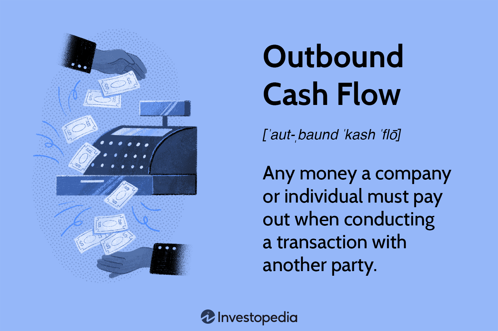

## Table of Contents

## What is outbound cash flow?

Outbound cash flow is the money that goes out of a business or a person's account. It is also called cash outflow. This can happen when a business pays for things like rent, salaries, or buying supplies. For a person, it might be when they pay for groceries, bills, or other expenses.

It's important to keep track of outbound cash flow because it shows how much money is being spent. If more money is going out than coming in, it can lead to problems. Businesses and people need to make sure they have enough money coming in to cover their expenses. By watching their outbound cash flow, they can make better decisions about spending and saving.

## How does outbound cash flow differ from inbound cash flow?

Outbound cash flow is the money that leaves a business or a person's account. It's like when you pay for things you need, like food, rent, or supplies for your business. This money going out is important to keep track of because it shows how much you're spending. If you spend too much, you might run out of money.

Inbound cash flow is the opposite. It's the money that comes into your account. For a business, this could be from selling products or services. For a person, it might be their salary or money from other sources. Keeping an eye on inbound cash flow helps you know how much money you have coming in, which is important for planning and making sure you can cover your expenses.

Both outbound and inbound cash flow are crucial for understanding your financial health. By comparing the two, you can see if you're spending more than you're [earning](/wiki/earning-announcement), which can help you make better decisions about saving and spending. Balancing these flows is key to maintaining financial stability, whether you're running a business or managing personal finances.

## What are common examples of outbound cash flow in a business?

Outbound cash flow in a business is the money that goes out to pay for things the business needs. This includes paying for rent or a mortgage on the business's building. It also covers the cost of utilities like electricity, water, and internet. Another big part of outbound cash flow is paying salaries and wages to employees. Businesses also spend money on supplies and materials they need to make their products or provide their services.

There are other costs that add to outbound cash flow too. For example, a business might pay for advertising to attract more customers. They might also spend money on insurance to protect their business from risks. Sometimes, businesses need to pay taxes, which is another type of outbound cash flow. All these payments are important for the business to keep running smoothly, but they need to be managed carefully to make sure the business doesn't spend more money than it makes.

## How can a company track its outbound cash flow?

A company can track its outbound cash flow by keeping a record of all the money it spends. This can be done by using accounting software that automatically logs every payment made by the company. The software can categorize these payments into different types of expenses, like rent, salaries, and supplies. This makes it easy for the company to see where its money is going and helps in planning future spending.

Another way to track outbound cash flow is by using a simple spreadsheet. The company can list all its expenses in the spreadsheet and update it regularly. This method requires more manual work, but it can be just as effective. By looking at the spreadsheet, the company can see trends in its spending and make adjustments if needed. Both methods help the company keep a close eye on its money and make sure it doesn't spend more than it earns.

## What are the potential impacts of high outbound cash flow on a business?

High outbound cash flow can put a business in a tough spot. When a lot of money is going out, it can mean there isn't enough left to cover all the costs. If the business keeps spending more than it makes, it might run out of money and have to borrow more, which can lead to debt. This can make it hard to pay bills on time and might even cause the business to close if things don't get better.

But high outbound cash flow isn't always bad. Sometimes, a business might spend a lot on things like new equipment or marketing to grow and make more money in the future. If these investments pay off, the business could end up earning more than it spends. The key is to keep an eye on the money coming in and going out, so the business can make smart choices about where to spend and how to save.

## How can businesses manage and optimize their outbound cash flow?

Businesses can manage and optimize their outbound cash flow by keeping a close eye on where their money is going. They can do this by using accounting software or a simple spreadsheet to track all their expenses. By looking at these records, they can see which costs are the highest and where they might be able to save money. For example, if they're spending a lot on office supplies, they could look for cheaper options or buy in bulk to get a better deal. It's also important to pay bills on time to avoid late fees, which can add up and increase outbound cash flow.

Another way to optimize outbound cash flow is by making smart spending choices. Businesses should think carefully before spending money on things like new equipment or marketing campaigns. They need to make sure these investments will help them earn more money in the future. It's also a good idea to negotiate with suppliers for better prices or longer payment terms. This can help spread out the costs and make it easier to manage cash flow. By planning ahead and being mindful of their spending, businesses can keep their outbound cash flow under control and stay financially healthy.

## What role does budgeting play in managing outbound cash flow?

Budgeting is a key tool for managing outbound cash flow. It helps businesses plan how much money they will spend on things like rent, salaries, and supplies. By making a budget, a business can set limits on how much it will spend in each area. This helps them avoid spending too much money and running into financial trouble. A good budget acts like a guide, showing the business where its money should go each month.

A budget also makes it easier to spot problems early. If a business sees that it's spending more than it planned in one area, it can take action to fix it. Maybe they need to find cheaper suppliers or cut back on some costs. By keeping track of their spending through a budget, a business can make sure it has enough money to cover all its costs. This helps keep the business running smoothly and avoids surprises that could hurt its finances.

## How does outbound cash flow relate to a company's financial health?

Outbound cash flow is really important for a company's financial health. It's the money that goes out of the business to pay for things like rent, salaries, and supplies. If a company spends too much money, it might not have enough left to keep going. This can lead to problems like not being able to pay bills on time or even having to borrow money, which can make things worse. So, it's important for a company to keep an eye on its outbound cash flow to make sure it doesn't spend more than it earns.

On the other hand, managing outbound cash flow well can help a company stay strong. By keeping track of where the money is going, a company can see if it's spending too much in one area and make changes. For example, they might find cheaper suppliers or cut back on some costs. This helps the company stay financially healthy and avoid surprises that could hurt its business. By planning carefully and watching their spending, a company can make sure it has enough money to cover all its costs and keep running smoothly.

## What are some strategies to reduce unnecessary outbound cash flow?

One way to cut down on unnecessary outbound cash flow is to look closely at all the money going out and see where you might be spending too much. For example, a business might be paying a lot for office supplies. They could look for cheaper options or buy in bulk to save money. It's also important to check if there are any subscriptions or services the business doesn't really need anymore. Canceling these can free up cash that can be used for more important things.

Another strategy is to negotiate better deals with suppliers. Sometimes, a business can get a discount if they agree to buy more from the same supplier or if they pay early. This can help reduce the cost of goods and services, which means less money going out. Also, paying bills on time is key because late fees can add up and increase outbound cash flow. By keeping a close eye on spending and making smart choices, a business can reduce unnecessary costs and stay financially healthy.

## How can technology and software help in managing outbound cash flow?

Technology and software can make it a lot easier for a business to keep track of its outbound cash flow. There are special programs that automatically record every time money goes out of the business. These programs can sort the payments into different types of expenses, like rent, salaries, and supplies. This helps the business see where its money is going and makes it easier to plan future spending. By using these tools, a business can quickly spot if it's spending too much in one area and take steps to fix it.

Another way technology helps is by making it simpler to create and stick to a budget. Budgeting software can help a business set limits on how much it will spend on different things. It can also send alerts if the business is about to go over its budget, which helps avoid surprises. Plus, some software can connect with bank accounts and automatically update the budget, so the business always knows where it stands financially. By using technology and software, a business can manage its outbound cash flow better and stay on top of its money.

## What advanced metrics should experts use to analyze outbound cash flow?

Experts should use the cash burn rate to analyze outbound cash flow. This metric shows how quickly a business is using up its cash reserves. It's calculated by looking at the difference between the money coming in and the money going out over a certain period, like a month. A high cash burn rate can be a warning sign that a business is spending too much and might run out of money soon. By keeping an eye on this rate, experts can help businesses make better decisions about spending and saving.

Another important metric is the operating cash flow ratio. This compares the money a business makes from its main activities to its current liabilities. It helps experts see if a business has enough cash to pay its short-term bills. A ratio higher than one means the business is in good shape because it can cover its costs. If the ratio is lower than one, it might be a sign that the business needs to cut back on spending or find more ways to bring in money. Using these metrics, experts can give businesses a clear picture of their financial health and help them manage their outbound cash flow better.

## How does outbound cash flow forecasting contribute to strategic planning?

Outbound cash flow forecasting helps businesses plan for the future by predicting how much money they will need to spend. This is important because it lets them see if they will have enough money to cover their costs. By looking at past spending and using this information to guess what will happen next, businesses can make a plan. They can decide where to spend money and where to save it. This helps them avoid surprises and make sure they don't run out of money.

Good forecasting also helps businesses make smart choices about big decisions, like buying new equipment or starting a new project. If the forecast shows they will have enough money to cover these costs, they can go ahead with their plans. But if the forecast shows they might not have enough, they can change their plans to spend less or find other ways to bring in more money. This way, they can keep their business running smoothly and stay ready for whatever comes next.

## What is the Financial Process and Cash Flow Statement?

The cash flow statement represents a crucial aspect of financial reporting by detailing the cash generated and utilized across a specified period. It is divided into three main categories: cash flow from operations, investing, and financing. Each section provides distinct insights into a company's financial health. 

1. **Cash Flow from Operations (CFO):** This segment highlights the cash inflows and outflows directly related to the principal business operations. It primarily includes net income, adjustments for non-cash transactions, and changes in working capital. For instance, depreciation is added back into net income since it is a non-cash charge. The formula for cash flow from operations can be simplified as:
$$
   \text{CFO} = \text{Net Income} + \text{Non-cash Expenses} - \Delta \text{Working Capital}

$$

   This metric helps assess a company’s ability to generate sufficient cash to maintain and expand operations.

2. **Cash Flow from Investing (CFI):** Investing activities involve cash transactions for the acquisition and disposal of long-term assets and investments. Purchases of machinery or property, as well as proceeds from the sale of such assets, are recorded in this section. A negative CFI might suggest that a company is investing in its future growth, whereas a positive CFI can indicate asset liquidation.

3. **Cash Flow from Financing (CFF):** This accounts for cash changes resulting from fundraising activities. It includes cash obtained from issuing debt or equity, and outflows such as dividends and debt repayments. The financing section reveals how the company manages changes in its capital structure and its strategy regarding debt versus equity funding.

By thoroughly understanding these segments, companies can evaluate their [liquidity](/wiki/liquidity-risk-premium) position, investment strategies, and overall financial performance more effectively. Such insights facilitate the assessment of a company’s capability to generate future cash flows, fulfill its obligations, and invest in growth opportunities. 

Proper analysis of cash flow statements is indispensable for making informed investment and operational decisions. By examining the statement's trends, stakeholders can identify potential red flags or promising opportunities. Enhancing the accuracy and transparency of these statements plays a critical role in fostering stakeholder trust and achieving strategic business goals.

## References & Further Reading

1. **Books and Articles on Cash Flow Management and Financial Analysis**:
   - _Cash Flow Analysis and Forecasting: The Definitive Guide to Understanding and Using Published Cash Flow Data_ by Timothy Jury provides an in-depth exploration of analyzing cash flow, offering readers insights into making informed financial decisions.
   - _Financial Statement Analysis: A Practitioner's Guide_ by Martin Fridson and Fernando Alvarez presents comprehensive techniques for analyzing financial statements, including cash flow statements, to assess a company's performance.

2. **Books and Articles on Algorithmic Trading**:
   - _Algorithmic Trading: Winning Strategies and Their Rationale_ by Ernest P. Chan introduces readers to the core strategies behind algorithmic trading and explains the rationale that leads to effective trading models.
   - _Quantitative Trading: How to Build Your Own Algorithmic Trading Business_ by Ernie Chan discusses the tools and technical setups required to set up and conduct quantitative trading efficiently.

3. **Research Papers**:
   - "The Impact of Cash Flow Volatility on Business Investment Patterns" published in the _Journal of Financial Economics_ explores the relationship between cash flow variability and investment decisions, highlighting the importance of cash flow management.
   - "Algorithmic Trading and the Market: Evidence from the NYSE" examines how algorithmic trading strategies impact market dynamics and liquidity, offering insights into the integration of algorithmic trading within financial systems.

4. **Online Resources**:
   - Coursera offers courses such as "Financial Reporting" which includes modules focused on understanding cash flow statements and interpreting financial data.
   - Khan Academy provides free educational resources on financial statements, including detailed tutorials on constructing and analyzing cash flow statements.

5. **Online Courses on Automated Trading Systems**:
   - The course "Algorithmic Trading and Finance Models with Python, R, and Stata Essential Training" on LinkedIn Learning introduces key programming tools and strategies for developing algorithmic trading systems.
   - Udacity's "Artificial Intelligence for Trading" nano degree program covers advanced topics in algorithmic trading, data analysis, and financial strategies, aiding in the development of sophisticated trading algorithms.

