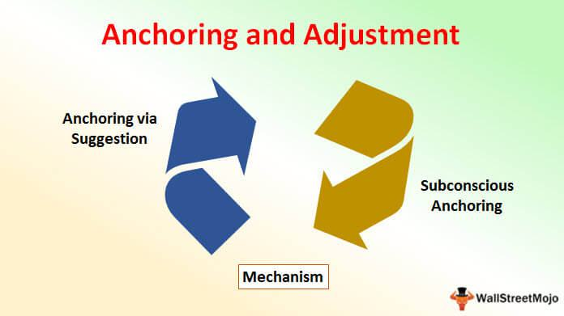

Financial trading is a dynamic and intricate field where decisions are heavily influenced by cognitive and outcome biases. These biases significantly shape the behavior and decision-making processes of both traders and investors. Cognitive biases are systematic deviations from rationality, leading individuals to misinterpret information and make decisions based on flawed logic. Outcome bias, a subset of cognitive biases, involves evaluating a decision based on its outcome rather than the quality of the decision-making process itself. 

Algorithmic trading, which involves executing trades based on predefined algorithms, is particularly vulnerable to these biases. Despite being designed to eliminate human error and emotion, these algorithms are devised by humans and may inherently carry the biases of their creators. This creates a unique challenge as these biases can lead to suboptimal trading decisions and outcomes. 



This article aims to investigate the impact of cognitive biases, with a particular focus on outcome bias, within the sphere of algorithmic trading. By understanding these biases, traders can develop strategies to mitigate their effects, thereby enhancing their decision-making processes and leading to more robust trading outcomes. This exploration underscores the critical need for evaluating trading strategies based on sound decision-making principles rather than short-term successes or failures.

## Table of Contents

## Understanding Cognitive Biases in Decision Making

Cognitive biases are systematic deviations from rational judgment, significantly impacting decision-making processes, particularly in trading and financial environments. These biases arise from cognitive shortcuts or heuristics that the human brain employs to process information rapidly. While these shortcuts can be useful in simplifying complex decisions, they often lead to errors in judgment and suboptimal decision-making.

One prevalent cognitive bias is confirmation bias, where individuals favor information confirming their pre-existing beliefs or hypotheses, disregarding evidence that contradicts them. In trading, this bias can result in traders selectively interpreting market data to reinforce their investment decisions, potentially leading to significant financial losses if the overlooked information proves critical.

Overconfidence bias represents another common deviation, characterized by an individual's excessive confidence in their own abilities or knowledge. Traders affected by this bias may overestimate their predictive accuracy or underestimate risks, leading to overly aggressive trading strategies. This overconfidence not only increases the likelihood of errors but also exacerbates potential financial losses when market conditions do not align with expectations.

Hindsight bias is the tendency to perceive past events as having been more predictable than they actually were. In trading, this bias can cause individuals to falsely believe that they would have predicted market events accurately, fostering unrealistic confidence in their predictive abilities. This often results in a distorted understanding of risk and probability, impairing future decision-making.

Thoroughly understanding these biases is crucial for traders seeking to enhance the rationality and effectiveness of their decision-making processes. By recognizing the inherent cognitive biases, traders can take active steps to mitigate their influence, improving their ability to objectively interpret and act on market information. Such awareness fosters more disciplined and strategic trading behaviors, ultimately leading to better financial outcomes.

## The Role of Outcome Bias in Trading

Outcome bias occurs when the result of a decision disproportionately influences perceptions of the decision's quality, often overshadowing the rationale or process involved in making it. In trading, this bias can be particularly insidious as it leads individuals to focus heavily on successful trades without adequately considering whether the decision-making process that led to that trade was sound. This can perpetuate faulty strategies that thrive on luck rather than skillful analysis and methodology.

In practice, a trader might execute a trade based on a hunch rather than a well-structured analysis. If the trade yields positive returns, the erroneous assumption that the decision-making process was effective may arise. This leads to a false sense of competence, where traders continue to apply similar inadequate approaches, potentially ignoring crucial elements like market indicators, financial news, or comprehensive data analysis, that should ideally inform their trades. The core issue here is that success is often ascribed to skill rather than attributed correctly to fortunate external circumstances.

A key example of outcome bias is observed when traders judge their decisions solely on profit or loss. A profit might be mistaken for a confirmation of strategy effectiveness, while a loss can lead to an unjustified sense of failure, even if the decision-making process was sound and driven by logical analysis. This misjudgment results in the reinforcement of potentially flawed decision-making frameworks, emphasizing short-term gains over long-term strategy stability and understanding.

For traders to advance and develop robust strategies, it is crucial to cultivate awareness of outcome bias. By shifting focus from results to examining the decision-making process, traders are better positioned to identify strengths and weaknesses within their strategies. Techniques such as maintaining comprehensive trading journals, where traders document the reasoning, emotion, and analysis behind each trade, can be invaluable. This practice encourages reflection and critical analysis of each trade beyond its immediate financial outcome.

Additionally, adopting a mindset that values the process over the result can significantly aid in mitigating outcome bias. Traders should evaluate whether each trading decision was based on accurate data, solid technical and [fundamental analysis](/wiki/fundamental-analysis), and consistent methodology. This pivot from an outcome-oriented to a process-oriented approach helps emphasize the adequacy of the decision-making framework rather than the mere financial result.

In conclusion, acknowledging and addressing outcome bias is an essential step towards forming trading strategies that prioritize logical reasoning and sound analysis over transient financial success. By doing so, traders can enhance their decision-making skills and create a more sustainable trading practice that withstands the test of market fluctuations.

## Impact of Cognitive and Outcome Biases on Algorithmic Trading

Algorithmic trading, which utilizes computer programs to automate trading activity based on predetermined instructions, is increasingly dominant in financial markets. However, despite its seemingly objective nature, [algorithmic trading](/wiki/algorithmic-trading) is susceptible to cognitive and outcome biases stemming from the human [agents](/wiki/agents) who design and implement these algorithms.

#### Cognitive Biases in Algorithm Development

The development of trading algorithms involves numerous subjective decisions, such as the selection of data inputs, the weighting of variables, and the interpretation of historical patterns. Cognitive biases like confirmation bias can lead developers to overweight information that supports preconceived notions, while neglecting contradictory data. This can result in algorithms that reflect the biases of their creators, rather than objective reality.

For example, a developer might emphasize price trends that align with their expectations while underappreciating contradictory signals. An echo of this bias can manifest in the algorithms, leading to skewed trading actions based on selective interpretation of data. Overconfidence bias, another common cognitive distortion, may propel developers to overestimate the accuracy of their models, reducing the emphasis on thorough [backtesting](/wiki/backtesting) and validation.

#### Outcome Bias and its Implications

Outcome bias, where decisions are judged based on their results rather than their rationality, further compounds the problem in algorithmic trading. Successful trading outcomes can reinforce flawed decision-making processes, giving developers a false sense of security in their algorithms' efficacy. Consequently, these algorithms may perform well under certain market conditions but collapse when those conditions change.

Consider an algorithm designed during a period of low [volatility](/wiki/volatility-trading-strategies) that performs exceptionally well in similar environments. Its perceived success may prevent developers from revising or improving the model, only for it to fail in more volatile conditions due to oversight of essential risk factors.

#### Addressing Bias in Algorithmic Trading

Recognizing and mitigating cognitive and outcome biases is essential for refining algorithmic trading strategies. Implementing a more structured development process can help in this regard. This may include:

- **Diversified Data Inputs:** Ensuring a broad and unbiased selection of inputs to counteract any initial bias.
- **Robust Backtesting:** A comprehensive backtesting approach, combined with stress testing under various market scenarios, aids in identifying potential weaknesses in algorithm design.

- **Continuous Monitoring and Revision:** Algorithms should be subject to ongoing evaluation and refinement based on performance feedback, and adjustments should be informed by diverse perspectives to prevent singular viewpoints from dominating the development process.

By addressing these biases, the robustness of algorithmic trading strategies can be improved, leading to decisions that are more aligned with rational analysis rather than subjective bias. This adjustment is critical not only for individual traders but also for the stability and efficiency of financial markets.

## Strategies to Mitigate Cognitive and Outcome Biases

Mitigating cognitive and outcome biases in trading requires a multifaceted approach. One fundamental strategy is fostering self-awareness. Traders can benefit from recognizing their cognitive biases by actively challenging their assumptions and reflecting on their decision-making processes. This introspection enables traders to identify bias patterns and address them before they influence trading decisions.

Diversifying information sources and incorporating diverse perspectives is equally crucial. Relying on a singular source or a homogenous set of data can reinforce existing biases. By contrast, considering multiple viewpoints and varied information inputs can provide a more balanced perspective, reducing the impact of biases on trading strategies. This pluralism ensures that decisions are grounded in a comprehensive understanding of market dynamics, enhancing the objectivity of analysis.

Historical data analysis and backtesting serve as vital tools for bias mitigation. By examining past trading data, traders can gain insights into how biases may have affected their previous decisions and outcomes. Backtesting involves evaluating a trading strategy using historical data to determine its effectiveness without the emotional influence of real-time decision-making. This practice helps traders refine their strategies, identifying and correcting bias-induced errors.

Implementing predetermined stop-loss strategies is another effective countermeasure. A stop-loss order is designed to limit an investor's loss on a security position by initiating a sale once a specific price threshold is reached. By setting stop-loss points in advance, traders commit to an [exit](/wiki/exit-strategy) strategy based on predetermined criteria rather than emotionally charged reactions to market fluctuations. This discipline helps counteract emotional biases like fear and greed, which can lead to irrational decision-making.

Algorithmic approaches can further aid traders in minimizing biases. By setting clear, algorithm-based rules for entering and exiting trades, traders can reduce the emotional and subjective elements of decision-making. These algorithms, if thoughtfully designed, help ensure that trading decisions adhere to a logical framework rather than being swayed by cognitive biases.

An illustrative Python snippet for backtesting might resemble the following:

```python
import pandas as pd

# Example DataFrame containing historical price data
data = pd.DataFrame({
    'price': [100, 102, 101, 105, 110, 108, 115]
})

def backtest_strategy(data, buy_threshold, sell_threshold):
    balance = 1000  # initial balance
    position = 0  # no initial stock position
    buy_price = 0  # initial buy price

    for i in range(1, len(data)):
        if data['price'][i] < buy_threshold and position == 0:
            buy_price = data['price'][i]
            position = balance / buy_price
            print(f"Buying at {buy_price}, position: {position}")
        elif data['price'][i] > sell_threshold and position > 0:
            balance = position * data['price'][i]
            print(f"Selling at {data['price'][i]}, new balance: {balance}")
            position = 0

    return balance

final_balance = backtest_strategy(data, buy_threshold=101, sell_threshold=107)
print(f"Final balance after backtesting: {final_balance}")
```

In this example, a simple strategy is backtested using historical data. The trader buys when the price falls below a certain threshold and sells when it exceeds another, demonstrating a systematic approach free from momentary biases. Such techniques emphasize process-oriented evaluation, fostering rational, bias-resistant decision-making.

## The Role of Feedback and Continuous Learning

Engaging with trading communities and seeking regular feedback play a critical role in helping traders identify and mitigate cognitive and outcome biases in their trading strategies. These communities often provide diverse insights and experiences, which aid traders in understanding different perspectives and challenging their preconceived notions. By participating in discussions and sharing trading experiences, individuals can gain exposure to alternative viewpoints and strategies that may otherwise remain unexplored.

Continuous learning and adaptation of strategies are equally essential for long-term success in trading. Financial markets are dynamic, characterized by constant changes in economic conditions, market sentiment, and technological advancements. Therefore, staying updated with new information and evolving strategies is critical. Traders can do this by attending webinars, reading industry publications, or enrolling in trading courses that focus on the latest market trends and techniques.

Consistent feedback from trading activities allows for a process-oriented evaluation rather than one focused solely on outcomes. This approach involves assessing the decision-making process itself instead of just the final results. By prioritizing process-oriented evaluation, traders are encouraged to identify any biases and mistakes within their decision-making framework, ultimately leading to refinements that improve future performance.

Emphasizing continuous learning can be further enhanced by leveraging technology and data analysis tools. For instance, traders can write Python scripts to analyze historical trading data and identify patterns that they may have overlooked initially. Here is a basic example of how Python can be used to analyze trading performance:

```python
import pandas as pd

# Load historical trading data
data = pd.read_csv('trading_data.csv')

# Calculate returns
data['returns'] = data['close'].pct_change()

# Analyze performance metrics
mean_return = data['returns'].mean()
volatility = data['returns'].std()

print(f"Mean Return: {mean_return:.2%}")
print(f"Volatility: {volatility:.2%}")
```

This script helps traders understand their performance metrics, such as mean return and volatility, which are essential for evaluating the efficacy of their trading strategies.

Ultimately, continuous feedback and learning facilitate an adaptive trading approach that prioritizes the refinement of trading processes. By emphasizing these practices, traders can overcome cognitive and outcome biases, leading to more sustainable trading success.

## Conclusion

Cognitive and outcome biases significantly impact decision-making processes in trading and finance. These biases can cloud judgment and detract from rational analysis, leading to suboptimal trading outcomes. Recognizing and addressing these biases is crucial for traders aiming to improve their decision-making processes. By doing so, they position themselves for more sustainable and robust trading outcomes.

Efforts to mitigate cognitive and outcome biases should center around self-awareness, which involves understanding one's own predispositions to certain biases. Traders are encouraged to seek diverse perspectives and assimilate these into their analysis to avoid echo chambers that reinforce existing biases. A comprehensive evaluation of historical data can provide insights into past trading patterns and help identify recurring biases. Additionally, strategies like backtesting and setting predetermined stop-losses can offer structured ways to manage and rectify biases.

Continuous learning is integral to adapting and refining trading strategies. Engaging with trading communities and seeking feedback can offer fresh viewpoints and novel strategies, promoting a more balanced analytical framework. Emphasizing a process-oriented approach rather than judging solely by outcomes ensures that the logic behind decisions takes precedence. This shift can lead to enhanced decision-making processes, fostering long-term success in trading environments.

## References & Further Reading

[1]: Kahneman, D. (2011). ["Thinking, Fast and Slow."](https://link.springer.com/article/10.1007/s00362-013-0533-y) Farrar, Straus and Giroux.

[2]: Tversky, A., & Kahneman, D. (1974). ["Judgment under Uncertainty: Heuristics and Biases."](https://www2.psych.ubc.ca/~schaller/Psyc590Readings/TverskyKahneman1974.pdf) Science, 185(4157), 1124-1131.

[3]: Odean, T. (1998). ["Are Investors Reluctant to Realize Their Losses?"](https://onlinelibrary.wiley.com/doi/full/10.1111/0022-1082.00072) The Journal of Finance, 53(5), 1775-1798.

[4]: Barberis, N., & Thaler, R. (2003). ["A Survey of Behavioral Finance."](https://www.nber.org/papers/w9222) Handbook of the Economics of Finance, 1, 1053-1128.

[5]: Fama, E. F. (1998). ["Market Efficiency, Long-Term Returns, and Behavioral Finance."](https://www.sciencedirect.com/science/article/pii/S0304405X98000269) Journal of Financial Economics, 49(3), 283-306.

[6]: Tetlock, P. C. (2007). ["Giving Content to Investor Sentiment: The Role of Media in the Stock Market."](https://www.columbia.edu/~pt2238/papers/Tetlock_Media_Sentiment_JF.pdf) The Quarterly Journal of Economics, 122(3), 1139-1168.