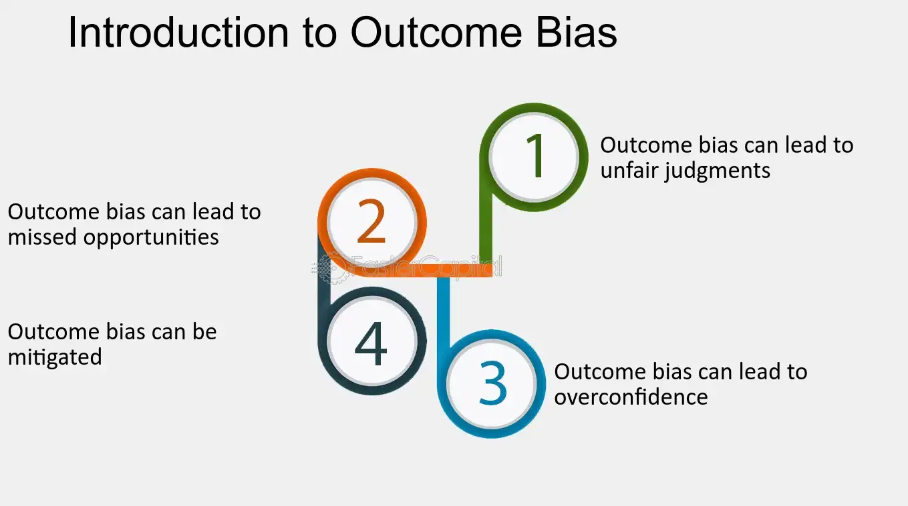

## Table of Contents

## What is outcome bias?

Outcome bias is when people judge a decision based on the result, not on how good the decision was at the time. For example, if someone takes a risk and it works out, people might think it was a good decision. But if the same risk fails, people might think it was a bad decision. The problem is, the result doesn't always show if the decision was smart or not.

This bias can be harmful because it can make people ignore the process of making decisions. They might focus too much on what happened in the end and not enough on whether the choice was wise given the information available at the time. This can lead to unfair judgments and can stop people from learning from their decisions, because they are too focused on the outcome.

## How does outcome bias differ from other cognitive biases?

Outcome bias is different from other cognitive biases because it focuses specifically on the end result of a decision, rather than the decision-making process itself. For example, hindsight bias is when people think they knew something was going to happen after it already did. This is different from outcome bias because hindsight bias is about thinking you predicted an event, while outcome bias is about judging a decision based on its outcome. Another bias, confirmation bias, is when people look for information that supports what they already believe. This is different because it's about seeking out certain information, not about judging decisions based on results.

Outcome bias can also be confused with the sunk cost fallacy, but they are not the same. The sunk cost fallacy is when people keep doing something because they've already put time or money into it, even if it's not the best choice anymore. This is about sticking with a decision because of past investment, not about judging the decision based on its outcome. In contrast, outcome bias is about looking at the end result and deciding if the original decision was good or bad based on that alone. Understanding these differences helps us see how outcome bias uniquely affects our judgment and decision-making.

## Can you provide examples of outcome bias in everyday life?

Imagine a student who decides to study only the night before a big test. If they do well on the test, people might say it was a smart move to cram. But if they do poorly, everyone might think it was a bad choice. The truth is, whether the student did well or not doesn't change the fact that cramming the night before isn't usually the best way to study. This is outcome bias because people are judging the decision to cram based on the test result, not on if it was a good study plan.

Another example is in sports. A coach might decide to try a risky play during a game. If the play works and the team scores, everyone might think the coach made a great call. But if the play fails and the team loses, people might say the coach made a terrible decision. The outcome of the play shouldn't be the only thing we look at. The coach might have had good reasons for trying the risky play, based on the game situation and the team's skills. Judging the decision only by the result is outcome bias.

## What are the psychological mechanisms behind outcome bias?

Outcome bias happens because our brains like to take shortcuts when thinking. We often look at the end result of something to decide if it was good or bad, instead of looking at all the steps and choices that led to that result. This is because it's easier and quicker to judge something by its outcome. Our brains are wired to save energy, so we naturally go for the simplest way to understand things. When we see that something worked out well, we think the choices that led to it must have been good, even if they were risky or not the best choices at the time.

Another reason for outcome bias is how we learn and make sense of the world. From a young age, we're taught to focus on results. If we do well on a test, we get praised; if we do poorly, we might get scolded. This teaches us to pay more attention to outcomes than to the process. Over time, this focus on results becomes a habit. When we see a good outcome, our brains quickly connect it to the decisions that came before, making us think those decisions were smart, even if they weren't. This habit can make it hard for us to judge decisions fairly, based on the information available at the time they were made.

## How does outcome bias affect decision-making processes?

Outcome bias can mess up how we make choices. It makes us focus too much on what happened in the end, instead of thinking about if our decision was good when we made it. For example, if someone tries a new way to save money and it works, they might think it was a great idea. But if it doesn't work, they might feel it was a bad choice. This can stop us from trying new things or taking smart risks because we're too worried about what might happen, not about if the choice makes sense right now.

This bias also affects how we learn from our choices. If we only look at the end result, we might miss out on understanding why we made a certain decision in the first place. For instance, a doctor might choose a treatment that ends up not working, but that doesn't mean the choice was wrong at the time. If the doctor only thinks about the bad outcome, they might not learn from the situation as well as they could. This can lead to making the same mistakes over and over, because we're not really looking at the whole picture.

## What role does hindsight play in outcome bias?

Hindsight can make outcome bias worse. When we look back at a decision, it's easy to think we knew what was going to happen all along. This is called hindsight bias. If something turns out well, we might think, "Oh, I knew that was going to work!" But if it turns out badly, we might say, "I should have seen that coming." This hindsight thinking makes us judge decisions based on what happened, not on what we knew at the time. So, when we mix hindsight bias with outcome bias, we end up judging choices unfairly, just because we know the end result.

Hindsight can also stop us from learning from our decisions. If we always look back and think we should have known better, we might miss out on understanding why we made certain choices. For example, a business owner might try a new marketing strategy that fails. With hindsight, they might think, "That was a dumb move." But maybe at the time, it seemed like a good idea based on the information they had. If they focus too much on the bad outcome and hindsight, they might not learn what they could do differently next time. This can make it harder to make better decisions in the future.

## How can outcome bias impact professional judgments, such as in medicine or law?

In medicine, outcome bias can make doctors judge their choices based on how a patient turns out, not on if the choice was good at the time. For example, a doctor might choose a treatment that seems right based on the patient's symptoms and medical history. If the patient gets better, everyone might think the doctor made a great call. But if the patient doesn't get better, people might think the doctor made a mistake. This can make doctors afraid to try new treatments or take smart risks, because they're worried about being judged by the outcome, not by the quality of their decision-making process.

In law, outcome bias can affect how lawyers and judges see cases. If a lawyer tries a new strategy in court and wins the case, everyone might think it was a brilliant move. But if they lose, people might say it was a bad choice. This can make lawyers less willing to try new approaches, even if they might work well. Judges might also be influenced by outcome bias when they look back at past cases. If a decision led to a good outcome, they might think it was the right call, even if it wasn't based on the law at the time. This can lead to unfair judgments and can stop the legal system from improving and learning from past decisions.

## What are the potential consequences of outcome bias in organizational settings?

Outcome bias can really mess things up in a workplace. If bosses and workers only care about the end results, they might not pay attention to how decisions are made. This can make people afraid to try new ideas or take smart risks because they're worried about what might happen, not about if the choice makes sense right now. For example, if someone tries a new way to do a project and it doesn't work out, everyone might think it was a bad idea, even if it was a good plan at the time. This can stop the company from growing and learning because everyone is too focused on the results, not on the process.

This focus on outcomes can also make it hard for the company to learn from its mistakes. If everyone only looks at what happened in the end, they might miss out on understanding why certain choices were made. For instance, a team might try a new way to solve a problem, and if it fails, they might just think it was a bad choice without looking at why they thought it would work. This can lead to the same mistakes happening over and over because no one is really looking at the whole picture. In the end, outcome bias can make a company less able to adapt and improve, because it's all about the results, not about getting better at making decisions.

## How can individuals and organizations mitigate the effects of outcome bias?

To reduce the effects of outcome bias, individuals and organizations need to focus more on the decision-making process instead of just the end result. This means taking time to think about why a choice was made and what information was available at the time. For example, when reviewing a project, instead of just looking at whether it succeeded or failed, it's important to go over the steps taken to make the decision. This can help everyone understand if the choice was smart, even if the outcome wasn't what they hoped for. By doing this, people can learn from their decisions and make better choices in the future.

Organizations can also help by creating a culture that values learning and trying new things, even if they don't always work out. This means encouraging people to take smart risks and not punishing them if things don't go as planned. For instance, a company might set up regular meetings where teams can discuss their decisions and what they learned, no matter the outcome. This way, everyone can see that the focus is on improving the process, not just on the results. By making these changes, individuals and organizations can reduce the impact of outcome bias and make better decisions overall.

## What research methods are used to study outcome bias?

Researchers use different ways to study outcome bias. One common way is through experiments where they ask people to judge decisions based on different outcomes. For example, they might give people a story about a doctor choosing a treatment and then change the story so that sometimes the treatment works and sometimes it doesn't. By comparing how people judge the doctor's decision in each case, researchers can see if the outcome affects their judgment. Surveys and questionnaires are also used to ask people about their experiences with outcome bias in real life, like at work or in sports.

Another method is looking at real-world data, like medical records or court cases, to see if outcome bias affects professional judgments. Researchers might study how doctors or judges make decisions and if those decisions are judged differently based on the results. They can also use computer simulations to model how outcome bias might affect decision-making in different situations. By using these different research methods, scientists can learn more about how outcome bias works and how to reduce its effects.

## How does outcome bias interact with other biases, such as confirmation bias?

Outcome bias and confirmation bias can work together to make our thinking even more messed up. Confirmation bias is when we look for information that agrees with what we already think. If we already believe that a certain decision was good or bad, we might only pay attention to the outcome that fits our belief. For example, if we think a risky business move was a bad idea, and it fails, we might focus on the failure and say, "See, I was right!" But if the move works out, we might ignore it or find reasons to explain it away, because it doesn't fit with what we believed.

This mix of outcome bias and confirmation bias can make it really hard to see things clearly. When we only look at the end result to judge a decision, and we're also only looking for information that agrees with what we already think, we can end up making the same mistakes over and over. It's like wearing blinders that keep us from seeing the whole picture. To make better choices, we need to try to look at all the information and think about the decision-making process, not just the outcome.

## What are the latest findings in neuroscience related to outcome bias?

Recent neuroscience research has shown that outcome bias is linked to how our brains process rewards and outcomes. Studies using brain imaging, like fMRI, have found that when people see a good outcome, parts of the brain that deal with rewards, like the ventral striatum, light up more. This suggests that our brains might be wired to feel good about decisions that lead to positive results, even if the decisions themselves weren't the best. This reward system can make us focus more on the end result than on the process of making the decision.

Another finding is that outcome bias can affect how we remember decisions. Research has shown that when we look back at a choice and see a good outcome, the parts of the brain involved in memory, like the hippocampus, can change how we remember the decision. This means our brains might rewrite our memories to fit the outcome, making us think the decision was better than it was. Understanding these brain processes can help us find ways to reduce the impact of outcome bias and make better decisions.

## References & Further Reading

[1]: Kahneman, D. (2011). ["Thinking, Fast and Slow."](https://link.springer.com/article/10.1007/s00362-013-0533-y) Farrar, Straus and Giroux.

[2]: Tversky, A., & Kahneman, D. (1974). ["Judgment under Uncertainty: Heuristics and Biases."](https://www2.psych.ubc.ca/~schaller/Psyc590Readings/TverskyKahneman1974.pdf) Science, 185(4157), 1124-1131.

[3]: Odean, T. (1998). ["Are Investors Reluctant to Realize Their Losses?"](https://onlinelibrary.wiley.com/doi/full/10.1111/0022-1082.00072) The Journal of Finance, 53(5), 1775-1798.

[4]: Barberis, N., & Thaler, R. (2003). ["A Survey of Behavioral Finance."](https://www.nber.org/papers/w9222) Handbook of the Economics of Finance, 1, 1053-1128.

[5]: Fama, E. F. (1998). ["Market Efficiency, Long-Term Returns, and Behavioral Finance."](https://www.sciencedirect.com/science/article/pii/S0304405X98000269) Journal of Financial Economics, 49(3), 283-306.

[6]: Tetlock, P. C. (2007). ["Giving Content to Investor Sentiment: The Role of Media in the Stock Market."](https://www.columbia.edu/~pt2238/papers/Tetlock_Media_Sentiment_JF.pdf) The Quarterly Journal of Economics, 122(3), 1139-1168.