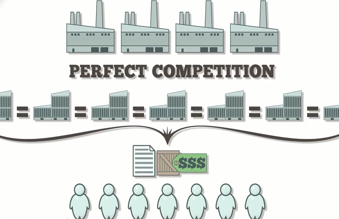

## Table of Contents

## What is brokerage price competition?

Brokerage price competition is when different brokers try to offer the lowest prices to attract customers. Brokers are people or companies that help you buy or sell things like stocks, real estate, or insurance. When they compete on price, they might lower their fees or commissions to get more business. This can be good for customers because it means they might pay less for the services they need.

However, there can be downsides to this kind of competition. Sometimes, brokers might cut corners or offer fewer services to keep their prices low. This means that while you might save money, you might not get the best advice or service. It's important for customers to look at more than just the price when choosing a broker. They should also think about the quality of service and the broker's reputation.

## How does brokerage price competition affect the real estate market?

Brokerage price competition in the real estate market happens when real estate agents and brokers try to offer lower fees to attract more clients. This can make it cheaper for people to buy or sell homes. When brokers compete on price, it can lead to lower commission rates. This means that people who are selling their homes might keep more of the money from the sale, and people buying homes might have to pay less in fees.

However, there can be some problems with this kind of competition. Sometimes, brokers might not offer as much help or advice if they are charging less. This could mean that people might not get the best service when they are buying or selling a home. It's important for people to think about more than just the price when choosing a real estate agent. They should also look at how good the agent is at their job and if they have a good reputation.

## What are the main factors that influence brokerage price competition?

The main factors that influence brokerage price competition are the number of brokers in the market and the level of demand for their services. When there are a lot of brokers, they have to compete harder to get clients. This often means they will lower their prices to attract more business. On the other hand, if there are only a few brokers, they might not need to lower their prices as much because there are fewer choices for clients. The demand for brokerage services also plays a big role. If a lot of people want to buy or sell things, brokers might be able to charge more because there are so many clients. But if fewer people need their services, brokers might have to lower their prices to get any business at all.

Another [factor](/wiki/factor-investing) is the type of services that brokers offer. Some brokers might offer more services or better quality services, which can allow them to charge higher prices. For example, a real estate agent who provides a lot of help and advice might be able to charge more than one who just lists a home and does nothing else. Technology also affects brokerage price competition. Online platforms and apps can make it easier for people to buy and sell things without using a broker, which can push brokers to lower their prices to stay competitive. Overall, the balance between supply and demand, the quality and range of services, and technological changes all play a part in how brokers set their prices.

## Can you explain the basic mechanisms of price setting in brokerage?

Price setting in brokerage involves brokers deciding how much to charge for their services. They look at how many other brokers are around and how much people want their services. If there are a lot of brokers, they might lower their prices to get more clients. But if there are only a few brokers, they might not need to lower their prices because people don't have many other choices. Also, if a lot of people want to buy or sell things, brokers might charge more because there are so many clients. But if fewer people need their services, brokers might have to lower their prices to get any business at all.

Brokers also think about what kind of services they offer when setting their prices. If they offer a lot of help and good advice, they might be able to charge more. But if they only offer basic services, they might need to charge less. Technology can also affect how brokers set their prices. With online platforms and apps, people can sometimes buy and sell things without a broker. This can make brokers lower their prices to stay competitive. So, brokers look at how many other brokers there are, how much people want their services, what kind of services they offer, and what technology is available when they decide how much to charge.

## How do different brokerage models impact price competition?

Different brokerage models can change how brokers compete on price. In a traditional brokerage model, brokers charge a commission for each transaction they help with. This can lead to higher prices because the broker's fee is a percentage of the sale price. But in a discount brokerage model, brokers charge lower fees or flat rates for their services. This can make prices go down because people can save money on fees. When there are both traditional and discount brokers in the market, they have to compete with each other. This can make traditional brokers lower their prices to keep up with the discount brokers.

Another model is the online brokerage, where everything is done over the internet. Online brokers often have lower costs because they don't need big offices or as many staff. This can let them offer lower prices than traditional brokers. But, they might not offer as much help or advice as a traditional broker. So, when online brokers compete with traditional brokers, it can push prices down, but people might have to choose between lower prices and less help. Overall, the different models make brokers think about how to set their prices to attract clients while still making money.

## What role do technology and online platforms play in brokerage price competition?

Technology and online platforms have changed how brokers compete on price. They make it easier for people to buy and sell things without a broker. This means brokers have to lower their prices to stay competitive. Online brokers can charge less because they don't need big offices or as many staff. This pushes traditional brokers to offer lower fees too, or they might lose clients to the cheaper online options.

However, there are trade-offs. Online platforms might not give as much help or advice as a traditional broker. So, people have to decide if they want to save money or get more help. This competition makes brokers think hard about their prices. They have to find a balance between charging enough to make money and keeping their prices low enough to attract clients.

## How has brokerage price competition evolved over the past decade?

Over the past decade, brokerage price competition has changed a lot. More people are using the internet to buy and sell things. This means there are more online brokers who can offer lower prices because they don't have the same costs as traditional brokers. These online brokers have made traditional brokers lower their prices too. They don't want to lose clients to the cheaper options. So, overall, the prices for brokerage services have gone down because of this competition.

But it's not just about lower prices. The quality of service has also changed. Some brokers now offer less help to keep their prices low. This means people have to decide if they want to save money or get more help. Technology has made it easier for people to do things themselves, but it also means they might not get the best advice. So, while prices have gone down, the kind of service people get can be different.

## What are the potential benefits of increased brokerage price competition for consumers?

Increased brokerage price competition can be really good for consumers. When brokers try to offer the lowest prices, it means people can save money on fees. For example, if you're buying or selling a house, a lower commission from a broker means you get to keep more of your money. This can make a big difference, especially when the fees are a percentage of the sale price. So, more competition can lead to lower costs for people who need to use a broker's services.

But it's not just about saving money. More competition can also push brokers to offer better services to stand out from others. They might use new technology or give more help to attract clients. This means people can get better service for less money. However, it's important for consumers to look at more than just the price. They should also think about the quality of service and the broker's reputation to make sure they're getting a good deal.

## What are the challenges and risks associated with intense brokerage price competition?

Intense brokerage price competition can make it hard for brokers to make money. When they lower their prices a lot to get more clients, they might not earn enough to cover their costs. This can lead to some brokers going out of business. Also, when prices are very low, brokers might not be able to pay their staff well or keep their offices running smoothly. This can make the quality of service go down, which is bad for everyone.

Another risk is that brokers might cut corners to keep their prices low. They might not give as much help or advice as they should. This can be a problem for people who need a lot of guidance, like first-time home buyers. If they don't get good advice, they might make bad decisions. So, while lower prices can save money, they can also mean less help and more risk for consumers.

## How do regulatory frameworks influence brokerage price competition?

Regulatory frameworks set rules that brokers have to follow. These rules can affect how much brokers charge for their services. For example, if the rules say brokers can't charge more than a certain amount, this can make prices go down. But if the rules make it hard for new brokers to start their business, there might be fewer brokers to compete with each other. This can make prices go up because there are fewer choices for people.

Rules can also make brokers give more information about their prices. This helps people compare different brokers and choose the one with the best price. But sometimes, too many rules can make it hard for brokers to change their prices quickly. This can make it harder for them to compete with each other. So, the rules can help keep prices fair, but they can also make it harder for brokers to offer lower prices.

## What advanced strategies can brokerages employ to maintain competitiveness in pricing?

Brokerages can use technology to keep their prices competitive. They can use online platforms to reach more people without spending a lot of money on big offices. This helps them lower their costs and offer better prices to their clients. They can also use data and computer programs to understand what people want and set their prices just right. By knowing what their clients need, they can offer special deals or discounts that attract more business.

Another strategy is to offer different levels of service. Some people might want to save money and are okay with less help, while others might want more advice and are willing to pay for it. By offering different packages, brokerages can attract different kinds of clients. They can also work with other companies to offer more services without raising their prices too much. This way, they can give their clients more value for their money and stay competitive in the market.

## How can data analytics and machine learning be utilized to optimize pricing strategies in brokerage?

Data analytics and [machine learning](/wiki/machine-learning) can help brokerages set their prices in a smart way. By looking at a lot of information about what people want and how much they are willing to pay, brokerages can figure out the best prices to charge. They can use computers to find patterns in the data, like when people are more likely to buy or sell things. This helps them know when to offer lower prices to attract more clients or when they can charge more because demand is high. By using data analytics, brokerages can make sure their prices are just right to get as much business as possible.

Machine learning can also make pricing strategies better over time. As brokerages collect more data, machine learning programs can learn from it and suggest new ways to set prices. These programs can find out which prices work best and keep changing the prices to make them even better. This means brokerages can always be adjusting their prices to stay competitive and meet their clients' needs. By using machine learning, brokerages can keep up with changes in the market and make sure they are always offering the best prices.

## References & Further Reading

[1]: ["Advances in Financial Machine Learning"](https://www.amazon.com/Advances-Financial-Machine-Learning-Marcos/dp/1119482089) by Marcos Lopez de Prado

[2]: ["Machine Learning for Algorithmic Trading"](https://github.com/stefan-jansen/machine-learning-for-trading) by Stefan Jansen

[3]: ["Quantitative Trading: How to Build Your Own Algorithmic Trading Business"](https://www.amazon.com/Quantitative-Trading-Build-Algorithmic-Business/dp/1119800064) by Ernest P. Chan

[4]: O'Hara, M. (2015). ["High-Frequency Market Microstructure."](https://www.sciencedirect.com/science/article/pii/S0304405X15000045) Annual Review of Financial Economics, 7, 133-152.

[5]: Hendershott, T., Jones, C. M., & Menkveld, A. J. (2011). ["Does Algorithmic Trading Improve Liquidity?"](https://onlinelibrary.wiley.com/doi/full/10.1111/j.1540-6261.2010.01624.x) The Journal of Finance, 66(1), 1-33.

[6]: Mittal, S. (2019). ["How Do Zero-Commission Trades Affect Retail Brokers?"](https://www.greenwich.com/equities/impact-zero-commissions-retail-trading-and-execution) State Street Global Advisors. 

[7]: Easley, D., López de Prado, M. M., & O'Hara, M. (2012). ["Flow Toxicity and Liquidity in a High-Frequency World."](https://www.semanticscholar.org/paper/Flow-Toxicity-and-Liquidity-in-a-High-Frequency-Easley-Prado/9369430bd005d194f9332ae7cbd5a57ace5e9ab3) Review of Financial Studies, 25(5), 1457-1493.