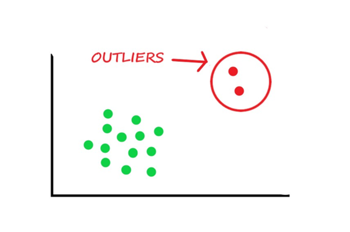

## Table of Contents

## What is an outlier in the context of machine learning?

In machine learning, an outlier is a data point that differs significantly from other observations. Imagine you have a bunch of data about people's heights, and almost everyone is between 5 and 6 feet tall. But then, there's one person who is 8 feet tall. That person would be an outlier because their height is much different from the rest.

Outliers can happen for many reasons. Sometimes, they are just mistakes, like if someone wrote down the wrong number. Other times, they can show something interesting or unusual, like a rare disease that makes someone much taller than average. It's important for people working with data to decide whether to keep or remove outliers because they can affect the results of machine learning models. If you keep them, they might mess up your predictions. If you remove them, you might miss important information.

## Why is outlier detection important in data analysis?

Outlier detection is important in data analysis because it helps us find unusual data points that could affect our results. Imagine you're looking at data about how much people spend on groceries each week. Most people spend between $50 and $100, but one person spends $1000. This could be a mistake, or it could mean something important. If we don't notice this outlier, our analysis might be wrong, thinking everyone spends a lot more than they actually do.

By finding outliers, we can decide what to do with them. Sometimes, we might remove them if they're just errors, making our data cleaner and our predictions more accurate. Other times, outliers can tell us something new and interesting, like a new trend or a rare event. For example, if many people suddenly start spending a lot more on groceries, it could mean there's a big change happening, like a price increase. So, outlier detection helps us make better decisions and understand our data better.

## What are the common types of outliers?

There are three main types of outliers: point outliers, contextual outliers, and collective outliers. Point outliers are single data points that are very different from the rest. For example, if everyone in a class scores between 60 and 80 on a test, but one student scores 10, that student's score is a point outlier. Contextual outliers depend on the situation. For example, a temperature of 30 degrees Celsius might be normal in summer but an outlier in winter. Collective outliers are a group of data points that together look unusual, even if each point by itself might seem normal. For example, if many people suddenly start buying lots of bread and water, it could be a collective outlier signaling something like a storm coming.

Understanding these types of outliers helps us know what to do with them. Point outliers might be mistakes that we can fix or remove to make our data more accurate. Contextual outliers need us to look at the situation to decide if they are important or not. Collective outliers can show us big trends or events that we might miss if we only look at single data points. By knowing the different types of outliers, we can make better choices about our data and get more useful results from our analysis.

## What are the basic methods for detecting outliers?

One common method for detecting outliers is using statistical measures like the mean and standard deviation. You can calculate the mean and standard deviation of your data, then look for data points that are far away from the mean. A popular way to do this is using the Z-score. The Z-score tells you how many standard deviations a data point is from the mean. If a data point has a Z-score that is very high or very low, it might be an outlier. For example, if a Z-score is more than 3 or less than -3, it's often considered an outlier. You can calculate the Z-score with this formula: $$ Z = \frac{(X - \mu)}{\sigma} $$ where $$ X $$ is the data point, $$ \mu $$ is the mean, and $$ \sigma $$ is the standard deviation.

Another method for detecting outliers is using the Interquartile Range (IQR). The IQR is the difference between the third quartile (Q3) and the first quartile (Q1) of your data. Data points that are below Q1 - 1.5 * IQR or above Q3 + 1.5 * IQR are often considered outliers. This method is good because it doesn't assume your data follows a normal distribution, which means it can work well with many different kinds of data. For example, if you have a list of numbers, you can sort them, find Q1 and Q3, calculate the IQR, and then check each number to see if it's an outlier.

There are also visual methods for detecting outliers, like using box plots or scatter plots. A box plot shows you the median, quartiles, and any outliers in your data. Outliers appear as individual points outside the whiskers of the box. In a scatter plot, outliers are data points that are far away from the other points. These visual methods can be very helpful because they let you see your data and spot outliers easily. You can use software like Python or R to make these plots and detect outliers. For example, in Python, you can use libraries like Matplotlib or Seaborn to create these visualizations.

## How does the Z-score method work for outlier detection?

The Z-score method is a way to find outliers by comparing each data point to the average of all the data. It uses the mean and the standard deviation to figure out if a data point is too far away from what is normal. The formula for the Z-score is $$ Z = \frac{(X - \mu)}{\sigma} $$, where $$ X $$ is the data point, $$ \mu $$ is the mean, and $$ \sigma $$ is the standard deviation. If a data point's Z-score is very high or very low, it might be an outlier. Usually, if the Z-score is more than 3 or less than -3, we consider that point to be an outlier.

Let's say you have a set of test scores and you want to find any outliers. First, you calculate the mean and standard deviation of all the scores. Then, for each score, you use the Z-score formula to see how far it is from the mean in terms of standard deviations. If a score has a Z-score of 3.5, that means it's 3.5 standard deviations above the mean, which is pretty far away. So, you might decide that this score is an outlier. The Z-score method is useful because it gives you a clear way to decide if a data point is too different from the rest.

## What is the Interquartile Range (IQR) method and how is it used to detect outliers?

The Interquartile Range (IQR) method is a way to find outliers by looking at the spread of your data. It uses the difference between the third quartile (Q3) and the first quartile (Q1) to figure out what counts as an outlier. The IQR is calculated as $$ \text{IQR} = Q3 - Q1 $$. Once you have the IQR, you can find outliers by checking if any data points are below $$ Q1 - 1.5 \times \text{IQR} $$ or above $$ Q3 + 1.5 \times \text{IQR} $$. This method is good because it doesn't assume your data follows a normal distribution, so it can work well with many different kinds of data.

For example, if you have a list of numbers, you can sort them and find Q1 and Q3. Let's say Q1 is 25 and Q3 is 75, so the IQR is $$ 75 - 25 = 50 $$. Any number below $$ 25 - 1.5 \times 50 = -50 $$ or above $$ 75 + 1.5 \times 50 = 150 $$ would be considered an outlier. This way, you can easily spot numbers that are too far away from the rest of your data. The IQR method helps you make your data cleaner and your analysis more accurate by finding and dealing with these unusual points.

## How can machine learning algorithms like Isolation Forest be used for outlier detection?

Isolation Forest is a machine learning algorithm that's really good at finding outliers. It works by making lots of little decision trees. Each tree tries to split the data into smaller and smaller groups until it finds points that are all by themselves. The idea is that outliers will be easier to separate from the rest of the data because they are different. So, if a data point gets isolated quickly in many trees, it's probably an outlier. The algorithm gives each point a score, and points with scores close to 1 are more likely to be outliers.

Let's say you have data about how much people spend on groceries. Most people spend between $50 and $100, but one person spends $1000. Isolation Forest would make lots of decision trees and try to split the data. The person who spends $1000 would be separated from the rest of the data quickly in many trees because their spending is so different. So, Isolation Forest would give this person a high score, showing that they are an outlier. This way, you can find unusual data points and decide what to do with them to make your analysis better.

## What are the advantages of using unsupervised learning techniques for outlier detection?

Unsupervised learning techniques like Isolation Forest are great for finding outliers because they don't need you to tell them what an outlier looks like. They can figure it out on their own by looking at the patterns in your data. This is helpful because sometimes you don't know what an outlier might be before you start looking at your data. For example, if you're studying how much people spend on groceries, you might not know what an unusual amount is until you see the data. Unsupervised methods can find these unusual amounts without any help, making your analysis easier and more accurate.

Another advantage of using unsupervised learning for outlier detection is that it can handle big and complex data sets well. These methods can look at lots of data points and find outliers even if the data is messy or doesn't follow a simple pattern. This is important because real-world data is often complicated and hard to understand. By using unsupervised learning, you can find outliers in all kinds of data, helping you make better decisions and understand your data better.

## How do supervised learning methods for outlier detection differ from unsupervised methods?

Supervised learning methods for outlier detection need you to tell them what an outlier looks like before they start working. You have to give them examples of normal data and examples of outliers so they can learn the difference. For example, if you're looking at test scores, you might show the algorithm scores that are normal and scores that are outliers. The algorithm then uses this information to make a model that can tell if a new score is an outlier or not. This means supervised methods need labeled data, which can be hard to get because you need to know what an outlier is before you start.

Unsupervised learning methods, like Isolation Forest, don't need you to tell them what an outlier looks like. They can find outliers on their own by looking at the patterns in your data. For example, if you're studying how much people spend on groceries, an unsupervised method can figure out that someone spending $1000 is an outlier without you telling it so. These methods are good for big and complex data sets because they can handle messy data and find unusual points without any help. This makes them useful when you don't know what an outlier might be before you start looking at your data.

## What are some challenges faced when detecting outliers in high-dimensional data?

Detecting outliers in high-dimensional data can be really tricky. When you have a lot of different variables or features, it's hard to see what's normal and what's not. Imagine you're looking at data about people, like their age, height, weight, and income. With just a few of these, it's easier to spot someone who's different. But when you add more and more details, it gets harder because the data spreads out in many directions. This is called the "curse of dimensionality," and it makes it tough for algorithms to find outliers because they get lost in all the extra space.

Another challenge is that many traditional methods for finding outliers, like using the Z-score or the Interquartile Range (IQR), don't work as well with high-dimensional data. These methods look at how far a data point is from the average or from the middle of the data. But in high-dimensional space, almost every point can seem far away from the others, so these methods can think everything is an outlier. To deal with this, you might need special algorithms that can handle high-dimensional data better, like using distance-based methods or density-based methods that look at how close points are to each other in all the dimensions.

## How can one evaluate the performance of an outlier detection model?

Evaluating the performance of an outlier detection model can be done by using different measures that tell you how well the model is finding outliers. One common way is to use a confusion matrix, which shows how many true positives, true negatives, false positives, and false negatives the model found. From this, you can calculate metrics like precision, which tells you how many of the points the model said were outliers actually were outliers, and recall, which tells you how many of the real outliers the model found. Another useful measure is the F1 score, which is the harmonic mean of precision and recall, and it gives you a single number that shows how well the model is doing overall. The formula for the F1 score is $$ F1 = 2 \times \frac{\text{precision} \times \text{recall}}{\text{precision} + \text{recall}} $$. If you have labeled data, you can use these metrics to see how good your model is at finding outliers.

Another way to evaluate an outlier detection model is by using the Receiver Operating Characteristic (ROC) curve and the Area Under the Curve (AUC). The ROC curve shows how well the model can tell the difference between outliers and normal points at different thresholds. The AUC is a number between 0 and 1 that tells you how good the model is overall. A higher AUC means the model is better at finding outliers. If you don't have labeled data, you can use internal validation methods like the silhouette score, which measures how similar an object is to its own cluster compared to other clusters. This can help you see if the outliers the model found are really different from the rest of the data. By using these different ways to evaluate your model, you can make sure it's working well and finding the outliers you need to find.

## What are advanced techniques like Local Outlier Factor (LOF) and how do they improve upon simpler methods?

Local Outlier Factor (LOF) is a more advanced way to find outliers that looks at how each data point compares to its neighbors. Instead of just looking at how far a point is from the average or the middle of the data, LOF checks how dense the area around each point is. If a point is in a less dense area than its neighbors, it might be an outlier. This method is good because it can find outliers even if the data is spread out in different ways, which simpler methods like Z-score or IQR might miss. LOF works well with high-dimensional data and can find outliers that are hidden in the middle of the data, not just the ones that are far away from everything else.

LOF improves upon simpler methods because it can find outliers that are not just extreme values but are unusual in their local area. For example, if you're looking at test scores and most students score around 70, a score of 75 might not seem like an outlier. But if all the other students in the same class scored around 60, the 75 score could be an outlier in its local context. LOF can spot this kind of outlier by comparing the density of points around it. This makes LOF a powerful tool for finding unusual data points in complex datasets where simpler methods might fail.