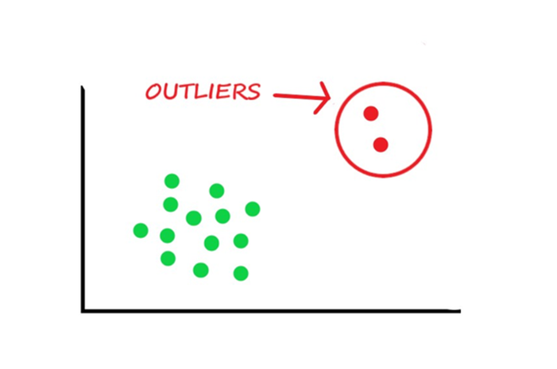

## Table of Contents

## What is an outlier in the context of machine learning?

In machine learning, an outlier is a data point that differs significantly from other observations. Imagine you have a dataset of people's heights, and almost everyone is between 5 and 6 feet tall. If one person is 8 feet tall, that person would be an outlier because their height is very different from the rest of the group.

Outliers can happen for many reasons. Sometimes they are mistakes, like if someone wrote down the wrong number. Other times, they might be real but unusual cases, like a person who is much taller than average. Outliers can affect how well a machine learning model works. If a model is trained on data with outliers, it might focus too much on those unusual cases and not work well for the more common cases.

It's important to decide what to do with outliers. You might choose to remove them if they are mistakes, or keep them if they are important parts of your data. The decision can change how your machine learning model performs, so it's something to think about carefully when working with data.

## Why is it important to detect outliers in a dataset?

Detecting outliers in a dataset is important because they can have a big impact on the results of your analysis or the performance of your machine learning model. Outliers can skew the data, making common statistical measures like the mean and standard deviation less accurate. For example, if you're calculating the average income of a group of people and one person earns a lot more than everyone else, the average will be higher than what most people actually earn. This can lead to wrong conclusions or predictions.

It's also important to find outliers because they can help you understand your data better. Sometimes, outliers are not mistakes but important pieces of information that can show you unusual patterns or events. For instance, in medical data, an outlier might point to a rare disease or a new health issue that needs more attention. By identifying these outliers, you can make sure your analysis is more complete and accurate, and you can decide whether to include them or not based on what you're trying to learn from your data.

## What are the common methods used for outlier detection in machine learning?

One common method for detecting outliers is the Z-score method. This method looks at how far each data point is from the average, or mean, of the dataset. If a data point is too far away from the mean, it might be an outlier. We measure this distance in terms of standard deviations. If a data point has a Z-score greater than 3 or less than -3, it is often considered an outlier. The formula for the Z-score is $$ Z = \frac{(X - \mu)}{\sigma} $$, where $$ X $$ is the data point, $$ \mu $$ is the mean, and $$ \sigma $$ is the standard deviation.

Another method is the Interquartile Range (IQR) method. This method uses the middle 50% of the data to find outliers. First, you find the first quartile (Q1) and the third quartile (Q3) of your data. The IQR is the difference between Q3 and Q1. Any data point below Q1 - 1.5 * IQR or above Q3 + 1.5 * IQR is considered an outlier. This method is good for datasets that might not follow a normal distribution.

Machine learning models can also be used for outlier detection. One popular model is the Isolation Forest. This model works by randomly splitting the data into smaller groups until each data point is isolated. Outliers are usually easier to isolate because they are different from most other points. The Isolation Forest gives a score to each data point, and points with a low score are more likely to be outliers. This method is useful because it doesn't need to assume anything about the shape of the data.

## How can outliers affect the performance of machine learning models?

Outliers can mess up the performance of [machine learning](/wiki/machine-learning) models by pulling the model's focus away from the typical data points. Imagine you're teaching a model to guess house prices. If most houses cost between $100,000 and $500,000, but there's one house that's $10 million, the model might start thinking that high prices are more common than they really are. This can lead to wrong predictions, especially for the more common, cheaper houses. The model might become less accurate because it's trying to fit the unusual, expensive house instead of focusing on what's normal.

In some cases, outliers can also make the model too sensitive to small changes in the data. For example, if you're using a linear regression model, outliers can pull the regression line towards them, making the line a poor fit for the rest of the data. The formula for linear regression is $$ y = mx + b $$, where $$ m $$ is the slope and $$ b $$ is the y-intercept. Outliers can change both $$ m $$ and $$ b $$, leading to a line that doesn't represent the majority of the data well. This can result in overfitting, where the model works great for the training data but not for new data because it's too focused on the outliers.

## What is the difference between univariate and multivariate outlier detection?

Univariate outlier detection looks at one variable at a time. Imagine you have a list of people's ages. You can use methods like the Z-score or the Interquartile Range (IQR) to find ages that are very different from the rest. For example, if most people are between 20 and 60 years old, someone who is 120 years old might be an outlier. The Z-score formula is $$ Z = \frac{(X - \mu)}{\sigma} $$, where $$ X $$ is the age, $$ \mu $$ is the average age, and $$ \sigma $$ is the standard deviation of the ages. This method is simple and works well when you're only looking at one thing at a time.

Multivariate outlier detection, on the other hand, looks at several variables together. It's like looking at people's ages and their incomes at the same time. A person might not be an outlier in age or income alone, but when you look at both together, they might be unusual. For example, a 30-year-old with a very high income might be an outlier when compared to others of the same age. Methods like the Mahalanobis distance or machine learning models like Isolation Forest can be used for this. The Mahalanobis distance formula is $$ D^2 = (x - \mu)^T S^{-1} (x - \mu) $$, where $$ x $$ is the data point, $$ \mu $$ is the mean vector, and $$ S $$ is the covariance matrix. This method is more complex but can find outliers that univariate methods might miss.

## Can you explain how the Z-score method works for outlier detection?

The Z-score method is a way to find outliers by looking at how far each data point is from the average of the dataset. Imagine you have a list of numbers, and you want to see if any of them are really different from the rest. The Z-score helps you do this by turning each number into a score that shows how many standard deviations it is away from the average. If a data point has a Z-score that's too high or too low, it might be an outlier. The formula for the Z-score is $$ Z = \frac{(X - \mu)}{\sigma} $$, where $$ X $$ is the data point, $$ \mu $$ is the average, and $$ \sigma $$ is the standard deviation. Usually, if a Z-score is greater than 3 or less than -3, we consider that data point an outlier.

This method is useful because it's simple and works well for data that follows a normal distribution, which looks like a bell curve. If most of your data is clustered around the average, the Z-score can easily spot the points that are far away from this cluster. However, the Z-score method might not work as well if your data doesn't follow a normal distribution. In those cases, other methods like the Interquartile Range (IQR) might be better. But for many datasets, the Z-score is a quick and effective way to find outliers and understand your data better.

## What are some advanced techniques for outlier detection, such as Isolation Forest and Local Outlier Factor?

Isolation Forest is a cool way to find outliers using machine learning. It works by randomly splitting the data into smaller and smaller groups until each data point is by itself. The idea is that outliers are easier to isolate because they are different from most other points. The Isolation Forest gives each data point a score, and points with a low score are more likely to be outliers. This method is great because it doesn't need to assume anything about the shape of the data, so it can work well even if your data is not normally distributed. The formula for the anomaly score in Isolation Forest is $$ s(x, n) = 2^{-\frac{E(h(x))}{c(n)}} $$, where $$ E(h(x)) $$ is the average path length of isolating the point $$ x $$, and $$ c(n) $$ is the average path length of unsuccessful searches in a binary search tree.

Local Outlier Factor (LOF) is another advanced method that looks at how isolated a data point is compared to its neighbors. It measures the local density of a point and compares it to the densities of its neighbors. If a point has a much lower density than its neighbors, it might be an outlier. LOF is good for finding outliers in datasets where the density can change a lot in different parts of the data. The LOF score for a point $$ p $$ is calculated as $$ LOF_k(p) = \frac{\sum_{o \in N_k(p)} \frac{reach-dist_k(o, p)}{lrd_k(o)}}{|N_k(p)|} $$, where $$ N_k(p) $$ is the set of k-nearest neighbors of $$ p $$, $$ reach-dist_k(o, p) $$ is the reachability distance, and $$ lrd_k(o) $$ is the local reachability density. This method can be a bit more complex, but it's very useful for understanding the structure of your data and finding outliers that might be hidden in dense areas.

## How do you handle outliers once they are detected in a dataset?

Once you find outliers in your dataset, you have a few choices on what to do with them. One common thing to do is to remove the outliers. This means you take them out of your dataset completely. You might choose to do this if the outliers are mistakes, like if someone wrote down the wrong number. Removing outliers can help make your analysis more accurate because it focuses on the more common data points. But be careful, because if you remove too many outliers, you might lose important information about your data.

Another way to handle outliers is to change them instead of removing them. This is called 'winsorizing' or 'capping'. You can replace the outliers with a number that's closer to the rest of your data. For example, if most of your data is between 1 and 10, but you have an outlier at 100, you might change that 100 to 10. This way, you keep the outlier in your dataset but make it less extreme. The formula for winsorizing can be $$ \text{New Value} = \min(\max(X, \text{Lower Bound}), \text{Upper Bound}) $$, where $$ X $$ is the original value, and the lower and upper bounds are set based on your data. This method can help keep your analysis balanced without losing too much information.

A third option is to keep the outliers as they are and use special machine learning models that can handle them well. Some models, like Random Forests or Gradient Boosting, are less affected by outliers. You can also use techniques like robust regression, which is designed to work well even when there are outliers. For example, the formula for a simple robust regression might look like $$ y = mx + b $$, but it uses methods like the Huber loss function to be less sensitive to outliers. Keeping outliers can be good if they represent important but rare cases in your data, and using the right models can help you learn from these unusual points without letting them mess up your analysis.

## What are the challenges associated with outlier detection in high-dimensional data?

Outlier detection in high-dimensional data can be really tricky. When you have a lot of variables, it's harder to spot outliers because each data point can be different in many ways. Imagine you're looking at people's ages, incomes, and heights all at once. A person might not be an outlier in any one of these, but when you look at all three together, they might be unusual. This is called the 'curse of dimensionality.' It makes it hard to use simple methods like the Z-score because the distance between points can become less meaningful in high dimensions. The formula for the Z-score is $$ Z = \frac{(X - \mu)}{\sigma} $$, but in high-dimensional space, this might not work well because the data can spread out in many directions.

Another challenge is that many traditional outlier detection methods assume the data follows a certain pattern, like a normal distribution. But in high-dimensional data, this assumption often doesn't hold true. Methods like the Isolation Forest can help because they don't need to assume anything about the shape of the data. However, even these methods can struggle because the more dimensions you add, the more likely it is that every point will look like an outlier. This can lead to false positives, where normal points are flagged as outliers. To deal with this, you might need to use special techniques like dimensionality reduction, which means simplifying your data by focusing on the most important variables. This can make outlier detection easier, but it's still a complex task that needs careful thought and the right tools.

## How can domain knowledge be integrated into outlier detection processes?

Domain knowledge can help a lot when you're trying to find outliers in your data. Imagine you're a doctor looking at medical data. You know that some numbers, like blood pressure or cholesterol levels, have normal ranges. If you see a number that's way outside these ranges, you might think it's an outlier. But if you know that some people with certain conditions can have unusual numbers, you might decide to keep those points in your data. This kind of knowledge helps you decide if an outlier is a mistake or something important to your study. You can use this knowledge to set special rules or thresholds for what counts as an outlier, making your analysis more accurate and meaningful.

Another way to use domain knowledge is by choosing the right methods for finding outliers. For example, if you know your data is not normally distributed, you might pick methods like the Isolation Forest, which don't assume a normal distribution. The formula for the anomaly score in Isolation Forest is $$ s(x, n) = 2^{-\frac{E(h(x))}{c(n)}} $$, where $$ E(h(x)) $$ is the average path length of isolating the point $$ x $$, and $$ c(n) $$ is the average path length of unsuccessful searches in a binary search tree. You can also use domain knowledge to tweak these methods. For instance, if you know some variables are more important than others, you can give them more weight in your analysis. This helps make sure you're focusing on the parts of the data that matter most to your field, making your outlier detection more useful and tailored to your specific needs.

## What metrics are used to evaluate the effectiveness of outlier detection algorithms?

To check how well an outlier detection algorithm works, we use different metrics. One common metric is the True Positive Rate (TPR), also called Recall. This tells us how many of the actual outliers the algorithm found. If the TPR is high, it means the algorithm is good at spotting outliers. Another important metric is the False Positive Rate (FPR), which shows how many normal points were wrongly called outliers. A low FPR means the algorithm doesn't make too many mistakes. We can use these two metrics together to draw a Receiver Operating Characteristic (ROC) curve, which helps us see how well the algorithm balances finding outliers and avoiding mistakes.

Another useful metric is the Precision, which tells us how many of the points the algorithm labeled as outliers are actually outliers. High Precision means most of the points the algorithm flagged are real outliers. We can also use the F1-score, which is a mix of Precision and Recall. The formula for the F1-score is $$ F1 = 2 \times \frac{\text{Precision} \times \text{Recall}}{\text{Precision} + \text{Recall}} $$. This score gives us a single number that shows how well the algorithm does overall. By looking at these metrics, we can decide which outlier detection method works best for our data and our needs.

## Can you discuss any recent advancements or research in the field of outlier detection in machine learning?

Recent advancements in outlier detection have focused on improving the accuracy and efficiency of algorithms, especially for high-dimensional data. One exciting development is the use of [deep learning](/wiki/deep-learning) techniques, like autoencoders, for outlier detection. Autoencoders are neural networks that learn how to efficiently compress and encode data, then decode it to reproduce the original input. By training an autoencoder on normal data, it can learn to reconstruct typical patterns well. When an outlier comes along, the autoencoder might struggle to reconstruct it, making it easier to spot. Researchers have also been working on hybrid methods that combine traditional statistical approaches with machine learning to get the best of both worlds. For example, they might use the Isolation Forest algorithm along with density-based methods to improve detection rates and reduce false positives.

Another area of research is the development of algorithms that can handle dynamic data, where the patterns of what's normal and what's an outlier might change over time. This is important for applications like fraud detection, where new types of fraud can appear suddenly. One approach is to use online learning algorithms that can update their understanding of the data in real-time. These algorithms can adapt to new patterns quickly, making them more effective at spotting outliers in changing environments. Researchers are also exploring ways to make outlier detection more interpretable, so that people can understand why a particular data point was flagged as an outlier. This can help build trust in the algorithms and make them more useful in practical settings.