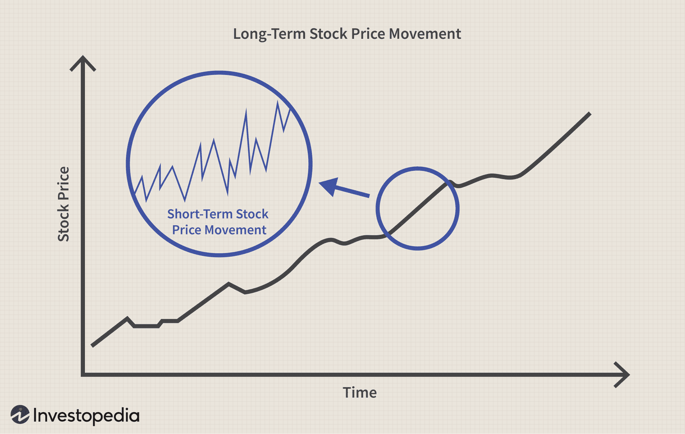

Algorithmic trading, a technological advancement reshaping the finance sector, has revolutionized investment strategies by enabling the rapid and efficient execution of trades without human intervention. The use of sophisticated algorithms allows investors to make decisions based on real-time data analysis, market conditions, and predefined parameters, significantly reducing the margin for human error.

Over recent decades, algorithmic trading has become a dominant force in financial markets, offering a range of strategies that surpass traditional trading methods. These systems are designed to capitalize on the computational power and speed available through advanced technology, enhancing the ability to monitor market fluctuations and execute high-volume transactions at unprecedented speeds.



The impact of algorithmic trading on the investment landscape is profound. By leveraging these technologies, investors can optimize performance and achieve superior returns compared to conventional trading practices. Moreover, the structured nature of algorithmic trading systems eliminates the emotional biases typical in human-mediated decision-making, fostering a more disciplined approach to market participation.

However, algorithmic trading is not without its challenges. The high level of automation involved introduces risks, including software malfunctions and systemic vulnerabilities that can lead to significant market disruptions. Notable phenomena such as flash crashes highlight the potential consequences of these risks, underscoring the need for effective risk management strategies to ensure long-term success.

This article provides a comprehensive overview of algorithmic trading, examining the intricacies of system design and the diverse strategies employed. We also explore the risks associated with this form of trading and discuss methods for mitigating them to safeguard investments against unforeseen disruptions. By understanding these elements, investors can make informed decisions and successfully navigate the rapidly evolving landscape of financial technology.

## Table of Contents

## Understanding Algorithmic Trading

Algorithmic trading employs automated, pre-programmed trading instructions to execute orders considering variables such as time, price, and volume. The roots of algorithmic trading can be traced back to the 1970s when the New York Stock Exchange introduced designated order turnaround (DOT) systems, allowing small orders to be routed electronically. As technology advanced, so did the complexity of trading algorithms, leading to their substantial growth in modern financial markets.

Throughout the years, [algorithmic trading](/wiki/algorithmic-trading) has evolved extensively, becoming a dominant force due to enhancements in computational power and the accessibility of high-speed internet. Today, it is an integral component of both institutional and retail trading environments. According to a report by MarketsandMarkets, algorithmic trading accounted for approximately 60-73% of the overall U.S. trading in 2020, reflecting its prevalence in contemporary financial systems.

One notable type of algorithmic trading is high-frequency trading ([HFT](/wiki/high-frequency-trading-strategies)), which involves executing a large number of orders at incredibly fast speeds. HFT typically relies on complex algorithms to analyze multiple markets and execute orders based on market conditions, often within microseconds. The primary goal of HFT is to capitalize on minute price discrepancies, [earning](/wiki/earning-announcement) profits from rapid, high-[volume](/wiki/volume-trading-strategy) trades. High-frequency trading has garnered attention for its significant role in providing [liquidity](/wiki/liquidity-risk-premium) and ensuring tighter bid-ask spreads in the markets.

Algorithmic trading’s reach extends across various financial instruments, including equities, futures, options, and foreign exchange. The efficiency provided by algorithms has revolutionized trading volumes globally, with algorithms now representing a substantial portion. A study by TABB Group suggested that algorithmic trading constituted more than 50% of the equity trades in Europe, underscoring its global impact.

The diverse strategies employed in algorithmic trading range from statistical [arbitrage](/wiki/arbitrage) to market-making and trend-following. Strategies such as [statistical arbitrage](/wiki/statistical-arbitrage) take advantage of price differentials between correlated securities, while trend-following algorithms seek to capitalize on upward or downward market movements. These strategies highlight the flexibility and adaptability of algorithms in navigating complex financial markets efficiently.

In conclusion, algorithmic trading has experienced significant growth since its inception, now playing a pivotal role in modern financial markets. Its ability to execute trades at rapid speeds with precision and efficiency has solidified its position as a cornerstone of trading activity worldwide. As algorithms account for an increasing share of trading volumes, their influence on market dynamics continues to expand.

## Advantages and Disadvantages of Algorithmic Trading

Algorithmic trading offers significant advantages, foremost among them being speed and efficiency. Automated systems can execute orders in fractions of a second, much faster than human traders, enabling investors to capitalize on fleeting opportunities. This rapid execution is crucial in volatile markets where timing can greatly influence profitability.

Additionally, algorithmic trading ensures precision in order execution and minimizes human error. Emotional decision-making, often a pitfall in trading, is mitigated as trades are executed based on pre-defined criteria without human intervention. This objectivity fosters disciplined trading and consistent performance.

Backtesting strategies using historical data is another substantial advantage. Traders can validate their strategies against historical market conditions to determine their effectiveness before deploying them in live markets. This process enables refinement and optimization of strategies, enhancing the likelihood of success.

However, despite its advantages, algorithmic trading has notable disadvantages. A significant reliance on technology means any malfunction, such as software bugs or connectivity issues, can lead to substantial financial losses. Moreover, the speed at which algorithms operate can exacerbate market [volatility](/wiki/volatility-trading-strategies), contributing to unstable market conditions.

Market manipulation is another concern, as algorithmic trading can be used to create artificial market movements, leading to phenomena such as flash crashes. These rapid, deep price declines, followed by quick recoveries, can disrupt markets and erode investor confidence. As such, regulatory oversights and checks are crucial to mitigate the systemic risks posed by algorithmic trading.

## How Algorithmic Trading Outperforms Traditional Methods

Algorithmic trading has become a superior alternative to traditional investing methods due to its capability of leveraging computational power to analyze and respond to market conditions with unprecedented speed and accuracy. One of the primary advantages of algorithmic trading is its ability to execute trades faster than human traders. By utilizing advanced algorithms, traders can capitalize on small price movements in the market, executing trades in microseconds. This speed enables them to take advantage of brief arbitrage opportunities and respond to price fluctuations almost instantaneously.

The capability of processing extensive amounts of data in real time is another significant advantage of algorithmic trading. Algorithms can sift through numerous data sources, including financial statements, market news, and sentiment analysis, to evaluate potential trading opportunities swiftly. This data processing allows algorithms to detect trends and patterns that might be invisible to human traders due to the sheer volume of information. As a result, they can make informed decisions much faster, often leading to more profitable trades.

Portfolio managers who integrate algorithmic systems into their trading strategies often see improved performance compared to traditional methods. Algorithmic trading systems can backtest strategies using historical data, allowing for optimization and refinement before actual capital is put at risk. This [backtesting](/wiki/backtesting) can produce strategies that are fine-tuned to exploit market inefficiencies. Consequently, these managers can often exceed the performance benchmarks set by conventional trading techniques.

One example of how algorithmic trading can outperform traditional methods is through statistical arbitrage. In this approach, algorithms are programmed to identify pairs of stocks whose price movements are statistically related but may temporarily drift apart in price due to market inefficiencies. By trading such pairs, algorithms can capitalize on the convergence of their prices, a strategy often too complex and rapid for manual execution.

Here is a simple Python code snippet to demonstrate a basic framework for statistical arbitrage using historical stock data:

```python
import pandas as pd
import numpy as np

# Load historical stock data for two related stocks
stock_a = pd.read_csv('stock_a.csv')
stock_b = pd.read_csv('stock_b.csv')

# Calculate the spread between the two stocks
spread = stock_a['Close'] - stock_b['Close']

# Establish thresholds for buying and selling
z_score = (spread - spread.mean()) / spread.std()
buy_threshold = -1.5
sell_threshold = 1.5

# Generate buy and sell signals
signals = np.where(z_score < buy_threshold, 'Buy Stock A, Sell Stock B',
                   np.where(z_score > sell_threshold, 'Sell Stock A, Buy Stock B', 'Hold'))

# Display the generated signals
print(signals)
```

Algorithmic trading systems are continuously tested and improved upon, utilizing data-driven insights and advanced statistical models. This dynamic nature of algorithmic trading, combined with its ability to assimilate vast computational power and real-time data processing, positions it as a formidable tool in surpassing the performance of traditional investment methods.

## Crafting a Winning Algorithmic Strategy

Successful algorithmic strategies are fundamentally rooted in the integration of data-driven insights and meticulous programming. The ability to interpret and act upon market dynamics is essential for designing algorithms capable of adapting to the rapidly changing conditions observed in financial markets. The effectiveness of these algorithms often lies in their precision and adaptability, which are achieved through an extensive understanding of various trading strategies such as arbitrage and [trend following](/wiki/trend-following).

Arbitrage involves exploiting price differentials between markets or similar financial instruments. This strategy can be profitable in highly liquid markets where small price discrepancies occur. An algorithm designed for arbitrage must swiftly capitalize on these discrepancies before they vanish. For example, consider a situation where the same stock is traded on two different exchanges at slightly different prices. An algorithm can perform a buy on the undervalued exchange and a simultaneous sell on the overvalued one to lock in a risk-free profit. The efficiency of this strategy depends heavily on the speed and accuracy of the algorithm, coupled with real-time data access.

Trend following, another prevalent strategy, exploits market [momentum](/wiki/momentum). Unlike arbitrage, it relies on the consistent direction of price movements over a defined period, often ignoring short-term fluctuations. Algorithms employing trend following are programmed to identify potential directional trends and enter trades that align with these trends, holding positions until a clear indication of trend reversal is observed. The effectiveness of a trend following strategy stems from the algorithm’s ability to process substantial historical and real-time data to ascertain the prevailing market trend.

Risk management plays a vital role in algorithmic trading, ensuring not only the preservation of capital but also the maximization of returns. Effective risk management involves setting stop-loss orders to prevent excessive losses and implementing diversified strategies to spread risk across multiple positions or asset classes. It's also crucial to control leverage, as excessive leverage can amplify losses during market downturns.

Moreover, setting clear objectives is paramount in algorithmic trading. Objectives should define the desired outcomes, whether that be absolute returns, risk-adjusted returns, or outperformance of a benchmark index. These goals guide the development and calibration of trading algorithms, ensuring that their operations align with the broader investment strategy.

Python, with libraries such as pandas for data manipulation, NumPy for numerical computations, and SciPy for scientific computing, serves as a powerful tool for developing algorithmic trading strategies. For example, using Python to implement a simple moving average crossover strategy might look like the following:

```python
import pandas as pd

# Load market data
data = pd.read_csv('market_data.csv')
data['Short_MA'] = data['Close'].rolling(window=20).mean()
data['Long_MA'] = data['Close'].rolling(window=50).mean()

# Generate signals
data['Signal'] = 0
data.loc[data['Short_MA'] > data['Long_MA'], 'Signal'] = 1
data.loc[data['Short_MA'] <= data['Long_MA'], 'Signal'] = 0

# Extract buy/sell signals
data['Positions'] = data['Signal'].diff()
```

This code demonstrates the foundation for a moving average crossover strategy, a subset of trend-following strategies, using Python. By continuously evolving such strategies through iterative testing and recalibration in response to market feedback, algorithmic trading systems can maintain their effectiveness amidst ever-evolving financial markets.

## Risk Management in Algorithmic Trading

Risk management in algorithmic trading is critical for preserving capital and maximizing returns. As algorithmic trading continues to gain prominence in financial markets, the implementation of effective risk management strategies is essential to safeguard against potential trading mishaps.

One fundamental risk management strategy is the use of stop-loss orders. These orders automatically sell a security when its price falls to a certain level, limiting potential losses in rapidly moving markets. Stop-loss orders are especially beneficial in algorithmic trading, where trades are executed at high speeds and the risk of significant financial loss in a short timeframe is considerable.

Diversification of trading strategies is another key component of risk management. By employing a variety of strategies, traders can spread their risk across different assets and markets, reducing the impact of adverse events on any single investment. This approach not only mitigates risk but also increases the chances of capturing opportunities in various market conditions.

Controlling leverage is also vital. Leverage amplifies both potential gains and losses, and excessive use can lead to significant capital erosion. Algorithmic traders must carefully manage leverage by ensuring that their positions remain within acceptable risk thresholds, protecting their portfolios from sudden market fluctuations.

Continuous monitoring of algorithms is crucial to ensure they operate correctly in dynamic markets. Markets can change rapidly, and models must be adaptive to remain relevant. This involves not only monitoring the performance of algorithms but also updating parameters or models in response to new data or shifts in market conditions. Algorithms should be stress-tested against historical data and hypothetical scenarios to identify any weaknesses that could result in significant financial loss.

Risk management techniques in algorithmic trading, such as those mentioned, play a critical role in preventing unexpected outcomes. By systematically evaluating risks and implementing comprehensive strategies, traders can enhance their resilience to market volatility and uncertainty, ultimately leading to more consistent and sustainable trading success. This approach allows algorithmic traders to navigate the challenges of financial markets with greater confidence, ensuring their capital is well-protected while seeking returns.

## Future Trends in Algorithmic Trading

The evolution of algorithmic trading is increasingly driven by cutting-edge advancements in [artificial intelligence](/wiki/ai-artificial-intelligence) (AI) and [machine learning](/wiki/machine-learning) (ML), which are reshaping how trading decisions are made. AI and ML enable trading algorithms to process vast quantities of data swiftly, leading to more intuitive and effective trading strategies. These technologies allow for pattern recognition in large datasets, facilitating models that can predict market movements with higher accuracy. For instance, machine learning models, such as neural networks, are frequently employed to analyze historical market data, identify trends, and forecast future price movements. 

The sophistication of data analytics enhances the adaptability of algorithms, enabling them to respond swiftly to market changes. Algorithms equipped with machine learning capabilities can improve over time by learning from new data inputs, thus offering a dynamic approach to trading that evolves with market conditions.

Future innovations in fintech are expected to democratize algorithmic trading further, making it more accessible to individual investors. Platforms providing algorithmic tools and frameworks, such as quantopian or tradestation, are bridging the gap for retail investors, enabling them to create and execute algorithmic strategies without profound technical expertise. This democratization is supported by open-source libraries, like Python's TensorFlow or scikit-learn, which provide resources for individuals to develop their own algorithmic trading models.

Moreover, advances in natural language processing (NLP) are anticipated to play a critical role in the future of algorithmic trading. Algorithms utilizing NLP can analyze news articles, social media chatter, and other unstructured data sources to gauge market sentiment, thereby improving decision-making processes.

The integration of blockchain technology is another trend likely to impact algorithmic trading significantly. By enhancing transparency and security, blockchain can improve the integrity of trading operations and reduce risks associated with fraudulent activities.

In conclusion, the convergence of AI, ML, and fintech innovation is set to redefine algorithmic trading. As these technologies mature, they will likely contribute to more sophisticated, adaptive, and accessible trading solutions, benefitting a broader spectrum of investors.

## Conclusion

Algorithmic trading represents a paradigm shift in the financial industry, offering key benefits such as speed, efficiency, and the potential to outperform traditional methods. The ability to execute trades rapidly and process vast amounts of data allows investors to take advantage of fleeting market opportunities. However, traders must remain vigilant about the risks associated with algorithmic systems. The reliance on technology can lead to vulnerabilities, including system malfunctions and susceptibility to market volatility.

To mitigate these risks, implementing robust risk management strategies is critical. This includes setting appropriate stop-loss orders, diversifying strategies, and actively monitoring algorithm performance to ensure it aligns with market conditions.

Continuous learning and adaptation are imperative as algorithmic trading systems evolve. As new developments in artificial intelligence and machine learning emerge, these technologies are expected to further enhance trading efficacy and efficiency. Investors must remain proactive in updating their systems to keep pace with these rapid advancements.

By embracing algorithmic trading, investors can significantly enhance their chances of success in the competitive financial markets. The integration of these sophisticated technologies not only streamlines the trading process but also provides a strategic edge over traditional methods. Adopting algorithmic trading represents not just a technological advancement, but a strategic investment in the future of financial markets.

## References & Further Reading

[1]: MacKenzie, D. (2015). ["Mechanizing the Merc: The Chicago Mercantile Exchange and the Rise of High-Frequency Trading."](https://pubmed.ncbi.nlm.nih.gov/26387525/) Environment and Planning.

[2]: Aldridge, I. (2013). ["High-Frequency Trading: A Practical Guide to Algorithmic Strategies and Trading Systems."](https://www.amazon.com/High-Frequency-Trading-Practical-Algorithmic-Strategies/dp/1118343506) Wiley.

[3]: Narang, R. K. (2009). ["Inside the Black Box: A Simple Guide to Quantitative and High-Frequency Trading."](https://onlinelibrary.wiley.com/doi/book/10.1002/9781118267738) Wiley.

[4]: Cumming, D., Johan, S., & Li, D. (2011). ["Exchange Trading Rules and Stock Market Liquidity."](https://papers.ssrn.com/sol3/papers.cfm?abstract_id=1328553) Journal of Financial Economics.

[5]: Pardo, R. (2008). ["The Evaluation and Optimization of Trading Strategies."](https://onlinelibrary.wiley.com/doi/book/10.1002/9781119196969) Wiley.

[6]: Hirsa, A. (2013). ["Computational Methods in Finance."](https://www.taylorfrancis.com/books/mono/10.1201/b12755/computational-methods-finance-ali-hirsa) Chapman and Hall/CRC.

[7]: Hendershott, T., Jones, C. M., & Menkveld, A. J. (2011). ["Does Algorithmic Trading Improve Liquidity?"](https://onlinelibrary.wiley.com/doi/full/10.1111/j.1540-6261.2010.01624.x) The Review of Financial Studies.