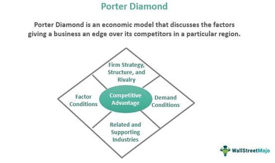

The modern job market is characterized by rapid technological advancements and significant economic shifts, creating a landscape where career stability is no longer guaranteed. In this turbulent environment, employees often encounter unexpected career changes, requiring both adaptability and resilience. These transitions might include shifts due to industry changes, corporate restructuring, or personal career aspirations.

In response to these challenges, the interplay between employee support mechanisms such as outplacement services, career transition strategies, and emerging fields like algorithmic trading becomes crucial. Outplacement services assist employees in smoothly transitioning to new jobs by offering resources such as resume writing and interview preparation, ultimately benefiting both employees and employers by reducing conflict and preserving employer reputation.



Career transitions, when well-supported, enhance not only professional development but also the emotional well-being of employees, ensuring they remain engaged and motivated. This facet of career management includes tailored coaching and skills development to meet the demands of a constantly evolving job market.

Additionally, new career pathways, such as those in algorithmic trading, represent significant opportunities for career reinvention. Algorithmic trading utilizes sophisticated algorithms to automate trading decisions, necessitating a blend of skills in data analysis, programming, and financial theory. This field is growing in prominence alongside the rise of fintech, offering lucrative prospects for those willing to upskill.

By understanding the connections between outplacement services, career transition support, and the burgeoning field of algorithmic trading, employees and organizations can craft effective strategies to navigate the complexities of the modern job market. This article will explore these interconnected elements, providing a roadmap for successful adaptation and growth in dynamic professional environments.

## Table of Contents

## Understanding Outplacement Services

Outplacement services function as a crucial element for facilitating the transition of employees into new employment opportunities. These services, often provided by specialized firms, offer comprehensive support designed to prepare individuals for re-entry into the job market. Key components typically include resume crafting, interview preparation, career coaching, and tailored job search strategies.

Resume writing services focus on creating compelling documents that showcase an individual's skills and achievements effectively, aligning with current market expectations. Interview preparation involves providing techniques and practice scenarios to help candidates convey confidence and competency during job interviews. Career coaching provides personalized guidance, helping individuals to identify their strengths and career aspirations, while job search strategies offer tools and recommendations to navigate the evolving job market landscape efficiently.

The implementation of outplacement services can significantly benefit both employees and employers. For employees, these services offer emotional and practical support, reducing the stress associated with job loss and enhancing their readiness for new opportunities. For employers, offering outplacement can help to maintain positive relationships with departing employees and preserve the company’s reputation. Employers demonstrate their commitment to employee welfare, which can mitigate potential conflicts during workforce reductions and support employer branding. An organization's investment in outplacement reflects a proactive approach to responsible corporate conduct, fostering goodwill among remaining employees and potential future talent.

## The Role of Career Transition Support

Career transition support plays a vital role in ensuring the emotional and professional well-being of employees who are navigating job changes. This support system is particularly important in the modern job market, where rapid technological advancements and economic fluctuations can lead to unexpected career shifts.

Key components of career transition support often include comprehensive career assessments, personalized coaching, and skills development initiatives. Career assessments are instrumental in helping individuals identify their strengths, weaknesses, preferences, and potential career paths. These assessments can take various forms, such as psychometric tests, skill inventories, or interest surveys, all aimed at providing individuals with insights into suitable career options.

Personalized coaching is another critical element of effective career transition support. Coaching sessions are typically tailored to the individual's specific needs and goals, focusing on areas such as confidence building, networking strategies, resume enhancement, and interview preparation. A skilled career coach acts as both a mentor and a motivator, guiding individuals through the transition process and helping them set achievable objectives.

Skills development is an essential part of aligning with the evolving demands of the job market. Many career transition programs offer workshops, training courses, and e-learning platforms that enable individuals to upgrade or diversify their skill sets. This may include learning new technologies, developing soft skills, or gaining expertise in areas with increasing market demand. By equipping individuals with relevant skills, transition support helps employees become more adaptable and marketable in their job searches.

The impact of effective career transition support extends beyond skills and assessments. It has significant psychological benefits, enhancing employee morale and reducing the anxiety associated with job changes. When individuals feel supported during their transitions, they are more likely to approach their job searches with positivity and confidence, leading to faster reintegration into the workforce. This emotional backing is crucial in maintaining resilience and motivation during what can be an inherently stressful time.

In conclusion, career transition support is indispensable for both the emotional and professional adjustment of employees facing career changes. By offering services that meet the unique needs of transitioning individuals, such programs facilitate smoother transitions, supporting employees in finding rewarding and suitable new roles within the workforce.

## Algorithmic Trading: A New Career Pathway

Algorithmic trading represents a groundbreaking career pathway that utilizes sophisticated computer algorithms to make automated trading decisions in financial markets. This field is characterized by the use of quantitative models and data-driven strategies to execute trades with precision and speed, often capitalizing on minute market inefficiencies that can yield significant profits.

The ascent of fintech has significantly fueled the demand for professionals adept in [algorithmic trading](/wiki/algorithmic-trading). These roles primarily require competencies in data analysis, programming, and a solid understanding of financial markets. The data analysis component often involves parsing large datasets to identify trading opportunities, requiring proficiency in statistical techniques and [machine learning](/wiki/machine-learning) algorithms. Programming, often in languages like Python or C++, is essential for developing and optimizing trading algorithms. An in-depth knowledge of financial instruments and market dynamics is also crucial, as it enables practitioners to align their algorithms with market behavior effectively.

For professionals from traditional finance backgrounds, transitioning to algorithmic trading offers a promising avenue for career advancement. The traditional skill set that includes financial analysis, market assessment, and risk evaluation can be an asset when combined with new skills in technology and quantitative analysis. Standard linear regression models, time series analysis, and risk management practices form the backbone of many algorithmic strategies, making prior financial knowledge invaluable.

To illustrate, consider the construction of a simple algorithmic trading model using mean reversion—an approach where the algorithm predicts that the price of a security will revert to its mean over time. For example, using Python, one might start by loading relevant time series data, calculating the moving average, and setting a strategy to buy or sell based on the deviation from this average:

```python
import pandas as pd
import numpy as np

# Load historical data
data = pd.read_csv('stock_data.csv')
data['Moving_Average'] = data['Close'].rolling(window=20).mean()

# Define trading signals
data['Signal'] = 0
data.loc[data['Close'] > data['Moving_Average'], 'Signal'] = -1  # Sell when price is above the moving average
data.loc[data['Close'] < data['Moving_Average'], 'Signal'] = 1   # Buy when price is below the moving average

# Implement a simple backtest
data['Strategy_Returns'] = data['Signal'].shift(1) * data['Close'].pct_change()
data.dropna(inplace=True)
cumulative_returns = (1 + data['Strategy_Returns']).cumprod() - 1
```

This code snippet highlights the algorithmic implementation of a trading strategy that could be further optimized with more complex models and real-time data integration.

Upskilling in algorithmic trading not only equips finance professionals with cutting-edge capabilities but also provides substantial growth opportunities. As the financial industry continues to evolve, blending quantitative methods with technological innovation, practitioners in this domain can expect to be at the forefront of market innovation. The sophistication and adaptability of algorithmic trading not only enhance career prospects but also pave the way for pioneering developments in the broader financial ecosystem.

## Integrating Outplacement and Tech Skills

Combining outplacement services with training in emerging technologies can significantly strengthen support systems for career transitions. The integration of these services equips employees with the necessary skills to remain competitive, particularly in industries undergoing rapid digital transformation. Workshops and e-learning platforms serve as valuable resources for employees seeking to acquire new competencies. These platforms are especially beneficial when targeting skills such as data analysis, coding, and financial modeling, which are essential in fields like algorithmic trading.

Workshops offer hands-on experience and facilitate interaction with experts and peers, which can enhance learning outcomes. E-learning platforms, on the other hand, provide flexibility and accessibility, enabling individuals to learn at their own pace. For instance, platforms like Coursera and edX offer courses in Python programming, machine learning, and finance, which are fundamental for algorithmic trading. By engaging in these learning modes, employees not only improve their technical skills but also become adaptable to different working environments.

Employers who invest in integrating outplacement services with tech skills training can nurture a more adaptable and future-ready workforce. By aligning employee development with organization objectives and market trends, companies can minimize skill gaps and enhance operational efficiency. Additionally, fostering a culture of continuous learning can lead to increased employee satisfaction and retention. Such proactive strategies not only benefit individual career growth but also bolster organizational resilience against economic fluctuations and technological disruptions. 

The collaboration between technology training providers and companies offering outplacement services is crucial. Tailored programs that align with specific industry needs and employee objectives can be developed through these partnerships. This ensures that employees receive relevant training, maximizing their potential for successful career transitions. In practice, integrating technical skills training with traditional outplacement services results in a comprehensive support system that propels both employees and organizations towards sustainable growth.

## Conclusion

In a rapidly evolving corporate landscape, both companies and employees must employ proactive strategies to navigate career transitions successfully. Outplacement services and upskilling in fields like algorithmic trading offer tangible pathways for career reinvention and adaptation to new market demands. By integrating these tools, employees can enhance their skill sets and remain competitive, while organizations can cultivate a more resilient and versatile workforce.

Outplacement services provide essential support for individuals facing job transitions, helping them to secure new employment opportunities more efficiently. When combined with training in cutting-edge areas such as algorithmic trading, these services can significantly enhance an employee's career trajectory. Algorithmic trading, which automates trading activities through complex algorithms and data analysis, symbolizes the broader shift toward technology-driven job roles. For individuals transitioning from traditional finance backgrounds, acquiring skills in coding and data analysis for algorithmic trading represents not only a career shift but also an opportunity for substantial professional growth.

Organizations that effectively integrate outplacement services and technology-focused training foster a positive narrative around corporate restructuring and workforce development. This integration enhances employer branding and reduces friction in transitional periods by providing employees with the tools they need to succeed in new roles. Additionally, it prepares businesses to meet the demands of an increasingly digital economy, thereby securing long-term success for both employees and the company.

In conclusion, embracing both outplacement services and targeted upskilling, particularly in high-demand areas like algorithmic trading, equips employees with the competencies needed for future roles. Such strategic initiatives ensure that both individuals and organizations can navigate changes with confidence, yielding beneficial outcomes for all stakeholders involved. This approach underscores the significance of adaptability and continuous learning in achieving sustained career success and organizational growth.

## References & Further Reading

[1]: Bergstra, J., Bardenet, R., Bengio, Y., & Kégl, B. (2011). ["Algorithms for Hyper-Parameter Optimization."](https://dl.acm.org/doi/10.5555/2986459.2986743) Advances in Neural Information Processing Systems 24.

[2]: ["Advances in Financial Machine Learning"](https://www.amazon.com/Advances-Financial-Machine-Learning-Marcos/dp/1119482089) by Marcos Lopez de Prado

[3]: ["Evidence-Based Technical Analysis: Applying the Scientific Method and Statistical Inference to Trading Signals"](https://www.amazon.com/Evidence-Based-Technical-Analysis-Scientific-Statistical/dp/0470008741) by David Aronson

[4]: ["Machine Learning for Algorithmic Trading"](https://github.com/stefan-jansen/machine-learning-for-trading) by Stefan Jansen

[5]: ["Quantitative Trading: How to Build Your Own Algorithmic Trading Business"](https://www.amazon.com/Quantitative-Trading-Build-Algorithmic-Business/dp/1119800064) by Ernest P. Chan