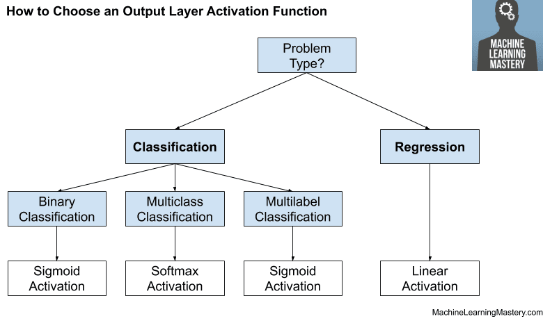

## Table of Contents

## What is an output function in the context of machine learning?

In machine learning, an output function is a part of a model that takes the input data and processes it to produce a result or prediction. This function is crucial because it determines how the model interprets the data and what kind of output it generates. For example, in a simple linear regression model, the output function might be a straight line that best fits the data points. The formula for this could be written as $$y = mx + b$$, where $$y$$ is the output, $$x$$ is the input, $$m$$ is the slope, and $$b$$ is the y-intercept.

The output function can vary depending on the type of machine learning model being used. In classification tasks, the output function might produce a probability or a class label. For instance, in a logistic regression model, the output function could be the sigmoid function, which converts the input into a value between 0 and 1, representing the probability of the input belonging to a certain class. The formula for the sigmoid function is $$ \sigma(z) = \frac{1}{1 + e^{-z}} $$, where $$z$$ is a linear combination of the input features. Understanding the output function is essential for interpreting the model's predictions and for making adjustments to improve the model's performance.

## How does the Softmax function work and where is it commonly used?

The Softmax function is used in machine learning to turn a set of numbers into probabilities that add up to one. It's like a special tool that helps the computer decide which answer is the most likely out of many possible answers. Imagine you have a bunch of scores, and you want to know how sure the computer is about each one. The Softmax function takes these scores and makes them into a nice, easy-to-understand set of probabilities. The formula for the Softmax function is $$ \text{Softmax}(x_i) = \frac{e^{x_i}}{\sum_{j=1}^K e^{x_j}} $$, where $$x_i$$ is one of the scores, and the bottom part of the formula makes sure all the probabilities add up to one.

Softmax is commonly used in classification tasks, especially in neural networks. For example, if you're trying to recognize different types of animals in pictures, the Softmax function can help the computer figure out the probability that a picture is a cat, a dog, or a bird. It's often used at the end of a [neural network](/wiki/neural-network), where it takes the raw output from the network and turns it into a set of probabilities. This makes it easier for the computer to pick the most likely answer. In code, you might see the Softmax function implemented like this:

```python
import numpy as np

def softmax(x):
    e_x = np.exp(x - np.max(x))
    return e_x / e_x.sum()
```

This function takes an array of numbers and turns them into probabilities that add up to one.

## What are heatmaps and how are they used as output functions in machine learning?

Heatmaps are colorful pictures that show where something is happening a lot or a little. They use different colors to show different amounts, like using red for high amounts and blue for low amounts. In [machine learning](/wiki/machine-learning), heatmaps are used to show where a model is looking or what it's paying attention to. For example, if you're using a computer to recognize what's in a picture, a heatmap can show which parts of the picture the computer thinks are important for making its guess.

In machine learning, heatmaps are often used as output functions to help people understand how a model works. For instance, in a model that looks at pictures, the heatmap might show that the model is focusing on the eyes and nose when trying to recognize a face. This helps people see if the model is looking at the right parts of the picture. By using heatmaps, people can check if the model is working the way they expect, and they can make changes to make it work better.

## Can you explain the concept of Mixture of Logistic Distributions as an output function?

A Mixture of Logistic Distributions is a way to combine several simple logistic functions to create a more complex output function. Imagine you have a bunch of S-shaped curves, each representing a simple yes-or-no decision. By mixing these curves together, you can create a more flexible and powerful way to model data that might have more than one peak or different shapes. This method is useful when the data you're trying to predict doesn't fit neatly into one simple pattern. For example, if you're trying to predict how likely someone is to buy different products, the data might show multiple groups of people with different buying habits, and a Mixture of Logistic Distributions can capture this complexity.

In practical terms, a Mixture of Logistic Distributions works by assigning weights to each logistic function and then combining their outputs. The formula for this might look like $$ P(y) = \sum_{k=1}^K \pi_k \cdot \text{Logistic}(x; \beta_k) $$, where $$ \pi_k $$ are the weights that add up to 1, and $$ \text{Logistic}(x; \beta_k) $$ is the logistic function with parameters $$ \beta_k $$. This approach allows the model to fit data that might have multiple underlying patterns or groups. By adjusting the weights and parameters of each logistic function, the model can better match the real-world data, making it a useful tool in machine learning for tasks like classification and regression where the data might be more complex than a single logistic function can handle.

## What is Adaptive Softmax and in what scenarios is it beneficial to use it?

Adaptive Softmax is a way to make the Softmax function work faster and better when you have a lot of different things to choose from. Imagine you're trying to guess which of a thousand different words someone might say next. The regular Softmax function would have to think about all thousand words every time, which can be slow. Adaptive Softmax is smarter because it splits the words into groups. It only thinks hard about the words that are most likely to be next, and it uses a simpler way to guess about the other words. This makes the guessing faster and still pretty accurate.

This method is really helpful when you're working with big sets of data, like in language models where you have a huge number of words to consider. For example, if you're building a chatbot that needs to pick the right word to say next out of thousands of options, Adaptive Softmax can make your chatbot respond quicker without losing much accuracy. It's also useful in other machine learning tasks where you have a lot of different categories to choose from, and you want to speed up the process without making the model too complicated.

## How does the Expected Value Model (EVM) function as an output in machine learning?

The Expected Value Model (EVM) is a way to predict the average outcome of a situation in machine learning. It's like guessing what will happen on average if you do something many times. For example, if you're trying to predict how much money you'll make from selling lemonade, the EVM would look at all the possible amounts you could make and figure out the average. This helps you make decisions based on what's most likely to happen.

In machine learning, the EVM can be used as an output function to help make predictions. Imagine you're training a model to guess the price of a house. The EVM would take into account all the different factors like the size of the house, the neighborhood, and recent sales, and then calculate the average price you could expect. This average, or expected value, becomes the model's prediction. The formula for the expected value is $$ E(X) = \sum_{i=1}^n x_i \cdot p_i $$, where $$ x_i $$ are the possible outcomes and $$ p_i $$ are their probabilities. By using this method, the model can give you a good guess about what to expect, even when there's a lot of uncertainty.

## What is Sparsemax and how does it differ from Softmax?

Sparsemax is a function used in machine learning that's similar to Softmax but works a bit differently. While Softmax turns a set of numbers into probabilities that add up to one, Sparsemax does something similar but can make some of the probabilities zero. This means it can focus on just a few important choices instead of spreading out the probabilities evenly across all choices. The formula for Sparsemax is a bit more complicated than Softmax, but it's designed to make the output more "sparse," which means it has fewer non-zero values. This can be really helpful when you want your model to make clear, strong decisions instead of always being a bit unsure about everything.

The main difference between Sparsemax and Softmax is how they handle the output. Softmax uses the formula $$ \text{Softmax}(x_i) = \frac{e^{x_i}}{\sum_{j=1}^K e^{x_j}} $$ to turn the input numbers into probabilities. This means every choice gets some probability, even if it's very small. On the other hand, Sparsemax can set some probabilities to zero, which means it can ignore choices that aren't very important. This makes Sparsemax useful in situations where you want your model to be more decisive and focus on just a few key options. For example, if you're trying to pick the best words to use in a sentence, Sparsemax might help your model choose just a few good words instead of giving a little bit of attention to many words.

## Can you describe the Hierarchical Softmax and its advantages in large-scale applications?

Hierarchical Softmax is a smart way to make the Softmax function work faster when you have a lot of different things to choose from. Imagine you're trying to guess which of a thousand different words someone might say next. The regular Softmax function would have to think about all thousand words every time, which can be slow. Hierarchical Softmax is like a tree where you start at the top and make choices as you go down the branches. This way, you only have to think about a few words at each step instead of all of them at once. The formula for Hierarchical Softmax involves breaking down the probability calculation into smaller steps, like $$ P(w) = \prod_{i=1}^L P(n_i | n_{i-1}) $$, where $$ w $$ is the word you're trying to predict, and $$ n_i $$ are the nodes in the tree.

The big advantage of using Hierarchical Softmax in large-scale applications is that it makes things much faster. When you have thousands or even millions of choices, like in language models that need to pick the right word out of a huge dictionary, regular Softmax can take a long time to compute. But with Hierarchical Softmax, you can quickly narrow down your choices by going through the tree. This not only speeds up the process but also uses less memory, which is really important when you're working with big data. So, if you're building a model that needs to make quick decisions from a huge set of options, Hierarchical Softmax can help make your model run smoother and faster.

## What are Part Affinity Fields (PAFs) and how are they applied in pose estimation tasks?

Part Affinity Fields (PAFs) are a way to help computers understand where different body parts are in a picture and how they connect to each other. Imagine you have a picture of a person, and you want to know where their elbows, knees, and other joints are. PAFs create special maps that show the direction and strength of the lines connecting these body parts. These maps help the computer figure out which parts belong to the same person, even if there are many people in the picture. By using PAFs, the computer can trace the lines from one joint to another and build a complete picture of a person's pose.

In pose estimation tasks, PAFs are really useful because they make it easier for the computer to connect the dots, literally. For example, if you're trying to track the movements of athletes in a sports video, PAFs can help the computer follow each athlete's body parts frame by frame. The computer uses the PAFs to draw lines between detected joints, like from the shoulder to the elbow, and then from the elbow to the wrist. This helps create a full skeleton of the person, showing their exact pose. By using PAFs, pose estimation becomes more accurate and can handle complex scenes with multiple people moving around.

## How does the Mixture of Softmaxes enhance model performance in classification tasks?

A Mixture of Softmaxes is a way to make classification tasks in machine learning better by combining several Softmax functions. Imagine you're trying to guess what kind of animal is in a picture. A single Softmax function might be good at guessing dogs and cats but not so good at guessing birds. By using a Mixture of Softmaxes, you can have one Softmax function that's really good at guessing dogs, another that's great at cats, and a third one that's perfect for birds. The model then decides which Softmax function to trust more for each picture, making its guesses more accurate overall. This is done by assigning weights to each Softmax function and then combining their outputs, like $$ P(y) = \sum_{k=1}^K \pi_k \cdot \text{Softmax}_k(x) $$, where $$ \pi_k $$ are the weights that add up to 1.

Using a Mixture of Softmaxes helps the model handle complex data better. For example, if you're classifying different types of flowers, some flowers might look very similar to each other, making it hard for a single Softmax function to tell them apart. By mixing several Softmax functions, the model can focus on different features of the flowers, like petal shape or color, and use the best function for each type of flower. This approach makes the model more flexible and able to learn from data that has many different patterns or groups, leading to better performance in classification tasks.

## What are the computational trade-offs when choosing between different output functions like Softmax and Sparsemax?

When choosing between Softmax and Sparsemax as output functions in machine learning, there are important computational trade-offs to consider. Softmax is simpler and faster to compute because it uses the formula $$ \text{Softmax}(x_i) = \frac{e^{x_i}}{\sum_{j=1}^K e^{x_j}} $$. This function turns a set of numbers into probabilities that add up to one, which is useful for many classification tasks. However, Softmax can be slow when you have a lot of different choices to consider because it needs to calculate the exponential of each input and then normalize them all. This can be a problem in large-scale applications like language models with thousands of words.

Sparsemax, on the other hand, is more complex to compute but can be faster in certain situations. It uses a different approach that can set some probabilities to zero, making the output more "sparse." This means Sparsemax can focus on just a few important choices instead of spreading out the probabilities evenly across all choices. While the computation of Sparsemax involves solving a quadratic program, which can be more time-consuming than the exponential calculations of Softmax, it can lead to faster overall performance in tasks where you want the model to make clear, strong decisions. For example, in language models, Sparsemax might help the model choose just a few good words instead of giving a little bit of attention to many words, which can speed up the decision-making process.

In summary, the choice between Softmax and Sparsemax depends on the specific needs of your machine learning task. If speed and simplicity are most important, and you're okay with spreading probabilities across all choices, Softmax might be the better choice. But if you need your model to be more decisive and focus on just a few key options, and you're willing to deal with a bit more complexity in the computation, Sparsemax could offer better performance, especially in large-scale applications.

## How can one evaluate the effectiveness of different output functions in a specific machine learning model?

To evaluate the effectiveness of different output functions in a machine learning model, you can use several methods. One common approach is to compare the model's performance using different output functions on a set of test data. You can look at metrics like accuracy, which tells you how often the model's predictions are correct, or the F1 score, which is a measure of a model's accuracy that considers both precision and recall. By running the model with Softmax, Sparsemax, or other output functions and comparing these metrics, you can see which function works best for your specific task. For example, if you're working on a classification task, you might use the formula $$ \text{Accuracy} = \frac{\text{Number of Correct Predictions}}{\text{Total Number of Predictions}} $$ to see how well each output function performs.

Another way to evaluate output functions is by looking at how they affect the model's training time and computational resources. Some output functions, like Softmax, are simpler and faster to compute, which can be important if you're working with large datasets or need quick results. Others, like Sparsemax, might be more complex but can lead to better performance in certain scenarios. You can measure the time it takes to train the model with different output functions and compare their impact on the model's speed and efficiency. For instance, you might use a code block like this to time the training process:

```python
import time

start_time = time.time()
# Train model with Softmax
end_time = time.time()
softmax_time = end_time - start_time

start_time = time.time()
# Train model with Sparsemax
end_time = time.time()
sparsemax_time = end_time - start_time

print(f"Softmax training time: {softmax_time} seconds")
print(f"Sparsemax training time: {sparsemax_time} seconds")
```

By considering both the model's performance on test data and its computational efficiency, you can make an informed decision about which output function is most effective for your specific machine learning model.

## References & Further Reading

[1]: Goodfellow, I., Bengio, Y., & Courville, A. (2016). ["Deep Learning"](https://link.springer.com/article/10.1007/s10710-017-9314-z). MIT Press.

[2]: Bishop, C. M. (2006). ["Pattern Recognition and Machine Learning."](https://www.cs.uoi.gr/~arly/courses/ml/tmp/Bishop_book.pdf) Springer.

[3]: Trémeau, A., Schettini, R., & Tominaga, S. (Eds.). (2013). ["Computational Color Imaging."](https://www.semanticscholar.org/paper/Computational-Color-Imaging-Tr%C3%A9meau-Schettini/d93e33eff4278dabb3185a667729f6647b6a56ed) Springer.

[4]: Murphy, K. P. (2012). ["Machine Learning: A Probabilistic Perspective."](https://www.cs.ubc.ca/~murphyk/MLbook/pml-toc-1may12.pdf) MIT Press.

[5]: Hochreiter, S., & Schmidhuber, J. (1997). ["Long Short-Term Memory."](https://www.researchgate.net/publication/13853244_Long_Short-term_Memory) Neural Computation, 9(8), 1735-1780.

[6]: Kingma, D. P., & Ba, J. (2014). ["Adam: A Method for Stochastic Optimization."](https://arxiv.org/abs/1412.6980) arXiv preprint arXiv:1412.6980.

[7]: Bengio, Y., Ducharme, R., Vincent, P., & Jauvin, C. (2003). ["A Neural Probabilistic Language Model."](https://jmlr.org/papers/volume3/bengio03a/bengio03a.pdf) Journal of Machine Learning Research, 3, 1137-1155.

[8]: Glorot, X., & Bengio, Y. (2010). ["Understanding the difficulty of training deep feedforward neural networks."](https://www.researchgate.net/publication/215616968_Understanding_the_difficulty_of_training_deep_feedforward_neural_networks) In Proceedings of the Thirteenth International Conference on Artificial Intelligence and Statistics (AISTATS), 249-256.

[9]: Jaderberg, M., Simonyan, K., & Zisserman, A. (2015). ["Spatial Transformer Networks."](https://arxiv.org/abs/1506.02025) arXiv preprint arXiv:1506.02025.

[10]: Olah, C. (2015). ["Understanding LSTM Networks."](https://colah.github.io/posts/2015-08-Understanding-LSTMs/)

[11]: Papandreou, G., Zhu, T., Chen, L. C., Gidaris, S., Tompson, J., & Murphy, K. (2018). ["PersonLab: Person Pose Estimation and Instance Segmentation with a Bottom-Up, Part-Based, Geometric Embedding Model."](https://arxiv.org/abs/1803.08225) arXiv preprint arXiv:1803.08225.