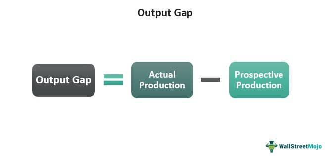

In the evolving landscape of global finance, economic measures such as the output gap and technological advancements like algorithmic trading have become essential components of modern economic analysis and trading practices. The output gap is a critical economic measure, representing the difference between an economy's actual output and its potential output, often expressed as a percentage of GDP. This metric is used to assess the current economic performance of a country, providing insights into whether the economy is operating above or below its capacity. A positive output gap suggests that an economy is overperforming, potentially leading to inflation, while a negative gap may indicate underperformance and risks of recession.

Concurrently, the advent of algorithmic trading represents a significant technological shift in financial markets. Algorithmic trading, or algo-trading, involves the use of computer algorithms to execute trades based on predefined rules. This approach allows traders to capitalize on market efficiencies with a level of precision and speed unachievable by humans alone. Institutions and retail traders increasingly leverage this technology, fundamentally changing the dynamics of trading activities.



This article examines the intersection between the output gap and algorithmic trading, evaluating the advantages and limitations inherent in both. By exploring how output gaps impact economic performance and how algorithmic trading has transformed the trading landscape, we offer insights into the complex interplay of these factors within the financial ecosystem. These insights are invaluable for understanding how these economic measures and technological innovations influence each other and collectively shape global economic stability and investor confidence.

## Table of Contents

## Understanding the Output Gap

The output gap is a crucial economic indicator that measures the deviation between an economy's actual and potential production levels. Expressed as a percentage of Gross Domestic Product (GDP), it provides insights into the cyclical position of an economy—whether it's operating above its full capacity or below it.

Mathematically, the output gap can be represented as:

$$
\text{Output Gap (\%)} = \left( \frac{\text{Actual Output} - \text{Potential Output}}{\text{Potential Output}} \right) \times 100
$$

A positive output gap occurs when actual output exceeds the potential output, implying that the economy is operating above its long-term sustainable capacity. This scenario often generates inflationary pressures since the demand for goods and services surpasses the economy's ability to supply them without causing price increases. For instance, excessive consumer spending or booming investment could lead to such a situation, prompting central banks to consider tightening monetary policies to mitigate inflation risks.

Conversely, a negative output gap is indicative of an economy underperforming relative to its potential. In this case, actual output falls short of potential output, which may signal recessionary tendencies. Underutilization of resources, such as labor and capital, is prevalent in this scenario, often resulting in increased unemployment and downward pressure on prices, potentially leading to deflation. Policymakers may respond to a negative output gap by implementing stimulus measures, such as lowering interest rates or increasing government spending, to spur economic activity.

Understanding the output gap, therefore, is vital for macroeconomic management, playing a significant role in shaping fiscal and monetary policies aimed at stabilizing economic performance and ensuring sustainable growth.

## Pros and Cons of the Output Gap

The output gap is a significant metric in economic analysis, offering both benefits and challenges. Its primary advantage is its utility in aiding policymakers to assess inflationary pressures and gauge economic health more effectively. By measuring the divergence between an economy's actual and potential output, the output gap provides insights into whether an economy is overheating or underperforming. In periods of a positive output gap, characterized by actual output exceeding potential output, the economy may experience inflationary pressures due to increased demand. Conversely, a negative output gap, where actual output falls short of potential output, can highlight underutilization of resources and signal recessionary risks. These insights are crucial for informing fiscal and monetary policies aimed at either stimulating the economy or curbing inflation.

However, the output gap presents challenges, primarily due to its inherent measurement difficulties. Estimating potential output, which is a theoretical construct of an economy's maximum sustainable output, is fraught with uncertainty. This estimation depends on factors such as technological advancements, labor force characteristics, and capital stock, all of which can change over time. As a result, any calculated output gap is subject to revision and may not always be a reliable indicator of economic conditions. 

Despite these limitations, policymakers continue to rely on the output gap as a vital input for economic decision-making. It guides crucial fiscal policies, such as government spending and taxation, and monetary policies, including [interest rate](/wiki/interest-rate-trading-strategies) adjustments, to align actual output closer to potential output. However, users of this metric must remain cautious, acknowledging possible inaccuracies in measurement and complementing it with other economic indicators for a more comprehensive analysis.

 to Algorithmic Trading

Algorithmic trading, often referred to as algo-trading, revolutionizes the financial markets by employing computer algorithms to execute trades based on a set of predefined rules. These algorithms analyze market data and make trading decisions at speeds and efficiencies that are beyond human capabilities. The primary objective of [algorithmic trading](/wiki/algorithmic-trading) is to exploit market inefficiencies and execute large volumes of trades quickly to optimize profits and reduce potential price impacts.

The rise of algorithmic trading has been largely driven by technological advances and increased computational power. These advancements have facilitated the processing of a vast amount of market data, enabling traders to respond to changes in market conditions within milliseconds. Algorithms can be designed to follow a variety of strategies, such as [trend following](/wiki/trend-following), [arbitrage](/wiki/arbitrage), or market-making, and can be backtested using historical data to evaluate performance before live deployment.

Algorithmic trading is predominantly used by institutional investors, including mutual funds, hedge funds, and financial institutions, due to the significant resources required to develop and maintain these sophisticated systems. However, the barriers to entry have been lowered in recent years, leading to increasing participation by retail traders. Retail platforms now offer more accessible tools that allow individual traders to engage in automated trading using simpler algorithmic strategies.

The impact of algorithmic trading on modern trading practices is substantial. It improves market efficiency by allowing for better price discovery and [liquidity](/wiki/liquidity-risk-premium) provision. The precision and lack of emotional bias inherent in these systems can lead to more disciplined and systematic approaches to trading. However, this reliance on technology also introduces new risks, such as the potential for significant market disruptions due to errant algorithms or flash crashes.

In summary, algorithmic trading represents a significant shift in the dynamics of the financial markets. It has reshaped the trading landscape by providing both institutional and, increasingly, retail investors with tools to engage more efficiently with the market. As technology continues to evolve, the influence of algorithmic trading is expected to grow, further transforming market operations and trading methodologies.

## Advantages and Disadvantages of Algorithmic Trading

Algorithmic trading, widely adopted in modern financial markets, brings several key advantages. Its primary benefits are speed and efficiency. These systems can execute numerous transactions across various markets within milliseconds, a feat unattainable by human traders. This capability allows traders to seize market opportunities rapidly, optimizing portfolio performance.

Another advantage is the emotionless nature of algorithmic trading. Unlike human traders, algorithms are immune to emotional biases such as fear or greed. They execute transactions based solely on predefined rules and data analysis, leading to more consistent trading outcomes. Precision is also a critical benefit. Algorithms can follow strict parameters and conditions, enabling trades to be executed at optimal times and prices, reducing slippage and human error.

Backtesting is an essential feature of algorithmic trading. Traders can test strategies using historical data to evaluate their effectiveness before deploying them in live markets. This process helps refine strategies and improve future performance.

Despite these benefits, algorithmic trading carries disadvantages. High technical complexity is a notable drawback. Developing and maintaining trading algorithms requires specialized knowledge in finance, mathematics, and computer programming. This complexity can be a barrier for many traders, especially retail investors.

Over-reliance on technology is another downside. Technical failures such as system crashes or connectivity issues can lead to significant trading losses. Moreover, algorithmic trading can risk over-optimization, where a strategy is excessively tailored to historical data, resulting in underperformance in live markets due to discrepancies between historical and real-time data conditions.

Algorithmic trading also poses systemic risks. Its ability to execute a vast number of trades in a short period can impact market liquidity. In extreme cases, it can lead to market instability, as witnessed during the "flash crash" of May 6, 2010, when major stock indices, including the Dow Jones Industrial Average, plummeted in minutes before recovering. The incident underscored the need for regulators to monitor algorithmic trading activities and implement safeguards to mitigate systemic risks.

In summary, while algorithmic trading offers unparalleled speed, efficiency, and objectivity, it is accompanied by complex challenges that require careful management to fully leverage its potential in financial markets.

## The Intersection of Economic Measures and Algorithmic Trading

The understanding of output gaps presents a notable opportunity to refine algorithmic trading strategies. The output gap, representing the difference between an economy's actual output and its potential output, provides insights into whether an economy is overheating or underperforming. By integrating this economic measure into algorithmic trading models, traders can better anticipate market conditions and adjust their strategies accordingly.

A well-defined understanding of output gaps can enable algorithmic trading systems to react more swiftly to economic shifts. Algorithmic models can be programmed to recognize signals of inflation or recession indicated by output gaps, thus enabling quicker market responses. This ability to respond to economic changes promptly might mitigate some negative consequences of a negative output gap, such as declining asset values or reduced liquidity in financial markets.

Incorporating real-time economic indicators like the output gap into algorithmic trading models requires sophisticated algorithmic design and data integration. These models can be constructed to automatically adjust trading positions based on output gap data, allowing for more dynamic and informed trading decisions. For example, Python can be used to build models that analyze GDP data and adjust positions in derivatives or currencies accordingly:

```python
import numpy as np
import pandas as pd
from sklearn.linear_model import LinearRegression

# Load GDP data
gdp_data = pd.read_csv('gdp_data.csv') # Assumes CSV file with Date, Actual GDP, Potential GDP

# Calculate output gap
gdp_data['Output_Gap'] = (gdp_data['Actual_GDP'] - gdp_data['Potential_GDP']) / gdp_data['Potential_GDP']

# Simple linear model to predict market movement based on output gap
X = gdp_data['Output_Gap'].values.reshape(-1, 1)
y = gdp_data['Market_Movement'].values
model = LinearRegression().fit(X, y)

# Predict market movement based on new output gap data
output_gap_today = 0.02
predicted_movement = model.predict(np.array([[output_gap_today]]))

print(f"Predicted market movement: {predicted_movement}")
```

This code outlines a simplistic approach to predicting market movements based on the output gap, highlighting the integration of economic data into trading algorithms. However, practical application in live markets necessitates extensive data, robust models, and continuous adjustments to algorithmic strategies.

In conclusion, understanding output gaps can refine algorithmic trading strategies by anticipating economic conditions, enabling rapid market responses, and fostering more informed trading decisions. Both economic measures and technological advancements can jointly enhance market efficiency and stability.

## Real-World Applications and Impacts

### Real-World Applications and Impacts

Countries often encounter fluctuating output gaps, which significantly impact their financial markets and broader economic stability. For example, during the early 2000s, Japan experienced a prolonged negative output gap, signaling an underperformance of its economy, which led to deflationary pressures. This economic stagnation impacted Japan’s financial markets through decreased investor confidence and lower asset prices. Similarly, during the 2008 global financial crisis, numerous developed economies, including the United States and several European countries, faced negative output gaps, which corresponded with steep declines in their financial markets.

On the other hand, positive output gaps can also strain economies. For instance, during the peak of the dot-com bubble in the late 1990s, the United States encountered a positive output gap, indicating that the economy was overheating. This was followed by a market correction as the bubble burst, leading to a reassessment of asset values and broader economic readjustment.

In terms of algorithmic trading, various case studies illustrate its application during different economic cycles influenced by output gaps. For instance, during periods of a pronounced negative output gap, algorithms can be programmed to respond to indicators of economic stimulus or fiscal interventions, thereby enabling traders to capitalize on anticipated market rebounds. Conversely, in times of a positive output gap, algorithmic trading strategies might focus on protecting capital, employing stop-loss mechanisms, or utilizing short-selling strategies to benefit from potential market corrections.

Moreover, integrating algorithmic trading with real-time economic indicators, such as output gaps, can enhance market efficiency and stability. Algorithms can quickly adapt trading strategies based on changes in economic data, potentially mitigating some adverse effects of output gaps by enabling rapid adjustments in asset allocations. For instance, during periods of economic uncertainty, algorithmic models can reduce exposure to volatile sectors and increase focus on stable, counter-cyclical investments.

Both fluctuating output gaps and algorithmic trading have profound implications for global economic stability and investor confidence. A well-calibrated understanding and response to output gaps can help policymakers and investors anticipate economic turning points, fostering a more resilient financial environment. Concurrently, algorithmic trading, when effectively managed, can enhance market liquidity and price discovery processes, contributing positively to overall market stability. However, the interaction between these factors also necessitates careful oversight to mitigate the potential risks associated with rapid technological advancements and economic fluctuations.

## Conclusion

In the current economic environment, the interplay between economic measures like the output gap and trading innovations such as algorithmic trading significantly affects financial stability and market performance. This symbiotic relationship highlights how understanding macroeconomic indicators can guide trading strategies, while advanced trading technologies can, in turn, provide real-time feedback and influence economic perceptions.

The output gap serves as a critical gauge for assessing an economy's performance relative to its potential. By integrating this measure into trading algorithms, traders can potentially enhance their strategies, ensuring they are synchronized with overarching economic conditions. This alignment allows for informed decision-making, where strategies can be dynamically adjusted in response to shifts in economic indicators, thereby fostering a more balanced economic landscape.

However, the integration of these complex systems into financial markets is not without challenges. As trading strategies become increasingly sophisticated, the need for robust regulatory frameworks is paramount. Regulatory measures must address the speed and magnitude with which algorithmic trading can influence market dynamics, especially when coupled with sensitive economic data. The potential for systemic risks underscores the importance of regulations that ensure market integrity and stability, alongside technological advancements.

Furthermore, the continuous evolution in both economic analytics and trading technologies necessitates ongoing research and development. Such efforts could enhance the precision of economic measures and improve the adaptability and resilience of trading systems. Policymakers and financial institutions are encouraged to explore synergies between these domains, as their integration promises not only improved economic decision-making but also enhanced market efficiency.

Ultimately, the relationship between economic metrics and trading technologies is a cornerstone of modern financial markets. By leveraging these connections judiciously, stakeholders can contribute to a more resilient and stable economic environment, thereby bolstering investor confidence and promoting sustainable growth.

## References & Further Reading

[1]: ["Understanding the Output Gap"](https://www.stlouisfed.org/open-vault/2021/august/understanding-potential-gdp-and-output-gap) by International Monetary Fund

[2]: ["Algorithmic Trading: Winning Strategies and Their Rationale"](https://www.wiley.com/en-us/Algorithmic+Trading%3A+Winning+Strategies+and+Their+Rationale-p-9781118460146) by Ernest P. Chan

[3]: Orphanides, Athanasios, and Simon van Norden. ["The Weighing of Risks with the Output Gap."](https://www.jstor.org/stable/3211719) Journal of Monetary Economics, Vol. 57, No. 8, 2010, pp. 900–916.

[4]: Carlin, Bruce I., & Lobo, Miguel S. ["Financial Decision Making with Costly External Financing"](https://jhmovie.fandom.com/wiki/Kirby_Krisis_Movie:_Age_of_Ultron/Credits). Journal of Finance, Volume 69, Issue 6, December 2014.

[5]: "Flash Boys: A Wall Street Revolt" by Michael Lewis, which explores the impact of high-frequency and algorithmic trading on financial markets.