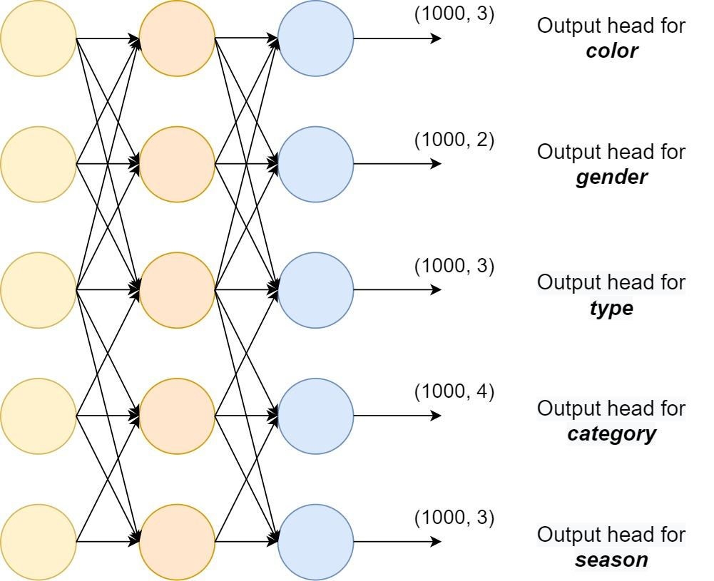

## Table of Contents

## What is an output head in machine learning?

An output head in machine learning is a part of a neural network that produces the final predictions or outputs. Think of it as the last step in a series of operations where the network processes input data and then uses the output head to make a decision or prediction. For example, in a classification task, the output head might take the features extracted by the earlier layers of the network and turn them into probabilities for different classes.

In more technical terms, the output head often includes a layer or set of layers that transform the neural network's internal representations into the desired output format. This could involve using an activation function like softmax for classification tasks, where $$ \text{softmax}(x_i) = \frac{e^{x_i}}{\sum_j e^{x_j}} $$ helps convert raw scores into probabilities. The design of the output head depends on the specific task, such as regression, classification, or even more complex outputs like bounding boxes in object detection tasks.

## How does an output head function within a neural network?

An output head in a neural network is like the final step that turns the network's internal calculations into something useful, like a prediction or decision. Imagine the neural network as a factory where raw materials (input data) go through various machines (layers) to get processed. The output head is the last machine that shapes these processed materials into the final product. For example, if you're trying to guess what type of animal is in a picture, the output head will take all the features the network has learned and decide if it's a cat, dog, or something else.

In technical terms, the output head often includes a special layer that changes the network's internal numbers into the format you need. For a task like classifying pictures, the output head might use something called a softmax function. This function turns the numbers into probabilities, so you can see how likely it is that the picture is of a cat, dog, or another animal. The formula for softmax looks like this: $$ \text{softmax}(x_i) = \frac{e^{x_i}}{\sum_j e^{x_j}} $$. This way, the output head makes sure the network's final answer is in a form that's easy to understand and use.

## What is the purpose of using different types of output heads?

Different types of output heads are used in neural networks because they help the network make different kinds of predictions. For example, if you want to guess a number, like the price of a house, you would use an output head that gives you a single number. But if you want to classify something, like deciding if an email is spam or not, you would use an output head that gives you probabilities for each class. The type of output head you choose depends on what you want the [neural network](/wiki/neural-network) to do at the end.

For instance, in classification tasks, the output head often uses a softmax function to turn the network's raw numbers into probabilities. The formula for softmax is $$ \text{softmax}(x_i) = \frac{e^{x_i}}{\sum_j e^{x_j}} $$. This helps the network decide which class is most likely. On the other hand, for regression tasks, where you're predicting a continuous value, the output head might just use a linear function to output a single number. By using the right type of output head, the neural network can be tailored to solve specific problems effectively.

## Can you explain the concept of a Dynamic Keypoint Head?

A Dynamic Keypoint Head is a special part of a neural network used for tasks like pose estimation, where you want to find important points (keypoints) on an object, like the joints on a person. What makes it "dynamic" is that it can change how it works based on the input it gets. So, if the network is looking at a picture of a person, it can adjust to find the right keypoints, even if the person is in a weird pose or partly hidden.

For example, in pose estimation, the Dynamic Keypoint Head might use a function to predict where each keypoint should be. It can look at the features the earlier layers of the network have found and then decide where to place the keypoints. This makes the network more flexible and accurate because it can adapt to different situations. If you want to see how it might work, you could use a formula like $$ \text{keypoint}_i = f(\text{features}) $$, where $$ f $$ is a function that the network learns to predict the position of the $$ i $$-th keypoint based on the features it has extracted.

## How does a Dynamic Keypoint Head differ from other types of output heads?

A Dynamic Keypoint Head is different from other output heads because it can change how it works depending on what it sees. Imagine you're trying to find key points on a person in a picture, like their elbows or knees. A regular output head might use the same method every time, but a Dynamic Keypoint Head can adjust its approach. This makes it really good at finding these points even if the person is in a strange pose or partly hidden.

For example, while a classification output head might use a softmax function to turn numbers into probabilities for different classes, a Dynamic Keypoint Head uses a different kind of function. This function can look at the features the network has found and then decide where to place the keypoints. If you want to see how it might work, you could use a formula like $$ \text{keypoint}_i = f(\text{features}) $$, where $$ f $$ is a function that the network learns to predict the position of the $$ i $$-th keypoint based on the features it has extracted.

## What are the key components of a Dynamic Keypoint Head?

A Dynamic Keypoint Head has a few important parts that help it find key points on objects in pictures. The main part is the function that changes how it works depending on what it sees. This function looks at the features the earlier layers of the network have found and then decides where to put the keypoints. It's like the head can adapt to different poses or if part of the object is hidden. If you want to see how it might work, you could use a formula like $$ \text{keypoint}_i = f(\text{features}) $$, where $$ f $$ is a function that the network learns to predict the position of the $$ i $$-th keypoint based on the features it has extracted.

Another key part is how it handles uncertainty. Because the keypoints might not always be easy to see, the Dynamic Keypoint Head can also predict how sure it is about where the keypoints are. This helps the network be more accurate and reliable. By adjusting its method and considering uncertainty, the Dynamic Keypoint Head can do a better job at finding important points on objects, even in tricky situations.

## In what scenarios would a Dynamic Keypoint Head be most beneficial?

A Dynamic Keypoint Head would be most beneficial in scenarios where you need to find important points on objects that can be in different poses or partly hidden. For example, in sports analysis, if you want to track the movements of athletes, a Dynamic Keypoint Head can adjust to find their joints even if they are in unusual positions. This makes it really useful for things like tracking a soccer player's movements during a game or analyzing a gymnast's routine.

Another scenario where a Dynamic Keypoint Head shines is in medical imaging. When doctors need to find specific points on a patient's body, like joints or bones, the head can adapt to different body shapes and positions. This helps in creating accurate models of the body for diagnosis or planning surgeries. By using a function like $$ \text{keypoint}_i = f(\text{features}) $$, the head can predict where these points are based on the features it sees, making it a powerful tool in healthcare.

## How can one implement a Dynamic Keypoint Head in a machine learning model?

To implement a Dynamic Keypoint Head in a [machine learning](/wiki/machine-learning) model, you start by designing a neural network that can find important points on objects, like joints on a person. The key part of the Dynamic Keypoint Head is a function that can change how it works based on what it sees. This function looks at the features the earlier layers of the network have found and then decides where to put the keypoints. For example, you might use a formula like $$ \text{keypoint}_i = f(\text{features}) $$ where $$ f $$ is a function that the network learns to predict the position of the $$ i $$-th keypoint based on the features it has extracted. To make this work, you'll need to train the network with lots of pictures that have the keypoints marked, so it can learn how to find them.

In practice, you might use a programming language like Python with a library like PyTorch or TensorFlow to build and train your model. Here's a simple example of how you might start setting up a Dynamic Keypoint Head in PyTorch:

```python
import torch
import torch.nn as nn

class DynamicKeypointHead(nn.Module):
    def __init__(self, in_channels, num_keypoints):
        super(DynamicKeypointHead, self).__init__()
        self.conv = nn.Conv2d(in_channels, in_channels, kernel_size=3, padding=1)
        self.keypoint_predictor = nn.Conv2d(in_channels, num_keypoints, kernel_size=1)

    def forward(self, x):
        x = self.conv(x)
        keypoints = self.keypoint_predictor(x)
        return keypoints

# Example usage
model = DynamicKeypointHead(in_channels=256, num_keypoints=17)
input_tensor = torch.randn(1, 256, 64, 64)  # Example input tensor
output = model(input_tensor)
print(output.shape)  # Should print torch.Size([1, 17, 64, 64])
```

This code creates a simple Dynamic Keypoint Head that uses convolutional layers to process the input features and predict the locations of keypoints. The network can be trained to adapt to different poses and occlusions by adjusting the weights of these layers based on the training data.

## What are the challenges faced when using a Dynamic Keypoint Head?

One challenge with using a Dynamic Keypoint Head is that it needs a lot of good data to learn from. If the pictures used to train the model don't show a lot of different poses or if some keypoints are often hidden, the model might not work well when it sees new, different pictures. This means you need a big and varied set of pictures with the keypoints marked correctly, which can be hard to get.

Another challenge is that the model has to be smart enough to guess where keypoints are even when they're hard to see. For example, if someone's arm is behind their back, the model needs to figure out where the elbow is even though it's not visible. This requires the model to understand the overall shape and position of the body, which can be tricky. To do this, the model uses a function like $$ \text{keypoint}_i = f(\text{features}) $$ to predict the position of the $$ i $$-th keypoint based on the features it sees, but getting this function right takes a lot of careful training and tuning.

## How does the performance of a Dynamic Keypoint Head compare to traditional keypoint detection methods?

A Dynamic Keypoint Head often performs better than traditional keypoint detection methods because it can adapt to different poses and situations. Traditional methods might use fixed rules or simpler models to find keypoints, but they can struggle when the object is in a new or unusual pose. A Dynamic Keypoint Head, on the other hand, uses a function like $$ \text{keypoint}_i = f(\text{features}) $$ to predict where each keypoint should be based on the features it sees. This means it can learn from a wide range of examples and make better guesses even when parts of the object are hidden or in strange positions.

However, the performance advantage of a Dynamic Keypoint Head comes with some challenges. It needs a lot of good training data to work well, which can be hard to get. If the training data doesn't show many different poses or if some keypoints are often hidden, the model might not perform as well on new, different images. Also, traditional methods might be simpler and faster to use, while a Dynamic Keypoint Head requires more complex models and more computing power. Despite these challenges, when trained well, a Dynamic Keypoint Head can be more accurate and flexible than traditional methods.

## What advanced techniques can be applied to optimize a Dynamic Keypoint Head?

One advanced technique to optimize a Dynamic Keypoint Head is to use [data augmentation](/wiki/data-augmentation). This means taking the pictures you use to train the model and changing them a bit, like flipping them or adding some noise. By doing this, you can make the model see many different versions of the same picture, which helps it learn to find keypoints even when the object is in new poses or partly hidden. Another technique is to use a function like $$ \text{keypoint}_i = f(\text{features}) $$ to predict where each keypoint should be, and then use something called "attention mechanisms" to focus on the most important parts of the picture. This can help the model be more accurate by paying more attention to the areas where the keypoints are likely to be.

Another way to optimize a Dynamic Keypoint Head is to use transfer learning. This means starting with a model that's already been trained on a different task and then tweaking it to find keypoints. This can save a lot of time because the model already knows some basic things about pictures, so it can learn to find keypoints faster. You can also use a technique called "ensemble methods," where you train several different models and then combine their guesses to get a better overall prediction. By using these advanced techniques, you can make the Dynamic Keypoint Head work better and be more accurate at finding important points on objects, even in tricky situations.

## What future developments can we expect in the field of output heads, specifically with Dynamic Keypoint Heads?

In the future, we can expect Dynamic Keypoint Heads to become even smarter and more adaptable. Researchers are working on making these heads better at handling even more complex situations, like when objects are moving quickly or when there are multiple objects in the same picture. One way they might do this is by using more advanced functions, like $$ \text{keypoint}_i = f(\text{features}) $$, that can learn from even more varied examples. This would help the model predict where keypoints are, even if they're in very unusual positions or partly hidden.

Another development we might see is the use of more powerful computers and new training methods to make Dynamic Keypoint Heads faster and more accurate. For example, researchers might use techniques like transfer learning, where a model starts with what it already knows from another task and then learns to find keypoints. They could also use ensemble methods, where several models work together to make better predictions. By combining these new ideas and technologies, Dynamic Keypoint Heads could become a key tool in many areas, like sports analysis, medical imaging, and even video games, where finding important points on moving objects is crucial.

## References & Further Reading

[1]: Toshev, A., & Szegedy, C. (2014). ["DeepPose: Human Pose Estimation via Deep Neural Networks."](https://arxiv.org/abs/1312.4659) Proceedings of the IEEE Conference on Computer Vision and Pattern Recognition (CVPR).

[2]: He, K., Zhang, X., Ren, S., & Sun, J. (2016). ["Deep Residual Learning for Image Recognition."](https://ieeexplore.ieee.org/document/7780459) Proceedings of the IEEE Conference on Computer Vision and Pattern Recognition (CVPR).

[3]: Newell, A., Yang, K., & Deng, J. (2016). ["Stacked Hourglass Networks for Human Pose Estimation."](https://arxiv.org/abs/1603.06937) Proceedings of the IEEE Conference on Computer Vision and Pattern Recognition (CVPR).

[4]: ["Deep Learning"](https://en.wikipedia.org/wiki/Deep_learning) by Ian Goodfellow, Yoshua Bengio, and Aaron Courville

[5]: Cao, Z., Simon, T., Wei, S.-E., & Sheikh, Y. (2017). ["Realtime Multi-Person 2D Pose Estimation using Part Affinity Fields."](https://ieeexplore.ieee.org/document/8765346) Proceedings of the IEEE Conference on Computer Vision and Pattern Recognition (CVPR).

[6]: Chen, L.-C., Papandreou, G., Kokkinos, I., Murphy, K., & Yuille, A. L. (2017). ["DeepLab: Semantic Image Segmentation with Deep Convolutional Nets, Atrous Convolution, and Fully Connected CRFs."](https://ieeexplore.ieee.org/document/7913730) IEEE Transactions on Pattern Analysis and Machine Intelligence.

[7]: Sun, X., Xiao, B., Wei, F., Liang, S., & Wei, Y. (2019). ["Integral Human Pose Regression."](https://arxiv.org/abs/1711.08229) Proceedings of the IEEE Conference on Computer Vision and Pattern Recognition (CVPR).