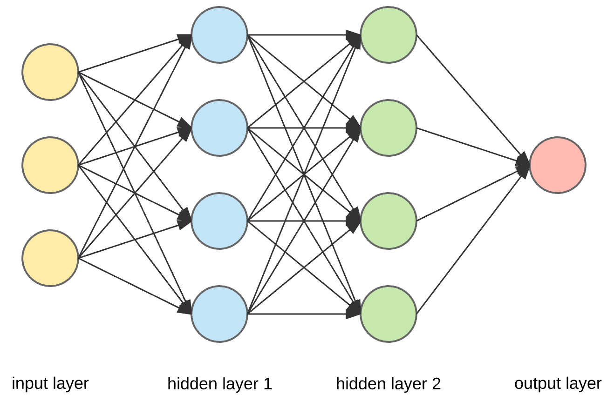

## Table of Contents

## What is an output layer in the context of machine learning?

In machine learning, the output layer is the final layer in a neural network. It's where the network makes its predictions or decisions based on the data it has processed through earlier layers. Think of it as the part of the network that gives you the answer to your question. For example, if you're using a neural network to recognize pictures of cats and dogs, the output layer will tell you whether the picture is more likely to be a cat or a dog.

The output layer can have different forms depending on the type of problem you're solving. For classification problems, where you're trying to put things into different categories, the output layer often uses something called a softmax function. This function turns the network's raw outputs into probabilities that add up to 1. For example, if you're classifying pictures of animals, the softmax function might give you a probability of 0.8 for "cat" and 0.2 for "dog". For regression problems, where you're predicting a number, the output layer might just give you a single number as its prediction.

## How does the output layer differ from other layers in a neural network?

The output layer in a neural network is special because it's the last stop for data before the network makes its final prediction or decision. Unlike the hidden layers, which process and transform the data in various ways, the output layer's job is to give you the answer you're looking for. For example, if you're trying to figure out if a picture shows a cat or a dog, the hidden layers might be looking at different parts of the image and trying to understand what they see, but the output layer will tell you directly if it thinks the picture is more likely to be a cat or a dog.

The structure of the output layer can be different from other layers too. While hidden layers often use activation functions like ReLU or sigmoid to help them learn, the output layer might use a different function depending on what you're trying to do. For example, if you're doing classification, the output layer might use a softmax function to turn the network's guesses into probabilities. If you're doing regression, the output layer might just give you a number without any special function. This makes the output layer unique because it's designed to give you the final answer in a way that's easy to understand and use.

## What are the common activation functions used in the output layer?

In the output layer of a [neural network](/wiki/neural-network), the choice of activation function depends on the kind of problem you're solving. For classification problems, where you're trying to decide which category something belongs to, the softmax function is often used. The softmax function turns the raw outputs of the network into probabilities that add up to 1. For example, if you're classifying pictures of animals, the softmax function might give you a probability of 0.8 for "cat" and 0.2 for "dog". This is helpful because it tells you how confident the network is in its decision. The formula for the softmax function for an output $$z_i$$ is $$ \text{softmax}(z_i) = \frac{e^{z_i}}{\sum_{j} e^{z_j}} $$, where $$z_i$$ are the raw outputs of the network.

For regression problems, where you're trying to predict a number, the output layer often doesn't use any activation function at all. This means the network's raw output is used directly as the prediction. Sometimes, if you want to make sure the output is always positive, you might use a ReLU (Rectified Linear Unit) function, which is defined as $$ \text{ReLU}(x) = \max(0, x) $$. If you need the output to be between 0 and 1, you might use a sigmoid function, which is defined as $$ \text{sigmoid}(x) = \frac{1}{1 + e^{-x}} $$. These functions help make sure the network's output fits the kind of number you're trying to predict.

In summary, the choice of activation function in the output layer is crucial for making sure the network's output makes sense for the problem you're trying to solve. Whether it's softmax for classification, no activation for simple regression, or ReLU or sigmoid for specific constraints, the right function helps the network give you the best possible answer.

## How does the choice of activation function affect the output layer's performance?

The choice of activation function in the output layer can greatly affect how well a neural network performs. For example, if you're trying to classify something into different categories, using a softmax function can help a lot. The softmax function turns the network's guesses into probabilities that add up to 1. So, if you're trying to decide if a picture is of a cat or a dog, the softmax function might tell you there's an 80% chance it's a cat and a 20% chance it's a dog. This makes it easier to understand and use the network's output. If you didn't use softmax and just used the raw numbers from the network, it would be harder to know how confident the network is in its decision.

For regression problems, where you're trying to predict a number, not using any activation function in the output layer can be best. This means the network's raw output is used directly as the prediction. Sometimes, if you need the output to be positive, you might use a ReLU function, which is defined as $$ \text{ReLU}(x) = \max(0, x) $$. If you need the output to be between 0 and 1, you might use a sigmoid function, which is defined as $$ \text{sigmoid}(x) = \frac{1}{1 + e^{-x}} $$. Using the right activation function helps make sure the network's output fits the kind of number you're trying to predict. If you use the wrong function, the network might give you numbers that don't make sense for your problem, which can make it perform worse.

## What is the role of the output layer in classification tasks?

In classification tasks, the output layer of a neural network is where the final decision is made. It takes the information processed by the earlier layers and turns it into a prediction about which category something belongs to. For example, if you're using a network to decide if a picture is of a cat or a dog, the output layer will tell you which one it thinks the picture shows. The output layer often uses a special function called softmax to do this. The softmax function turns the network's guesses into probabilities that add up to 1. So, if the network thinks there's an 80% chance the picture is of a cat, the softmax function will show that as 0.8 for "cat" and 0.2 for "dog".

Using the softmax function in the output layer helps make the network's output easier to understand and use. The formula for the softmax function for an output $$z_i$$ is $$ \text{softmax}(z_i) = \frac{e^{z_i}}{\sum_{j} e^{z_j}} $$, where $$z_i$$ are the raw outputs of the network. This function is really helpful because it tells you how confident the network is in its decision. If you didn't use softmax and just used the raw numbers from the network, it would be harder to know how sure the network is about its guess. So, the output layer and the softmax function together make the network's decision clear and useful for classification tasks.

## How is the output layer configured for regression tasks?

In regression tasks, the output layer of a neural network is set up to predict a number. Unlike classification, where the output layer often uses a softmax function to turn guesses into probabilities, regression usually doesn't need any special function at all. The network's raw output is used directly as the prediction. This means if you're trying to predict something like the price of a house, the output layer will give you a number that's the network's best guess for that price.

Sometimes, though, you might need the output to be positive or to be between certain numbers. If you need the output to be positive, you might use a ReLU function. The ReLU function is defined as $$ \text{ReLU}(x) = \max(0, x) $$. This means it will give you a number that's zero or more. If you need the output to be between 0 and 1, you might use a sigmoid function. The sigmoid function is defined as $$ \text{sigmoid}(x) = \frac{1}{1 + e^{-x}} $$. This function will always give you a number between 0 and 1. Using the right function in the output layer helps make sure the network's prediction makes sense for the kind of number you're trying to predict.

## What are the considerations for designing the output layer in multi-label classification?

In multi-label classification, the output layer needs to be set up to predict more than one label at the same time. For example, if you're classifying pictures of animals, a picture might have both a "cat" and a "dog" label. To do this, the output layer usually has one neuron for each possible label. Each neuron uses a sigmoid function, which is defined as $$ \text{sigmoid}(x) = \frac{1}{1 + e^{-x}} $$. This function gives you a number between 0 and 1, which you can think of as the probability that the label applies to the input. If the number is close to 1, it means the network thinks the label is likely to be true. If it's close to 0, it means the network thinks the label is unlikely to be true.

When designing the output layer for multi-label classification, you need to think about how to handle the different labels. Since each label is predicted separately, you can set a threshold to decide if a label should be applied. For example, you might say that if the output for a label is more than 0.5, you'll consider that label to be true. This threshold can be adjusted based on how important it is to avoid false positives or false negatives. Also, because the labels are predicted independently, you need to make sure the network is trained to recognize when multiple labels can be true at the same time. This means using the right loss function, like binary cross-entropy, which helps the network learn to predict multiple labels correctly.

## How do you interpret the outputs from the output layer in a neural network?

Interpreting the outputs from the output layer of a neural network depends on what kind of problem you're trying to solve. For classification tasks, where you're trying to decide which category something belongs to, the output layer often uses a softmax function. This function turns the network's guesses into probabilities that add up to 1. For example, if you're trying to decide if a picture is of a cat or a dog, the softmax function might give you a probability of 0.8 for "cat" and 0.2 for "dog". This tells you the network thinks there's an 80% chance the picture is of a cat. The formula for the softmax function for an output $$z_i$$ is $$ \text{softmax}(z_i) = \frac{e^{z_i}}{\sum_{j} e^{z_j}} $$, where $$z_i$$ are the raw outputs of the network. By looking at these probabilities, you can understand which category the network thinks is most likely.

For regression tasks, where you're trying to predict a number, the output layer usually doesn't use any special function at all. This means the network's raw output is used directly as the prediction. For example, if you're trying to predict the price of a house, the output layer will give you a number that's the network's best guess for that price. Sometimes, if you need the output to be positive, you might use a ReLU function, which is defined as $$ \text{ReLU}(x) = \max(0, x) $$. If you need the output to be between 0 and 1, you might use a sigmoid function, which is defined as $$ \text{sigmoid}(x) = \frac{1}{1 + e^{-x}} $$. These functions help make sure the network's output fits the kind of number you're trying to predict. So, for regression, you just look at the number the output layer gives you and use it as the network's prediction.

## What techniques can be used to improve the performance of the output layer?

To improve the performance of the output layer, you can start by choosing the right activation function. For classification tasks, using a softmax function helps turn the network's guesses into probabilities that add up to 1. This makes it easier to understand and use the network's output. For regression tasks, you might not need any special function at all, but if you need the output to be positive, you can use a ReLU function, which is $$ \text{ReLU}(x) = \max(0, x) $$. If you need the output to be between 0 and 1, you can use a sigmoid function, which is $$ \text{sigmoid}(x) = \frac{1}{1 + e^{-x}} $$. Picking the right function helps make sure the network's output makes sense for the problem you're trying to solve.

Another way to improve the output layer's performance is by using the right loss function during training. For classification, you might use a loss function like cross-entropy, which helps the network learn to make better predictions. For regression, you might use mean squared error or mean absolute error, which help the network learn to predict numbers more accurately. Also, you can try adding more neurons to the output layer if it's not performing well. More neurons can help the network capture more details about the problem, but be careful not to add too many, or the network might become too complicated and hard to train.

## How does the size of the output layer relate to the problem being solved?

The size of the output layer in a neural network depends on what you're trying to do. If you're doing classification, where you're trying to put things into different categories, the size of the output layer is usually the same as the number of categories you have. For example, if you're trying to decide if a picture is of a cat or a dog, your output layer would have two neurons, one for each animal. The output layer uses a softmax function to turn the network's guesses into probabilities that add up to 1. The formula for the softmax function for an output $$z_i$$ is $$ \text{softmax}(z_i) = \frac{e^{z_i}}{\sum_{j} e^{z_j}} $$, where $$z_i$$ are the raw outputs of the network. This helps you understand which category the network thinks is most likely.

For regression tasks, where you're trying to predict a number, the output layer usually has just one neuron. This neuron gives you the network's best guess for the number you're trying to predict. Sometimes, if you need the output to be positive, you might use a ReLU function, which is $$ \text{ReLU}(x) = \max(0, x) $$. If you need the output to be between 0 and 1, you might use a sigmoid function, which is $$ \text{sigmoid}(x) = \frac{1}{1 + e^{-x}} $$. The size of the output layer in regression is simple because you're just trying to predict one number, so you only need one neuron to do that.

## What are the challenges in optimizing the output layer in deep learning models?

Optimizing the output layer in [deep learning](/wiki/deep-learning) models can be tricky because it's the part where the model makes its final guess. One challenge is [picking](/wiki/asset-class-picking) the right activation function. For example, if you're trying to classify things, you might use the softmax function, which is $$ \text{softmax}(z_i) = \frac{e^{z_i}}{\sum_{j} e^{z_j}} $$. This function turns the model's guesses into probabilities that add up to 1. But if you pick the wrong function, like using softmax for regression, your model might not work well. Another challenge is choosing the right loss function. The loss function helps the model learn, so if you're doing classification, you might use cross-entropy loss, but if you're doing regression, you might use mean squared error. Picking the wrong loss function can make your model give bad answers.

Another challenge is deciding how many neurons to use in the output layer. If you're doing classification, you usually need one neuron for each category you're trying to predict. But if you have too many categories, your model might get confused and not learn well. For regression, you usually just need one neuron, but if your problem is more complicated, you might need more. It's also hard to make sure the output layer works well with the rest of the model. The output layer depends on what the hidden layers do, so if the hidden layers aren't good at processing the data, the output layer won't be able to make good guesses. So, you need to make sure all the parts of the model work together to get the best results.

## How can advanced techniques like ensemble methods affect the output layer's effectiveness?

Ensemble methods can make the output layer of a neural network work better by combining the guesses of many different models. Imagine you're trying to decide if a picture is of a cat or a dog. If you use one model, it might guess wrong sometimes. But if you use a bunch of different models and let them vote on the answer, you can get a more accurate guess. This is what ensemble methods do. They take the outputs from different models and combine them to make a final decision. For example, if you're using a method called "voting," each model in the ensemble gives its guess, and the final answer is the one that gets the most votes. This can help make sure the output layer's guess is more reliable.

One popular ensemble method is called "bagging," which stands for Bootstrap Aggregating. In bagging, you make many different versions of your model by training each one on a slightly different set of data. Then, you combine their guesses to get the final answer. Another method is "boosting," where you train models one after the other, and each new model tries to fix the mistakes of the last one. For example, if the first model often guesses "cat" when it should be "dog," the next model will focus on getting those "dog" guesses right. By using these ensemble methods, you can make the output layer's guesses more accurate and reliable. This is because the combined wisdom of many models is often better than the guess of just one.