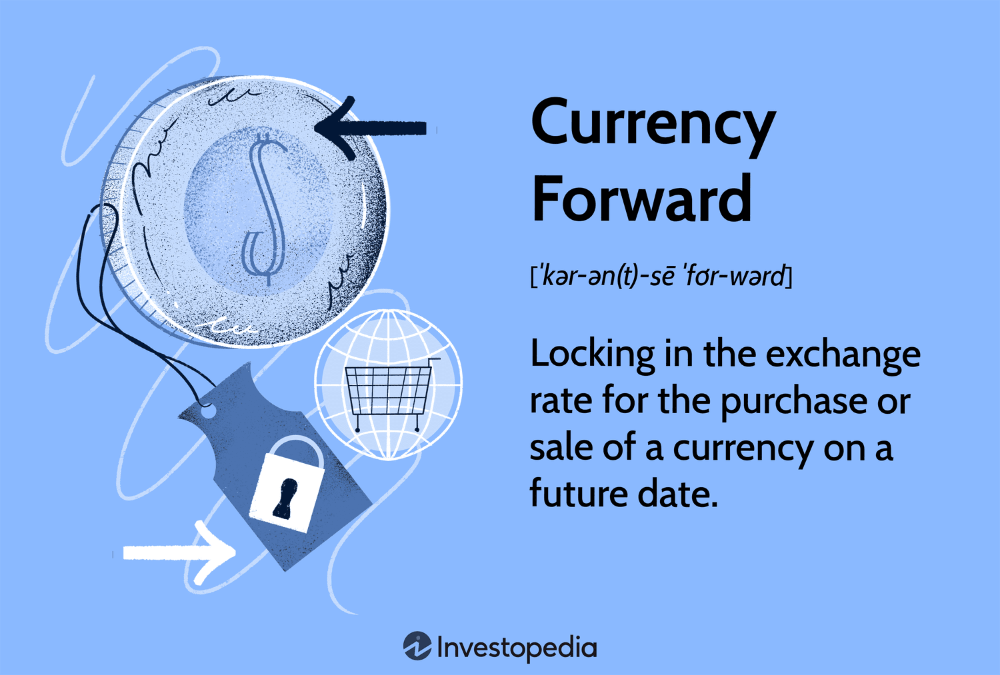

## Table of Contents

## What is an Outright Forward Contract?

An Outright Forward Contract is a type of financial agreement where two parties agree to buy or sell an asset at a set price on a future date. This is commonly used in foreign exchange markets, where one currency is exchanged for another at a predetermined rate. The main purpose of an Outright Forward Contract is to hedge against currency fluctuations, allowing businesses and investors to manage their risk when dealing with international transactions.

For example, if a company knows it will need to pay for goods in euros in six months, it can enter into an Outright Forward Contract to lock in the current exchange rate. This way, even if the euro strengthens against their local currency in the meantime, the company will still pay the agreed-upon rate, protecting them from potential losses due to currency volatility. This tool is particularly useful for businesses that have predictable foreign currency needs and want to avoid the uncertainty of exchange rate movements.

## How does an Outright Forward Contract differ from a spot contract?

An Outright Forward Contract and a spot contract are both used in foreign exchange markets, but they work in different ways. A spot contract is an agreement to buy or sell a currency at the current market rate, with the transaction usually happening right away, within two business days. This is great for immediate needs, like paying a bill in another currency that's due soon.

On the other hand, an Outright Forward Contract is used to buy or sell a currency at a future date, at a rate agreed upon today. This helps businesses plan for future expenses in foreign currencies without worrying about how exchange rates might change. For example, if a company knows it will need euros in six months, it can lock in today's rate, protecting itself from any future increases in the euro's value.

In simple terms, a spot contract is for immediate currency exchanges, while an Outright Forward Contract is for planning and protecting against future currency changes. Both are useful tools, but they serve different purposes depending on when you need the currency and how you want to manage risk.

## What are the main purposes of using Outright Forward Contracts?

The main purpose of using Outright Forward Contracts is to protect businesses from the ups and downs of currency exchange rates. When a company knows it will need to pay for something in another currency in the future, it can use an Outright Forward Contract to lock in the current exchange rate. This means they won't have to worry if the currency they need gets more expensive before they have to pay. It's like buying insurance against currency changes, helping businesses plan their budgets more accurately.

Another important use of Outright Forward Contracts is to help companies manage their cash flow. By knowing exactly how much they will need to pay in the future, businesses can better plan their finances. This can be really helpful for companies that do a lot of business in different countries and need to deal with many different currencies. Using Outright Forward Contracts lets them focus on their business without worrying about sudden changes in exchange rates messing up their plans.

## Can you explain the basic mechanics of how an Outright Forward Contract works?

An Outright Forward Contract is like making a deal with someone to buy or sell a currency at a price you agree on today, but you won't actually do the exchange until a later date. Imagine you need to pay for something in euros in six months, but you're worried the euro might get more expensive. You can use an Outright Forward Contract to agree on today's exchange rate for euros, so no matter what happens to the euro's value in the next six months, you'll still pay the rate you locked in today.

Here's how it works: You and a bank or another financial institution agree on the amount of currency you need and the exchange rate you want. You decide on the date in the future when you'll actually make the exchange. When that date comes, you give the bank your local currency, and they give you the foreign currency at the rate you agreed on earlier. This way, you're protected from any surprises in the currency market and can plan your budget with confidence.

## What are the typical terms and conditions found in an Outright Forward Contract?

An Outright Forward Contract has some key terms and conditions that both parties agree on. The first is the amount of currency to be exchanged. This means you decide how many euros, dollars, or any other currency you'll need on the future date. The second is the exchange rate, which is set at the time you make the contract. This rate will be used no matter what happens to the currency values later. The third is the settlement date, which is the specific day in the future when the actual exchange will happen. This could be weeks or months away, depending on when you need the currency.

Another important term is the type of settlement. Usually, it's a delivery settlement, where you actually get the foreign currency on the agreed date. But sometimes, it can be a non-delivery settlement, where you just settle the difference between the agreed rate and the market rate on the settlement date. There might also be fees or charges from the bank or financial institution for setting up and managing the contract. It's important to understand all these terms clearly before you agree to the contract, so you know exactly what you're getting into and what to expect when the settlement date arrives.

## How do companies use Outright Forward Contracts for hedging currency risks?

Companies use Outright Forward Contracts to protect themselves from sudden changes in currency exchange rates. When a company knows it will need to pay for goods or services in a foreign currency at a future date, it can use an Outright Forward Contract to lock in today's exchange rate. This means that even if the foreign currency becomes more expensive before the payment is due, the company will still pay the rate it agreed on earlier. This helps the company avoid unexpected costs and makes it easier to plan its budget.

For example, imagine a company in the U.S. that needs to pay a supplier in Europe 100,000 euros in six months. If the euro gets stronger against the dollar in that time, the company would have to pay more dollars to get the same amount of euros. By using an Outright Forward Contract, the company can agree to pay the current exchange rate for those euros in six months. This way, no matter what happens to the euro's value, the company's costs stay predictable, helping it manage its finances more effectively.

## What are the potential risks associated with Outright Forward Contracts?

Using Outright Forward Contracts can help companies protect themselves from currency changes, but there are some risks to be aware of. One big risk is that if the currency moves in the opposite direction than expected, the company could miss out on savings. For example, if a U.S. company locks in a rate to buy euros and the euro actually gets cheaper, the company will still have to pay the higher rate they agreed on, missing out on a better deal.

Another risk is that these contracts can be inflexible. Once you agree on a rate and a date, it's hard to change things if your plans change. If the company doesn't need the currency on the agreed date or if they need more or less than they planned, they might be stuck with a contract that doesn't fit their new needs. This can make it tricky to manage finances if things don't go as expected.

Lastly, there might be costs involved that can add up. Banks or financial institutions might charge fees for setting up and managing the contract. These costs can reduce the benefits of using the contract, especially if the currency doesn't move much or moves in the wrong direction. It's important for companies to weigh these potential costs against the benefits of protecting against currency changes.

## How are the rates for Outright Forward Contracts determined?

The rates for Outright Forward Contracts are determined based on the current spot rate of the currencies involved and the interest rate differential between those currencies. The spot rate is the rate you would get if you exchanged the currencies right away. The interest rate differential is the difference between the interest rates of the two countries' currencies. If one country has a higher interest rate, the forward rate will adjust to reflect that difference, making the currency with the higher interest rate cheaper in the future.

For example, if the U.S. dollar has a higher interest rate than the euro, the forward rate for buying euros with dollars will be lower than the current spot rate. This is because the higher interest rate on the dollar means it's more expensive to hold onto dollars over time, so the forward rate adjusts to make the future exchange more favorable for the euro. Banks and financial institutions use these factors to calculate the forward rate, ensuring that the contract reflects the expected changes in currency values over time.

## What are the differences between Outright Forward Contracts and other types of forward contracts, such as non-deliverable forwards?

Outright Forward Contracts and non-deliverable forwards both help companies manage currency risks, but they work a bit differently. With an Outright Forward Contract, you actually get the foreign currency on the agreed date. This is called a delivery settlement. It's useful when you need the actual currency to pay for something. On the other hand, a non-deliverable forward (NDF) doesn't involve exchanging the actual currencies. Instead, you just settle the difference between the agreed rate and the market rate on the settlement date. NDFs are often used when dealing with currencies that can't be easily traded, like those from some emerging markets.

Another key difference is where and how these contracts are used. Outright Forward Contracts are common in developed markets where currencies can be easily traded. They're great for companies that know they'll need a specific amount of foreign currency in the future. Non-deliverable forwards, however, are more common in markets with currency restrictions or where the currency isn't freely convertible. Companies use NDFs to hedge against currency fluctuations without needing to handle the actual currency. Both types of contracts help manage risk, but they're suited to different situations and needs.

## How do regulatory requirements impact the use of Outright Forward Contracts?

Regulatory requirements can affect how companies use Outright Forward Contracts. Different countries have rules about who can use these contracts and how they must be reported. For example, some places might require companies to show that they're using the contracts to manage real business risks, not just to make money from currency changes. This means companies have to keep good records and be ready to explain why they're using the contracts. If a company doesn't follow these rules, they could face fines or other penalties.

Also, regulations can change how banks and financial institutions offer Outright Forward Contracts. Banks have to follow strict rules about how much risk they can take and how they report their activities to regulators. This can make it harder for companies to get these contracts, or it might make them more expensive. Companies need to stay up-to-date with these rules and work closely with their banks to make sure they're using Outright Forward Contracts in a way that follows the law.

## Can you discuss a real-world example where an Outright Forward Contract was effectively used?

A U.S. company that makes car parts had a big order from a car maker in Germany. They knew they would need to pay for the order in euros in six months. The company was worried because the euro was getting stronger against the dollar. To avoid paying more if the euro kept going up, they used an Outright Forward Contract. They agreed with their bank to buy the euros they needed at the current exchange rate, even though they wouldn't need them until later. When the six months were up, the euro had indeed gone up, but the company paid the rate they locked in earlier, saving them a lot of money.

Another example is a Canadian company that exports wood to Japan. They knew they would get paid in Japanese yen in three months. The yen was getting weaker against the Canadian dollar, and the company was worried about losing money when they converted the yen back to Canadian dollars. They used an Outright Forward Contract to sell the yen they expected to receive at the current exchange rate. When the three months passed, the yen had fallen even more, but the company got the better rate they locked in earlier. This helped them keep their profits higher than if they had waited and used the spot rate at the time of payment.

## What advanced strategies can be employed with Outright Forward Contracts to optimize financial outcomes?

Companies can use a strategy called layering to optimize their financial outcomes with Outright Forward Contracts. Layering involves setting up multiple contracts with different settlement dates instead of one big contract. For example, if a company knows it will need euros over the next year, it can set up contracts that settle every three months. This way, if the euro's value changes a lot during the year, the company can adjust its strategy for the next contract based on the new market conditions. This can help the company get a better average exchange rate over time and reduce the risk of big losses if the currency moves in an unexpected way.

Another advanced strategy is to combine Outright Forward Contracts with other financial tools like options. Options give companies the right, but not the obligation, to buy or sell a currency at a set price. By using both forwards and options, a company can lock in a rate with a forward contract while also keeping some flexibility. For example, if a company thinks the euro might go down but isn't sure, it can use a forward contract to lock in a rate and buy an option to buy euros at a lower rate if the market moves that way. This strategy can help the company save money if the currency goes down while still protecting against it going up.

## What are Foreign Exchange Forward Contracts and how do they work?

A foreign exchange forward contract is a financial instrument that allows parties to establish a predetermined exchange rate for the purchase or sale of currencies at a future date. This instrument plays a crucial role in international finance by providing a mechanism to hedge against currency risk, which arises from fluctuations in exchange rates. By locking in a future exchange rate, businesses and investors can protect themselves from adverse movements that could impact their financial outcomes.

The mechanics of a foreign exchange forward contract involve an agreement between two parties to exchange a specified amount of one currency for another at an agreed-upon rate, on a predetermined future date. This set rate, known as the forward rate, is determined at the inception of the contract and remains fixed regardless of any subsequent market movements. The terms "outright forward contracts" refer to non-standardized forward contracts settled gross on the settlement date.

The pricing of a forward contract is primarily based on the spot exchange rate at the time of contract initiation, adjusted for the [interest rate](/wiki/interest-rate-trading-strategies) differential between the two currencies involved. The formula for calculating the forward rate ($F$) can be expressed as:

$$
F = S \times \left(1 + i_d\right)^t / \left(1 + i_f\right)^t
$$

where:
- $S$ represents the current spot rate.
- $i_d$ is the domestic interest rate.
- $i_f$ is the foreign interest rate.
- $t$ is the time until contract maturity, expressed in years.

Outright forward contracts typically specify details such as the currencies involved, the nominal amount, the agreed exchange rate (forward rate), and the settlement date. These contracts provide a protective measure against potential adverse shifts in exchange rates between the contract date and the settlement date.

The benefits of using forward contracts are vast, especially for importers, exporters, and investors. For importers, these contracts offer protection against the depreciation of their domestic currency, which could increase the cost of purchasing goods from abroad. Exporters benefit by securing favorable exchange rates for the future sale of goods in foreign markets, thus ensuring predictable revenue in their home currency. For investors, forward contracts serve as a tool to manage currency exposure in international investment portfolios, aiding in the maintenance of targeted investment returns regardless of currency [volatility](/wiki/volatility-trading-strategies).

Overall, foreign exchange forward contracts are powerful tools for managing currency risk, facilitating international trade and investment by providing certainty and predictability to future financial transactions.

## What are the pricing and settlement methods for forward contracts?

Foreign exchange forward contracts are priced using the current spot exchange rates and the interest rate differentials between the two currencies involved in the transaction. The pricing formula can be expressed as follows:

$$
F = S \times \left( \frac{1 + r_d \times \frac{T}{360}}{1 + r_f \times \frac{T}{360}} \right)
$$

where:
- $F$ is the forward exchange rate
- $S$ is the spot exchange rate
- $r_d$ is the domestic interest rate
- $r_f$ is the foreign interest rate
- $T$ is the time to maturity in days

The formula reflects the principle of covered interest rate parity, which posits that the forward rate should offset the interest rate differential between two currencies, ensuring no [arbitrage](/wiki/arbitrage) opportunities exist.

The settlement process of forward contracts involves the exchange of the specified currency amounts on the contract's maturity date, based on the agreed-upon forward rate. Settlement can occur in two primary forms: delivery or non-delivery. In physical delivery, the actual currencies are exchanged between counterparties. In a non-deliverable forward (NDF) contract, only the cash difference is settled in a mutually agreed upon currency, usually USD. 

The settlement process impacts the parties involved significantly. The buyer locks in a future currency outflow, while the seller secures an inflow, both mitigating potential losses from adverse currency movements. This predictability aids in financial planning and budgeting for both parties.

Risk management benefits of forward contracts stem from their ability to hedge against exchange rate volatility. By fixing the future exchange rate, firms can protect themselves against unfavorable shifts, stabilizing cash flows and safeguarding profit margins. Financial impacts also include the facilitation of cross-border business operations, as companies can transact with confidence, knowing that currency fluctuations will not derail financial projections.

In summary, forward contracts serve as crucial instruments for managing foreign exchange risk, providing both a pricing mechanism tied to present market conditions and a reliable settlement framework to honor these financial agreements.

## References & Further Reading

[1]: Hull, J. C. (2014). ["Options, Futures, and Other Derivatives"](https://www.amazon.com/Options-Futures-Other-Derivatives-9th/dp/0133456315). Pearson Education.

[2]: Lopez de Prado, M. (2018). ["Advances in Financial Machine Learning"](https://www.amazon.com/Advances-Financial-Machine-Learning-Marcos/dp/1119482089). Wiley.

[3]: Aronson, D. R. (2007). ["Evidence-Based Technical Analysis: Applying the Scientific Method and Statistical Inference to Trading Signals"](https://onlinelibrary.wiley.com/doi/book/10.1002/9781118268315). Wiley.

[4]: Jansen, S. (2020). ["Machine Learning for Algorithmic Trading: Predictive Models to Extract Signals from Market and Alternative Data for Systematic Trading Strategies with Python"](https://github.com/stefan-jansen/machine-learning-for-trading). Packt Publishing.

[5]: Chan, E. P. (2008). ["Quantitative Trading: How to Build Your Own Algorithmic Trading Business"](https://github.com/ftvision/quant_trading_echan_book). Wiley.

[6]: ["Foreign Exchange Operations: Master Trading Agreements and Negotiation"](https://www.amazon.com/Foreign-Exchange-Operations-Agreements-Settlement/dp/0470932910) by David F. DeRosa

[7]: Johnson, B. (2010). ["Algorithmic Trading & DMA: An Introduction to Direct Access Trading Strategies"](https://archive.org/details/algorithmictradi0000john). 4Myeloma Press.