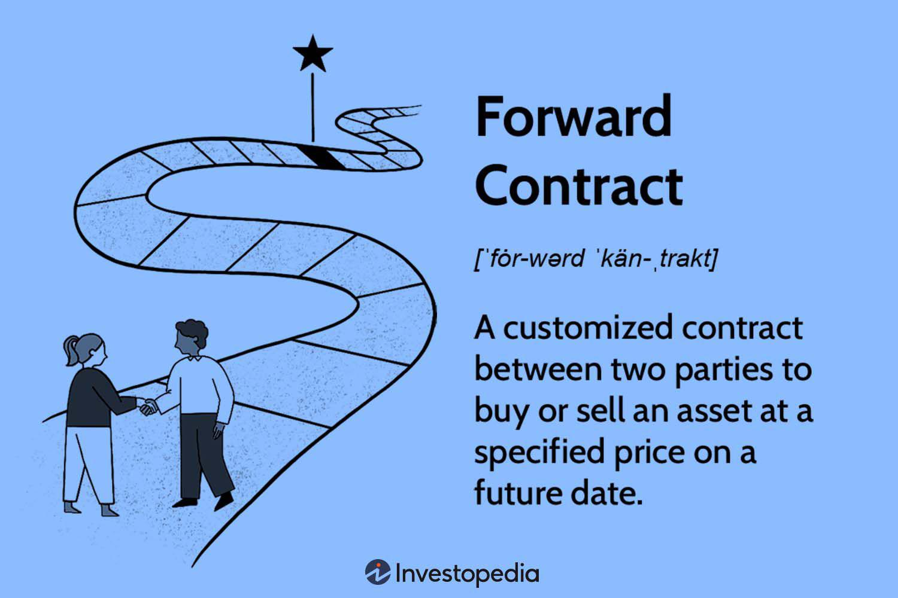

Foreign exchange forward contracts are fundamental instruments in financial markets used to lock in exchange rates for the purchase or sale of a currency at a future date. These contracts enable businesses and investors to manage foreign currency exposure by mitigating risks associated with fluctuating exchange rates. A typical forward contract specifies the amount of currency to be exchanged, the agreed-upon exchange rate, and the settlement date, which is usually more than two business days in the future.

Outright forward contracts, a subset of foreign exchange forward contracts, specifically focus on hedging currency risks by establishing a fixed forward rate, independent of future market fluctuations. This fixed rate benefits entities like importers, exporters, and multinational corporations by providing a stable currency conversion rate. For example, a company anticipating a payment in a foreign currency can secure a favorable exchange rate for a future date, safeguarding its financial planning from adverse currency movements.



Algorithmic trading, which involves using computer programs to execute trades based on predefined criteria, has become increasingly significant in the forex market, including trading forward contracts. The rise of high-frequency trading and advanced algorithms has improved market efficiency by executing trades swiftly and optimizing the timing and pricing of transactions. In the context of foreign exchange, algorithms can dynamically adjust to market conditions, processing vast amounts of data to identify trends and maximize profit opportunities, thus enhancing the traditional role of forward contracts in risk management.

The integration of algorithmic trading with outright forward contracts offers several advantages, such as increased transaction speed, reduced human error, and enhanced capability for handling complex trading strategies. As the financial markets continuously evolve, the combination of forward contracts and algorithmic trading represents a sophisticated method of adapting to and thriving in volatile currency environments.

## Table of Contents

## Understanding Foreign Exchange Forward Contracts

A foreign exchange forward contract is a financial instrument that allows parties to establish a predetermined exchange rate for the purchase or sale of currencies at a future date. This instrument plays a crucial role in international finance by providing a mechanism to hedge against currency risk, which arises from fluctuations in exchange rates. By locking in a future exchange rate, businesses and investors can protect themselves from adverse movements that could impact their financial outcomes.

The mechanics of a foreign exchange forward contract involve an agreement between two parties to exchange a specified amount of one currency for another at an agreed-upon rate, on a predetermined future date. This set rate, known as the forward rate, is determined at the inception of the contract and remains fixed regardless of any subsequent market movements. The terms "outright forward contracts" refer to non-standardized forward contracts settled gross on the settlement date.

The pricing of a forward contract is primarily based on the spot exchange rate at the time of contract initiation, adjusted for the [interest rate](/wiki/interest-rate-trading-strategies) differential between the two currencies involved. The formula for calculating the forward rate ($F$) can be expressed as:

$$
F = S \times \left(1 + i_d\right)^t / \left(1 + i_f\right)^t
$$

where:
- $S$ represents the current spot rate.
- $i_d$ is the domestic interest rate.
- $i_f$ is the foreign interest rate.
- $t$ is the time until contract maturity, expressed in years.

Outright forward contracts typically specify details such as the currencies involved, the nominal amount, the agreed exchange rate (forward rate), and the settlement date. These contracts provide a protective measure against potential adverse shifts in exchange rates between the contract date and the settlement date.

The benefits of using forward contracts are vast, especially for importers, exporters, and investors. For importers, these contracts offer protection against the depreciation of their domestic currency, which could increase the cost of purchasing goods from abroad. Exporters benefit by securing favorable exchange rates for the future sale of goods in foreign markets, thus ensuring predictable revenue in their home currency. For investors, forward contracts serve as a tool to manage currency exposure in international investment portfolios, aiding in the maintenance of targeted investment returns regardless of currency [volatility](/wiki/volatility-trading-strategies).

Overall, foreign exchange forward contracts are powerful tools for managing currency risk, facilitating international trade and investment by providing certainty and predictability to future financial transactions.

## Algorithmic Trading and Forward Contracts

Algorithmic trading, often referred to as algo trading or automated trading, involves the use of computer programs to execute trades at high speeds and volumes based on predefined criteria. In the [forex](/wiki/forex-system) market, [algorithmic trading](/wiki/algorithmic-trading) has gained significant traction due to its ability to analyze vast amounts of market data in real-time, identify trading opportunities, and execute orders with minimal human intervention.

The integration of algorithmic strategies with outright forward contracts has enhanced the way these contracts are traded and managed. Outright forward contracts are agreements to exchange a specified amount of currencies at a predetermined rate on a set future date, and they are commonly used to hedge against currency risk. Algorithmic trading in this context can include executing and managing these forward contracts more efficiently by leveraging data-driven decision-making processes.

Algorithms can optimize forward contract trading through several advantages:

1. **Speed and Efficiency**: Algorithms can process real-time market data rapidly and execute forward contracts almost instantaneously. This capability allows traders to capitalize on fleeting opportunities that may arise from currency fluctuations.

2. **Cost Reduction**: By minimizing the need for human traders to execute manual trades, algorithms can significantly reduce transaction costs. They also reduce slippage costs by executing trades at optimal times, based on precise calculations.

3. **Risk Management**: Algorithms can be programmed to follow specific risk management protocols, ensuring that forward contracts are executed under predefined risk parameters. This is particularly useful in volatile markets where human traders might react emotionally.

4. **Optimization of Trading Strategies**: Through backtesting and analyzing historical data, algorithms can develop and refine trading strategies that improve the outcomes of forward contract trading. Machine learning techniques can further enhance these strategies by learning from new data to adapt to changing market conditions.

An example of how algorithms might function in trading a forward contract can be seen in a Python snippet:

```python
import pandas as pd
import numpy as np

# Example: Simple moving average crossover strategy
def moving_average_strategy(historical_data, short_window=20, long_window=50):
    signals = pd.DataFrame(index=historical_data.index)
    signals['price'] = historical_data['close']
    signals['short_mavg'] = historical_data['close'].rolling(window=short_window, min_periods=1, center=False).mean()
    signals['long_mavg'] = historical_data['close'].rolling(window=long_window, min_periods=1, center=False).mean()

    signals['signal'] = 0.0
    signals['signal'][short_window:] = np.where(signals['short_mavg'][short_window:] > signals['long_mavg'][short_window:], 1.0, 0.0)
    signals['positions'] = signals['signal'].diff()

    # Execute forward contract if a buy signal is detected
    if signals['positions'].iloc[-1] == 1.0:
        execute_forward_contract()

def execute_forward_contract():
    # Placeholder function for executing a forward contract
    print("Executing forward contract based on algorithmic strategy.")

# Simulated historical data
historical_data = pd.DataFrame({'close': np.random.rand(100)})
moving_average_strategy(historical_data)
```

This code demonstrates a simple moving average strategy, which could be used by algorithms to decide when to enter a forward contract based on market conditions. As algorithmic trading continues to evolve, it promises further enhancements in the execution of forward contracts, making the process more robust, accurate, and aligned with financial objectives.

## Pricing and Settlement of Forward Contracts

Foreign exchange forward contracts are priced using the current spot exchange rates and the interest rate differentials between the two currencies involved in the transaction. The pricing formula can be expressed as follows:

$$
F = S \times \left( \frac{1 + r_d \times \frac{T}{360}}{1 + r_f \times \frac{T}{360}} \right)
$$

where:
- $F$ is the forward exchange rate
- $S$ is the spot exchange rate
- $r_d$ is the domestic interest rate
- $r_f$ is the foreign interest rate
- $T$ is the time to maturity in days

The formula reflects the principle of covered interest rate parity, which posits that the forward rate should offset the interest rate differential between two currencies, ensuring no [arbitrage](/wiki/arbitrage) opportunities exist.

The settlement process of forward contracts involves the exchange of the specified currency amounts on the contract's maturity date, based on the agreed-upon forward rate. Settlement can occur in two primary forms: delivery or non-delivery. In physical delivery, the actual currencies are exchanged between counterparties. In a non-deliverable forward (NDF) contract, only the cash difference is settled in a mutually agreed upon currency, usually USD. 

The settlement process impacts the parties involved significantly. The buyer locks in a future currency outflow, while the seller secures an inflow, both mitigating potential losses from adverse currency movements. This predictability aids in financial planning and budgeting for both parties.

Risk management benefits of forward contracts stem from their ability to hedge against exchange rate volatility. By fixing the future exchange rate, firms can protect themselves against unfavorable shifts, stabilizing cash flows and safeguarding profit margins. Financial impacts also include the facilitation of cross-border business operations, as companies can transact with confidence, knowing that currency fluctuations will not derail financial projections.

In summary, forward contracts serve as crucial instruments for managing foreign exchange risk, providing both a pricing mechanism tied to present market conditions and a reliable settlement framework to honor these financial agreements.

## Real-world Applications and Examples

Foreign exchange forward contracts are critical tools for companies aiming to hedge against currency risks, especially in a globalized economy where currency volatility can significantly impact financial stability. Companies such as multinational corporations, exporters, and importers frequently utilize these contracts to stabilize cash flows and manage risks associated with exchange rate fluctuations.

One prominent example is the use of forward contracts by Apple Inc. The tech giant, which derives a substantial portion of its revenue from international markets, regularly engages in forward contracts to hedge against the potential adverse effects of exchange rate movements. By locking in favorable exchange rates, Apple can mitigate the risk of currency depreciation in its major markets, ensuring that its financial performance remains relatively stable despite volatile market conditions.

Algorithmic trading further enhances the effective utilization of forward contracts. Financial institutions like Goldman Sachs and J.P. Morgan have incorporated algorithmic trading strategies to optimize the execution of forward contracts. These algorithms assess market conditions and execute trades at optimal prices and times, significantly reducing transaction costs and enhancing profitability. For instance, J.P. Morgan uses sophisticated algorithms to manage its currency exposures and leverage forward contracts efficiently, providing a competitive edge in forex trading.

In volatile market scenarios, such as the Brexit referendum or the COVID-19 pandemic, companies and financial institutions have increasingly relied on forward contracts to provide security and predictability. The unpredictable nature of these events causes exchange rates to fluctuate sharply, posing considerable risks to businesses that operate across borders. By employing forward contracts, companies such as Unilever and Nestlé have successfully hedged against these fluctuations, maintaining financial stability during periods of economic uncertainty.

Overall, the practical applications of foreign exchange forward contracts demonstrate their indispensable role in safeguarding against currency risks. Companies that strategically utilize these contracts can achieve financial resilience, particularly when supplemented by algorithmic trading techniques that optimize contract management.

## Conclusion

Foreign exchange forward contracts play a crucial role in managing forex risks by allowing businesses and investors to lock in future exchange rates, effectively mitigating the uncertainty associated with currency fluctuations. These contracts are essential for companies engaged in international trade as they help stabilize cash flows and protect profit margins from adverse currency movements. By securing a predetermined exchange rate for future transactions, outright forward contracts provide a reliable hedging tool, ensuring that financial planning and budgeting remain unaffected by market volatility.

The integration of algorithmic trading into foreign exchange forward markets has revolutionized the way these contracts are utilized and traded. Algorithms bring efficiency and speed to the management of forward contracts, optimizing the execution process and allowing for better pricing and risk management. Given the complexity and dynamic nature of the forex market, algorithmic trading strategies enable market participants to analyze vast amounts of data and identify optimal trading opportunities in real-time. This integration enhances the overall efficiency of forward contracts, reducing transaction costs and minimizing human error.

In an era where technological advancements continue to reshape the financial landscape, it is imperative to explore and adopt advanced trading strategies in the forex market. Encouraging the use of algorithmic trading and other innovative approaches not only increases market efficiency but also drives competitiveness and resilience among market participants. As forex markets continue to evolve, the adoption of these advanced strategies will be crucial in maintaining a robust and adaptive financial ecosystem capable of withstanding the challenges and opportunities that come with global market dynamics.

## References & Further Reading

[1]: Hull, J. C. (2014). ["Options, Futures, and Other Derivatives"](https://www.amazon.com/Options-Futures-Other-Derivatives-9th/dp/0133456315). Pearson Education.

[2]: Lopez de Prado, M. (2018). ["Advances in Financial Machine Learning"](https://www.amazon.com/Advances-Financial-Machine-Learning-Marcos/dp/1119482089). Wiley.

[3]: Aronson, D. R. (2007). ["Evidence-Based Technical Analysis: Applying the Scientific Method and Statistical Inference to Trading Signals"](https://onlinelibrary.wiley.com/doi/book/10.1002/9781118268315). Wiley.

[4]: Jansen, S. (2020). ["Machine Learning for Algorithmic Trading: Predictive Models to Extract Signals from Market and Alternative Data for Systematic Trading Strategies with Python"](https://github.com/stefan-jansen/machine-learning-for-trading). Packt Publishing.

[5]: Chan, E. P. (2008). ["Quantitative Trading: How to Build Your Own Algorithmic Trading Business"](https://github.com/ftvision/quant_trading_echan_book). Wiley.

[6]: ["Foreign Exchange Operations: Master Trading Agreements and Negotiation"](https://www.amazon.com/Foreign-Exchange-Operations-Agreements-Settlement/dp/0470932910) by David F. DeRosa

[7]: Johnson, B. (2010). ["Algorithmic Trading & DMA: An Introduction to Direct Access Trading Strategies"](https://archive.org/details/algorithmictradi0000john). 4Myeloma Press.