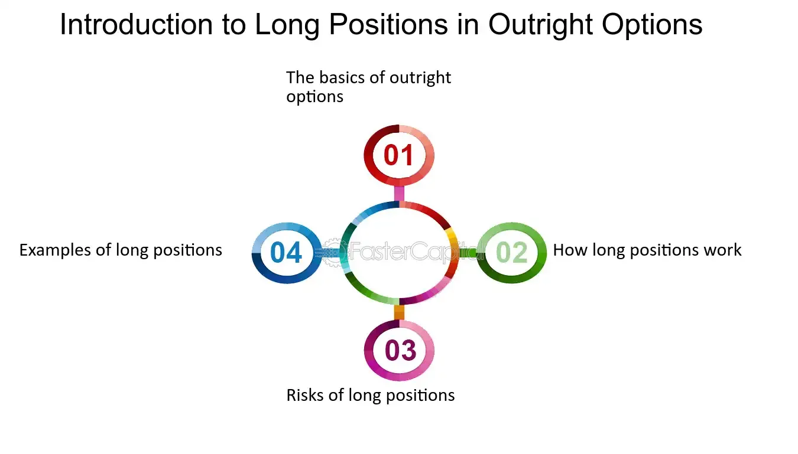

## Table of Contents

## What is an outright futures position?

An outright futures position is when someone buys or sells a futures contract without any other related trades. It's a straightforward way to bet on the future price of something, like oil or wheat. If you think the price will go up, you buy the futures contract. If you think the price will go down, you sell it.

For example, if you believe the price of gold will increase in the next six months, you might buy a gold futures contract. This means you agree to buy gold at today's price, but you'll actually get it in six months. If the price of gold goes up as you expected, you can sell the contract later for a profit. But if the price goes down, you could lose money.

## How does an outright futures position differ from other types of futures positions?

An outright futures position is different from other types of futures positions because it involves only one futures contract, without any other related trades. It's a simple bet on whether the price of the asset will go up or down. For example, if you think the price of corn will rise, you buy a corn futures contract. If you think it will fall, you sell one. This straightforward approach makes it easier to understand but can be riskier because it's not hedged against other positions.

Other types of futures positions often involve more complex strategies. For instance, a spread position involves buying one futures contract and selling another related one. This can help reduce risk because gains in one contract might offset losses in the other. Another example is a hedged position, where you might own the actual asset (like owning corn) and then sell a futures contract on that asset to lock in a price. This protects you from price drops. Outright positions don't have these extra layers of protection, making them simpler but potentially more volatile.

## What are the basic steps to initiate an outright futures position?

To start an outright futures position, you first need to choose a futures contract that you want to trade. This could be anything from commodities like oil or wheat, to financial instruments like stock indices or currencies. You'll need to decide if you think the price of the asset will go up or down. If you think it will go up, you'll buy the futures contract. If you think it will go down, you'll sell the futures contract. Once you've made your choice, you'll need to open a futures trading account with a brokerage that offers futures trading.

After setting up your account, you'll need to place your order. This involves specifying the type of futures contract, the quantity you want to trade, and the price at which you want to buy or sell. Most trading platforms will have an interface where you can enter these details and submit your order. Once your order is filled, you'll have an open futures position. Keep in mind that you'll need to monitor your position and decide when to close it, either by selling if you initially bought, or buying if you initially sold, to realize any profits or losses.

## What are the risks associated with holding an outright futures position?

Holding an outright futures position can be risky because the price of the asset you're betting on can change a lot. If you buy a futures contract and the price goes down, you could lose money. If you sell a futures contract and the price goes up, you could also lose money. These price changes can happen quickly, and sometimes they can be big, which makes futures trading risky.

Another risk is that futures contracts require you to put up money, called margin, to open a position. If the price moves against you, you might need to add more money to your account to keep your position open. This is called a margin call. If you can't add more money, your position might be closed automatically, and you could lose what you've already put in. So, it's important to be ready to handle these extra costs and to understand that you could lose more than you initially planned.

## How can an outright futures position be used for hedging?

An outright futures position can be used for hedging by taking a position that offsets the risk of another investment. For example, if you own a farm and grow wheat, you might be worried that the price of wheat will go down before you can sell your crop. To protect yourself, you could sell a wheat futures contract. This means you agree to sell wheat at today's price in the future. If the price of wheat does go down, the money you lose on your actual wheat will be made up by the profit you make on the futures contract.

This strategy helps you lock in a price for your wheat, so you know how much money you'll get no matter what happens to the market. It's like insurance for your crop. By using an outright futures position in this way, you're not trying to make a big profit from the futures market. Instead, you're using it to make sure you don't lose too much money if prices change. This can give you peace of mind and help you plan your business better.

## What are the potential benefits of taking an outright futures position?

Taking an outright futures position can give you a chance to make money if you guess right about where prices are going. If you think the price of something, like oil or corn, will go up, you can buy a futures contract. If you're right and the price does go up, you can sell the contract later for more money than you paid for it. It's like betting on the future price, and if you're good at predicting, you can make a profit. This can be exciting and rewarding if you like taking risks and have a good understanding of the market.

Another benefit is that you can use outright futures positions to protect yourself from price changes. If you have a business that depends on the price of a certain thing, like a farmer who grows wheat, you can use futures to lock in a price. For example, if you're worried the price of wheat will go down before you can sell your crop, you can sell a wheat futures contract. This way, even if the price does drop, you'll make money on the futures contract to cover your losses on the actual wheat. It's like insurance that helps you plan and feel more secure about the future.

## How do market conditions affect the decision to take an outright futures position?

Market conditions play a big role in deciding whether to take an outright futures position. If the market is stable and prices are not changing much, it might not be the best time to take a futures position because the potential for big profits is low. But if the market is moving a lot, with prices going up and down quickly, it could be a good time to take a position. You might be able to make money if you can predict where the prices are going. Also, if there's a lot of news or events that could affect prices, like a big report on oil supplies or a change in interest rates, it might be a good time to take a futures position to try to benefit from these changes.

Another thing to think about is the overall trend in the market. If prices have been going up for a while, you might want to buy a futures contract, hoping the trend will continue. But if prices have been going down, you might want to sell a futures contract, betting that the trend will keep going. It's also important to look at how much risk you're willing to take. If the market is very unpredictable, you might decide it's too risky to take an outright futures position. But if you're okay with the risk and think you can make a good guess about where prices are headed, then it might be a good move for you.

## What are the key considerations for managing an outright futures position?

Managing an outright futures position means you need to keep a close eye on the market. Prices can change a lot, so you should check how your futures contract is doing every day. If the price is moving against you, you might need to add more money to your account to keep your position open. This is called a margin call. If you can't add more money, your position could be closed, and you might lose what you've already put in. So, it's important to have a plan for what you'll do if the market goes the wrong way.

Another big thing to think about is when to close your position. You don't want to hold onto a futures contract forever. You need to decide if you want to take a profit or cut your losses. If the price moves in your favor, you might want to sell your contract to make money. But if it's moving against you, you might want to close your position to stop losing more. Having a clear plan for when to get out can help you manage your risk and make smarter decisions.

## How does leverage impact an outright futures position?

Leverage in an outright futures position means you can control a big amount of something, like oil or wheat, with just a small amount of money. This is called trading on margin. For example, if you want to buy a futures contract for oil, you might only need to put down a small part of the total value of the oil. This can be good because if the price of oil goes up, you can make a lot more money than if you had just bought the oil outright. But it's also risky because if the price goes down, you can lose a lot more money than you put in.

Because of leverage, small changes in the price of the futures contract can lead to big changes in how much money you make or lose. If the price moves in your favor, you can make a lot of money quickly. But if it moves against you, you can lose a lot of money just as fast. This means you need to be careful and watch the market closely. You might also need to add more money to your account if the price goes down a lot, or your position could be closed, and you could lose what you've already put in.

## What are the tax implications of profits and losses from an outright futures position?

When you make money from an outright futures position, you have to pay taxes on those profits. The IRS treats profits from futures trading as a type of income called capital gains. If you hold the futures contract for less than a year before selling it, the profit is considered a short-term capital gain. Short-term capital gains are taxed at the same rate as your regular income, which can be anywhere from 10% to 37% depending on how much money you make. If you hold the futures contract for more than a year, the profit is a long-term capital gain, which is usually taxed at a lower rate, between 0% and 20%.

If you lose money on an outright futures position, you can use those losses to reduce your taxes. You can deduct these losses from your other income, like your salary or other investments. This can lower the amount of taxes you have to pay. But there are rules about how much you can deduct and how you report these losses on your tax return. It's a good idea to keep good records of all your trades and talk to a tax professional to make sure you're doing everything right.

## How do regulatory requirements influence the management of outright futures positions?

Regulatory requirements can have a big impact on how you manage outright futures positions. Different countries and organizations, like the Commodity Futures Trading Commission (CFTC) in the United States, set rules about how futures trading works. These rules can affect things like how much money you need to start trading, how much you need to keep in your account, and what kind of information you need to report. For example, you might need to fill out special forms or keep detailed records of your trades. If you don't follow these rules, you could get in trouble or even lose the right to trade.

Another way regulations affect managing futures positions is through limits on how many contracts you can hold. Some regulators set position limits to stop any one person or group from controlling too much of the market. This means you might need to keep an eye on how many contracts you have open and be ready to close some if you hit these limits. Also, there can be rules about how you report your profits and losses for taxes, which can influence when and how you decide to close your positions. Keeping up with these rules can be tricky, but it's important to stay compliant to avoid penalties and manage your positions effectively.

## What advanced strategies can be employed with outright futures positions to optimize returns?

One advanced strategy to optimize returns with outright futures positions is called "scalping." This means you buy and sell futures contracts very quickly, trying to make small profits from tiny changes in the price. Scalpers watch the market closely and might make many trades in a single day. This strategy can be good if you're good at spotting small price movements and can react fast. But it's also risky because you need to be right a lot to make money, and the costs of trading a lot can add up.

Another strategy is "trend following." This means you look at the market to see if prices are going up or down over time. If you see a trend, you can take an outright futures position that goes with the trend. For example, if prices have been going up, you might buy a futures contract, hoping the trend will keep going. Trend followers use tools like moving averages and charts to help them decide when to get in and out of the market. This strategy can be good if you're patient and can wait for the right time to trade, but it can also be risky if the trend changes suddenly.

A third strategy is "arbitrage." This means you look for small differences in prices between different markets or different futures contracts. If you find a difference, you can buy the cheaper one and sell the more expensive one at the same time. This can help you make money from the price difference. Arbitrage can be a good way to make money with less risk if you can find these opportunities quickly. But it needs a lot of research and fast action, and the profits might be small compared to the work you put in.

## References & Further Reading

[1]: Bermúdez, A., & Anagnostopoulos, I. T. (2018). ["Algorithmic Trading and Market Quality."](https://www.cambridge.org/core/journals/journal-of-financial-and-quantitative-analysis/article/abs/algorithmic-trading-and-market-quality-international-evidence/4B96E916E3E13AFF1DF9B5FCC188F4E0) Journal of Financial Markets, 38, 1-17.

[2]: Narang, R. K. (2013). ["Inside the Black Box: A Simple Guide to Quantitative and High-Frequency Trading."](https://onlinelibrary.wiley.com/doi/book/10.1002/9781118662717) Wiley.

[3]: Bouchaud, J.-P., Farmer, J. D., & Lillo, F. (2009). ["How Markets Slowly Digest Changes in Supply and Demand."](https://arxiv.org/abs/0809.0822) Handbook of Financial Markets: Dynamics and Evolution, 57-156.

[4]: Hull, J. C. (2021). ["Options, Futures, and Other Derivatives."](https://elibrary.pearson.de/book/99.150005/9781292410623) Pearson.

[5]: Malkiel, B. G. (2019). ["A Random Walk Down Wall Street."](https://yourknowledgedigest.org/wp-content/uploads/2020/04/a-random-walk-down-wall-street.pdf) W. W. Norton & Company.