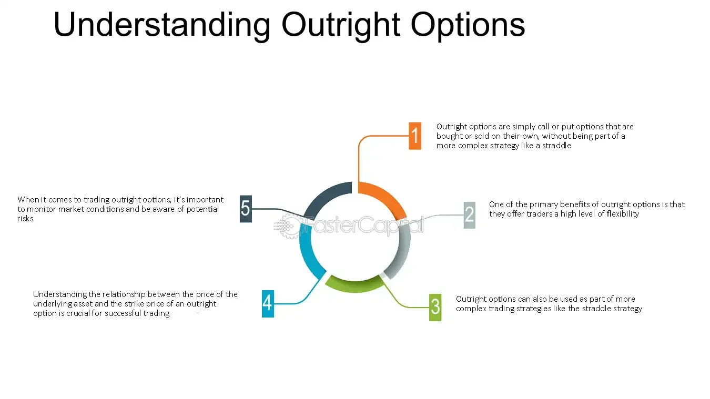

## Table of Contents

## What is an outright option?

An outright option is a type of financial contract where someone buys the right to buy or sell an asset at a set price before a certain date. This asset could be stocks, commodities, or currencies. The buyer pays a fee, called a premium, for this right. If the buyer decides to use the option, they can buy or sell the asset at the agreed price, no matter what the current market price is.

Outright options are useful because they give the buyer flexibility. They can choose to use the option if it benefits them, or let it expire if it doesn't. This can help protect against price changes or make money if the market moves in the right direction. For example, if you think the price of a stock will go up, you can buy an option to purchase it at today's price. If the price does go up, you can buy the stock at the lower price and then sell it at the higher market price, making a profit.

## How does an outright option differ from other types of options?

An outright option is different from other types of options mainly because it's a simple, standalone contract. When you buy an outright option, you're just buying the right to buy or sell an asset at a set price before a certain date. It's straightforward and doesn't come with other conditions or combinations. Other types of options, like spread options or combination options, involve more than one option contract. For example, a spread option might involve buying one option and selling another at the same time, which can be more complex but also offers different strategies for managing risk and potential profit.

Another difference is in how they are used. Outright options are often used by people who have a clear prediction about where the price of an asset is going. If you think a stock's price will go up, you might buy an outright call option to buy the stock at today's price, hoping to sell it later at a higher price. On the other hand, other types of options might be used for more complex strategies. For instance, a collar option combines a call option and a put option to limit both potential gains and losses, which can be useful for investors who want to protect their investments without giving up all potential profit. So, while outright options are simpler and more direct, other types of options offer more flexibility and can be tailored to different investment goals.

## What are the basic components of an outright option?

An outright option has a few key parts that everyone should know about. The first part is the premium, which is the price you pay to buy the option. This is like a fee you pay upfront to have the right to buy or sell the asset later. The second part is the strike price, which is the set price at which you can buy or sell the asset if you decide to use the option. If you think the price of the asset will go up, you might buy a call option with a strike price lower than what you think it will be in the future.

The third part is the expiration date, which is the deadline by which you must decide to use the option or let it expire. If you don't use the option by this date, it becomes worthless and you lose the premium you paid. The last part is the type of option, which can be either a call option or a put option. A call option gives you the right to buy the asset, while a put option gives you the right to sell it. Understanding these parts helps you know what you're getting into when you buy an outright option.

## Can you explain the process of buying an outright option?

Buying an outright option is like buying a ticket that gives you a special right to buy or sell something later. First, you need to decide if you want a call option, which lets you buy the asset, or a put option, which lets you sell it. Then, you pick the asset you're interested in, like a stock or a commodity. After that, you choose the strike price, which is the price at which you can buy or sell the asset if you use the option. You also need to set an expiration date, which is when the option will expire if you don't use it. Once you've made these choices, you go to a place where options are traded, like a stock exchange or through a broker, and you buy the option by paying a premium, which is the price of the option.

After you've bought the option, you keep an eye on the price of the asset. If it moves in the direction you hoped, you might decide to use the option before it expires. For example, if you bought a call option and the price of the stock goes up, you can buy the stock at the lower strike price and then sell it at the higher market price, making a profit. If the price doesn't move in your favor, you can just let the option expire and you'll only lose the premium you paid. It's a way to bet on the future price of something without having to buy it right away.

## What are the risks associated with trading outright options?

Trading outright options can be risky because you might lose the money you paid for the option. This money is called the premium, and if the price of the asset doesn't move the way you hoped by the expiration date, you won't get it back. It's like buying a ticket to a show that you might not end up going to. If you don't use the ticket, you lose the money you spent on it. So, it's important to think carefully about whether the potential profit is worth the risk of losing the premium.

Another risk is that options can be very sensitive to changes in the market. Small changes in the price of the asset can make a big difference in the value of your option. This is called leverage, and it can work in your favor if the price moves the right way, but it can also lead to big losses if it doesn't. Also, options have an expiration date, so you have to be right about the direction and the timing of the price move. If you're wrong, you could lose your entire investment in the option.

## How do outright options function in financial markets?

Outright options play a big role in financial markets because they let people bet on the future price of things like stocks, commodities, or currencies without having to buy them right away. When someone buys an outright option, they pay a fee called a premium to get the right to buy or sell the asset at a set price before a certain date. This can be useful if someone thinks the price of the asset will go up or down. For example, if you think a stock's price will go up, you can buy an option to buy it at today's price. If the price does go up, you can use the option to buy the stock at the lower price and then sell it at the higher market price, making a profit.

But there are risks too. If the price of the asset doesn't move the way you hoped by the expiration date, you lose the money you paid for the option. This is like buying a ticket to a show that you might not end up going to. Also, options can be very sensitive to small changes in the market, which can lead to big wins or big losses. Because options have an expiration date, you need to be right about both the direction and the timing of the price move. If you're wrong, you could lose all the money you invested in the option. So, while outright options can be a powerful tool in financial markets, they need to be used carefully.

## What strategies can be employed using outright options?

Outright options can be used in different ways to make money or protect investments. One common strategy is called "buying a call option." If you think the price of a stock will go up, you can buy a call option to buy the stock at today's price. If the price does go up, you can use the option to buy the stock at the lower price and then sell it at the higher market price, making a profit. This can be a good way to bet on the stock going up without having to buy it right away.

Another strategy is "buying a put option." This is useful if you think the price of a stock will go down. By buying a put option, you get the right to sell the stock at today's price. If the price does go down, you can buy the stock at the lower market price and then use the option to sell it at the higher price you set, making a profit. This can help you make money if the stock goes down, which is different from most investments where you want the price to go up.

A third strategy is using outright options to protect other investments. For example, if you own a stock and you're worried its price might go down, you can buy a put option on that stock. This put option gives you the right to sell the stock at a set price, even if the market price drops. This way, you can limit your losses if the stock's price falls. It's like buying insurance for your investment, giving you peace of mind while you hold onto the stock.

## How do market conditions affect the pricing of outright options?

Market conditions play a big role in deciding how much an outright option costs. One important thing that affects the price is how much the asset's price is expected to move up or down. If people think the price of the asset will move a lot, the option will cost more because there's a bigger chance it could be worth using. Another thing that matters is how much time is left until the option expires. The more time left, the more the option costs because there's more time for the price to move in a good way. Also, if the market is more risky or uncertain, options can cost more because people want to pay for the chance to protect themselves or make money if things change a lot.

Interest rates and how much the asset pays out, like dividends for stocks, also affect option prices. If interest rates go up, call options usually get more expensive and put options get cheaper. This happens because higher interest rates make it more expensive to hold onto the money needed to buy the asset later. If the asset pays out a lot, like a stock with high dividends, call options might be cheaper and put options might be more expensive. This is because the payouts can affect how much the asset's price is expected to change. So, when you're thinking about buying an outright option, it's good to keep an eye on these market conditions because they can change how much you'll have to pay for the option.

## What are the tax implications of trading outright options?

When you trade outright options, you need to think about taxes. If you make money from options, you have to pay taxes on those profits. The tax you pay depends on how long you held the option. If you held it for a year or less, it's called a short-term capital gain, and you pay taxes on it at your regular income tax rate. If you held it for more than a year, it's a long-term capital gain, and you pay a lower tax rate on it. This is important to know because it can affect how much money you keep after taxes.

If you lose money on options, you might be able to use those losses to lower your taxes. You can use the losses to reduce your taxable income, which can help you pay less in taxes. But there are rules about how much you can deduct and how you report it on your tax return. It's a good idea to talk to a tax professional to make sure you're doing everything right and taking advantage of all the tax benefits you can.

## How can one assess the performance of an outright option investment?

To assess the performance of an outright option investment, you need to look at how much money you made or lost compared to what you paid for the option. If you bought a call option and the price of the asset went up, you might have made a profit by buying the asset at the lower strike price and selling it at the higher market price. But if the price didn't go up enough, or if it went down, you might have lost the money you paid for the option. So, the key thing to look at is whether the profit from using the option was more than the premium you paid for it.

Another way to assess performance is to compare it to other investments you could have made. If you made more money with the option than you would have by just buying the asset directly, then the option was a good choice. But if you would have made more money by investing in something else, then the option might not have been the best choice. It's also important to think about how much risk you took with the option. If you made a big profit but it was very risky, you might not want to do it again if you don't like taking big risks. So, assessing performance is about looking at the money you made or lost, comparing it to other options, and thinking about the risk you took.

## What advanced analytical tools are used to evaluate outright options?

To evaluate outright options, people often use advanced tools like the Black-Scholes model. This model helps figure out what an option should be worth by looking at things like the price of the asset, the strike price, how much time is left until the option expires, and how much the price of the asset might move up or down. It's like a calculator that helps you see if the option is a good deal or not. Another tool is the Greeks, which are measures like Delta, Gamma, Theta, and Vega. These help you understand how sensitive the option's price is to different things. For example, Delta tells you how much the option's price will change if the asset's price changes a little bit.

Another important tool is option pricing software, which can run different scenarios to see how the option might perform under different market conditions. This software can help you see what might happen if the market goes up, down, or stays the same. It's like playing out different futures to see which option strategy might work best for you. These tools are really helpful because they give you a lot of information to make smart choices about buying or selling options. But remember, even with all these tools, there's still risk involved because no one can predict the future perfectly.

## How do regulatory frameworks impact the trading of outright options globally?

Regulatory frameworks play a big role in how outright options are traded around the world. Different countries have their own rules to make sure trading is fair and safe. For example, in the United States, the Securities and Exchange Commission (SEC) and the Commodity Futures Trading Commission (CFTC) set rules for options trading. These rules can affect who can trade options, how they can trade them, and what information they need to share. If the rules are strict, it might be harder to trade options, but it can also make the market safer. On the other hand, if the rules are more relaxed, it might be easier to trade, but there could be more risk of things going wrong.

These regulations can also change how much it costs to trade options. For example, if a country requires a lot of paperwork or fees to trade options, it might make the options more expensive. This can affect how many people want to trade them. Also, different countries might have different rules about taxes on options, which can impact how much money people make or lose. Because of these differences, people who trade options need to understand the rules in each country they trade in. This can be tricky, but it's important to follow the rules to avoid getting into trouble.

## What are the key concepts and strategies in options trading?

Options trading provides a flexible platform for investors to speculate on or hedge against potential price fluctuations of underlying assets. At its core, an option is a contract that grants the buyer the right, but not the obligation, to buy (call option) or sell (put option) an asset at a predetermined price, known as the strike price, before or on a specified expiration date. This flexibility makes options an attractive instrument for investors with various strategic goals.

**Covered Calls**

A covered call strategy involves holding a long position in an asset while selling call options on the same asset. This approach can generate additional income through the premiums received from selling the calls. It is typically employed by investors who believe the underlying asset will not experience significant price increases in the short term. The risk is capped as the investor already owns the underlying asset, making this strategy suitable for moderately bullish markets.

**Protective Puts**

Protective puts, sometimes called married puts, are used to guard against potential losses in a held asset. In this strategy, an investor holding a long position in a security buys a put option for the same asset. This setup functions much like insurance, limiting downside risk if the asset's price falls significantly, while still allowing the investor to enjoy any upside gains. This strategy is popular in uncertain markets or when hedging against adverse price movements.

**Straddles**

A straddle is an options strategy that involves purchasing both a call and a put option on the same underlying asset, with the same strike price and expiration date. This strategy profits from significant price movements in either direction, making it ideal for investors anticipating high [volatility](/wiki/volatility-trading-strategies) but uncertain about direction. The payoff can be calculated as:

$$
\text{Payoff} = \max(S_T - K, 0) + \max(K - S_T, 0) - C - P
$$

Where $S_T$ is the asset’s price at expiration, $K$ is the strike price, $C$ is the premium of the call option, and $P$ is the premium of the put option. The main risk is the total premium paid for acquiring both options if the market remains stable.

**Iron Condors**

The iron condor is a more advanced strategy, combining a bull put spread with a bear call spread. It involves selling an out-of-the-money call and put, while simultaneously buying a further out-of-the-money call and put. The goal is to capitalize on lower volatility and the tendency of the underlying asset to remain within a certain price range. This strategy has a limited risk and capped profit potential, relying on the premium differential between the options sold and bought.

Understanding these strategies equips traders with the ability to tailor their investments to suit various market environments, manage risks, and potentially enhance returns. Whether aiming to hedge portfolios or seek income through premiums, mastering options trading strategies is crucial for optimizing investment outcomes in a dynamic financial landscape.

## What is the Role of Financial Derivatives?

Financial derivatives are essential instruments in today's financial markets, providing a method for linking the value of a financial contract to the performance of an underlying entity such as an asset, index, or [interest rate](/wiki/interest-rate-trading-strategies). These instruments allow market participants to generate profits or mitigate risks by managing exposure to fluctuations in the underlying asset's value.

Derivatives fall into several key categories, each offering distinct features and applications. Options, for instance, provide the right but not the obligation to buy or sell an asset at a predetermined price before the contract expires. Forwards and futures are another common form, representing agreements to purchase or sell assets at a future date for a specific price. Swaps, which involve the exchange of cash flows between parties, are typically based on interest rates, currencies, or commodities.

The critical advantage of derivatives lies in their ability to facilitate risk management. Investors use them for hedging—offsetting potential losses in investments by taking an opposite position in a related derivative. For example, an airline concerned about rising fuel costs might use futures contracts to lock in fuel prices, thereby stabilizing operating expenses. Similarly, options can be employed to secure a particular sale price for a stock, thereby protecting against potential downturns in market value.

Global financial markets benefit significantly from the [liquidity](/wiki/liquidity-risk-premium) and price discovery functions provided by derivatives. They enable market participants to express complex views on anticipated market movements, speculate on price changes, and [arbitrage](/wiki/arbitrage) price discrepancies across different markets. A robust derivatives market can enhance market efficiency by promoting competition and innovation among financial instruments.

The mechanics of financial derivatives can appear complex, with pricing often influenced by multiple variables, including the underlying asset's price, time to expiration, volatility, and prevailing interest rates. The Black-Scholes model, one of the most well-known formulas for pricing options, is used for evaluating the fair price of options contracts:

$$
C = S_0 \cdot N(d_1) - X \cdot e^{-rT} \cdot N(d_2)
$$

Where:
- $C$ is the call option price
- $S_0$ is the current price of the underlying asset
- $X$ is the strike price of the option
- $r$ is the risk-free interest rate
- $T$ is the time to expiration
- $N(d_1)$ and $N(d_2)$ are the cumulative distribution functions of the standard normal distribution
- $d_1 = \frac{\ln(S_0/X) + (r + \sigma^2/2)T}{\sigma\sqrt{T}}$
- $d_2 = d_1 - \sigma\sqrt{T}$
- $\sigma$ is the volatility of returns of the underlying asset

Understanding the pricing models and dynamics of derivatives is crucial for traders and investors, as it allows them to make informed decisions and better navigate the intricacies of financial markets. Those who master the use of financial derivatives can effectively manage risk, enhance portfolio returns, and exploit speculative opportunities, thereby reinforcing their position in the increasingly complex financial landscape.

## References & Further Reading

[1]: Black, F., & Scholes, M. (1973). ["The Pricing of Options and Corporate Liabilities."](https://www.cs.princeton.edu/courses/archive/fall09/cos323/papers/black_scholes73.pdf) Journal of Political Economy, 81(3), 637-654.

[2]: Hull, J. C. (2017). ["Options, Futures, and Other Derivatives."](https://www.semanticscholar.org/paper/Options%2C-Futures%2C-and-Other-Derivatives-Hull/89bdee500c8623864fc9eb7a471546aa713acc44) (10th ed.). Pearson.

[3]: MacKenzie, D. (2006). ["An Engine, Not a Camera: How Financial Models Shape Markets."](https://academic.oup.com/mit-press-scholarship-online/book/20588) MIT Press.

[4]: Aldridge, I. (2013). ["High-Frequency Trading: A Practical Guide to Algorithmic Strategies and Trading Systems."](https://www.ahmetbeyefendi.com/wp-content/uploads/2020/07/High-Frequency-Trading-Irene-Aldridge.pdf) (2nd ed.). Wiley.

[5]: Narang, R. K. (2013). ["Inside the Black Box: A Simple Guide to Quantitative and High-Frequency Trading."](https://www.amazon.com/Inside-Black-Box-Quantitative-Frequency/dp/1118362411) (2nd ed.). Wiley.

[6]: "Algorithmic Trading and DMA: An Introduction to Direct Access Trading Strategies" by Barry Johnson (2010).