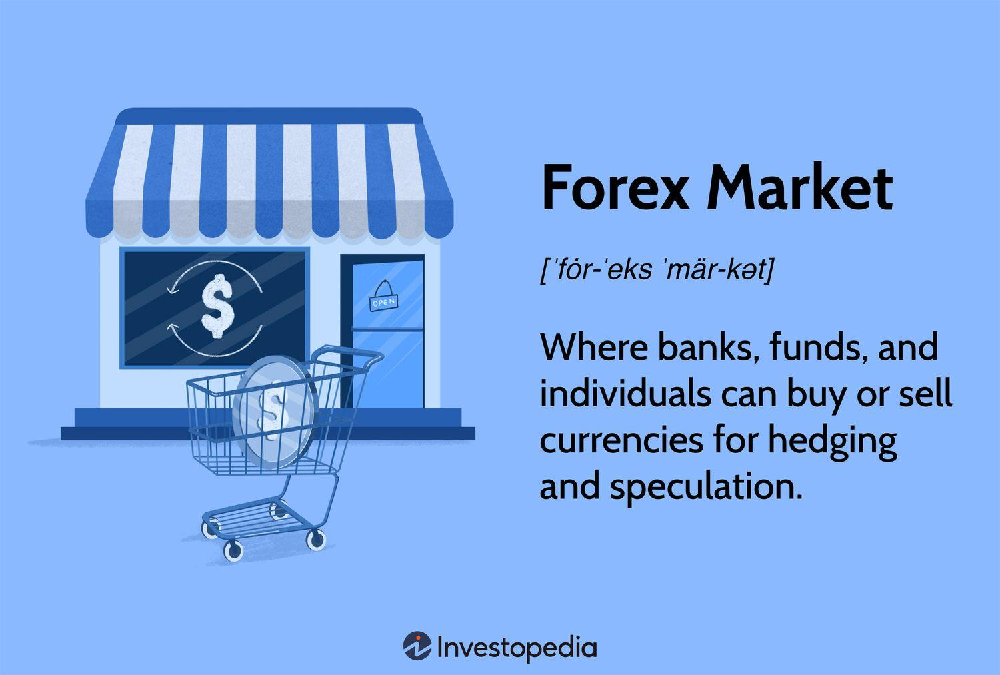

The foreign exchange (FX) market stands as the largest and most liquid financial market globally, operating as a central hub for international commerce and financial transactions. With an average daily turnover exceeding $6 trillion, the FX market facilitates the exchange of currencies necessary for global trade and investment, making it integral to the world economy (Bank for International Settlements, 2019).

In recent years, algorithmic trading has revolutionized the FX market. This technological advancement utilizes computer algorithms to automate trading processes, thereby enhancing efficiency and providing new opportunities for traders and financial institutions alike. By eliminating the human emotional component of trading and incorporating advanced data analytics, algorithmic trading has led to more consistent and rapid trade execution, fostering improved market liquidity and reduced transaction costs.



This article focuses on the concept of FX outrights within the context of algorithmic trading. FX outrights, also known as forward outrights or FX forwards, are financial instruments that allow parties to agree on a specific exchange rate for a currency transaction to occur at a future date. These instruments are pivotal in hedging against currency risk, offering a safeguard against adverse exchange rate movements.

By exploring the application of FX outrights within algorithmic frameworks, this article aims to illuminate the benefits and risks associated with such practices. Additionally, the evolving dynamics of FX algorithmic trading with outrights will be highlighted, providing insights into the modern strategies that define today's foreign exchange ecosystem. Understanding these elements is vital for those involved in the FX market, as they navigate a complex and rapidly changing financial landscape.

## Table of Contents

## What are FX Outrights?

FX outrights, also known as forward outrights or FX forwards, are financial transactions that play a critical role in the global foreign exchange market. These transactions involve two parties agreeing to exchange a predetermined amount of currency at a specific rate on a future date. Unlike spot transactions, which involve immediate currency exchange, FX outrights provide a timeframe extension that is primarily utilized for hedging purposes. This allows entities to manage and mitigate currency risk effectively.

The primary function of FX outrights is to lock in favorable exchange rates, thereby protecting against adverse currency fluctuations that can impact financial outcomes. This characteristic is particularly valuable for companies engaged in international trade and finance, where currency exchange variability can significantly influence profitability and costs. By securing a fixed rate for future currency transactions, businesses can stabilize their financial planning and budgeting.

[FX](/wiki/fx-anomaly) outrights are structured through forward contracts. The agreement terms specify the amount of the currency to be exchanged, the exchange rate (known as the forward rate), and the future settlement date. The forward rate is determined based on factors such as the spot exchange rate and the interest rate differentials between the two currencies involved. The formula to calculate the forward rate $F$ using the spot rate $S$, the domestic interest rate $i_d$, and the foreign interest rate $i_f$ can be expressed as:

$$
F = S \times \left( \frac{1 + i_d \times t}{1 + i_f \times t} \right)
$$

where $t$ represents the time period until the contract's maturity expressed as a fraction of a year.

The significance of outright contracts extends beyond individual companies to the broader financial system. They are vital tools in managing currency exposure for multinational corporations, exporters, and importers, enabling these entities to shield themselves from unexpected exchange rate movements. In an increasingly globalized market, the ability to predict and manage costs in various currencies is indispensable for strategic planning and operations.

Furthermore, the utilization of FX outrights is not confined to businesses alone; governmental bodies and financial institutions also employ these instruments. For instance, central banks may use forwards as part of their foreign exchange reserves management strategy to ensure currency stability or to fulfill international obligations.

In conclusion, FX outrights are indispensable components of the foreign exchange landscape, offering a means to manage currency risk effectively. Their role in stabilizing exchange rate exposure underscores their importance for stakeholders across various sectors of the economy.

## The Basics of Algorithmic Trading

Algorithmic trading represents a profound shift in the financial markets, leveraging computational technology to execute trades based on predefined criteria. By utilizing sophisticated algorithms, traders can automate the decision-making process, thereby minimizing human emotion's impact and potentially leading to more consistent trading outcomes. A key advantage of [algorithmic trading](/wiki/algorithmic-trading) is its speed and efficiency, as computer programs can analyze large datasets and execute trades in fractions of a second, a task nearly impossible for human traders. 

At its core, algorithmic trading encompasses several types of strategies, each leveraging computational power in unique ways. Statistical analysis plays a pivotal role, where algorithms analyze historical data to identify patterns and trends that inform future trading decisions. This approach often involves quantitative modeling to predict price movements, identify [arbitrage](/wiki/arbitrage) opportunities, or optimize trading strategies.

Auto-hedging is another significant strategy in algorithmic trading, where algorithms are designed to automatically enter trades that offset potential losses in an investment portfolio. This is particularly beneficial in volatile markets, as the algorithm can respond instantaneously to changes, maintaining the desired level of exposure without requiring manual intervention.

Algorithmic execution strategies focus on optimizing the process of buying or selling assets in the market. These strategies aim to break down large orders into smaller, strategically timed trades to minimize market impact and achieve more favorable pricing. Techniques such as time-weighted average price (TWAP) or [volume](/wiki/volume-trading-strategy)-weighted average price (VWAP) are often employed to achieve this objective.

In the foreign exchange (FX) market, algorithmic trading has become increasingly prevalent. Traders and financial institutions use algorithms to navigate the rapid movements and vast [liquidity](/wiki/liquidity-risk-premium) of currency markets efficiently. The speed of execution is particularly advantageous in the FX market, allowing for quick responses to economic news and data releases that can sway currency valuations.

Moreover, algorithmic trading facilitates the execution of complex strategies that would be challenging to manage manually. For instance, traders can implement multi-leg trades simultaneously, manage a diverse set of currency pairs, or dynamically adjust strategies in real-time as market conditions evolve.

Incorporating code snippets can further illustrate the utility of algo trading. For example, in Python, a simple moving average crossover strategy could be implemented as follows:

```python
import pandas as pd

# Assume df is a pandas DataFrame with a 'close' column for currency prices
df['short_mavg'] = df['close'].rolling(window=40, min_periods=1).mean()
df['long_mavg'] = df['close'].rolling(window=100, min_periods=1).mean()

# Signal generation: Buy signal when short moving average crosses above the long moving average
df['signal'] = 0
df['signal'][40:] = np.where(df['short_mavg'][40:] > df['long_mavg'][40:], 1, 0)
df['positions'] = df['signal'].diff()

# Positions indicate trade actions - buy when 1, sell when -1
```

This example highlights how algorithms can utilize moving averages to generate buy or sell signals based on market data, streamlining the decision-making process.

In conclusion, algorithmic trading in the FX market harnesses technology to achieve unparalleled speed and precision. By employing statistical analysis, auto-hedging, and algorithmic execution strategies, traders can adapt swiftly to market dynamics, enhancing their competitive edge in a fast-paced trading environment.

## Algorithmic Trading in the FX Market

Algorithmic trading has increasingly shaped the landscape of the foreign exchange (FX) market, profoundly altering how transactions are executed. This technology-driven approach leverages computer algorithms to automate trading processes, yielding significant advantages such as reduced manual labor and decreased transaction costs. The ability to process complex calculations and execute trades at lightning speed gives algorithmic traders a distinct edge over traditional methods, enabling seamless execution of various trading strategies.

One of the primary applications of algorithms in the FX market is the automation of pricing updates for currency pairs. In a market that operates 24 hours a day, real-time price adjustments are crucial. Algorithms help banks and traders manage this constant flow of information by promptly adjusting prices based on specified parameters and market conditions. This reduces human error and improves the accuracy and reliability of pricing, which is vital for maintaining market integrity.

Risk management is another critical area where algorithmic trading excels. By continuously monitoring market [volatility](/wiki/volatility-trading-strategies) and exposure to different currency positions, algorithms can help traders maintain desired risk levels. For instance, hedging strategies can be more efficiently managed with algorithms that automatically adjust positions according to pre-set risk thresholds. This capability not only minimizes potential losses but also capitalizes on market fluctuations.

Algorithmic trading also allows for sophisticated speculative strategies. Traders can implement algorithms designed to exploit market inefficiencies, such as [statistical arbitrage](/wiki/statistical-arbitrage), which involves analyzing historical price data to predict future movements. These strategies rely on mathematical models to detect pricing anomalies and execute trades that generate profits from small price differences.

Furthermore, algorithms can facilitate complex execution strategies like slicing large orders into smaller, more manageable pieces to minimize market impact and reduce slippage. This ensures that trades are executed at the best possible prices without disrupting market conditions.

Overall, the utilization of algorithms in the FX market enhances decision-making by providing traders and financial institutions access to real-time data analysis and execution capabilities. As algorithmic trading continues to evolve, it brings greater efficiency and effectiveness to the intricate operations of the foreign exchange market, ensuring participants can navigate this vast ecosystem with greater precision and confidence.

## Risks Involved in FX Algorithmic Trading

Algorithmic trading in the foreign exchange (FX) market offers notable advantages in terms of speed and efficiency. However, it also introduces significant risks that can affect market stability. One primary concern is the impact of high-frequency trading ([HFT](/wiki/high-frequency-trading-strategies)), a subset of algorithmic trading characterized by rapid execution of a large number of orders. While HFT enhances market liquidity under normal conditions, it can exacerbate market volatility during periods of stress, potentially leading to liquidity shortages. For example, during a market shock, the rapid withdrawal or execution of a large volume of orders by high-frequency traders can cause dramatic price swings.

Another risk is the inability of algorithms to adapt swiftly to unforeseen market events. These programs are designed to operate based on specific conditions and historical data, but unusual market occurrences or black swan events can lead to significant losses if the algorithms fail to adapt. For instance, in a sudden geopolitical event causing abrupt currency rate changes, algorithms might continue executing trades based on outdated conditions, exacerbating financial exposure.

Moreover, the complexity and sophistication required for successful algorithmic trading create disparities among market participants. Not all traders have access to advanced technology or the expertise to develop and maintain effective trading algorithms. This discrepancy can lead to unequal competitive landscapes, where well-resourced participants dominate the market, potentially reducing overall market competitiveness.

Appropriate measures to mitigate these risks are vital for maintaining a stable and transparent foreign exchange market. Ensuring robust risk management systems, continuous monitoring, and the development of adaptive algorithms can help in managing the unanticipated impacts of algorithmic trading. Additionally, regulatory efforts to enhance transparency and ensure fair access to trading technologies may help level the playing field among different market participants.

## The Future of FX Outrights in Algorithmic Trading

As technology continues to advance, the role of algorithmic trading in the foreign exchange (FX) market is poised for substantial growth. This evolution is driven by various factors, including regulatory developments, technological innovation, and the ongoing need for effective risk management, which together will shape the future dynamics of FX outrights in algorithmic trading.

In recent years, regulatory bodies worldwide have heightened their scrutiny of algorithmic trading practices, emphasizing transparency and risk management. For example, regulations like the European Union's MiFID II have imposed stringent reporting requirements and risk controls on financial institutions engaging in algorithmic trading. Such measures are intended to prevent market disruptions and ensure a fair trading environment. This increased regulatory oversight necessitates that market participants adopt robust compliance frameworks while engaging in algorithmic trading, particularly when dealing with complex instruments like FX outrights.

Technological advancements, particularly in the fields of [artificial intelligence](/wiki/ai-artificial-intelligence) (AI) and [machine learning](/wiki/machine-learning), are expected to play a fundamental role in the future of FX algorithmic trading. These technologies enable the development of sophisticated trading algorithms capable of analyzing vast amounts of market data in real-time to make informed trading decisions. For instance, AI-driven algorithms can enhance predictive accuracy by identifying patterns and trends across various currency pairs, enabling traders to optimize their hedging strategies using FX outrights more effectively.

The integration of blockchain technology and smart contracts is another promising trend that could transform how FX outrights are executed within algorithmic trading frameworks. Blockchain's decentralized nature and immutable ledger provide enhanced security and transparency for FX transactions. Smart contracts facilitate automatic execution and settlement of these transactions based on pre-agreed terms, reducing counterparty risk and improving operational efficiency.

Despite these technological advances, managing associated risks remains crucial for market participants. High-frequency or algorithmic trading strategies can amplify volatility, as seen in events like the Flash Crash of 2010. Market participants must therefore implement robust risk management systems to mitigate potential negative impacts, ensuring stable market operations.

FX outrights will continue to serve as a pivotal tool in hedging strategies, especially within algorithmic trading frameworks. As businesses engage in international trade, the certainty offered by FX outrights allows them to lock in exchange rates ahead of transactions, safeguarding against unfavorable currency movements. The application of advanced algorithms can further optimize these hedging strategies, taking into account a range of market variables to provide the best possible protection.

Looking ahead, the future of FX outrights in algorithmic trading will depend on the industry's ability to balance innovation with risk management and compliance. Investors and financial institutions must remain agile, embracing new technologies while adhering to regulatory requirements. By doing so, they can harness the benefits of algorithmic trading to enhance efficiency and achieve their strategic financial objectives in the evolving FX market ecosystem.

## Conclusion

Algorithmic trading has significantly transformed the foreign exchange (FX) market by enhancing operational efficiencies and providing new opportunities in currency trading. The integration of algorithms has introduced precision and speed, allowing for the execution of trades that adhere to predefined criteria with minimal human intervention. This evolution has made it imperative for market participants to comprehend FX outrights and their role in algo trading, given their importance in hedging efforts and maintaining competitive leverage in global finance.

The advantages of algorithmic trading are numerous, but the potential risks it carries cannot be overlooked. Automated systems increase the velocity and volume of trades, which may heighten market volatility or spark unintended ripple effects during periods of market stress. This necessitates a robust risk management framework that can handle the potential pitfalls, ensuring that the efficiency and advantages gained do not come at the expense of market stability.

The future trajectory of FX trading is likely to be shaped by continuous technological advancements that promise further innovations in algorithmic strategies. However, this progress needs to be carefully matched with prudent risk management practices. It is, therefore, crucial for investors and companies to remain vigilant and knowledgeable, adapting their strategies as technological landscapes evolve. This adaptability will be essential for navigating the complexities and dynamics of modern finance, allowing market players to thrive in an environment where change is constant and often rapid.

## References & Further Reading

[1]: Bank for International Settlements. (2019). ["Triennial Central Bank Survey of Foreign Exchange and OTC Derivatives Markets."](https://www.bis.org/statistics/rpfx19.htm)

[2]: Marcos Lopez de Prado. ["Advances in Financial Machine Learning."](https://www.amazon.com/Advances-Financial-Machine-Learning-Marcos/dp/1119482089) Wiley.

[3]: David Aronson. ["Evidence-Based Technical Analysis: Applying the Scientific Method and Statistical Inference to Trading Signals."](https://www.amazon.com/Evidence-Based-Technical-Analysis-Scientific-Statistical/dp/0470008741) Wiley.

[4]: Stefan Jansen. ["Machine Learning for Algorithmic Trading."](https://github.com/stefan-jansen/machine-learning-for-trading) CreateSpace Independent Publishing Platform.

[5]: Ernest P. Chan. ["Quantitative Trading: How to Build Your Own Algorithmic Trading Business."](https://www.amazon.com/Quantitative-Trading-Build-Algorithmic-Business/dp/0470284889) Wiley.