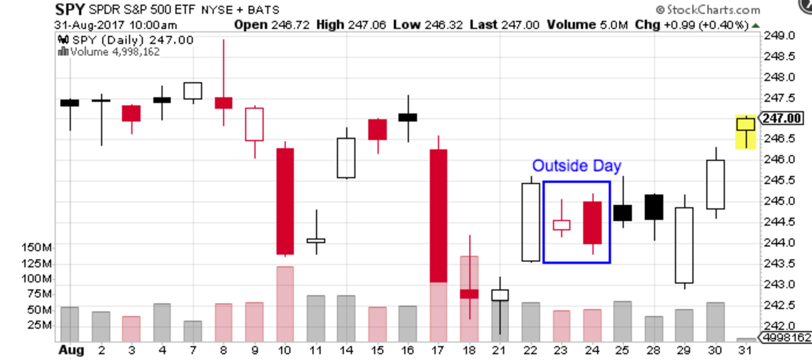

Algorithmic trading has transformed the financial trading landscape by leveraging advanced technology to enable faster and more accurate trading. One of the patterns often employed in algorithmic trading is the 'outside day' pattern, which is valuable for its ability to indicate potential market shifts. This pattern, despite its simple structure, is of great importance to traders who rely on algorithmic strategies, as it can offer insights into market dynamics and potential price movements.

The 'outside day' pattern is intriguing due to its capacity to signal changes in market sentiment by showing a trading day where the price range exceeds that of the preceding day, typically forming a higher high and a lower low. This feature makes it a crucial tool for traders aiming to capitalize on market volatility and potential reversals. In investigating the 'outside day' pattern, we will explore its definition, application, and strategic potential in algorithmic trading. Understanding the intricacies of this pattern can yield opportunities for informed decision-making and improved trading outcomes in the fast-paced world of algorithmic trading. By integrating the 'outside day' pattern into trading strategies, traders can enhance their ability to navigate volatile market conditions profitably.



## Table of Contents

## Understanding the Outside Day Pattern

An outside day pattern is a notable occurrence in the trading of securities, characterized by a price range extending beyond the boundaries of the previous day. Specifically, an outside day sees a security achieving both a higher high and a lower low compared to the preceding trading day. This distinctive pattern can be indicative of increased market volatility and may suggest a potential shift in market sentiment.

The outside day pattern holds particular importance as it can imply either a continuation or a reversal of the existing market trend. It bears resemblance to the engulfing candlestick pattern, often utilized in technical analysis; however, the outside day pattern is defined by the entirety of the trading day's price range surpassing that of the previous day. The pattern’s value lies in the insight it provides into market control dynamics, offering clues as to whether bulls or bears are exerting dominance.

In practical terms, an outside day may suggest that market forces are contesting for control, and the [breakout](/wiki/breakout-trading) of a higher high and lower low serves as a battleground for these forces. As a result, traders closely observe this pattern to gauge probable future market movements, employing it either independently or in conjunction with other technical indicators to better understand and predict market behavior. Importantly, the interpretation of an outside day should consider the broader market context, as the pattern's implications can vary significantly depending on other situational factors.

## Implementing Outside Day in Algorithmic Trading

In [algorithmic trading](/wiki/algorithmic-trading), capitalizing on the outside day pattern involves creating algorithms that can swiftly recognize this formation and execute trades according to predefined signals. The outside day pattern is characterized by the current day's price range surpassing both the high and low of the previous day, leading traders to interpret the pattern as a potential signal for market shifts.

The successful implementation of this pattern in algorithmic trading requires a thorough understanding of context—specifically, determining whether the pattern suggests a continuation or a reversal of the current trend. This context-driven approach helps in minimizing false signals, which are prevalent when patterns are interpreted in isolation without regard to broader market dynamics.

Algorithmic detection of outside day patterns necessitates precise coding and strategy development. Algorithms are designed to parse extensive datasets to identify days where the specified conditions of the outside day pattern occur. Once detected, these algorithms can execute buy or sell actions in milliseconds, exploiting the transient nature of market opportunities.

Below is an example of a simple algorithmic framework written in Python that recognizes outside day patterns and triggers trading signals:
```python
import pandas as pd

def identify_outside_day(data):
    # Ensure the input data has the necessary columns
    if not {'High', 'Low'}.issubset(data.columns):
        raise ValueError("Data must contain 'High' and 'Low' columns")

    # Identify outside day pattern
    data['Outside_Day'] = (data['High'] > data['High'].shift(1)) & (data['Low'] < data['Low'].shift(1))

    # Define buy and sell signals based on the pattern
    data['Signal'] = 0
    data.loc[data['Outside_Day'] & (data['Close'] > data['Open']), 'Signal'] = 1  # Buy signal
    data.loc[data['Outside_Day'] & (data['Close'] < data['Open']), 'Signal'] = -1  # Sell signal

    return data

# Example usage
# Assume you have a Pandas DataFrame 'market_data' with 'High', 'Low', 'Open', 'Close' columns
market_data = pd.DataFrame({
    'High': [105, 108, 110],
    'Low': [100, 102, 99],
    'Open': [101, 106, 104],
    'Close': [103, 107, 103]
})

signals = identify_outside_day(market_data)
print(signals[['High', 'Low', 'Outside_Day', 'Signal']])
```

Backtesting plays an indispensable role in the validation of strategies based on outside day patterns. This process involves running the pattern through historical market data to assess its reliability and profitability. Adjusting variables such as time frames or coupling with other indicators helps refine the algorithm and reduce the risk of unreliable signals. For example, integrating moving averages or [volume](/wiki/volume-trading-strategy) indicators can lend more credibility to the pattern, aligning short-term with longer-term signals for more robust decision-making.

Combining outside day patterns with other technical analysis tools enhances the accuracy of predictions. A multi-faceted approach, considering additional indicators and data points, often yields more precise trading outcomes. By improving the algorithm's capacity to understand and navigate various market scenarios, traders can potentially improve the performance of their algorithmic strategies deploying the outside day pattern.

## Is the Outside Day Pattern Bullish or Bearish?

The sentiment indicated by an outside day pattern is highly context-dependent and is influenced by the prevailing market conditions and other technical factors. An outside day occurs when a security's price range for a given day exceeds that of the previous day, with a higher high and a lower low. This pattern suggests potential [volatility](/wiki/volatility-trading-strategies) and can signal a shift in market sentiment.

An outside day pattern may be interpreted as bullish when it appears during an upward market movement, suggesting a potential continuation of the uptrend. For example, if the stock is already in a bullish trend and an outside day occurs, breaking through previous resistance levels, it might indicate that buyers have gained control, reinforcing the trend.

On the other hand, a bearish outside day pattern might signal the onset of a downtrend when it emerges in an already declining market. If the pattern occurs after a significant rally, it may imply exhaustion among buyers and a possible reversal if the subsequent price action aligns with the bear's pattern.

Traders should evaluate additional market factors, such as trading volume and overall trend direction, to accurately interpret the implications of an outside day pattern. For instance, a bullish outside day with high trading volume could suggest stronger confirmation of the trend than a similar pattern with low volume.

Recognizing these nuances is crucial when integrating outside day patterns into algorithmic trading frameworks. Algorithms must account for contextual interpretation to improve the precision of trading decisions. By combining these patterns with other technical indicators and analyzing factors like [momentum](/wiki/momentum) or support and resistance levels, traders can form a more comprehensive view of market movements.

In conclusion, while outside day patterns can signal potential bullish or bearish sentiments, their effectiveness depends significantly on the surrounding market context and additional confirming indicators.

## Backtesting the Outside Day Strategy

Backtesting involves simulating the outside day strategy using historical data to evaluate its performance. By applying the strategy to past market data, traders can assess its reliability and effectiveness before deploying it in real-time trading scenarios. Successful backtests provide insights into potential gains, losses, and the overall risk associated with the strategy.

Algorithmic strategies focusing on outside days exhibit mixed results due to the reliance on context-specific information. Market conditions, such as trending or ranging markets, can significantly impact the performance of an outside day strategy. Thus, understanding the market environment is crucial in interpreting the signals generated by outside days.

Traders refine their strategies by modifying criteria such as the time frames considered and additional patterns detected. For example, a common approach might involve analyzing outside day patterns within different time frames—such as hourly or daily charts—to identify the most effective context for the strategy. Incorporating other technical patterns, like moving averages or RSI, can also help enhance decision-making accuracy.

Despite challenges in predicting market movements purely based on outside day patterns, continuous testing and adaptation can lead to successful implementation in live trading environments. By adjusting parameters and incorporating dynamic elements, such as changes in volatility or volume, traders can optimize their strategies for improved results.

A basic Python code snippet demonstrating a backtest for the outside day strategy might look like this:

```python
import pandas as pd

def is_outside_day(row, previous_row):
    return (row['High'] > previous_row['High']) and (row['Low'] < previous_row['Low'])

def execute_backtest(data):
    signals = []
    for i in range(1, len(data)):
        if is_outside_day(data.iloc[i], data.iloc[i-1]):
            signals.append((data.index[i], 'Signal'))

    return signals

# Sample usage with historical market data
historical_data = pd.DataFrame({
    'High': [130, 135, 140, 136, 138],
    'Low': [125, 130, 132, 133, 134]
}, index=pd.date_range(start='2023-01-01', periods=5))

signals = execute_backtest(historical_data)
print(signals)
```

This example assumes you have a DataFrame named `historical_data` with columns 'High' and 'Low', representing daily high and low prices. The `is_outside_day` function checks if a day is an outside day compared to the previous day, and `execute_backtest` iterates through the data to identify and return the signals.

Continuous refinement of such strategies, including recalibrating the criteria and testing under different market conditions, is vital for uncovering opportunities in algorithmic trading involving outside day patterns.

## Conclusion

The outside day pattern offers valuable insights for traders applying algorithmic strategies in volatile markets. This candlestick pattern, marked by a trading session's price range exceeding that of the previous day, can highlight potential market trends and shifts. However, its practical application is not always straightforward. Traders must navigate the complexities of determining whether the pattern signals market continuation or reversal. By understanding the pattern's context and integrating it with other technical indicators, its effectiveness as a trading signal can be significantly enhanced.

Backtesting is an essential component of utilizing the outside day pattern within algorithmic strategies. By simulating the strategy's use with historical market data, traders can assess its viability, profitability, and associated risks. Successful backtests provide critical insights into expected performance metrics and help refine strategy parameters.

The potential for profit opportunities within algorithmic trading increases with continued exploration and refinement of approach. Algorithmic strategies can benefit from tweaks in implementation, such as adapting criteria based on varying time frames or combining the outside day pattern with other market signals for more robust decision-making.

Ultimately, outside day patterns remain a compelling tool in technical analysis for financial markets. As traders continue to hone their strategies, the nuanced understanding and application of this pattern can significantly contribute to achieving trading success in algorithmic environments.

## FAQs

### What is the significance of an outside day pattern in trading?

The outside day pattern is significant in trading because it signals potential changes in market sentiment and volatility. Recognized when the daily price range of a security exceeds that of the previous day, forming both a higher high and a lower low, it suggests a possible shift in the market’s control. Understanding this pattern allows traders to anticipate whether the current trend may continue or reverse, aiding them in making informed trading decisions.

### How do traders determine whether an outside day is bullish or bearish?

Traders assess the bullish or bearish nature of an outside day pattern by examining the broader market context. A bullish outside day pattern generally occurs when the pattern appears during an upward market movement, suggesting a continuation of the uptrend. Conversely, if the pattern appears during a downward market movement, it may signal a potential downward trend. Evaluating additional factors such as trading volume and surrounding price action patterns enhances the accuracy of these predictions.

### What are the challenges of using outside day patterns in algorithmic trading?

One major challenge in using outside day patterns in algorithmic trading is the reliance on context for effective interpretation. Since the pattern can indicate both continuation and reversal scenarios, algorithms must be designed to assess surrounding market conditions accurately. Additionally, the volatile nature of markets necessitates rapid decision-making capabilities, which can be difficult to program effectively. Moreover, algorithms must be constantly updated to accommodate changing market dynamics and ensure their continued relevance.

### Why is backtesting important for strategies using outside day patterns?

Backtesting is crucial for strategies based on outside day patterns as it allows traders to evaluate the strategy's historical performance using past market data. By simulating trades, [backtesting](/wiki/backtesting) helps in identifying expected returns, losses, and the overall risk profile of the strategy. It aids in refining the strategy by revealing potential weaknesses and areas of improvement. For algorithmic strategies, which rely heavily on historical data and models, backtesting is a necessary step to confirm viability before live deployment.

### How can the effectiveness of an outside day strategy be improved?

The effectiveness of an outside day strategy can be improved through several methods. Firstly, combining the outside day pattern with other technical indicators, such as moving averages or RSI (Relative Strength Index), can enhance predictive accuracy. Secondly, traders should ensure their algorithms are adaptive, capable of adjusting their parameters based on real-time market feedback and ongoing backtests. Finally, regular updates and optimizations of the algorithm, informed by both qualitative market research and quantitative data analysis, will ensure its sustained effectiveness in various market conditions.

## References & Further Reading

[1]: Bergstra, J., Bardenet, R., Bengio, Y., & Kégl, B. (2011). ["Algorithms for Hyper-Parameter Optimization."](https://papers.nips.cc/paper/4443-algorithms-for-hyper-parameter-optimization) Advances in Neural Information Processing Systems 24.

[2]: ["Advances in Financial Machine Learning"](https://www.amazon.com/Advances-Financial-Machine-Learning-Marcos/dp/1119482089) by Marcos Lopez de Prado

[3]: ["Evidence-Based Technical Analysis: Applying the Scientific Method and Statistical Inference to Trading Signals"](https://www.amazon.com/Evidence-Based-Technical-Analysis-Scientific-Statistical/dp/0470008741) by David Aronson

[4]: ["Machine Learning for Algorithmic Trading"](https://github.com/stefan-jansen/machine-learning-for-trading) by Stefan Jansen

[5]: ["Quantitative Trading: How to Build Your Own Algorithmic Trading Business"](https://books.google.com/books/about/Quantitative_Trading.html?id=j70yEAAAQBAJ) by Ernest P. Chan