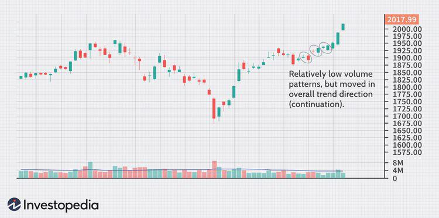

Trading patterns are essential tools in the stock market, providing traders with insights into potential price movements. These patterns analyze historical price data to predict future trends, enabling traders to make informed decisions. A pattern of particular interest is the "outside day," which holds significant importance in trading strategies, particularly in algorithmic trading. 

An outside day occurs when the trading day's high is higher, and the low is lower than those of the previous day. This creates a specific two-bar pattern on a price chart, indicating increased market volatility and potential shifts in market sentiment. Identifying and interpreting outside days can offer traders early signals of trend reversals or continuations, which is invaluable in volatile market conditions.



Algorithmic trading, which relies on programming rules to execute trades, can benefit greatly from incorporating outside days. By integrating outside day patterns into algorithms, traders can execute swift decisions based on market data, minimizing human error and optimizing response times. The ability to quickly identify shifts in market sentiment through outside days is a powerful tool for algorithmic trading systems aiming to capitalize on rapid market fluctuations.

This article explores the definition and application of outside days in trading and highlights their usefulness for improving decision-making in volatile markets. By understanding and leveraging these patterns, traders can enhance their strategies and increase their potential for success in trading environments characterized by uncertainty and dynamic price movements.

## Table of Contents

## Understanding Outside Days

Outside days are a fundamental concept in technical analysis, characterized by a trading day's high surpassing that of the previous day while its low drops below the previous day's low. This configuration creates a distinct two-bar pattern on price charts. Typically, an outside day signals heightened market volatility, indicating potential shifts in market sentiment. 

The pattern emerges because the price range of the outside day wholly engulfs the prior day's range, suggesting a tumultuous battle between bullish and bearish forces. When such a scenario unfolds, traders often anticipate a pivotal change in trend direction. This anticipation is based on the belief that outside days can indicate either a continuation or a reversal of the prevailing market trend.

In terms of market interpretation, outside days are instrumental in unveiling control dynamics between market participants. For instance, the occurrence of an outside day may highlight the dominant pressure exerted by either bullish or bearish sentiments. If the close is nearer to the high of the outside day after an initial decline, it might suggest bullish dominance. Conversely, if the close is near the low after an initial rise, bearish forces might be in control.

For traders, the utility of outside days lies in their ability to provide insights into market trends and reversals. By observing an outside day's structure, traders can gain an understanding of current market forces, which can aid in making informed predictions about potential future movements. This predictive power makes outside days a valuable tool in a trader’s toolkit, particularly for those focusing on short-term market fluctuations.

## Outside Days in Algorithmic Trading

Algorithmic trading, also known as algo trading, involves using computer algorithms to automatically make trading decisions and execute trades. The fundamental aim is to leverage computational efficiency and precision to capitalize on market opportunities, such as those presented by trading patterns like outside days.

An outside day is identified when a trading day's high surpasses the previous day's high and the low drops below the previous day's low. Implementing outside days in [algorithmic trading](/wiki/algorithmic-trading) involves crafting algorithms that are capable of recognizing this two-bar pattern swiftly and accurately. The challenge is in minimizing false signals, which can lead to erroneous trades and financial losses.

The first step in integrating outside days into an algorithmic trading system is to define the rules that detect this pattern. The algorithm must analyze stock price data arrayed over two consecutive days, confirming that the current day's high is greater than the previous day's high and that the current day's low is lower than the previous day's low. Below is a simple example of how such a rule might be coded in Python:

```python
def is_outside_day(today, yesterday):
    """
    Determine if today is an outside day compared to yesterday.

    Parameters:
    - today: A dictionary with 'high' and 'low' keys representing today's high and low prices.
    - yesterday: A dictionary with 'high' and 'low' keys representing yesterday's high and low prices.

    Returns:
    - bool: True if today is an outside day, False otherwise.
    """
    return today['high'] > yesterday['high'] and today['low'] < yesterday['low']

# Example usage
yesterday_data = {'high': 150, 'low': 145}
today_data = {'high': 155, 'low': 143}

print(is_outside_day(today_data, yesterday_data))  # Output: True
```

Once the pattern is correctly identified, the algorithm must then decide the appropriate trading action. This often involves interpreting the current market context to decide whether the pattern indicates a trend continuation or reversal. This requires sophisticated decision-making logic, potentially integrating additional indicators to validate the pattern's signal.

Efficient execution is another critical facet. Modern trading systems need to execute trades rapidly to take advantage of the short-lived opportunities that outside days can present. This necessitates the use of high-performance computing environments and connectivity to ensure low latency between signal detection and trade execution.

Moreover, the algorithms must incorporate mechanisms for risk management. This includes setting stop-loss orders and position sizing to manage potential losses if the market moves against the trade. Successful implementation of these components allows traders to effectively use outside days as a predictive tool, potentially increasing profitability in algorithmic trading.

Overall, the integration of outside days into algorithmic trading systems requires attention to detail in pattern recognition, contextual analysis, execution efficiency, and risk management.

## Bullish or Bearish? Interpreting Outside Days

The interpretation of an outside day as either bullish or bearish is heavily contingent upon the prevailing market context. This pattern, recognized by a day's trading high surpassing the previous day's high and a low dipping below the prior low, generally signals heightened market [volatility](/wiki/volatility-trading-strategies) and potential shifts in investor sentiment. 

In an established uptrend, an outside day often suggests a continuation of the bullish [momentum](/wiki/momentum). This interpretation arises because the market has shown strength by reaching new highs and recovering from lower levels within the same trading day. Investors interpret this as a sign of sustained buying interest, reinforcing the existing upward trajectory.

Conversely, in a downtrend, the presence of an outside day could indicate a bearish reversal. The market reaching both lower lows and higher highs within the same day might reflect an intense struggle between buyers and sellers. When sellers eventually dominate, it suggests a reinforcement of the bearish trend. This struggle can be quantified by examining the trading [volume](/wiki/volume-trading-strategy) and the magnitude of price movement relative to historical patterns.

A practical approach for traders is to analyze the context in which an outside day appears. For example, if an outside day emerges after a series of upward moves, traders might consider it a signal of potential exhaustion, which could lead to a reversal. In contrast, if this pattern appears after a significant decline, it might foreshadow a reversal towards bullish sentiment.

Using Python, one could develop an algorithmic approach for identifying and interpreting outside days within a specific market context. Here is a simple code snippet demonstrating how to recognize outside days using historical price data:

```python
import pandas as pd

def identify_outside_days(data):
    """
    Identifies outside days in the given price data.
    :param data: DataFrame with columns 'High', 'Low'
    :return: DataFrame indicating outside days
    """
    data['Prev_High'] = data['High'].shift(1)
    data['Prev_Low'] = data['Low'].shift(1)

    data['Outside_Day'] = ((data['High'] > data['Prev_High']) & 
                           (data['Low'] < data['Prev_Low']))

    return data

# Example usage with a DataFrame `price_data`
outside_days = identify_outside_days(price_data)
```

This algorithm detects places where both the high and the low exceed their previous values, signaling an outside day. Traders must integrate this detection with additional trend-analysis tools to effectively gauge whether the pattern is bullish or bearish. By considering broader market contexts, such as existing trends and volume activity, traders enhance their interpretation accuracy and make more informed trading decisions based on outside day formations.

## Backtesting and Strategy Development

Backtesting is a fundamental component of developing and evaluating trading strategies that incorporate outside day patterns. It involves the application of trading strategies to historical market data to determine how these strategies would have performed in the past. This retrospective analysis is invaluable for traders, allowing them to gauge the potential effectiveness and robustness of their strategies before deploying them in live markets.

To effectively backtest an outside day strategy, traders must begin by clearly defining the conditions under which an outside day is identified. This typically involves establishing criteria such as a trading day's high being higher and the low being lower than the previous day, thus encapsulating the entire price movement of the prior day. Once these criteria are set, historical data can be screened to identify instances of outside days.

One of the main advantages of [backtesting](/wiki/backtesting) is the ability to adjust variables like time frames and incorporate additional indicators, making it possible to refine trading strategies. Traders can test different time frames, ranging from intraday periods to longer-term daily or weekly analyses, to determine which time frame is most effective for their specific trading approach. Additionally, integrating complementary technical indicators, such as moving averages or relative strength index (RSI), can help filter out false signals and confirm potential trading opportunities generated by outside day patterns.

For instance, a Python script could be used to automate the backtesting process, scanning historical data to find outside day patterns and evaluate their subsequent market outcomes. Here is a simplified example in Python to illustrate such a backtesting strategy:

```python
import pandas as pd
import numpy as np

# Sample historical data in a DataFrame
data = pd.read_csv('historical_stock_data.csv')

# Define a function to identify outside days
def identify_outside_days(data):
    data['Outside Day'] = ((data['High'] > data['High'].shift(1)) & 
                           (data['Low'] < data['Low'].shift(1)))
    return data

# Apply the function
data = identify_outside_days(data)

# Example: backtest strategy based on outside days
initial_capital = 10000.0
positions = 0
cash = initial_capital

for i in range(1, len(data)):
    if data['Outside Day'].iloc[i]:
        # Example condition to buy stock
        if data['Close'].iloc[i] > data['Open'].iloc[i] and cash >= data['Close'].iloc[i]:
            positions += 1
            cash -= data['Close'].iloc[i]
        # Example condition to sell stock
        elif data['Open'].iloc[i] > data['Close'].iloc[i-1] and positions > 0:
            positions -= 1
            cash += data['Close'].iloc[i]

# Calculate final portfolio value
final_value = cash + positions * data['Close'].iloc[-1]
print(f"Final portfolio value: ${final_value:.2f}")
```

This script identifies outside days in historical stock data and simulates a simple buy/sell strategy based on those patterns. The performance of the strategy is tracked, providing insights into its viability.

Combining outside days with additional tools and indicators enhances the reliability and profitability of the strategy. Technical indicators, such as moving averages, can serve as trend filters, while momentum indicators like RSI can help identify potential entry and [exit](/wiki/exit-strategy) points. The synergistic use of these tools can significantly improve the predictive accuracy and efficiency of trading strategies based on outside days, reducing the likelihood of false signals and optimizing risk management practices in volatile market environments.

## Conclusion

Outside days are essential for detecting shifts in market sentiment, making them invaluable to traders who use algorithmic systems. These patterns provide insights into potential changes in price movements, assisting in the identification of either a continuation or reversal of market trends. For traders, effectively using outside days in their strategies can offer a competitive edge, especially in unstable market conditions.

To maximize their effectiveness, context analysis is paramount. By examining the market environment in which an outside day occurs, traders can better interpret whether the pattern signifies a bullish or bearish sentiment. Integrating other technical indicators, such as moving averages or the Relative Strength Index (RSI), can further refine these interpretations. This combined approach aids in minimizing false signals and increasing trading precision.

Moreover, the ongoing development and optimization of strategies involving outside days are crucial. This requires continuous backtesting and fine-tuning of algorithms. Backtesting allows traders to apply these patterns to historical market data, adjusting variables such as time frames or additional indicators, to evaluate and enhance strategy performance. By doing so, traders can identify potential strengths and weaknesses, leading to more reliable and profitable trading strategies.

Ultimately, the successful use of outside days in algorithmic trading hinges on the ability to adapt and enhance strategies over time. As market conditions evolve and new data becomes available, traders must be willing to alter their approaches, ensuring that their algorithms remain effective and relevant in capturing market sentiment changes.

## FAQs

---

**What is the significance of an outside day pattern in trading?**  
Outside day patterns are crucial because they indicate increased market volatility and potential shifts in market sentiment. By observing a day when the high is higher and the low is lower than the previous day, traders gain insights into who holds control—buyers (bulls) or sellers (bears). Recognizing these dynamics can help traders predict possible continuations or reversals in trends, thus informing their trading decisions.

**How do traders determine whether an outside day is bullish or bearish?**  
The interpretation of an outside day pattern as bullish or bearish largely depends on the prevailing market context and trends. In an uptrend, an outside day can suggest a continuation of bullish sentiment, as the broader trend overrides short-term volatility. Conversely, in a downtrend, the same pattern might indicate a bearish reversal, reflecting potential market exhaustion and the emergence of selling pressures.

**What are the challenges of using outside day patterns in algorithmic trading?**  
Implementing outside day patterns in algorithmic trading comes with challenges such as accurately detecting these patterns in real-time amidst noisy market data. There's also a risk of false signals, which can lead to poor trading decisions. Ensuring algorithms account for different market contexts and refining them to filter out noise are critical to overcoming these challenges.

**Why is backtesting important for strategies using outside day patterns?**  
Backtesting is integral to validating trading strategies that employ outside day patterns. By applying these strategies to historical data, traders can assess their effectiveness and make necessary adjustments before employing them in live markets. Backtesting helps uncover potential pitfalls and optimize variables such as time frames and the use of complementary indicators, thereby improving strategy reliability.

**How can the effectiveness of an outside day strategy be improved?**  
To enhance the effectiveness of an outside day strategy, traders can combine the pattern with other technical tools like moving averages, RSI, or MACD. This integration can filter out false signals and confirm the patterns' predictions. Additionally, continued evaluation and refinement through backtesting and ongoing market analysis are essential for adapting strategies to changing market conditions.

## References & Further Reading

[1]: ["Advances in Financial Machine Learning"](https://www.amazon.com/Advances-Financial-Machine-Learning-Marcos/dp/1119482089) by Marcos Lopez de Prado

[2]: ["Evidence-Based Technical Analysis: Applying the Scientific Method and Statistical Inference to Trading Signals"](https://www.amazon.com/Evidence-Based-Technical-Analysis-Scientific-Statistical/dp/0470008741) by David Aronson

[3]: ["Machine Learning for Algorithmic Trading"](https://github.com/stefan-jansen/machine-learning-for-trading) by Stefan Jansen

[4]: ["Quantitative Trading: How to Build Your Own Algorithmic Trading Business"](https://www.amazon.com/Quantitative-Trading-Build-Algorithmic-Business/dp/1119800064) by Ernest P. Chan

[5]: Bulkowski, T. (2013). ["Encyclopedia of Chart Patterns"](https://www.wiley.com/en-us/Encyclopedia+of+Chart+Patterns,+3rd+Edition-p-9781119739685) John Wiley & Sons.

[6]: Murphy, J.J. (1999). ["Technical Analysis of the Financial Markets: A Comprehensive Guide to Trading Methods and Applications"](https://archive.org/details/technicalanalysi0000murp) New York Institute of Finance.