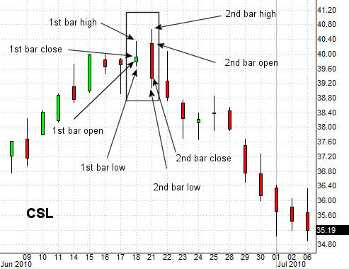

## Table of Contents

## What is an Outside Day in trading?

An Outside Day in trading is a type of candlestick pattern that shows a lot of movement in the price of a stock or other financial asset. It happens when the price of the asset goes both higher and lower than the previous day's price range. This means the day's high is higher than the previous day's high, and the day's low is lower than the previous day's low. Traders watch for Outside Days because they can signal that a big change might be coming in the price direction.

When traders see an Outside Day, they often think it could mean the current trend might be ending. If the price closes higher than it opened, some traders might think it's a sign that the price will keep going up. But if the price closes lower than it opened, traders might think the price will keep going down. Because an Outside Day shows a lot of uncertainty and change, traders use it along with other signs and patterns to help them decide what to do next.

## How can you identify an Outside Day on a price chart?

To spot an Outside Day on a price chart, you need to look at two days in a row. The first thing to check is if the high price of the second day is higher than the high price of the first day. Then, see if the low price of the second day is lower than the low price of the first day. If both of these things are true, you've found an Outside Day.

Once you've identified the high and low of the second day are outside the range of the first day, take a look at where the second day's price closes. If it closes higher than where it opened, it might mean the price could go up more. If it closes lower than where it opened, it might mean the price could go down more. This pattern can help traders guess what might happen next with the price.

## What does an Outside Day indicate about market sentiment?

An Outside Day shows that the market is feeling unsure and might be ready for a change. When the price goes higher and lower than the day before, it means people are trading a lot and can't agree on what the price should be. This big move in the price can mean that the market is trying to decide if it wants to go up or down next.

If the price ends the Outside Day higher than it started, it might mean that more people think the price will keep going up. They feel good about the market. But if the price ends lower than it started, it might mean that more people think the price will keep going down. They feel worried about the market. Traders look at these signs to guess what the market might do next.

## Can you explain the difference between an Outside Day and an Inside Day?

An Outside Day and an Inside Day are two different patterns you can see on a price chart. An Outside Day happens when the price on the second day goes higher than the high of the first day and lower than the low of the first day. This means the second day's price range is bigger than the first day's. It shows that the market is moving a lot and people are unsure about what will happen next.

On the other hand, an Inside Day is the opposite. It happens when the price on the second day stays between the high and low of the first day. This means the second day's price range is smaller than the first day's. An Inside Day shows that the market is not moving as much and people might be waiting to see what happens next.

Both patterns can help traders guess what the market might do. An Outside Day might mean a big change is coming, while an Inside Day might mean the market is taking a break before it decides what to do next.

## How does an Outside Day relate to support and resistance levels?

An Outside Day can help traders see where the support and resistance levels might be. Support is a price level where the price often stops going down and starts going up. Resistance is a price level where the price often stops going up and starts going down. When you see an Outside Day, the high of that day can show you where the resistance might be because the price went higher than the day before. The low of that day can show you where the support might be because the price went lower than the day before.

Traders use these levels to make guesses about what the price might do next. If the price goes above the high of the Outside Day, it might mean the price will keep going up because it broke through the resistance. If the price goes below the low of the Outside Day, it might mean the price will keep going down because it broke through the support. By watching where the price goes compared to the high and low of the Outside Day, traders can better understand the market and make their trading plans.

## What are the key components to consider when analyzing an Outside Day?

When you look at an Outside Day, the first thing to check is the price range. You need to see if the high of the second day is higher than the high of the first day, and if the low of the second day is lower than the low of the first day. If both are true, you have an Outside Day. This tells you that the market moved a lot and people were unsure about the price.

Next, look at where the price closes on the Outside Day. If it closes higher than it opened, it might mean that more people think the price will go up. This can be a sign that the market feels good. But if it closes lower than it opened, it might mean that more people think the price will go down. This can be a sign that the market feels worried. By checking the closing price, you can guess what might happen next with the market.

Also, think about the support and resistance levels. The high of the Outside Day can show where the resistance is, and the low can show where the support is. If the price breaks through these levels later, it can tell you if the price will keep going up or down. Watching these levels helps you understand the market better and make smarter trading choices.

## Can you provide examples of Outside Days in different markets (stocks, forex, commodities)?

In the stock market, let's say you're looking at the price chart for a company like Apple. On Monday, the stock's high was $150 and the low was $145. On Tuesday, the stock goes up to a high of $152 and down to a low of $143. This is an Outside Day because Tuesday's high is higher than Monday's high, and Tuesday's low is lower than Monday's low. If the stock closes at $151 on Tuesday, higher than it opened, traders might think the price will keep going up. But if it closes at $144, lower than it opened, they might think the price will go down.

In the [forex](/wiki/forex-system) market, imagine you're watching the EUR/USD pair. On Wednesday, the pair's high is 1.1800 and the low is 1.1750. On Thursday, the pair goes up to 1.1820 and down to 1.1730. This is an Outside Day because Thursday's high is higher than Wednesday's high, and Thursday's low is lower than Wednesday's low. If the pair closes at 1.1810 on Thursday, higher than it opened, traders might think the EUR/USD will keep going up. If it closes at 1.1740, lower than it opened, they might think it will go down.

In the commodities market, let's look at gold. On Friday, gold's high is $1,800 per ounce and the low is $1,780 per ounce. On Saturday, gold goes up to $1,810 and down to $1,770. This is an Outside Day because Saturday's high is higher than Friday's high, and Saturday's low is lower than Friday's low. If gold closes at $1,805 on Saturday, higher than it opened, traders might think the price of gold will keep going up. If it closes at $1,775, lower than it opened, they might think the price will go down.

## How should traders interpret an Outside Day in the context of a broader trend?

When traders see an Outside Day, they need to think about the bigger picture, like the trend that was happening before. If the market was going up before the Outside Day, and the price closes higher than it opened on the Outside Day, it might mean the market will keep going up. But if the price closes lower than it opened, it could mean the market might start going down instead. The Outside Day shows that people are unsure and the market might be ready for a change, so traders need to watch what happens next to see if the trend keeps going or changes.

In a market that was going down before the Outside Day, if the price closes lower than it opened, it might mean the market will keep going down. But if the price closes higher than it opened, it could mean the market might start going up instead. Traders use the Outside Day to guess what might happen next, but they also look at other signs and patterns to make sure they understand the market well. By thinking about the Outside Day in the context of the bigger trend, traders can make better choices about what to do next.

## What are the potential trading strategies that can be applied following an Outside Day?

When traders see an Outside Day, they might decide to use a [breakout](/wiki/breakout-trading) strategy. This means they wait to see if the price goes above the high of the Outside Day or below the low of the Outside Day. If the price goes above the high, traders might buy the stock or asset because they think the price will keep going up. If the price goes below the low, traders might sell or short the stock because they think the price will keep going down. This strategy helps traders take advantage of the big move that the Outside Day shows might be coming.

Another strategy is to use the Outside Day as a sign to reverse their position. If the market was going up before the Outside Day and the price closes lower than it opened, traders might think the trend is changing and decide to sell or short the stock. If the market was going down before the Outside Day and the price closes higher than it opened, traders might think the trend is changing and decide to buy the stock. This strategy helps traders make money if they think the market is about to change direction.

Traders can also use the Outside Day to set their stop-loss orders. A stop-loss order is a way to limit how much money they might lose. If they buy a stock after an Outside Day and the price goes up, they might set a stop-loss order just below the low of the Outside Day. If the price goes down to that level, the stop-loss order will sell the stock and stop the trader from losing more money. This strategy helps traders manage their risk and protect their money.

## How reliable is an Outside Day as a predictor of future price movements?

An Outside Day can be a helpful sign for traders, but it's not always right about what will happen next with the price. It shows that the market is moving a lot and people are unsure, which can mean a big change might be coming. But the market can be hard to predict, and other things can affect the price too. So, traders should not just look at an Outside Day by itself. They need to think about other signs and patterns to make better guesses about what the market will do.

Traders often use an Outside Day along with other tools to make their trading plans. They might look at the bigger trend, other chart patterns, and news about the market to see if the Outside Day fits with what they think will happen. By using all this information together, traders can make smarter choices. But even with all these tools, the market can still surprise them. So, it's important for traders to be ready for different outcomes and manage their risk carefully.

## What are some common pitfalls or misinterpretations when analyzing Outside Days?

One common mistake traders make is thinking that an Outside Day always means the price will change a lot. They might see the big move in the price and think it's a sure sign of what will happen next. But the market can be tricky, and an Outside Day doesn't always lead to a big change. Traders can get into trouble if they only look at the Outside Day and don't think about other things that might affect the price.

Another pitfall is not looking at the bigger trend before the Outside Day. If traders see an Outside Day and don't think about if the market was going up or down before, they might make the wrong guess about what will happen next. For example, if the market was going up and the price closes higher on the Outside Day, it might mean the market will keep going up. But if they don't consider the trend, they might miss this important clue.

## How can advanced technical indicators enhance the analysis of Outside Days?

Advanced technical indicators can help traders understand Outside Days better by giving them more clues about what the market might do next. For example, the Relative Strength Index (RSI) can show if a stock is overbought or oversold. If an Outside Day happens and the RSI is over 70, it might mean the price went up a lot and could go down soon. But if the RSI is under 30, it might mean the price went down a lot and could go up soon. By looking at the RSI along with the Outside Day, traders can make better guesses about what will happen next.

Another useful indicator is the Moving Average Convergence Divergence (MACD). It can help traders see if the trend is changing. If the MACD line crosses above the signal line after an Outside Day, it might mean the price will keep going up. If it crosses below the signal line, it might mean the price will keep going down. By using the MACD with the Outside Day, traders can get a clearer picture of the market's direction. These advanced indicators, when used with an Outside Day, can help traders make smarter choices and manage their risk better.

## References & Further Reading

[1]: ["Advances in Financial Machine Learning"](https://www.amazon.com/Advances-Financial-Machine-Learning-Marcos/dp/1119482089) by Marcos Lopez de Prado

[2]: ["Evidence-Based Technical Analysis: Applying the Scientific Method and Statistical Inference to Trading Signals"](https://www.amazon.com/Evidence-Based-Technical-Analysis-Scientific-Statistical/dp/0470008741) by David Aronson

[3]: ["Machine Learning for Algorithmic Trading"](https://github.com/stefan-jansen/machine-learning-for-trading) by Stefan Jansen

[4]: ["Quantitative Trading: How to Build Your Own Algorithmic Trading Business"](https://www.amazon.com/Quantitative-Trading-Build-Algorithmic-Business/dp/1119800064) by Ernest P. Chan

[5]: Bulkowski, T. (2013). ["Encyclopedia of Chart Patterns"](https://www.wiley.com/en-us/Encyclopedia+of+Chart+Patterns,+3rd+Edition-p-9781119739685) John Wiley & Sons.

[6]: Murphy, J.J. (1999). ["Technical Analysis of the Financial Markets: A Comprehensive Guide to Trading Methods and Applications"](https://archive.org/details/technicalanalysi0000murp) New York Institute of Finance.