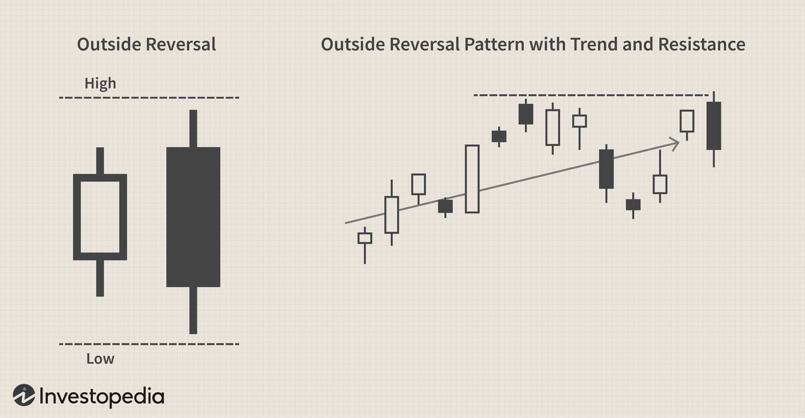

Stock trading is a complex field that requires a deep understanding of various patterns and signals. This complexity arises from the interplay of economic indicators, investor behaviors, and market dynamics. Among the tools available to traders, technical analysis stands out as a methodology for anticipating future price movements, which aids in strategic decision-making. By examining historical price data and trading volumes, traders can detect patterns that suggest potential future trends.

This article will focus on stock trading patterns, with particular emphasis on the outside reversal pattern, and its use in algorithmic trading. The outside reversal pattern is valuable for identifying potential shifts in market trends, and its implementation in trading algorithms can significantly enhance trading strategies.



A firm grasp of these patterns can enhance a trader's ability to predict market trends and optimize their trades. Understanding and accurately identifying these patterns allows traders to make more informed decisions, potentially increasing profitability and reducing risk. Whether used in manual trading or integrated into automated systems, these patterns serve as critical tools for navigating the complexities of the stock market.

## Table of Contents

## Understanding Technical Analysis

Technical analysis is a methodology used to forecast the direction of prices through the study of past market data, primarily price and volume. This approach is predicated on the notion that all relevant market information is reflected in the price, and historical price movements can give insight into future price behavior. 

Among the primary concepts in technical analysis is the identification of trendlines, which are straight lines drawn on a chart to connect specific data points, typically peaks, and troughs in price data. Trendlines help traders identify the general direction of the market, distinguishing between upward (bullish), downward (bearish), and sideways (neutral) trends. A common strategy involves buying in an upward trend and selling in a downward trend.

Another crucial element is the recognition of support and resistance levels. **Support** refers to a price level at which a downward trend can be expected to pause, due to a concentration of buying interest. Conversely, **resistance** is a price level where an uptrend is likely to pause or reverse, due to a concentration of selling interest. These levels are often used by traders to make decisions about entry and exit points. 

Beyond these linear tools, chart patterns play a fundamental role in technical analysis. Chart patterns are distinct formations created by the movements of security prices on a chart, signaling potential future price movements. Classic patterns include the head and shoulders, double tops and bottoms, and triangles, each providing predictive insights based on historical market behavior. For instance, a head and shoulders pattern is often interpreted as a sign of a potential trend reversal.

In practical terms, the application of technical analysis can provide traders with the ability to identify not just potential reversals but also continuations in price trends. A continuation pattern, such as a flag or pennant, suggests that the existing trend is likely to continue after a brief consolidation.

The use of various technical indicators further enhances the ability to interpret market conditions. Indicators like the moving average, which smooths out price data to identify the direction of the trend, and the relative strength index (RSI), which measures the magnitude of recent price changes to evaluate overbought or oversold conditions, are instrumental in this analysis. 

Technical analysis remains a powerful tool because it facilitates a disciplined and systematic approach to trading, enabling the trader to make decisions based on objective data rather than emotions. It is frequently used in conjunction with [algorithmic trading](/wiki/algorithmic-trading) systems to automate trading based on predefined technical criteria, enhancing both precision and speed in trading operations.

## Exploring Stock Trading Patterns

Stock trading patterns represent formations identified from historical price data, serving as critical indicators of potential market trends. These formations arise as representations of price relationships over time, often allowing traders to anticipate movements based on recurring patterns. Among the most commonly utilized patterns in technical analysis are the head and shoulders, triangles, and double tops.

The head and shoulders pattern is a reversal indicator, typically suggesting a change in trend direction. A standard head and shoulders pattern features three peaks, with the middle peak (the 'head') being the highest and the two outside peaks (the 'shoulders') being lower and roughly equal. This pattern indicates a potential reversal from a bullish trend to a bearish one, with the neckline acting as a critical support level. Once the price breaks below the neckline, it often signals a further downward move.

Triangles are continuation patterns that reveal a pause in the prevailing trend, followed by a [breakout](/wiki/breakout-trading). They can be categorized into ascending, descending, and symmetrical triangles. An ascending triangle consists of a horizontal resistance line and an upward-sloping support line, suggesting a bullish breakout is likely. Conversely, a descending triangle has a horizontal support line and a downward-sloping resistance line, often indicating a bearish breakout. Symmetrical triangles, with converging resistance and support lines, do not inherently favor either the bulls or the bears but foreshadow a significant breakout.

Double tops and double bottoms are reversal patterns forming at the end of a trend. A double top resembles the letter 'M' and signifies a bearish reversal following an uptrend. It consists of two peaks at approximately the same level, with a decline between them. A break below the trough confirms the bearish reversal. Conversely, a double bottom appears as a 'W', indicating a bullish reversal. It comprises two troughs at similar levels, with a peak between them, and a break above the peak typically confirms the pattern.

Recognizing such patterns allows traders to gain insights into potential future price movements, supporting more informed predictions and strategic trading decisions. Ultimately, these patterns serve as essential tools within technical analysis, guiding traders in understanding market dynamics and optimizing their trading strategies.

## In-Depth: Outside Reversal Pattern

An outside reversal pattern is a technical indicator signaling a potential change in market direction. It becomes evident when the current trading day's price range exceeds the prior day's range. This pattern is significant in predicting whether a bullish or bearish reversal might occur. The outside reversal is also commonly referred to as a bullish or bearish engulfing pattern, contingent on its position and direction within the prevailing market trend.

### Structure of the Outside Reversal Pattern

The outside reversal pattern consists of two consecutive candlesticks on a price chart:
1. The first day reflects the continuation of an existing trend. For a bullish engulfing pattern, this candle is bearish, signifying that the price closed lower than it opened. Conversely, for a bearish engulfing pattern, the initial candle is bullish, indicating a higher close than the opening price.
2. The second day's trading range completely encompasses the first day's range. For a bullish reversal, the second candle opens lower than the prior close and closes higher than the prior open, thus engulfing the previous bearish candle. In the case of a bearish reversal, the second candle opens higher than the prior close and closes lower than the prior open, engulfing the previous bullish candle.

### Significance of the Pattern

The outside reversal pattern is indicative of strong market [momentum](/wiki/momentum) in the direction of the reversal. When a bullish engulfing pattern forms, it suggests that buyers have overtaken sellers, potentially indicating the onset of an upward trend. On the other hand, a bearish engulfing pattern highlighted by an outside reversal suggests that sellers have taken control, possibly leading to a downward trend.

### Application in Trading

Traders use outside reversal patterns to make strategic decisions. Identifying these patterns can help traders anticipate price reversals, allowing them to initiate positions aligned with the new trend or [exit](/wiki/exit-strategy) positions before the trend shifts. While this pattern provides valuable insights, it is most effective when used in conjunction with other technical indicators and market analysis techniques to confirm the potential reversal.

By recognizing an outside reversal pattern, traders optimize their understanding of market dynamics and refine their predictive strategies, ultimately enhancing their trading efficacy.

## Algorithmic Trading and Pattern Recognition

Algorithmic trading utilizes advanced mathematical models and predefined algorithms to execute trading decisions at speeds and frequencies beyond human capability. This trading method is foundational to modern financial markets, where vast amounts of data are processed to capitalize on market inefficiencies. Incorporating technical analysis patterns, such as the outside reversal, enhances algorithmic strategies by providing additional metrics for entry and exit points.

The outside reversal pattern, characterized by its distinct two-day candlestick formation, is advantageous for algorithms designed to identify potential trend reversals. This pattern occurs when the trading range of the second day completely engulfs the range of the previous day, indicating a possible shift in market sentiment. Integrating such patterns into algorithmic models can improve trade accuracy by providing clear signals that align with market psychology.

Python serves as a robust tool for developing algorithmic trading strategies, allowing for the incorporation of technical analysis patterns. For instance, traders can use libraries such as Pandas and Numpy for data manipulation, while platforms like TA-Lib provide built-in functions for identifying candlestick patterns. A sample code snippet to detect an outside reversal might look as follows:

```python
import pandas as pd
import talib

# Assuming 'data' is a DataFrame with OHLC data: 'open', 'high', 'low', 'close'
data['CDL_ENGULFING'] = talib.CDLENGULFING(data['open'], data['high'], data['low'], data['close'])

# Filter signals (1 for bullish and -1 for bearish engulfing)
engulfing_signals = data[data['CDL_ENGULFING'] != 0]
```

Backtesting is a critical component in ensuring that these algorithms perform well under various market conditions. By applying the algorithm to historical data, traders can assess the strategy's effectiveness and refine it accordingly. Key performance metrics, such as the Sharpe Ratio, drawdown, and trade expectancy, guide the optimization process.

The implementation of [machine learning](/wiki/machine-learning) techniques can further enhance pattern recognition, allowing algorithms to adapt and learn from new data inputs. These advancements offer potential for improved predictive power and adaptive responses to dynamic market environments. However, the balance between algorithmic precision and market adaptability remains essential for successful and resilient trading strategies.

## Pros and Cons of Using Technical Patterns in Algo Trading

Using technical patterns in algorithmic trading offers a range of advantages. One significant benefit is the removal of emotional bias, which can often cloud judgment and lead to suboptimal trading decisions. Algorithmic trading, based on predefined criteria, allows for emotion-free execution, ensuring decisions are made purely on analytical data. This method enhances the speed of decision-making, executing trades at a pace that is unattainable by manual trading. Additionally, algorithms can swiftly recognize and act upon complex patterns in extensive data sets, outperforming human capability in pattern recognition.

However, employing technical patterns in algorithmic trading is not without its challenges. A notable concern is the risk of overfitting, where strategies are excessively tailored to historical data. This can impede their effectiveness in real-world scenarios, as the algorithm may fail to adapt to unexpected market conditions. Overfitting results from algorithms being optimized for past data, maximizing performance in [backtesting](/wiki/backtesting) but potentially underperforming when faced with new market dynamics.

Moreover, the underperformance risk during unforeseen market events is another downside. Market [volatility](/wiki/volatility-trading-strategies) and unexpected occurrences can lead to significant strategy deviations, impacting performance. To mitigate these risks, traders must strive to balance the precision of algorithmic strategies with adaptability to market changes. This involves regularly updating algorithms and incorporating diverse datasets to ensure robustness and flexibility.

Successfully integrating technical patterns into algorithmic trading demands ongoing evaluation and adjustment, ensuring strategies are well-aligned with market conditions and capable of adapting to varied environments.

## Conclusion

Mastering stock trading patterns through technical analysis is a valuable skill for traders, offering a systematic approach to understanding market dynamics. The ability to interpret patterns enables traders to evaluate potential market trends and make informed trading decisions. Implementing these patterns within algorithmic trading strategies can significantly enhance trading performance. Algorithms, designed to detect and act upon specific patterns such as the outside reversal, can swiftly execute trades based on predefined criteria, maximizing opportunities in real-time market conditions.

One of the primary advantages of algorithmic trading is its ability to process vast amounts of data efficiently. By employing technical patterns in these algorithms, traders can leverage rapid decision-making to capitalize on volatile market shifts. Here, continuous learning and adaptation become fundamental. Algorithms should be regularly updated to incorporate the latest market insights and technological advancements, ensuring they perform optimally even amidst changing market landscapes.

Successful trading lies in a trader's commitment to ongoing education and the refinement of strategies. Staying informed about new patterns or modifications to existing ones and technological developments in algorithmic trading is essential. This proactive approach helps maintain an edge in the market, adapting strategies to remain effective and relevant. As market conditions evolve, so too must the techniques used to navigate them, fostering resilience in trading methodologies and enhancing the potential for sustained success.

## References & Further Reading

[1]: Bergstra, J., Bardenet, R., Bengio, Y., & Kégl, B. (2011). ["Algorithms for Hyper-Parameter Optimization."](https://dl.acm.org/doi/10.5555/2986459.2986743) Advances in Neural Information Processing Systems 24.

[2]: ["Advances in Financial Machine Learning"](https://www.amazon.com/Advances-Financial-Machine-Learning-Marcos/dp/1119482089) by Marcos Lopez de Prado

[3]: ["Evidence-Based Technical Analysis: Applying the Scientific Method and Statistical Inference to Trading Signals"](https://www.amazon.com/Evidence-Based-Technical-Analysis-Scientific-Statistical/dp/0470008741) by David Aronson

[4]: ["Machine Learning for Algorithmic Trading"](https://github.com/stefan-jansen/machine-learning-for-trading) by Stefan Jansen

[5]: ["Quantitative Trading: How to Build Your Own Algorithmic Trading Business"](https://github.com/LucindaYa/quant-resources/blob/master/Quantitative%20Trading%20How%20to%20Build%20Your%20Own%20Algorithmic%20Trading%20Business.pdf) by Ernest P. Chan