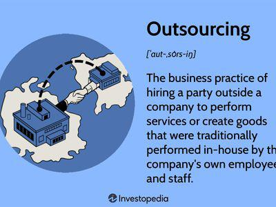

In the modern business landscape, organizations are constantly seeking strategies to manage and optimize their operations efficiently. Among these strategies, subcontracting and outsourcing have become prevalent, offering businesses the flexibility to allocate specific tasks to external specialists. This not only fosters concentration on core competencies but also enhances operational efficiency and cost-effectiveness.

Algorithmic trading, on the other hand, is an emerging force reshaping financial markets. It utilizes computer algorithms to execute trading orders at an unprecedented speed and accuracy, thus providing a competitive edge in trading environments. The integration of subcontracting and business process outsourcing (BPO) with algorithmic trading presents a compelling synergy. By outsourcing specialized functions such as algorithm development, firms can tap into external expertise, allowing them to keep pace with rapid technological advancements and focus on enhancing their strategic trading decisions.

This article examines how subcontracting and BPO intersect with algorithmic trading, showcasing how these methodologies complement each other. We explore the benefits and challenges associated with their integration, understanding that as companies embrace these approaches, they streamline operations, drive down costs, and leverage external innovations, thus fostering more agile and effective business models. Such integrations are proving crucial for companies aiming to maintain competitiveness in a swiftly evolving digital marketplace, where the optimization of resources is key to sustained growth and success.

## Table of Contents

## Understanding Subcontracting and Business Process Outsourcing

Subcontracting and business process outsourcing (BPO) are both strategic approaches employed by companies aiming to enhance their operational efficiency and focus on core competencies. Subcontracting involves delegating certain tasks or projects to an external, specialized third party. This allows organizations to utilize the expertise and resources of a subcontractor without having to invest heavily in building those capabilities in-house. For example, a manufacturing company may subcontract the assembly of specific components to a firm that specializes in that process, thereby gaining access to specialized skills and equipment that the subcontractor possesses.

Business process outsourcing, on the other hand, extends beyond individual tasks to encompass entire business processes. Companies engage third-party vendors to manage specific functions such as payroll, customer service, or information technology support, allowing the company to concentrate on its main business activities. This transfer of responsibilities can significantly reduce operational costs, as third-party vendors often operate in regions with lower labor costs or have economies of scale that lower expenses. Additionally, BPO enables organizations to benefit from the latest technologies and innovations without having to make substantial investments themselves.

Both subcontracting and BPO share the goal of reducing costs and increasing efficiency while leveraging the specialized skills and technologies that external partners offer. They are intertwined with the concept of competitive advantage, allowing firms to focus on areas where they can create the most value. By selectively using subcontracting and BPO, organizations can adapt more quickly to market changes, improve service quality, and innovate by accessing global talent pools and advanced technological solutions.

A practical example could involve a software company outsourcing its customer support services to a call center in another country. This BPO arrangement would not only cut costs but also enable the software company to allocate more resources to product development and innovation, enhancing its competitive position in the technology market. Subcontracting and BPO strategies are crucial in today's globalized economy, where agility and cost-effectiveness are key to maintaining a competitive edge.

## How Subcontracting and BPO Facilitate Efficiency in Algorithmic Trading

Algorithmic trading, which utilizes complex algorithms to execute trading decisions at high speeds and volumes, inherently demands precise calculations and timely data processing. Subcontracting and Business Process Outsourcing (BPO) play pivotal roles in enhancing the efficiency of these operations by delegating specific tasks to specialists, allowing firms to focus on their core competencies.

Subcontracting enables trading firms to offload the development of complex trading algorithms to specialized entities that possess the necessary expertise and technological resources. These subcontracted experts typically have deep knowledge of quantitative strategies, statistical models, and programming skills required to create robust algorithms that can assess multiple market variables with speed and accuracy. By outsourcing algorithm development, trading firms can gain access to cutting-edge techniques and innovations without the significant investment required to build and maintain in-house expertise.

For instance, firms can employ subcontractors to design high-frequency trading systems, backtest new strategies using historical data, or enhance algorithmic models through [machine learning](/wiki/machine-learning) techniques. These subcontractors can adjust algorithms in real time to accommodate market changes, thus providing a dynamic trading edge.

In addition to subcontracting, BPO streamlines back-end operations crucial to [algorithmic trading](/wiki/algorithmic-trading). Tasks such as data analysis and management, risk assessment, and customer service require significant resources and continuous attention. By outsourcing these functions to third-party vendors, trading firms can significantly reduce overhead costs and operational burdens.

BPO services can manage vast datasets necessary for algorithmic trading, ensuring data is processed, cleaned, and delivered efficiently for decision-making. Outsourcing risk management operations allows for comprehensive monitoring and evaluation of trading strategies, helping firms minimize exposure to undesirable market events. Additionally, customer support services can be managed more effectively, ensuring that client inquiries and needs are addressed promptly, bolstering client relationships and trust.

Overall, subcontracting and BPO provide a collaborative model where trading firms can access advanced technological capabilities and operational efficiencies, driving enhanced performance and competitive advantage in the fast-paced world of algorithmic trading.

## The Advantages of Integrating Subcontracting and BPO in Algo Trading

Outsourcing and subcontracting within algorithmic trading firms yield significant advantages, particularly in cost reduction, flexibility, scalability, and access to advanced technologies.

**Cost Reduction:** Implementing outsourcing and subcontracting strategies allows trading firms to significantly reduce labor and infrastructure expenses. By delegating non-core activities to third-party vendors, companies can operate with leaner in-house teams, sparing them the burden of maintaining large, expensive departments. Infrastructure costs can also be minimized as many service providers use cloud-based solutions, eliminating the need for extensive IT hardware investments. For instance, instead of maintaining an entire IT department, a trading firm might outsource its IT services, cutting costs associated with salaries, benefits, and office space.

**Flexibility and Scalability:** These strategies enable trading firms to swiftly adapt to shifts in market demand without substantial resource allocation. By leveraging a flexible workforce and scalable infrastructure offered by subcontractors and BPO providers, firms can efficiently adjust their operations. This adaptability is crucial in financial markets where conditions can change rapidly. For example, during a market surge, a firm can quickly scale up its algorithmic trading operations by expanding its cloud computing resources or hiring additional data analysts through BPO services, all without the delays associated with traditional hiring processes.

**Exposure to the Latest Technology:** By engaging subcontracted experts, trading firms gain access to cutting-edge technology and methodologies that bolster trading efficiency. These experts often specialize in the latest trends and advancements, such as high-frequency trading algorithms, machine learning models, and sophisticated data analytics tools. Collaborating with such specialists ensures that the firm remains at the forefront of technological innovation. By outsourcing the development of trading algorithms to a specialized firm, a company can leverage the latest advancements in artificial intelligence and machine learning, which can improve the precision and effectiveness of its trading strategies.

In conclusion, integrating subcontracting and BPO in algorithmic trading provides numerous advantages that are indispensable for maintaining a competitive edge. These strategies not only facilitate cost-effective operations but also enhance operational flexibility and technological capability.

## Challenges and Considerations

### Challenges and Considerations

**Quality Control and Compliance**: Ensuring that outsourced and subcontracted services meet high standards of quality and compliance is crucial for any business process. In algorithmic trading, errors in algorithm performance or data processing can lead to significant financial losses. Therefore, maintaining robust quality control mechanisms such as continuous monitoring and auditing of third-party services is essential. Regulatory compliance, especially in the financial industry, is non-negotiable. Algorithmic trading firms must adhere to regulations set by entities like the Securities and Exchange Commission (SEC) in the United States or the Financial Conduct Authority (FCA) in the United Kingdom. Outsourced partners must be well-versed in these regulations to ensure compliance and avoid legal repercussions.

**Dependence on Third Parties**: Relying extensively on third parties poses the risk of over-dependence, which could threaten operational stability if not managed effectively. This dependence can manifest in the form of reduced control over critical business functions and limited agility in responding to market changes. To mitigate these risks, algorithmic trading firms should adopt a strategic approach to outsourcing by engaging multiple vendors and maintaining a hybrid model that combines in-house and outsourced capabilities. This approach not only diversifies risk but also provides flexibility to adapt to changing business environments.

**Intellectual Property Risks**: Protecting sensitive data and intellectual property is a significant concern when subcontracting or outsourcing services. The algorithms used in trading are proprietary and provide a competitive edge, making their protection paramount. Unauthorized access to these algorithms by third-party vendors could result in intellectual property theft or unintentional leaks. Implementing robust data protection measures and utilizing secure communication channels are essential steps in safeguarding intellectual property. Non-disclosure agreements (NDAs) and stringent contractual clauses can be enforced to legally bind third parties to maintain confidentiality and protect proprietary information. To further enhance security, firms can use encryption and regular security audits to ensure that any transferred data remains protected during its external handling.

## Conclusion

Subcontracting and business process outsourcing (BPO) offer significant enhancements to the operational efficiency and capability of algorithmic trading firms. By reallocating specific functions to external specialists, these firms can streamline processes, reduce overhead, and tap into advanced technological expertise. The strategic empowerment derived from these outsourcing models facilitates innovation and profitability through the acquisition of specialized knowledge and capabilities that may not be economically feasible to develop in-house.

Despite the benefits, the challenges of subcontracting and BPO remain prominent. Effective partnerships require robust management to ensure quality services and compliance with industry standards. Additionally, firms must mitigate risks associated with dependency on third parties and the safeguarding of sensitive data and intellectual property. Addressing these concerns through proactive strategies and rigorous oversight can enable firms to manage their subcontracted tasks effectively.

By harnessing the potential of outsourced and subcontracted services, algorithmic trading companies can maintain a competitive edge in a dynamic digital marketplace. These processes allow firms to adapt quickly to market changes and technological advancements, ensuring sustainable growth and resilience in an industry characterized by rapid evolution and fierce competition.

## References & Further Reading

[1]: Bergstra, J., Bardenet, R., Bengio, Y., & Kégl, B. (2011). ["Algorithms for Hyper-Parameter Optimization."](https://papers.nips.cc/paper/4443-algorithms-for-hyper-parameter-optimization) Advances in Neural Information Processing Systems 24.

[2]: ["Advances in Financial Machine Learning"](https://www.amazon.com/Advances-Financial-Machine-Learning-Marcos/dp/1119482089) by Marcos Lopez de Prado

[3]: ["Evidence-Based Technical Analysis: Applying the Scientific Method and Statistical Inference to Trading Signals"](https://www.amazon.com/Evidence-Based-Technical-Analysis-Scientific-Statistical/dp/0470008741) by David Aronson

[4]: ["Machine Learning for Algorithmic Trading"](https://github.com/stefan-jansen/machine-learning-for-trading) by Stefan Jansen

[5]: ["Quantitative Trading: How to Build Your Own Algorithmic Trading Business"](https://www.amazon.com/Quantitative-Trading-Build-Algorithmic-Business/dp/1119800064) by Ernest P. Chan