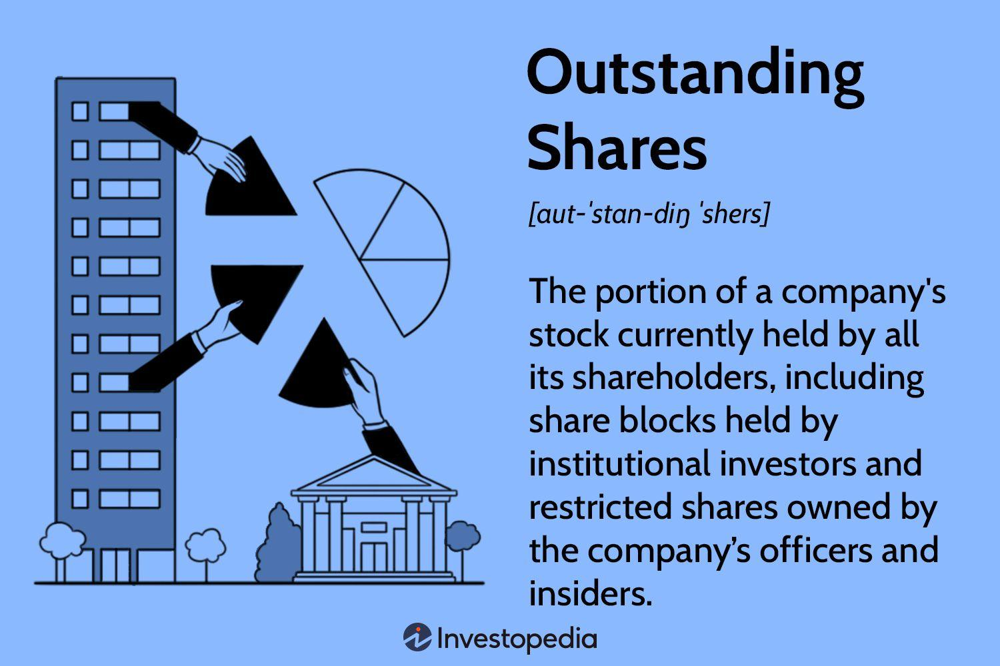

The stock market is a complex financial system where shares of publicly held companies are issued, bought, and sold. It serves as a critical platform for companies seeking capital to grow and for investors looking to gain returns. Within this market, two significant concepts are float and outstanding shares, both of which have profound impacts on investment strategies and market dynamics.

Outstanding shares represent the total number of shares a company has issued and are held by all shareholders, including institutional investors, company insiders, and the general public. This figure is crucial for calculating metrics such as earnings per share (EPS) and market capitalization. For instance, if a company has a net income of $10 million and 5 million outstanding shares, its EPS would be $2 per share.

Float, on the other hand, refers to the number of shares available for trading by the public. It excludes closely held shares by insiders, restricted stock, and shares locked up after an IPO. Float is a vital metric because it directly affects stock liquidity and price volatility; the smaller the float, the more likely a stock is to experience price swings due to low trading volumes.

Algorithmic trading, or algo-trading, is a method of executing large orders in financial markets using automated and pre-programmed trading instructions. These algorithms evaluate multiple market variables simultaneously, including float and outstanding shares, to make trading decisions with speed and precision. Algorithms can exploit price inefficiencies and make rapid market assessments that are impossible manually, enhancing both efficiency and profitability.

Understanding the interplay between float, outstanding shares, and algorithmic trading is essential for all market participants. For casual investors, recognizing these factors can inform decisions about stock liquidity and market trends. Financial professionals, however, must integrate these components into algorithmic models to optimize trading strategies and maintain a competitive edge. As modern investing becomes increasingly sophisticated, grasping these concepts allows individuals and firms to navigate the complexities of the stock market more effectively.

## Table of Contents

## Understanding Float and Outstanding Shares

Outstanding shares represent the total number of a company's shares that are held by all its stakeholders, including retail investors, institutional investors, and corporate officers. These shares are an essential metric for determining a company's market capitalization, which is calculated as the stock price multiplied by the total number of outstanding shares. The formula for calculating market capitalization is expressed as:

$$
\text{Market Capitalization} = \text{Outstanding Shares} \times \text{Stock Price}
$$

Outstanding shares encompass the entire pool of shares that a company has issued, including restricted shares and those held by insiders. They provide investors with insight into the scale of a company's equity and are crucial for calculating earnings per share (EPS) and other financial metrics.

Stock float, on the other hand, is a subset of the outstanding shares. It refers specifically to the number of shares that are freely available for public trading. This excludes restricted shares and shares held by company insiders or major shareholders, which are typically not available to the general investing public. Stock float is a significant measure because it represents the actual number of shares that are available for buying and selling in the open market, directly influencing a stock's [liquidity](/wiki/liquidity-risk-premium) and [volatility](/wiki/volatility-trading-strategies).

The primary difference between float and outstanding shares is the availability for trading. While outstanding shares include all issued shares, float focuses on those available to the public. Both metrics are important as they offer a comprehensive view of a company's share distribution and trading capacity. A larger float often correlates with higher liquidity, meaning the stock can be traded without causing significant price fluctuations. Conversely, a smaller float suggests limited availability, which can lead to greater price volatility as fewer shares are available to absorb trading [volume](/wiki/volume-trading-strategy) changes.

For example, in a scenario where a company has 10 million outstanding shares with 6 million shares held by insiders, the float would be 4 million shares. This indicates that only 4 million shares are available for public trading. The stock float's influence on liquidity is marked; with fewer shares available, any significant buying or selling activity can lead to larger price swings, affecting traders and investors. Understanding both float and outstanding shares is vital for accurate financial analysis and strategic trading decisions.

## Basics of Algorithmic Trading

Algorithmic trading refers to the use of computer algorithms to automatically execute trades in the stock market. These algorithms are designed to perform specific tasks based on predefined criteria, enabling rapid and efficient trading decisions without human intervention. Algorithmic trading plays a significant role in modern financial markets, increasing liquidity, enhancing the efficiency of trade execution, and reducing transaction costs.

The main advantages of [algorithmic trading](/wiki/algorithmic-trading) include speed, precision, and the ability to process vast amounts of data. Algorithms can analyze and react to market conditions within microseconds, significantly faster than any human trader. This speed allows them to take advantage of short-lived trading opportunities and execute large orders with minimal market impact. Furthermore, algorithmic trading enhances precision by reducing human errors that can occur due to emotional or irrational decision-making. It also processes large datasets quickly, enabling traders to identify patterns and correlations that might be invisible to humans.

A typical trading algorithm involves several key components. At its core, a trading algorithm starts with data input, which includes market data such as stock prices, volume, and news analytics. This data is then processed and analyzed according to the algorithm's predefined logic. The algorithm may employ various strategies, such as:

1. **Trend-Following Strategies**: These strategies capitalize on market momentum by analyzing trends and patterns. Algorithms might use indicators such as moving averages to make trading decisions based on the current trend direction.

2. **Arbitrage Opportunities**: Algorithms seek price differences between related securities across markets and execute trades to profit from these discrepancies, often completing the process in a fraction of a second.

3. **Market-Making Strategies**: These involve submitting buy and sell limit orders to capture the bid-ask spread. Algorithms maintain market liquidity by providing continuous quotes.

4. **Mean Reversion**: This strategy is based on the assumption that prices revert to their mean over time. If a stock is trading significantly higher or lower than its historical average, an algorithm may take a position expecting the price to return to its mean.

5. **Statistical Arbitrage**: This involves complex mathematical models to identify statistically significant trading opportunities. The algorithm calculates the probability of various outcomes to make informed trading decisions.

Overall, algorithmic trading algorithms are structured with sophisticated programming and quantitative modeling, often incorporating [machine learning](/wiki/machine-learning) techniques to improve performance over time. As financial markets continue to evolve, the reliance on algorithmic trading is expected to grow, driven by its ability to leverage technology for superior trading performance.

## How Float and Outstanding Shares Influence Algorithmic Trading

Trading algorithms, which are sets of predefined rules implemented via programming languages, consider numerous data points, including float and outstanding shares, to make informed trading decisions. These two metrics offer crucial insights into a stock’s potential liquidity and volatility, which are pivotal in forming trading strategies.

**Significance of Liquidity and Float in Algorithmic Trading**

Liquidity, the ease with which an asset can be bought or sold in the market without affecting its price, is vital in trading. Float, which is the number of shares available for trading by the public, directly influences liquidity. A higher float generally indicates greater liquidity, as more shares are available to satisfy buy and sell orders. Trading algorithms often incorporate float data to assess the liquidity of a security. If a stock has a high float, algorithms might predict lower volatility due to the abundance of shares, and thus implement more aggressive trading strategies. Conversely, a low float might lead the algorithm to anticipate higher volatility and adjust trading to account for potential price swings.

**Scenarios Triggering Algorithmic Trading Actions**

Algorithmic trading systems constantly monitor changes in float and outstanding shares to make responsive trading decisions. One typical scenario involves a company announcing a share buyback program, which reduces the float and potentially the outstanding shares. Algorithms may interpret this reduction as a signal of increased demand, possibly driving up the stock price. As a result, a trading algorithm might initiate a buy order to capitalize on the anticipated upward price movement.

Another scenario is when a company issues additional shares, increasing both float and outstanding shares. This action could dilute the existing shares' value, leading algorithms to predict a downward pressure on the stock price. Trading algorithms may respond by executing sell orders or short-selling the stock to benefit from the expected price decline.

Additionally, trading systems evaluate the float to adjust order sizes and timing to minimize market impact. For example, in stocks with low float, large orders are more likely to influence the stock price significantly. Algorithms could, therefore, break up large transactions into smaller trades and stagger them over time to prevent abrupt price changes.

Overall, the integration of float and outstanding shares data into algorithmic trading helps automate decision-making processes regarding entry, [exit](/wiki/exit-strategy), and position sizing, reflecting real-time market dynamics and optimizing trade execution.

## Benefits and Challenges of Algorithmic Trading Using Float and Outstanding Shares Data

Algorithmic trading leverages quantitative data to make investment decisions, and float and outstanding shares data are critical components of these algorithms. Utilizing float and outstanding shares data allows algorithms to enhance the precision and effectiveness of trading strategies.

### Benefits

One of the primary benefits of incorporating float and outstanding shares data in algorithmic trading is the ability to accurately assess liquidity. Float, the number of shares available for public trading, directly impacts a stock's liquidity. A larger float typically indicates higher liquidity, allowing algorithms to execute large trades with minimal market impact. This capability is critical for maintaining the efficiency of trading operations and optimizing trading costs.

Furthermore, understanding outstanding shares—the total shares issued by a company—enables algorithms to calculate valuation metrics like Earnings Per Share (EPS) more accurately. EPS can be represented as:

$$
\text{EPS} = \frac{\text{Net Income}}{\text{Outstanding Shares}}
$$

This formula highlights how changes in the denominator (outstanding shares) affect EPS, thereby influencing trading decisions driven by valuation models.

Algorithms that leverage float and outstanding shares data can quickly react to corporate actions such as stock splits, buybacks, or new share issuances. For instance, a reduction in outstanding shares due to a buyback can increase EPS, potentially making the stock more attractive to investors. Algorithmic trading can capitalize on these market developments faster than traditional trading methods.

### Challenges

Despite the advantages, there are challenges in implementing float and outstanding shares data into algorithmic trading strategies. Data accuracy is paramount; inaccurate or delayed data can lead to suboptimal trading decisions. Real-time data feeds and reliable data sources are essential to mitigate this risk.

Market volatility presents another challenge. Sudden changes in market conditions can affect stock volatility and liquidity, complicating the use of float and outstanding shares data in real-time trading algorithms. Algorithms must be sophisticated enough to adapt quickly to such changes to avoid significant losses.

Moreover, regulatory and ethical considerations cannot be overlooked. Algorithmic trading must adhere to regulations such as the Securities Exchange Commission's (SEC) rules in the U.S. [Investment and Securities Act, 1934](https://www.sec.gov/about/laws/sea34.pdf). These regulations require transparency and fair play in trading activities. Ethical considerations include ensuring that algorithms do not inadvertently manipulate market prices or disadvantage retail investors.

Incorporating float and outstanding shares data into algorithmic trading offers substantial benefits in terms of liquidity assessment, valuation accuracy, and engagement with market dynamics. Nonetheless, traders and firms must be cognizant of challenges related to data accuracy, market volatility, and regulatory compliance to harness these benefits effectively.

## Case Studies and Real-World Applications

In algorithmic trading, firms continually seek to optimize their strategies using a variety of data points, notably float and outstanding shares. These metrics offer valuable insights for making informed trading decisions.

One real-world example involves a prominent trading firm, Renaissance Technologies, which has reportedly utilized float and outstanding shares data to enhance their trading algorithms. Such firms typically integrate these metrics to evaluate stock liquidity and price movements, allowing them to make swift trading decisions. By analyzing outstanding shares, these algorithms can assess the stock's availability and potential for significant price swings under changing market conditions. Float data provides further clarity on the shares actively available for public trading, making it a critical component in assessing trade volume and price volatility.

A significant case study illustrating the impact of float changes on algorithmic trading decisions is the situation surrounding the index inclusion of certain stocks. When a stock is added to a major index, its float can be substantially affected as institutional investors, like mutual funds and ETFs, align their holdings with the index. Algorithmic traders often anticipate these changes to execute trades that capitalize on the predicted demand shifts. This kind of strategy was evident with Tesla's inclusion in the S&P 500 in December 2020, where algorithms that incorporated float data were advantageous in capturing the resultant volatility and liquidity changes. 

The lessons learned from these real-world applications emphasize the importance of dynamically updating algorithms to account for changes in float and outstanding shares. Algorithms should be designed to evaluate real-time data and adjust trading strategies accordingly. Best practices include ensuring clean and accurate data inputs and employing machine learning techniques that allow for adaptive responses to market dynamics. Additionally, maintaining a regulatory-compliant framework is crucial to ensure ethical trading practices.

Incorporating float and outstanding shares data efficiently can lead to significant gains, but it necessitates robust systems capable of processing complex datasets and adjusting strategies on-the-fly. The capability to predict market movements and liquidity changes based on these metrics remains an essential asset for algorithmic trading firms aiming to sustain a competitive edge.

## Future Trends and Developments

Predicting future trends in the intersection of float, outstanding shares, and algorithmic trading involves considering technological advancements and evolving market methodologies. The increasing integration of [artificial intelligence](/wiki/ai-artificial-intelligence) (AI) and machine learning is anticipated to significantly influence trading strategies, particularly those leveraging float and outstanding shares data.

AI and machine learning offer sophisticated data analysis capabilities, allowing for intricate modeling of market behaviors. Trading algorithms can evolve from basic rule-based systems into dynamic models that learn from historical data, adapting to new information more effectively. These technologies enhance the ability to predict price movements by analyzing patterns in float and outstanding shares, offering a competitive edge.

One emerging methodology is the use of [deep learning](/wiki/deep-learning) models like neural networks which can process large datasets to identify subtle correlations between stock metrics and market trends. For example, variational autoencoders or recurrent neural networks can model time-series data to forecast stock prices based on changes in float levels or shifts in outstanding shares. This approach is particularly useful in high-frequency trading environments where decisions must be made in milliseconds.

Another promising area is the development of quantum computing, which, although in its early stages, holds the potential to exponentially increase the processing power available for analyzing financial data. Quantum algorithms could solve complex optimization problems faster than classical computers, enhancing the precision of predictions related to float and outstanding shares.

Moreover, blockchain technology might play a crucial role in the transparency and accuracy of data related to outstanding shares and float. A decentralized ledger could ensure the immutability of this data, reducing discrepancies and facilitating real-time verification for algorithmic trading models.

The potential impact of AI and machine learning on these trading strategies is vast. They enable the development of algorithms that can adapt to market changes by continuously learning and evolving, thus improving decision-making processes. These technologies also allow for the integration of various data sources, providing a holistic view of market conditions.

Implementing these advancements, however, requires addressing challenges such as data quality and the ethical implications of algorithmic decisions. Ensuring the accuracy of input data remains critical, as any discrepancies in float or outstanding shares can lead to flawed trading outcomes. Ethical considerations involve the transparency of algorithmic operations and the potential for market manipulation, prompting regulatory bodies to develop guidelines for responsible AI use in trading.

In conclusion, the convergence of advanced technologies and sophisticated methodologies is set to transform algorithmic trading strategies that incorporate float and outstanding shares data. These developments promise enhanced accuracy, adaptability, and efficiency in financial markets, paving the way for a more informed and strategic approach to investing.

## Conclusion

In concluding the exploration of key stock market elements such as float, outstanding shares, and their relationship with algorithmic trading, several critical insights emerge. Understanding stock float and outstanding shares is paramount for both traders and investors, as these concepts significantly influence market dynamics. Float, the shares available for trading, alongside the total outstanding shares, determines a stock's liquidity and can impact price volatility—essential factors for making informed investment decisions.

Algorithmic trading leverages these metrics to execute trades with precision, speed, and efficiency. By integrating float and outstanding shares data, algorithms can assess market liquidity, adapt to changes, and execute strategies that capitalize on market opportunities. This relationship underscores the importance of having accurate and up-to-date float and outstanding shares information, which directly feeds into sophisticated trading algorithms.

Staying informed about these elements is crucial in today's rapidly evolving financial landscape. As technology advances, the intertwining of float, outstanding shares, and algorithmic trading continues to develop, offering new opportunities and challenges. Investors who grasp these concepts can craft more effective strategies, navigate market uncertainties, and potentially achieve better investment outcomes. Therefore, remaining vigilant and knowledgeable about these aspects is essential for those engaged in the stock market.

## References & Further Reading

[1]: Bergstra, J., Bardenet, R., Bengio, Y., & Kégl, B. (2011). ["Algorithms for Hyper-Parameter Optimization."](https://papers.nips.cc/paper/4443-algorithms-for-hyper-parameter-optimization) Advances in Neural Information Processing Systems 24.

[2]: ["Advances in Financial Machine Learning"](https://www.amazon.com/Advances-Financial-Machine-Learning-Marcos/dp/1119482089) by Marcos Lopez de Prado.

[3]: ["Evidence-Based Technical Analysis: Applying the Scientific Method and Statistical Inference to Trading Signals"](https://www.amazon.com/Evidence-Based-Technical-Analysis-Scientific-Statistical/dp/0470008741) by David Aronson.

[4]: ["Machine Learning for Algorithmic Trading"](https://github.com/stefan-jansen/machine-learning-for-trading) by Stefan Jansen.

[5]: ["Quantitative Trading: How to Build Your Own Algorithmic Trading Business"](https://books.google.com/books/about/Quantitative_Trading.html?id=j70yEAAAQBAJ) by Ernest P. Chan.

[6]: Securities and Exchange Commission. ["Investment and Securities Act, 1934."](https://www.sec.gov/rules-regulations/statutes-regulations).