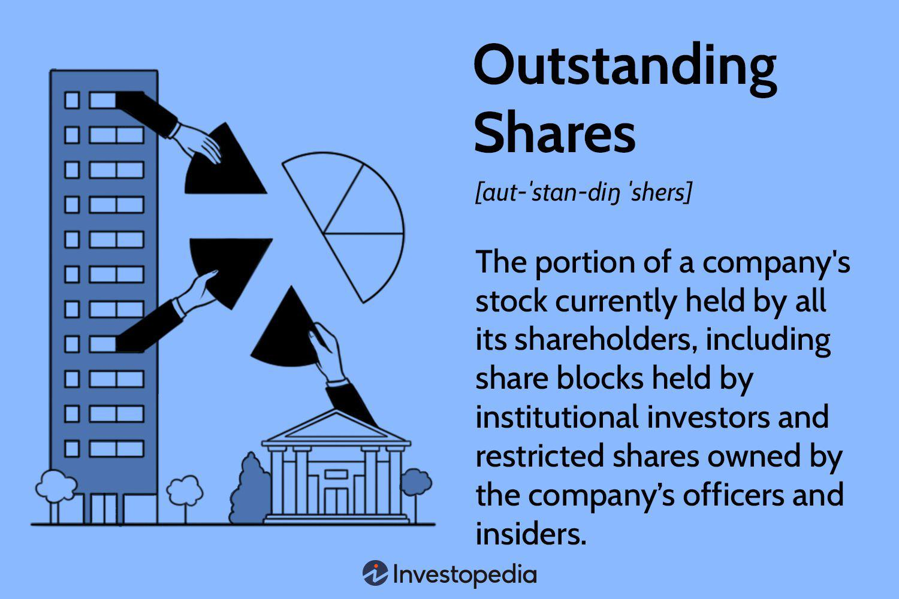

## Table of Contents

## What are outstanding shares?

Outstanding shares are the total number of shares of a company's stock that are currently owned by all its shareholders, including institutional investors, company insiders, and the public. These shares represent the ownership in the company and are used to calculate important financial metrics like market capitalization and earnings per share.

When a company first goes public, it issues a certain number of shares through an initial public offering (IPO). Over time, the number of outstanding shares can change due to actions like stock splits, buybacks, or the issuance of new shares. Keeping track of outstanding shares is important for investors because it helps them understand the value of their investment and the company's overall financial health.

## How are outstanding shares different from authorized shares?

Outstanding shares and authorized shares are two different concepts in a company's stock structure. Outstanding shares are the actual number of shares that have been issued by the company and are currently held by shareholders. These are the shares that are actively traded in the market and represent the ownership in the company. For example, if a company has issued 1 million shares to investors, then it has 1 million outstanding shares.

Authorized shares, on the other hand, are the maximum number of shares that a company is legally allowed to issue, as stated in its corporate charter. This number is set by the company's board of directors and approved by shareholders. Not all authorized shares need to be issued at once; a company might start with fewer shares and issue more later if needed. For instance, a company might have 10 million authorized shares, but only 1 million outstanding shares if it has only issued that many so far.

The key difference is that authorized shares represent a potential for future issuance, while outstanding shares are the actual shares currently in circulation. Understanding both numbers helps investors and company management make informed decisions about the company's growth and financial strategies.

## Why is the number of outstanding shares important for investors?

The number of outstanding shares is important for investors because it helps them figure out how much the company is worth. When you know the total number of shares that are out there, you can multiply that by the price of one share to get the market capitalization. This number tells investors the total value of the company in the stock market. If a company has a lot of outstanding shares, and the price per share is high, then the company is worth a lot of money.

Also, the number of outstanding shares affects how much money each share earns. This is called earnings per share (EPS). If a company makes a lot of money but has a lot of outstanding shares, each share might not earn as much. On the other hand, if there are fewer shares, each share might earn more. This is important for investors because they want to know how much money their shares are making. So, knowing the number of outstanding shares helps investors understand the value and earnings of their investment.

## How can one find out the number of outstanding shares for a publicly traded company?

You can find out the number of outstanding shares for a publicly traded company by looking at the company's financial reports. These reports are called quarterly or annual reports, and they are available on the company's website in the investor relations section. Another place to find this information is on the website of the Securities and Exchange Commission (SEC), where companies have to file their reports. On the SEC's website, look for documents like the 10-K (annual report) or 10-Q (quarterly report), which list the number of outstanding shares.

Another way to find this information is by using financial websites like Yahoo Finance, Google Finance, or Bloomberg. These websites have a lot of information about companies, including the number of outstanding shares. Just type in the company's name or stock symbol, and you can usually find a section that shows key [statistics](/wiki/bayesian-statistics), where the number of outstanding shares is listed. These websites make it easy to quickly see how many shares are out there without having to go through long reports.

## What is the significance of changes in the number of outstanding shares?

Changes in the number of outstanding shares can have a big impact on a company and its investors. If a company issues more shares, it can raise money to grow or pay off debts. But, this also means that each share is worth a smaller piece of the company. So, if you own shares, your ownership might go down a bit. On the other hand, if a company buys back its own shares, it can make each share more valuable because there are fewer shares to go around. This can be good for shareholders because their piece of the company gets bigger.

These changes also affect important numbers that investors look at, like earnings per share (EPS) and market capitalization. If a company issues more shares, the EPS might go down because the same amount of profit is spread over more shares. This can make the company look less profitable. But if the company buys back shares, the EPS might go up, making the company look more profitable. Market capitalization, which is the total value of all the shares, can also change. More shares can increase market cap if the stock price stays the same, but it can also dilute the value of each share. Understanding these changes helps investors make better decisions about buying or selling shares.

## How do stock splits and reverse stock splits affect the number of outstanding shares?

A stock split happens when a company decides to increase the number of its shares by splitting each existing share into more shares. For example, in a 2-for-1 stock split, each share you own becomes two shares. This means the total number of outstanding shares doubles. Even though you have more shares, the value of your investment stays the same because the price of each share gets cut in half. Companies do stock splits to make their shares seem cheaper and more attractive to investors, but it doesn't change the overall value of the company.

A reverse stock split is the opposite. It happens when a company decides to reduce the number of its shares by combining them. For example, in a 1-for-2 reverse stock split, every two shares you own become one share. This means the total number of outstanding shares is cut in half. The price of each share doubles to keep the value of your investment the same. Companies might do a reverse stock split to make their share price higher, which can help them meet listing requirements on stock exchanges or make the stock look more valuable to investors. Like a stock split, a reverse stock split doesn't change the overall value of the company.

## What are the methods used by companies to increase or decrease their outstanding shares?

Companies can increase their outstanding shares by issuing new shares. They might do this through a public offering, where they sell new shares to the public, or a private placement, where they sell shares to a select group of investors. Another way is through a stock split, which divides existing shares into more shares. For example, in a 2-for-1 split, each share becomes two shares. This makes the total number of shares go up, but it doesn't change the value of the company. Companies might issue new shares to raise money for growth, to pay off debts, or to make their stock more attractive to investors.

To decrease the number of outstanding shares, companies can buy back their own shares, a process called a share repurchase or buyback. They use their own money to buy shares from the market, which reduces the total number of shares out there. Another way is through a reverse stock split, where they combine existing shares into fewer shares. For instance, in a 1-for-2 reverse split, every two shares become one share. This makes the total number of shares go down, but again, it doesn't change the value of the company. Companies might do this to make their stock price higher or to increase the value of each share for their investors.

## How do share buybacks influence the number of outstanding shares?

Share buybacks, also known as stock repurchases, are when a company uses its own money to buy back its shares from the market. When a company does this, it reduces the total number of outstanding shares. For example, if a company had 1 million shares and bought back 100,000 of them, it would then have 900,000 shares outstanding. This means there are fewer shares for investors to own, which can make each share more valuable because the same amount of the company is divided into fewer pieces.

The reason companies do share buybacks can vary. Sometimes, they want to increase the value of each share, making the stock more attractive to investors. Other times, they might think their stock is undervalued and want to invest in themselves. By reducing the number of outstanding shares, the company can also increase important financial metrics like earnings per share (EPS), since the same amount of profit is now spread over fewer shares. This can make the company look more profitable and can be good for shareholders.

## What role do outstanding shares play in calculating market capitalization?

Market capitalization, or market cap, is how much a company is worth in the stock market. You can find it by multiplying the number of outstanding shares by the current price of one share. Outstanding shares are all the shares that people own in the company. So, if a company has 1 million outstanding shares and each share costs $50, the market cap would be $50 million.

Changes in the number of outstanding shares can change the market cap. If a company issues more shares, the market cap might go up if the stock price stays the same, because there are more shares to multiply by the price. But if the company buys back shares, the market cap might go down because there are fewer shares. Understanding the number of outstanding shares helps investors see how much the company is worth and how changes in shares can affect that value.

## How can the number of outstanding shares impact earnings per share (EPS)?

The number of outstanding shares directly affects earnings per share (EPS), which is a key number that shows how much money the company makes for each share of its stock. EPS is calculated by taking the company's total earnings and dividing it by the number of outstanding shares. So, if a company has a lot of outstanding shares, the EPS will be smaller because the same amount of earnings is spread out over more shares. On the other hand, if there are fewer outstanding shares, the EPS will be larger because the earnings are divided among fewer shares.

Changes in the number of outstanding shares can change the EPS. If a company issues more shares, like through a stock split or new offering, the EPS might go down because the earnings are now shared by more shares. But if a company buys back its own shares, the EPS might go up because the earnings are now shared by fewer shares. This is why investors watch the number of outstanding shares closely; it helps them understand how much money their shares are making and how the company's decisions might affect their investment.

## What are the regulatory requirements for reporting changes in outstanding shares?

Companies that are publicly traded have to follow rules from the Securities and Exchange Commission (SEC) about reporting changes in their outstanding shares. If a company issues new shares or buys back its own shares, it has to tell the SEC about it. This is done by filing special forms, like the Form 8-K, which is used to report big events that shareholders should know about. The company has to file this form quickly, usually within four business days of the change happening. This helps keep investors informed about what's going on with the company's shares.

Also, companies have to include information about their outstanding shares in their regular reports to the SEC. These reports are called the 10-Q (for quarterly reports) and the 10-K (for annual reports). In these reports, the company has to say how many shares are outstanding at the end of the quarter or year. This helps investors and the SEC keep track of the company's shares over time. By following these rules, companies make sure that everyone knows about changes in their shares, which is important for fair and open markets.

## How can advanced financial analysis tools help in tracking and predicting changes in outstanding shares?

Advanced financial analysis tools can help investors keep an eye on and guess changes in a company's outstanding shares. These tools can look at lots of data quickly, like the company's past reports and what other people are saying about the company. They can show you how many shares the company has right now and how that number has changed over time. This helps you see patterns and understand if the company often issues new shares or buys back its own shares. By looking at this information, you can make better guesses about what the company might do next with its shares.

These tools can also use special math to predict what might happen with the company's shares in the future. They can take into account things like the company's plans, what's happening in the market, and even news about the company. For example, if a company says it's going to buy back shares, the tool can help you figure out how that might change the number of outstanding shares and what it could mean for the stock price. By using these tools, investors can make smarter choices about buying or selling shares based on what they think will happen next.

## What are Locating Shares and Outstanding Shares?

Locating shares involves identifying the available shares of a company that can be freely traded on the open market. These are often referred to as "floating shares" and do not include shares that are restricted or held by insiders. A comprehensive understanding of this concept requires distinguishing between different types of shares, particularly outstanding shares. Outstanding shares represent the sum total of a company's shares that are currently held by all shareholders, including those held by institutional investors, company insiders, and those available in the marketplace.

To assess a company's valuation and gauge investor sentiment effectively, understanding the implications of outstanding shares is crucial. For instance, a company with a large number of outstanding shares might be seen as having a more diluted ownership when compared to one with fewer shares outstanding. This can impact the Earnings Per Share (EPS) calculation, which is a critical metric for evaluating the financial health and performance of a business. The formula for EPS is given by:

$$
\text{EPS} = \frac{\text{Net Income} - \text{Dividends on Preferred Stock}}{\text{Average Outstanding Shares}}
$$

Tracking changes in outstanding shares is imperative for investors, as it can influence the company's stock price and market perception. Events such as stock buybacks, where a company repurchases its own shares, reduce the number of outstanding shares and can indicate that the company's management believes their stock is undervalued. Conversely, the issuance of new shares might lead to shareholder dilution, potentially affecting the stock's market value negatively.

Investors and traders must employ several practical methods to acquire updated data on outstanding shares. Financial reports and filings, such as the quarterly and annual reports (commonly available as Form 10-Q and Form 10-K in the United States) filed with the Securities and Exchange Commission (SEC), provide detailed information about a company's share structure. Additionally, financial news outlets, investing platforms, and stock market databases also serve as resources for finding current data on shares outstanding.

By staying informed about the number and nature of outstanding shares, along with the company's strategic decisions regarding share buyback or issuance, investors can make more informed decisions, aligning their strategies with the prevailing market conditions and company practices.

 to Algorithmic Trading

Algorithmic trading, often referred to as algo trading, has revolutionized the financial markets by employing computer algorithms to execute trades at speeds and frequencies impossible for human traders. Through predefined criteria, algorithms can analyze market conditions and place trades to maximize profitability while minimizing exposure to risk. This approach is instrumental in reducing transaction costs and enhancing the speed and accuracy of trade execution.

One of the principal benefits of [algorithmic trading](/wiki/algorithmic-trading) lies in its ability to handle various strategies. Market-making, for example, involves continuously buying and selling to profit from the spread between bid and ask prices. Algorithms can maintain these operations effectively by rapidly adjusting quotes in response to market changes. Arbitrage strategies exploit price discrepancies across different markets or instruments, and with algorithms, traders can swiftly act on these fleeting opportunities before they vanish. Trend-following strategies, another popular application, can identify and capitalize on market [momentum](/wiki/momentum) by tracking price movements and patterns.

Algorithms processing large datasets to uncover trading opportunities rely heavily on a range of computational techniques. They sift through massive volumes of historical and real-time data, including pricing, trade volumes, and even sentiment analysis derived from news articles and social media. The algorithms apply filters and parameters based on trader-defined criteria to identify profitable signals or anomalies indicative of potential market movements.

Artificial intelligence (AI) and [machine learning](/wiki/machine-learning) (ML) have significantly augmented algo trading strategies. AI techniques allow for the creation of more adaptive and intelligent trading systems. Machine learning, particularly, enhances the ability of algorithms to learn from historical data and improve predictive accuracy without being explicitly programmed for every possible market scenario. Through neural networks and other learning models, these systems can generalize from past data and provide insights into complex patterns that may elude traditional analysis methods.

In essence, algorithmic trading embodies the convergence of advanced computing, statistical methods, and financial expertise, forming a crucial element in the modern trading landscape. As financial markets continue to evolve, the integration of sophisticated algorithms powered by AI and machine learning is likely to play an increasingly prominent role in the strategies of traders and investors alike.

## References & Further Reading

[1]: ["Advances in Financial Machine Learning"](https://www.amazon.com/Advances-Financial-Machine-Learning-Marcos/dp/1119482089) by Marcos Lopez de Prado

[2]: Bergstra, J., Bardenet, R., Bengio, Y., & Kégl, B. (2011). ["Algorithms for Hyper-Parameter Optimization."](https://dl.acm.org/doi/10.5555/2986459.2986743) Advances in Neural Information Processing Systems 24.

[3]: ["Evidence-Based Technical Analysis: Applying the Scientific Method and Statistical Inference to Trading Signals"](https://www.amazon.com/Evidence-Based-Technical-Analysis-Scientific-Statistical/dp/0470008741) by David Aronson

[4]: ["Machine Learning for Algorithmic Trading"](https://github.com/stefan-jansen/machine-learning-for-trading) by Stefan Jansen

[5]: ["Quantitative Trading: How to Build Your Own Algorithmic Trading Business"](https://www.amazon.com/Quantitative-Trading-Build-Algorithmic-Business/dp/1119800064) by Ernest P. Chan