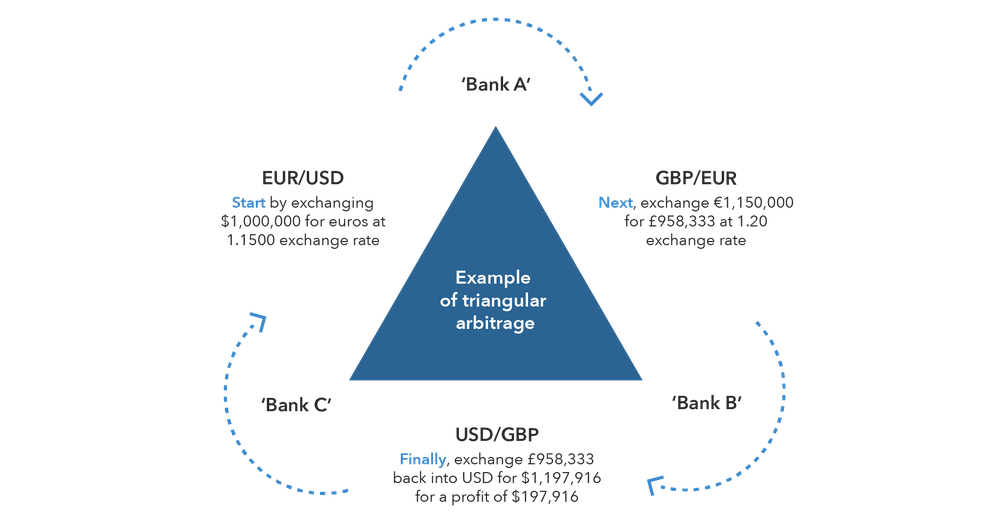

## Table of Contents

## What is arbitrage in finance?

Arbitrage in finance is when someone buys something in one place and sells it in another place for a higher price, making a profit from the difference. It's like buying a toy for $10 in one store and selling it for $15 in another store. People who do arbitrage are always looking for these price differences, which are called "arbitrage opportunities." They use computers and special software to find these opportunities quickly because they don't last long.

Arbitrage can happen with stocks, currencies, or even cryptocurrencies. For example, if a stock is trading at $100 on one stock exchange and $102 on another, someone can buy it at $100 and sell it at $102, making a $2 profit per share. This kind of trading helps keep prices the same across different markets because when people do arbitrage, they use up the price differences. However, arbitrage is not easy because it requires quick action and sometimes a lot of money to make the trades happen.

## How does outward arbitrage differ from other types of arbitrage?

Outward arbitrage, also known as spatial arbitrage, is a type of arbitrage where someone buys a product in one location and sells it in another location where the price is higher. This is different from other types of arbitrage because it involves moving the product from one place to another. For example, if apples are cheaper in one country and more expensive in another, someone might buy apples in the cheaper country, ship them to the more expensive country, and sell them there to make a profit.

Other types of arbitrage don't involve moving physical goods. For instance, in financial arbitrage, someone might buy and sell stocks or currencies without moving them physically. They just use computers to trade on different markets where the prices are different. Another type is statistical arbitrage, where traders use math and computer models to find small price differences in stocks or other financial products. Unlike outward arbitrage, these types of arbitrage focus on quick trades and don't involve shipping or transporting anything.

## Can you explain the basic mechanics of outward arbitrage?

Outward arbitrage is when someone buys something in one place where it's cheaper and then sells it in another place where it's more expensive. Imagine you find apples are cheaper in one country than another. You buy a lot of apples in the cheaper country, then you ship them to the country where apples cost more. When you sell the apples in the more expensive country, you make a profit because you sold them for more than you paid for them, even after paying for shipping.

This kind of arbitrage works because prices for the same thing can be different in different places. People who do outward arbitrage need to know a lot about the costs of buying, shipping, and selling. They also need to make sure the price difference is big enough to cover all their costs and still make a profit. If everything goes right, they can make money from the difference in prices between the two places.

## What are the common strategies used in outward arbitrage?

People who do outward arbitrage often look for big differences in prices between places. They might start by researching where things are cheaper and where they can sell them for more. For example, if electronics are cheaper in one country, they might buy a lot of them there and then sell them in another country where people will pay more. They have to be careful about the costs of shipping and any taxes or fees they might have to pay. If the price difference is big enough, they can still make money even after paying for all those extra costs.

Another strategy is to use special deals or discounts to buy things cheaper. Sometimes, stores or suppliers in one place might have sales or special offers that make their prices even lower. Arbitrageurs can take advantage of these deals to buy at a lower price and then sell at a higher price somewhere else. They also need to think about how fast they can move the goods from one place to another. If it takes too long, the price difference might go away before they can sell the goods, so timing is very important in outward arbitrage.

## What are the risks associated with outward arbitrage?

Outward arbitrage can be risky because prices can change quickly. If you buy something in one place and plan to sell it in another, the price in the selling place might drop before you get there. This means you could lose money instead of making a profit. Also, the cost of shipping can be higher than you expected, eating into your profits or even causing you to lose money. Things like taxes, customs fees, or other unexpected charges can also make outward arbitrage less profitable or even unprofitable.

Another risk is that the goods you're moving might get damaged or lost during shipping. If that happens, you won't be able to sell them and you'll lose the money you spent to buy them. There's also the risk that the laws or rules in the country where you want to sell might change. For example, they might start charging higher import taxes or ban the product you're trying to sell. All these risks mean that outward arbitrage requires careful planning and a good understanding of the markets and the costs involved.

## How can someone identify opportunities for outward arbitrage?

To find opportunities for outward arbitrage, you need to keep an eye on price differences between different places. This means checking the prices of things like electronics, clothes, or food in different countries or cities. You can use the internet to look at prices on websites or talk to people who know about prices in other places. Sometimes, special deals or sales in one place can make the price difference even bigger, so it's good to know when these happen.

Once you find a big price difference, you need to think about all the costs involved. This includes the cost of buying the product, shipping it to the place where you want to sell it, and any taxes or fees you might have to pay. If the price difference is bigger than all these costs, you might have a good opportunity for outward arbitrage. But you also need to act fast because prices can change quickly, and the opportunity might go away if you wait too long.

## What tools and technologies are essential for executing outward arbitrage?

To do outward arbitrage, you need some important tools and technologies. First, you need a good internet connection and a computer to research prices in different places. Websites and online marketplaces are really helpful for checking prices. You might also use special software that can automatically look for price differences and alert you when it finds a good opportunity. This software can save you a lot of time and help you find deals faster.

Another important tool is a way to keep track of your costs. This could be a simple spreadsheet or special accounting software. You need to know exactly how much you're spending on buying the product, shipping it, and any taxes or fees. Also, having a good relationship with shipping companies or using a reliable shipping service is key because you need to get the product from one place to another safely and quickly. Keeping all these tools and technologies in mind can help you do outward arbitrage more effectively.

## How does regulation impact the practice of outward arbitrage?

Regulation can make outward arbitrage harder. Different countries have different rules about what you can bring in and sell. Sometimes, you have to pay taxes or fees when you bring things into a country. These extra costs can make it so that the price difference isn't big enough to make a profit. Also, some countries might have rules that limit how much of something you can bring in or might even ban certain products. If you don't know these rules, you could get in trouble or lose money.

On the other hand, regulation can also help make outward arbitrage safer and more fair. Governments might set up rules to make sure everyone is playing by the same rules. This can stop people from doing things that are not fair or that could hurt the market. Knowing the regulations in both the place where you're buying and the place where you're selling is really important. It helps you plan better and avoid surprises that could mess up your arbitrage plans.

## Can you provide a case study of successful outward arbitrage?

In the early 2000s, a company called Big Box Retail saw that video game consoles were much cheaper in Japan than in the United States. They decided to buy a lot of these consoles in Japan and ship them to the U.S. to sell at a higher price. After figuring out the costs of buying the consoles, shipping them across the ocean, and paying any taxes, they found out they could still make a good profit. They bought thousands of consoles, shipped them to the U.S., and sold them in their stores. This helped them make a lot of money because the price difference was big enough to cover all their costs and still leave them with a profit.

Big Box Retail made sure to do their homework before starting. They talked to shipping companies to get the best rates and figured out how to pack the consoles so they wouldn't get damaged. They also checked the rules about bringing electronics into the U.S. to make sure they didn't have any surprises. By doing all this, they were able to take advantage of the price difference between Japan and the U.S. and make a successful outward arbitrage. This case shows that with careful planning and understanding of costs and regulations, outward arbitrage can be very profitable.

## What are the ethical considerations in outward arbitrage?

Outward arbitrage can be tricky when it comes to doing the right thing. One big issue is that it can sometimes hurt the people in the place where you're buying the product. If you buy a lot of something in one place and take it away to sell somewhere else, it might make it harder for people in that first place to get what they need. They might have to pay more or might not be able to find it at all. It's important to think about how your arbitrage might affect the people where you're buying from.

Another thing to think about is if you're following all the rules. Sometimes, people might try to get around taxes or fees to make more money. This isn't fair and can cause problems for everyone. It's better to be honest and follow the laws in both the place where you're buying and the place where you're selling. This way, you're doing arbitrage the right way and not hurting anyone or breaking any rules.

## How does global economic policy affect outward arbitrage opportunities?

Global economic policies can change the opportunities for outward arbitrage. When countries change their rules about trade, like putting up or taking down tariffs, it can make things cheaper or more expensive in different places. If a country lowers its tariffs on imported goods, it might make those goods cheaper there, so someone could buy them in another country and sell them there for a profit. But if a country raises its tariffs, it could make the goods more expensive and close the price difference, making arbitrage harder.

Also, economic policies like currency controls can affect arbitrage. If a country changes how its money works with other countries' money, it can change the prices of things. For example, if a country's money becomes weaker, things from that country might be cheaper for people in other countries. This could create a chance for arbitrage. But if a country puts strict rules on moving money in and out, it might be harder to do arbitrage because you can't easily buy things in one place and sell them in another. So, keeping an eye on global economic policies is important for finding and using arbitrage opportunities.

## What advanced techniques can experts use to enhance their outward arbitrage strategies?

Experts can use advanced techniques like data analytics to find better outward arbitrage opportunities. They can use special software to look at a lot of price data from different places quickly. This helps them spot price differences that might be hard to see otherwise. They can also use machine learning to predict how prices might change in the future. This can help them decide when to buy and sell to make the most profit. By using these tools, experts can find more opportunities and make better decisions about when and where to do arbitrage.

Another technique is to use supply chain optimization. This means finding the best ways to move goods from one place to another. Experts can work with shipping companies to get the best rates and make sure the goods get to where they need to go quickly and safely. They can also use real-time tracking to know exactly where their goods are at all times. This helps them plan better and make sure they can sell the goods before the price difference goes away. By optimizing the supply chain, experts can make their outward arbitrage strategies more efficient and profitable.

## What are the types of arbitrage strategies?

Arbitrage strategies are varied and cater to different market conditions and opportunities. This section outlines some of the main types, illustrating how traders can leverage price discrepancies for profit.

**Spatial Arbitrage**

Spatial arbitrage capitalizes on the price differences of the same security traded on different exchanges. This type of arbitrage requires traders to buy the security from the market where it is undervalued and sell it where it is overvalued. For example, if a stock is priced at $100 on Exchange A and $102 on Exchange B, a trader can profit by purchasing it on Exchange A and selling it on Exchange B. The critical [factor](/wiki/factor-investing) in spatial arbitrage is the ability to execute transactions swiftly to take advantage of fleeting price discrepancies.

**Statistical Arbitrage**

Statistical arbitrage is a more complex strategy that utilizes quantitative methods and computational models to identify pricing inefficiencies between related financial instruments. This strategy involves the use of statistical models to forecast the expected price movements of a broad array of stocks or other assets. These models are based on historical data and rely on techniques such as time series analysis or [machine learning](/wiki/machine-learning). For instance, if a statistical model predicts a temporary price deviation of a stock pair, traders can exploit this by opening long and short positions respectively, anticipating a return to their predicted mean values.

**Merger Arbitrage**

Merger arbitrage exploits the price fluctuations resulting from mergers and acquisitions. When a merger or acquisition is announced, the stock price of the target company typically rises, while the price of the acquiring company might fluctuate depending on the terms of the deal. Traders engage in merger arbitrage by buying the stock of the target company and, in some cases, shorting the stock of the acquiring company. The objective is to profit from the difference between the acquisition price and the current market price. However, this strategy carries the risk of the deal not going through, which can lead to potential losses.

**Covered Interest Arbitrage**

Covered interest arbitrage involves taking advantage of [interest rate](/wiki/interest-rate-trading-strategies) differentials between countries while hedging against exchange rate risk. Traders use forward contracts to lock in an exchange rate for converting currency in the future to mitigate risk. The strategy entails borrowing in a low-interest-rate currency and investing in a high-interest-rate currency. Suppose the interest rate in the domestic market is lower than that in the foreign market; a trader can borrow domestically, convert to the foreign currency, invest at the higher rate abroad, and then use a forward contract to convert back to the domestic currency at maturity. The profit is determined by the interest rate differential after accounting for the cost of the forward contract:

$$
\text{Profit} = \left( \frac{1 + r_f}{F} - \frac{1 + r_d}{S} \right) \times \text{Principal Amount}
$$

where $r_f$ is the foreign interest rate, $F$ is the forward exchange rate, $r_d$ is the domestic interest rate, and $S$ is the spot exchange rate. Covered interest arbitrage is a strategy that combines elements of financial engineering and risk management, offering potential gains while minimizing currency exposure.

## References & Further Reading

[1]: ["Advances in Financial Machine Learning"](https://www.amazon.com/Advances-Financial-Machine-Learning-Marcos/dp/1119482089) by Marcos Lopez de Prado

[2]: ["Machine Learning for Algorithmic Trading"](https://github.com/stefan-jansen/machine-learning-for-trading) by Stefan Jansen

[3]: ["Quantitative Trading: How to Build Your Own Algorithmic Trading Business"](https://www.amazon.com/Quantitative-Trading-Build-Algorithmic-Business/dp/1119800064) by Ernest P. Chan

[4]: Hasbrouck, J. (2003). ["Intraday Price Formation in U.S. Equity Markets."](https://onlinelibrary.wiley.com/doi/10.1046/j.1540-6261.2003.00609.x) The Journal of Finance, 58(6), 2375-2402.

[5]: Aldridge, I. (2013). ["High-Frequency Trading: A Practical Guide to Algorithmic Strategies and Trading Systems,"](https://books.google.com/books/about/High_Frequency_Trading.html?id=6l0DDQAAQBAJ) 2nd Edition. Wiley Trading.