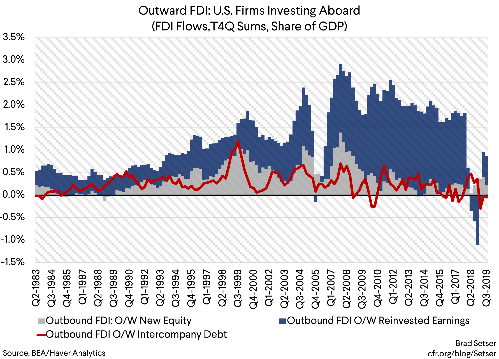

## Table of Contents

## What is Outward Direct Investment (ODI)?

Outward Direct Investment (ODI) is when a company from one country invests in a business or starts a new business in another country. It's like a company reaching out to grow its business in different parts of the world. This can happen by buying a company in another country, building new factories, or starting new projects abroad.

ODI helps companies expand their markets and reach more customers. It can also help them get resources or technology that might be cheaper or better in other countries. By doing this, companies can grow bigger and make more money. However, ODI can also be risky because it involves dealing with different laws, cultures, and economic conditions in other countries.

## How does ODI differ from Foreign Direct Investment (FDI)?

Outward Direct Investment (ODI) and Foreign Direct Investment (FDI) are two sides of the same coin but from different perspectives. ODI happens when a company from one country, let's call it the home country, invests in a business or starts a new business in another country, known as the host country. It's about the home country's companies reaching out to grow their business abroad.

On the other hand, Foreign Direct Investment (FDI) is seen from the host country's perspective. It's when a company from another country, the home country, comes to the host country to invest in a business or start a new one there. So, what is ODI for the home country is FDI for the host country. Both involve moving money and resources across borders, but they describe the same action from opposite viewpoints.

## What are the main motivations for companies to engage in ODI?

Companies engage in Outward Direct Investment (ODI) mainly to grow their business and reach new customers. When a company from one country invests in another country, it can sell its products or services to people there. This helps the company make more money because it can now sell to a bigger market. For example, a car company from Japan might build a factory in the United States to sell cars to American customers.

Another big reason for ODI is to get resources or technology that might be cheaper or better in other countries. A company might find that raw materials, like oil or minerals, are cheaper in another country. By setting up a business there, the company can save money on these resources. Also, some countries have advanced technology that a company wants to use. By investing in those countries, the company can use this technology to improve its products or services.

However, ODI is not without risks. Companies have to deal with different laws, cultures, and economic conditions in the countries where they invest. These can be challenging to navigate. Despite the risks, the potential benefits of reaching new markets and accessing valuable resources often make ODI an attractive option for companies looking to grow and expand.

## Can you provide examples of historical ODI activities?

One famous example of ODI is when Japanese car companies like Toyota and Honda started building factories in the United States in the 1980s. They wanted to sell cars to American customers without having to pay high shipping costs from Japan. By building factories in the U.S., they could make cars closer to where they were sold, which saved them money and helped them sell more cars.

Another example is when European companies invested in Africa during the colonial period. Countries like Britain and France set up businesses in their colonies to get resources like rubber, oil, and minerals. These resources were often cheaper in Africa, so the companies could make more money by using them. This kind of ODI helped European companies grow bigger and richer, but it also had big effects on the countries where they invested.

In more recent times, Chinese companies have been investing a lot in countries like Australia and Brazil. They are looking for resources like iron ore and copper, which are important for making things like cars and buildings. By setting up businesses in these countries, Chinese companies can get these resources more easily and help their economy grow.

## What are the economic impacts of ODI on the home country?

When companies from a country invest in other countries through Outward Direct Investment (ODI), it can have both good and bad effects on their home country. On the positive side, ODI can help the home country's economy grow. When companies make money from their investments abroad, they often bring some of that money back home. This can create more jobs and help other businesses in the home country grow. Also, when companies learn new ways of doing things in other countries, they can bring those ideas back home and make their businesses better.

However, ODI can also have some negative effects on the home country. When companies invest a lot of money abroad, they might take money away from the home country. This can make it harder for businesses at home to get the money they need to grow. Also, if companies move jobs to other countries, it can mean fewer jobs at home. This can be tough for people who lose their jobs and for the home country's economy. So, while ODI can help companies grow and bring new ideas home, it can also take money and jobs away from the home country.

## How do government policies influence ODI?

Government policies can have a big impact on how much companies from a country want to invest in other countries through Outward Direct Investment (ODI). If the government makes it easy for companies to invest abroad, like by giving them money or helping them with rules in other countries, more companies might choose to do ODI. For example, if a government offers tax breaks for companies that invest abroad, those companies might be more likely to do so because it saves them money. Also, if the government makes special deals with other countries, it can make it easier for companies to invest there.

On the other hand, if the government puts a lot of rules or restrictions on ODI, it can make companies think twice about investing abroad. For instance, if the government says companies need to ask for permission before they can invest in another country, it might take a long time and be hard to get that permission. This can make companies decide not to do ODI because it's too much trouble. So, government policies can either help or hurt ODI, depending on whether they make it easier or harder for companies to invest abroad.

## What role do multinational corporations play in ODI?

Multinational corporations are big companies that do business in many different countries. They play a big role in Outward Direct Investment (ODI) because they often invest a lot of money in other countries. When a multinational corporation decides to build a factory or start a business in another country, it's doing ODI. This helps the company grow bigger and reach more customers in different parts of the world. For example, a big tech company from the United States might build a new office in India to sell its products there. This is ODI because the company is investing money from its home country into another country.

These corporations also help spread technology and skills from their home country to other countries. When they invest in new places, they often bring new ways of doing things and new technology with them. This can help the countries where they invest grow and develop. However, multinational corporations also take money and jobs away from their home country when they invest abroad. So, while they help their own business grow, they can have both good and bad effects on the economies of the countries they invest in and their home country.

## How has the trend of ODI evolved over the past century?

Over the past century, the trend of Outward Direct Investment (ODI) has grown a lot. In the early 1900s, ODI was mostly done by big companies from rich countries like the United States and Europe. They invested in places like Africa and Asia to get resources like oil and minerals. After World War II, more countries started to do ODI. Japan and later South Korea became big players in ODI, especially in the car and electronics industries. They built factories in other countries to sell their products to more people.

In recent decades, the trend of ODI has changed even more. China has become a major player in ODI, investing a lot in countries like Australia and Brazil to get resources like iron ore and copper. At the same time, technology companies from the United States and Europe have been investing in places like India and Southeast Asia to reach new customers and use the skills of people there. The rise of globalization and better technology has made it easier for companies to invest in other countries, making ODI a bigger part of the world economy than ever before.

## What are the risks associated with ODI?

When companies invest in other countries through Outward Direct Investment (ODI), they face many risks. One big risk is the difference in laws and rules. Each country has its own set of laws that can be hard to understand and follow. If a company breaks these laws, it can get into trouble and lose money. Another risk is the political situation in the country where they invest. If there's a war or a change in government, it can make it hard for the company to do business there. Also, the economy of the country can change, making it harder for the company to make money.

Another risk is the cultural difference. People in different countries have different ways of doing things, and this can make it hard for a company to work well in a new place. For example, what works in one country might not work in another because of different customs and traditions. Currency risk is also a big problem. If the value of the money in the country where the company invests goes down, the company can lose a lot of money. So, while ODI can help companies grow and reach new customers, it comes with many risks that they need to be careful about.

## How do international agreements and treaties affect ODI?

International agreements and treaties can make it easier for companies to do Outward Direct Investment (ODI). These agreements often set rules that help companies invest in other countries without too much trouble. For example, a treaty might say that a country can't treat companies from another country unfairly. This makes companies feel safer about investing their money abroad because they know they will be treated fairly. Also, some agreements help companies move their money in and out of other countries more easily, which is important for ODI.

However, these agreements can also make things harder for ODI. Sometimes, treaties have rules that limit what companies can do in other countries. For example, a country might have rules about how much of a business a foreign company can own. These rules can make it harder for companies to invest in that country. So, while international agreements can help ODI by making it easier and safer, they can also create challenges by putting limits on what companies can do.

## What are the current global patterns and statistics of ODI?

In recent years, Outward Direct Investment (ODI) has grown a lot around the world. Big countries like the United States, China, and Japan are still the main players in ODI. The United States invests a lot in Europe and Asia, while China is putting more money into Africa and Latin America. Europe also does a lot of ODI, with countries like Germany and the United Kingdom investing in other parts of the world. Technology and manufacturing companies are leading the way in ODI, looking for new markets and resources to help their businesses grow.

However, the amount of ODI can change because of things like the economy and politics. For example, during the COVID-19 pandemic, ODI went down because companies were worried about the future. But as things got better, ODI started to go up again. In 2022, global ODI reached about $1.6 trillion, which is a lot of money. This shows that even though there are risks, many companies still see ODI as a good way to grow their business and reach new customers around the world.

## What advanced strategies can companies use to optimize their ODI?

Companies can optimize their Outward Direct Investment (ODI) by carefully choosing where to invest. They should look for countries with growing economies and good business conditions. For example, a company might use data and research to find out which countries have a lot of people who want to buy their products. They can also look for places where it's easy to do business, like countries with clear laws and good infrastructure. By [picking](/wiki/asset-class-picking) the right countries, companies can make more money from their investments.

Another strategy is to work with local partners in the countries where they invest. This can help companies understand the local culture and business rules better. For example, a company might team up with a local business to share knowledge and resources. This can make it easier to start and run a business in a new country. Also, companies can use technology to manage their investments better. They can use tools like data analytics to track how their investments are doing and make smart decisions about where to put their money next. By using these strategies, companies can make their ODI more successful and grow their business around the world.

## References & Further Reading

[1]: Barry Eichengreen and David Leblang. ["Capital Flows and Capital Flight in the East Asian Crisis."](https://www.bis.org/events/conf060619eichengreen.pdf) National Bureau of Economic Research, 2000.

[2]: Dunning, John H. ["Multinational Enterprises and the Global Economy."](https://books.google.com/books/about/Multinational_Enterprises_and_the_Global.html?id=Hz6S4BGmGxUC) Addison-Wesley Publishers Ltd., 1993.

[3]: Hull, John C. ["Options, Futures, and Other Derivatives."](https://www.pearson.com/en-us/subject-catalog/p/options-futures-and-other-derivatives/P200000005938/9780136939917) Pearson Education, 2018.

[4]: Joseph E. Stiglitz. ["Globalization and its Discontents Revisited: Anti-Globalization in the Era of Trump."](https://books.google.com/books/about/Globalization_and_Its_Discontents_Revisi.html?id=3skpDwAAQBAJ) W.W. Norton & Company, 2017.

[5]: Sneader, Kevin and Jonathan Woetzel. ["China and the world: Inside the dynamics of a changing relationship."](https://www.mckinsey.com/featured-insights/china/china-and-the-world-inside-the-dynamics-of-a-changing-relationship) McKinsey Global Institute, 2019.

[6]: Pietro Veronesi. ["Handbook of Fixed-Income Securities."](https://onlinelibrary.wiley.com/doi/book/10.1002/9781118709207) Wiley, 2016.

[7]: Ren, Jerry. ["Algorithmic Trading and DMA: An introduction to direct access trading strategies,"](https://archive.org/details/algorithmictradi0000john) 4Myeloma Press, 2009.