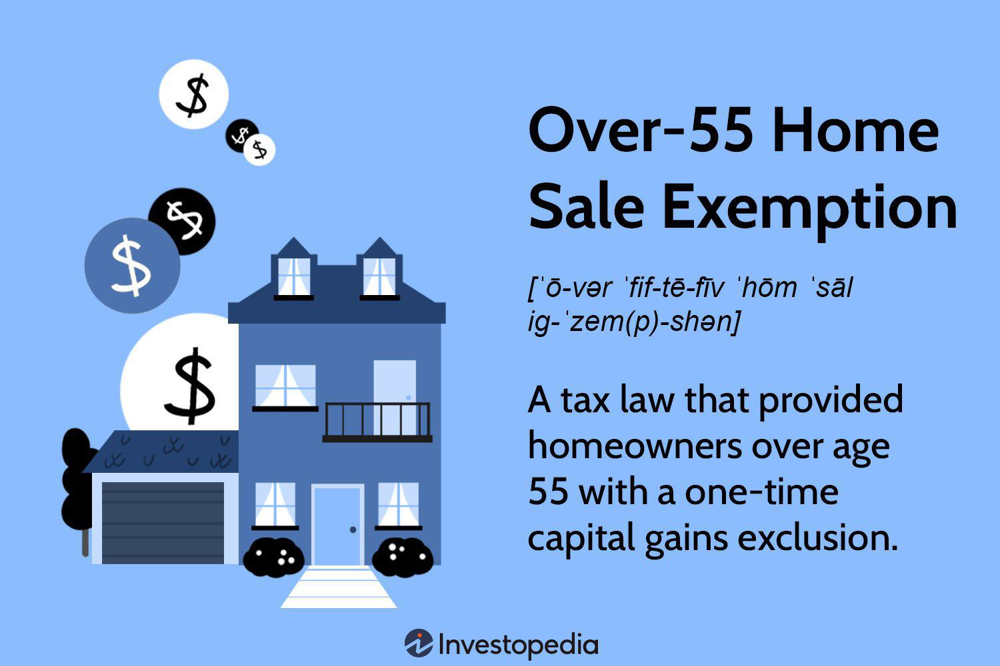

Capital gains tax is a crucial element in the examination of financial gains derived from the sale of assets, including real estate. One significant focus within this realm is the tax implications associated with home sales, particularly the exclusions available to homeowners. Historically, the Over-55 Home Sale Exemption played a pivotal role in shaping real estate transactions. Prior to its elimination, this exemption allowed homeowners over the age of 55 to exclude a one-time capital gain from the sale of their primary residence, up to a specified limit, thus facilitating a more favorable financial outcome for senior citizens engaging in real estate transactions. The intent was to provide financial relief to older adults who were downsizing or relocating in retirement. However, the introduction of the Taxpayer Relief Act of 1997 marked the obsolescence of the Over-55 Exemption, bringing about a new regime of home sale tax exclusions that are more comprehensive and inclusive for taxpayers regardless of age.

Concurrently, the landscape of investing has been revolutionized by the advent of algorithmic trading. Defined as the utilization of computer algorithms to execute trades at speeds and frequencies that human traders cannot replicate, algorithmic trading has become a cornerstone of modern financial markets. Its relevance is underscored by its ability to enhance efficiency, minimize trading costs, and exploit market opportunities through sophisticated data analysis and processing in real-time. Algorithmic trading's prominence in the financial ecosystem necessitates consideration of its tax implications, especially concerning capital gains.



The interplay between tax planning and trading strategies offers fertile ground for optimizing financial outcomes. Effective tax planning involves a strategic approach to utilizing available tax exemptions and deductions to minimize liability. For homeowners, this could mean leveraging home sale exclusions to maximize after-tax returns from real estate transactions. For traders, integrating tax considerations into algorithmic strategies could include structuring trades to minimize short-term capital gains taxes or exploring tax-loss harvesting strategies. Understanding these dynamics allows individuals and businesses to craft informed and strategic financial plans that respond adeptly to the evolving tax codes and investment technologies.

## Table of Contents

## Historical Overview of the Over-55 Home Sale Exemption

The Over-55 Home Sale Exemption was a significant element within U.S. tax policy designed to provide financial relief to homeowners over the age of 55. Implemented to ease the transition for older Americans downsizing or relocating, it allowed eligible homeowners to exclude a portion of the capital gain from the sale of their primary residence from taxable income.

To qualify for this exemption, homeowners had to meet specific conditions. Primarily, at least one of the homeowners needed to be 55 years old or older at the time of sale. Moreover, the exemption could only be claimed once per lifetime, necessitating careful planning by homeowners to maximize its benefits. The property in question also needed to have been the primary residence of the homeowner for at least two of the five years preceding the sale.

The rationale behind this policy can be traced back to socio-economic trends observed in the United States during its implementation. As the population aged, there was a growing need for policies that addressed the financial concerns of older citizens. The exemption provided a means to alleviate the potential financial burden of relocating, often a necessity due to changes in health, mobility, or financial circumstances.

However, the Over-55 Home Sale Exemption was replaced by a more inclusive policy under the Taxpayer Relief Act of 1997. This legislative change introduced a new exclusion system, allowing a $250,000 gain exclusion for single filers and $500,000 for joint filers on the sale of a primary residence, applicable to homeowners of any age. The shift aimed to simplify tax regulations around home sales and provide more universal benefits to a broader segment of the population. The replacement recognized that housing mobility and downsizing were not solely issues for the elderly, making home sale tax exclusions more equitable across different age groups. 

The abolition of the one-time use limitation and the introduction of recurring eligibility every two years offered expanded flexibility and benefits under the new law, aligning tax policy with evolving demographic needs and fostering economic mobility.

## Modern Home Sale Capital Gains Tax Exclusions

The current home sale capital gains tax exclusions, established under the Taxpayer Relief Act of 1997, signify a pivotal shift from previous exemptions and provide substantial benefits for eligible homeowners. Prior to 1997, the Over-55 Home Sale Exemption allowed individuals 55 years or older a one-time exclusion of capital gains up to $125,000 from the sale of their primary residence. This was a significant, albeit restrictive, benefit given the age constraint and the one-time usage condition. 

Post-1997 reforms largely liberalized these exclusions. Currently, homeowners can exclude up to $250,000 of capital gains if single, and up to $500,000 if married filing jointly, from the sale of their primary residence. This change not only increased the exclusion amounts but abolished the age restriction, thereby broadening the scope of eligible sellers. Additionally, the once-in-a-lifetime provision was removed, allowing homeowners to claim this exclusion multiple times, provided certain conditions are met. 

Eligibility for the present-day exclusion rests on two principal requirements: the ownership and use test. The homeowner must have owned and used the home as their primary residence for at least two of the five years preceding the sale. Moreover, the exclusion can be claimed only once every two years. These conditions ensure that the benefits are targeted towards genuine homeowners rather than investors or frequent traders. 

These rules have had varied effects on different demographics. Younger homeowners, who may move more frequently due to career or lifestyle changes, benefit from the ability to claim the exclusion repeatedly under the new rules. Conversely, older homeowners, while previously constrained by age limits, now enjoy greater flexibility and financial gain from selling their properties without heavy tax repercussions. Additionally, these tax exclusions provide significant relief for low- to middle-income homeowners who may not have substantial capital beyond their property's value. 

In conclusion, the restructuring of home sale capital gains tax exclusions has expanded financial benefits for a broader range of homeowners, supporting greater mobility and easing the tax burdens associated with selling one's primary residence.

## Algorithmic Trading: A New Era in Investing

Algorithmic trading refers to the use of computer programs and algorithms to execute trades in financial markets. These automated systems are designed to follow a set of predefined rules or instructions, such as timing, price, or quantity, to make decisions and execute trading strategies. With the advancement of technology and the increase in market complexity, [algorithmic trading](/wiki/algorithmic-trading) has become a dominant force in the financial industry.

### Benefits of Algorithmic Trading in the Modern Financial Landscape

Algorithmic trading offers several advantages over traditional manual trading. It can process vast amounts of data much faster than a human, enabling traders to capitalize on fleeting market opportunities. This speed is crucial, especially in high-frequency trading, where trades are executed in fractions of a second. Additionally, algorithmic trading minimizes human emotion and error in trading decisions, allowing for more precise execution. It also facilitates [backtesting](/wiki/backtesting), enabling traders to test their strategies against historical market data to identify profitability and risks before actual trading.

### Potential Tax Implications and Considerations in Using Algo Trades

While algorithmic trading provides numerous benefits, it introduces specific tax considerations. Traders using these strategies must navigate complex tax regulations, particularly concerning short-term capital gains. Short-term trades, typically held for less than a year, are taxed at higher rates than long-term investments. Therefore, traders must plan to mitigate these tax implications, potentially through strategic loss harvesting or offsetting gains with losses to reduce taxable income.

### Case Studies and Examples of Successful Algorithmic Trading Strategies

There have been numerous instances where algorithmic trading strategies have proven successful. One notable example is statistical [arbitrage](/wiki/arbitrage), where traders profit from price discrepancies between linked equities that typically trade in correlation. Algorithms can identify and exploit these temporary market inefficiencies at a speed unattainable by human traders.

Python, among other programming languages, is often used to develop these strategies. A simple example of a mean-reversion strategy in Python might look like this:

```python
import pandas as pd
import numpy as np

def mean_reversion_strategy(prices, window=10, threshold=1.5):
    rolling_mean = prices.rolling(window=window).mean()
    rolling_std = prices.rolling(window=window).std()

    z_scores = (prices - rolling_mean) / rolling_std

    buy_signals = z_scores < -threshold
    sell_signals = z_scores > threshold

    return buy_signals, sell_signals

# Example usage with a DataFrame 'df' containing stock prices
buy, sell = mean_reversion_strategy(df['Close'])
print("Buy signals:\n", buy)
print("Sell signals:\n", sell)
```

This code identifies buy and sell signals based on the statistical concept of mean reversion, aiming to buy when the price is sufficiently below the mean and sell when it's sufficiently above.

Algorithmic trading continues to reshape the landscape of financial markets, driving innovations and efficiencies while presenting new challenges in terms of regulation and taxation. As technology progresses, the role of algorithms is expected to expand further, demanding continuous adaptation and vigilance from market participants.

## Strategic Tax Planning for Homeowners and Traders

Strategic tax planning is essential for both homeowners looking to optimize their financial outcomes when selling properties and traders aiming to manage capital gains effectively. Integrating tax planning into financial strategies requires a thorough understanding of tax laws, available exemptions, and strategic investment practices.

### Tax-Saving Opportunities and Pitfalls for Homeowners

The sale of a primary residence can result in significant capital gains, making it crucial for homeowners to be aware of current tax exclusions. As of today, the IRS allows homeowners to exclude up to $250,000 of capital gains ($500,000 for married couples filing jointly) from taxation, provided certain conditions are met. These include having owned and used the home as a primary residence for at least two of the five years preceding the sale.

Potential pitfalls include failing to meet residency requirements, which can lead to the entirety of the capital gains being subject to tax. Furthermore, homeowners should be cautious of substantial improvements and repairs, as only certain expenses can be added to the home's basis, affecting the taxable gain. Proper documentation is necessary to maximize these adjustments, ensuring that all qualifying costs are accounted for.

### Optimizing Capital Gains Taxes through Algorithmic Trading

Algorithmic trading can provide investors with precise control over large numbers of trades, potentially influencing capital gains outcomes. Taxes in trading are primarily concerned with the classification of gains as either short-term or long-term, with different tax rates applied to each. For 2023, short-term capital gains are taxed as ordinary income, while long-term gains on assets held for more than one year benefit from reduced tax rates, typically ranging from 0% to 20%.

Traders can employ strategies within algorithmic trading to defer taxes and favorably classify gains:

1. **Tax-Loss Harvesting:** Algorithms can automatically identify and execute trades that realize losses, offsetting gains to reduce taxable income.

2. **Optimal Holding Period Management:** Algorithms can be designed to track holding periods, scheduling trades to ensure gains qualify for long-term rates whenever advantageous.

3. **Trade Timing and Batch Processing:** By consolidating transactions and executing them at specific intervals, algorithmic trading can reduce transaction costs and optimize tax outcomes.

```python
def calculate_tax_gain(cost_basis, sale_price, tax_exemption_single=250000, tax_exemption_joint=500000, filing_status='single'):
    capital_gain = sale_price - cost_basis

    if filing_status == 'single':
        taxable_gain = max(0, capital_gain - tax_exemption_single)
    elif filing_status == 'joint':
        taxable_gain = max(0, capital_gain - tax_exemption_joint)
    else:
        raise ValueError("Invalid filing status")

    # Assuming a simplified tax rate calculation for the example
    tax_rate = 0.15 if taxable_gain > 0 else 0
    tax_due = taxable_gain * tax_rate
    return tax_due

# Example: calculate tax due if single, with a cost basis of $300,000 and a sale price of $600,000
print(calculate_tax_gain(300000, 600000))  # Output: $5250
```

### Leveraging Tax Exclusions to Maximize Financial Benefits

Homeowners and traders alike should be strategic about utilizing tax exclusions to enhance financial benefits. For homeowners, this means planning home sales around qualifying for exemptions and ensuring all eligibles are claimed. For traders, designing algorithms that implement tax-efficient strategies can result in significant savings.

Ultimately, informed tax planning requires staying updated on evolving tax laws, consulting professionals when needed, and leveraging technology to maximize financial outcomes. The combination of thorough planning and the strategic use of tools such as algorithmic trading can significantly enhance the financial stance of both homeowners and traders.

## Scenario Analysis

### Scenario Analysis

The comparison between the Over-55 Home Sale Exemption and the current home sale capital gains tax exclusions reveals significant differences in financial impacts across various demographics. The Over-55 Exemption, prior to the Taxpayer Relief Act of 1997, allowed individuals over the age of 55 to exclude up to $125,000 of capital gains from the sale of a primary residence, provided specific conditions were met. Today, under the current exclusions introduced post-1997, homeowners can exclude up to $250,000 ($500,000 for married couples filing jointly) of capital gains from the sale of their primary residence. This modern rule applies regardless of the homeowner's age but requires that the homeowner has used the property as their main home for at least two of the five years preceding the sale.

#### Financial Impact Analysis for Homeowners

For homeowners aged 55 and older, the shift from the Over-55 Exemption to the current exclusions potentially offers greater financial flexibility and a higher cap on exclusions. For instance, a married couple over the age of 55 selling their home with a $300,000 capital gain can now exclude up to $500,000, rendering the entire gain non-taxable, as opposed to being limited to $125,000 under the old rule. This has made it considerably easier for older homeowners to downsize or move without incurring significant tax liabilities.

In contrast, younger homeowners who do not meet the age requirement of the previous rule now benefit from the exclusion, facilitating more frequent property sales without penalty. This is particularly advantageous for younger families who might move often due to career advancements or lifestyle changes.

Here's a simple Python code to simulate the financial impact of different exemption scenarios given varying capital gains:

```python
def calculate_exclusion(age, capital_gain, marital_status='single'):
    if age >= 55:  # Old rule
        old_exclusion = min(capital_gain, 125000)
    else:
        old_exclusion = 0

    if marital_status == 'married':
        current_exclusion = min(capital_gain, 500000)
    else:
        current_exclusion = min(capital_gain, 250000)

    return old_exclusion, current_exclusion

# Example usage
age, capital_gain = 60, 300000
old_exclusion, current_exclusion = calculate_exclusion(age, capital_gain, 'married')
print(f"Old Exclusion: ${old_exclusion}, Current Exclusion: ${current_exclusion}")
```

#### Evaluation of Trading and Investment Scenarios

When it comes to trading and investment strategies, the modifications in tax exclusions impact decision-making significantly. Investors and traders must consider capital gains taxes when executing trades, as these can affect the net returns of investment portfolios. Algorithmic trading, which utilizes computer algorithms to trade assets rapidly, might experience varying tax liabilities based on the frequency and profitability of trades.

For example, short-term capital gains, which apply to assets held for less than a year, are taxed at ordinary income tax rates, while long-term capital gains benefit from reduced tax rates. Current tax exclusions do not directly apply to trading gains, but effective strategy formulation can identify periods where selling certain investments benefits from lower tax brackets or losses can offset gains to alleviate tax burdens.

By leveraging tools such as tax-loss harvesting or strategically planning the sale of assets during favorable tax years, traders can optimize their tax liabilities. The integration of algorithmic trading with strategic tax planning creates a potential operational synergy aimed at maximizing after-tax gains.

## Conclusion

The interplay between capital gains tax, home sale exemptions, and algorithmic trading forms a crucial aspect of financial strategy. Understanding capital gains tax is fundamental for homeowners and traders alike. The evolution from the Over-55 Home Sale Exemption to current home sale tax exclusions illustrates significant tax reforms that impact financial planning. These exclusions, while differing in eligibility and benefits, share the common aim of alleviating the tax burden on home sellers, thereby facilitating smoother real estate transactions.

Algorithmic trading, on the other hand, represents a revolutionary shift in investment strategies. This technology-driven approach has transformed the financial markets by enabling rapid and data-driven decision-making. Yet, each trade executed via algorithms generates tax events, making tax efficiency a vital component of algorithmic trading strategies. Investors can use tactics like tax-loss harvesting to potentially offset gains, thus optimizing after-tax returns. For example, if an investor has capital gains of $10,000 and also realized capital losses of $3,000, their taxable gain may be reduced to $7,000, illustrating effective tax planning.

The framework of tax laws significantly influences financial decisions, prompting both homeowners and traders to consider tax implications in their strategies. It is paramount for individuals to stay informed about tax regulations and leverage available exclusions to maximize financial outcomes. Professional guidance from financial advisors and tax experts can provide invaluable insights tailored to individual circumstances, balancing the benefits and complexities of these tax rules.

Looking ahead, ongoing developments in tax laws and technologies hold promises and challenges for individuals seeking to optimize their financial strategies. Future changes could further streamline tax processes or introduce new considerations. Similarly, the advancement of trading technologies, particularly in [artificial intelligence](/wiki/ai-artificial-intelligence) and [machine learning](/wiki/machine-learning), is poised to enhance trading efficiencies. Staying abreast of these trends will empower both homeowners and traders to make informed, strategic choices, ensuring resilience and adaptability in an ever-evolving financial landscape.

## References & Further Reading

[1]: ["The Taxpayer Relief Act of 1997"](https://www.congress.gov/105/plaws/publ34/PLAW-105publ34.pdf) - U.S. Congress documentation on the legislation that altered capital gains tax exclusions for homeowners.

[2]: McGee, Roberto. (1998). ["The Taxpayer Relief Act of 1997: An Overview."](http://www.congressionalresearch.com/97-854/document.php) Social Science Research Network.

[3]: ["Advances in Financial Machine Learning"](https://www.amazon.com/Advances-Financial-Machine-Learning-Marcos/dp/1119482089) by Marcos Lopez de Prado - A comprehensive guide to using machine learning techniques to improve trading strategies.

[4]: Chan, Ernest P. (2008). ["Quantitative Trading: How to Build Your Own Algorithmic Trading Business"](https://github.com/ftvision/quant_trading_echan_book) - A guide for designing and implementing profitable algorithmic trading systems and strategies.

[5]: Poterba, James M. (2006). ["Taxation and Household Portfolio Structure: U.S. Evidence from the 1980s and 1990s"](https://economics.mit.edu/sites/default/files/publications/1-s2.0-S0047272701001682-main.pdf) The Oxford University Press - An analysis of how tax policy influences financial decisions related to household portfolios.