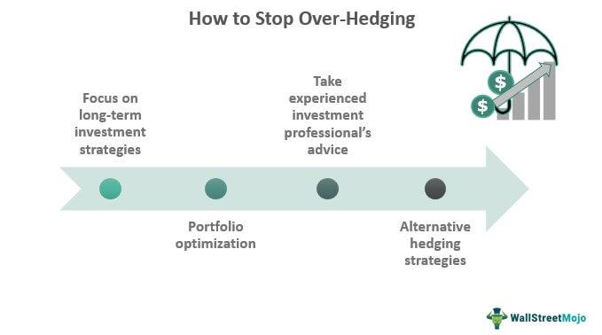

In the rapidly evolving world of finance, mastering risk management and strategy has become paramount for achieving success, especially as algorithmic trading continues to expand its influence. Algorithmic trading utilizes sophisticated mathematical models and computational algorithms to execute trades at speeds and frequencies that are beyond the capabilities of human traders. Within this context, understanding key risk management strategies is indispensable.

One notable concept in risk management is over-hedging. This occurs when the hedge undertaken surpasses the size of the original position, which can inadvertently lead to a net position that runs contrary to the initial intent. While the primary objective of hedging is to mitigate risk by offsetting potential losses in investments, over-hedging can paradoxically introduce new risks. It becomes crucial to discern the nuances of this strategy to ensure it contributes positively to the risk management framework rather than creating additional complexities or exposures.

The exploration of over-hedging is particularly relevant within the framework of algorithmic trading. With the capacity to process vast amounts of market data swiftly and execute trades in milliseconds, algorithmic trading not only enhances trading efficiency but also accentuates the need for robust risk management strategies. A deep understanding of how over-hedging interacts with algorithmic systems is necessary to balance the benefits of rapid trade execution with the imperative of financial security.

This article will examine the intricacies of over-hedging, positioning it as a pivotal part of the broader discourse on risk management and algorithmic trading. Through this understanding, traders and financial strategists can better navigate the complex landscape of modern financial markets, ensuring they leverage algorithmic tools to optimize performance while safeguarding against potential risks.

## Table of Contents

## Understanding Over-Hedging

Over-hedging occurs when the amount used for hedging surpasses the size of the original position. This situation results in a net position that no longer aligns with the initial objective, potentially creating new risks instead of mitigating them. The core idea behind a hedge is to stabilize a financial position by offsetting potential losses in the primary asset with gains in the hedging instrument. However, when a hedge exceeds the original size, it poses the risk of turning into a speculative stance, inadvertently shifting the trader’s exposure to the opposite market condition intended for protection.

In practical terms, if an investor holds an asset worth 100 units and establishes a hedge covering 120 units, they are over-hedged by 20 units. Instead of merely neutralizing risk, this strategy could create a new problem: if the opposite market movement occurs, the hedge might generate losses greater than any potential gains in the primary position.

Mistakes in applying over-hedging can stem from inaccurate estimations, misinterpretations of market signals, or flawed strategic frameworks. For example, a trader might project excessive [volatility](/wiki/volatility-trading-strategies) and opt for a larger hedge, only to see the market remain relatively stable. As a result, the additional hedged portion could lead to unforeseen financial drawbacks.

Understanding and correctly implementing hedging strategies is critical, as over-hedging deviates from the intended financial objectives. Aligning the hedge with the actual position size, rather than exceeding it, is essential to maintaining the integrity and purpose of risk management in trading environments.

## The Role of Algorithmic Trading in Risk Management

Algorithmic trading utilizes sophisticated algorithms to identify and exploit market opportunities efficiently. This type of trading has transformed financial markets by providing unprecedented speed and precision in executing trades. Algorithms can quickly analyze vast sets of market data, detect trading signals, and execute trades at the optimal price points, often executing thousands of trades in seconds.

Despite its advantages, [algorithmic trading](/wiki/algorithmic-trading) also increases exposure to a variety of risks. One significant risk is market risk, which refers to potential losses due to adverse price movements in the market. Algorithms, designed to react swiftly to market conditions, can amplify these losses if they execute trades based on erroneous signals or during periods of high volatility. Additionally, [liquidity](/wiki/liquidity-risk-premium) risk is another concern, as algorithms may exacerbate market conditions by executing large orders that cannot be matched efficiently, causing price distortions.

Operational risks are also magnified in algorithmic trading. These include risks related to technology failures, such as software bugs, hardware malfunctions, or connectivity issues, which can lead to unintended trading behavior or failure to execute trades as intended. Furthermore, there is the risk of regulatory non-compliance, as trading algorithms must adhere to an array of financial regulations and any oversight can result in significant legal and financial consequences.

To mitigate these risks and optimize the benefits of algorithmic trading, it is essential to incorporate robust risk management strategies. These strategies include implementing comprehensive testing and validation procedures for trading algorithms before deployment in live markets. Stress testing under various market conditions ensures that algorithms can handle different scenarios effectively.

Moreover, establishing strict controls and monitoring systems is crucial. Real-time monitoring allows for the quick identification and rectification of anomalies in trading activity. Limiting the size of trades or utilizing fail-safes can prevent excessive loss by automatically halting trading activity if certain thresholds are breached.

Effective algorithmic trading also involves ensuring compliance with market regulations to prevent legal risks. Regular audits and updates to algorithms help maintain compliance with evolving regulatory requirements.

In summary, while algorithmic trading offers immense potential for optimizing market opportunities, its associated risks necessitate the integration of solid risk management frameworks to safeguard financial performance and ensure the integrity of trading operations.

## Risk Management Strategies in Algorithmic Trading

In the context of algorithmic trading, risk management strategies are fundamental to ensuring stability and achieving long-term success. Key techniques include stop-loss and take-profit orders, trailing stops, and portfolio diversification.

Stop-loss orders are pre-determined thresholds set by traders to automatically close a position when its price drops to a specific level. This mechanism helps limit potential losses by preventing further deterioration of asset value. Similarly, take-profit orders allow traders to lock in profits once a position reaches a desired price level. By defining [exit](/wiki/exit-strategy) points in advance, traders can mitigate exposure to sudden market reversals.

Trailing stops are dynamic versions of stop-loss orders that adjust in line with favorable price movements. As the asset price rises, the trailing stop follows at a fixed distance, ensuring that profits are captured while maintaining an active position. This approach provides a balance between securing gains and allowing for potential upside.

Portfolio diversification is a strategy that spreads investments across multiple assets to reduce the impact of a single asset's poor performance on the overall portfolio. By allocating resources to a variety of asset types—such as stocks, bonds, and commodities—traders can lower unsystematic risk and achieve more stable returns. Diversification can be mathematically represented through the correlation matrix of asset returns, aiming to select assets with low or negative correlations to maximize the benefit of diversification.

Successful implementation of these strategies requires a thorough understanding of market dynamics and a well-constructed algorithm that can adapt to changing conditions. By employing these risk management techniques, traders gain the capacity to better manage market volatility and protect their investments from unexpected fluctuations.

## Examples of Over-Hedging

An illustrative case of over-hedging emerges in the futures market, particularly when the number of futures contracts surpasses the actual inventory held by a company. This oversizing effect may lead to an unintended speculative exposure, transforming a defensive strategy into a potential source of risk. For instance, consider a firm that holds a physical inventory of 10,000 barrels of oil and decides to hedge its price exposure with futures contracts. If this firm mistakenly or purposefully enters into futures contracts covering 15,000 barrels, it effectively speculates on the price change for the excess 5,000 barrels. While the goal is to stabilize cash flows and reduce volatility, exceeding the inventory introduces a speculative element that can increase financial vulnerability. 

Such a mismatch between the hedging instruments and the underlying position exposes a firm to market movements that it originally intended to avoid. If oil prices fall, the gain on the futures position may offset the loss up to the amount of the inventory. However, the additional 5,000 barrels contracted in futures will result in a net speculative loss. This example underscores the critical importance of aligning hedge sizes with the actual needs and assets of the firm to avoid unintended speculative risks. Properly aligning hedge sizes not only mitigates risks but also aligns the company’s financial strategy with its operational realities, thereby preserving its economic objectives.

## Comparing Over-Hedging to Other Risk Management Strategies

Over-hedging and under-hedging both represent inefficiencies in managing risk effectively. Traditional hedging aims to protect an investment portfolio or trading position from adverse market movements. However, when a hedge is set up improperly, it can introduce additional risks that may be more detrimental than having no hedge at all.

Over-hedging involves taking a hedging position larger than the exposure it is intended to protect. For example, if a company has an exposure of 1,000 units of a commodity but takes a hedging position of 1,200 units, it essentially creates a net speculative position of 200 units in the opposite direction. In such cases, the protection sought through hedging is overshadowed by the speculative risk arising from the excess hedge. This misalignment can lead to financial losses if market prices move unfavorably with respect to the over-hedged amount.

On the other hand, under-hedging, where the hedge is sized smaller than the actual exposure, leaves part of the position unprotected. Both over-hedging and under-hedging fail to accurately mirror the risk profile of the underlying assets, making them equally suboptimal for risk mitigation.

Despite its drawbacks, over-hedging might be advantageous under specific circumstances. In volatile markets, the additional hedged amount could act as a buffer against extreme price fluctuations, inadvertently offering a form of speculative gain if the market moves favorably. Additionally, over-hedging might be strategically used if forecasts indicate a significant shift in market trends post-hedge initiation, thereby realigning the hedge with anticipated future exposures.

Implementing effective risk management requires a strategic balance in hedging to ensure that the size of the hedge aligns precisely with the risk exposure it aims to cover. This involves ongoing assessment and adjustment to accommodate market dynamics and exposure changes, thereby optimizing the hedge's efficiency without venturing into the pitfalls of over-hedging or under-hedging.

## Conclusion

In the dynamic landscape of financial markets, effective risk management is essential for the success and longevity of trading activities. Concepts like over-hedging must be clearly understood and meticulously applied to ensure sustainable outcomes. Over-hedging, which refers to the excess of a hedging position beyond the original exposure, can introduce risks as it may invert the trader's intended market stance. This necessitates a careful balance and constant monitoring of hedge ratios to ensure they align closely with the underlying positions.

Algorithmic trading provides traders with powerful tools to automate and optimize their strategies, offering speed and precision far beyond human capabilities. However, this also demands robust risk management practices to mitigate the inherent risks of automatic execution. By incorporating strategies such as over-hedging when appropriate, traders can potentially reduce unwanted exposure and minimize financial hazards.

Integrating sophisticated risk management techniques within algorithmic frameworks can enhance trading performance by protecting investments against adverse market movements. It involves implementing a mix of position sizing, diversified asset allocation, and utilizing stop-loss or take-profit thresholds to guard against excessive losses. Moreover, continuous refinement of trading algorithms is critical to adapt to changing market conditions and maintain an advantageous hedge.

As financial markets evolve, embracing thorough and adaptive risk management strategies, including a prudent understanding of over-hedging, can greatly enhance traders’ capabilities. This ensures not only the protection of capital but also the potential for improved trading outcomes and sustainable success over the long term.

## References & Further Reading

[1]: Black, F., & Scholes, M. (1973). ["The Pricing of Options and Corporate Liabilities."](https://www.cs.princeton.edu/courses/archive/fall09/cos323/papers/black_scholes73.pdf) Journal of Political Economy, 81(3), 637–654.

[2]: Hull, J. C. (2018). ["Options, Futures, and Other Derivatives"](https://www.semanticscholar.org/paper/Options%2C-Futures%2C-and-Other-Derivatives-Hull/89bdee500c8623864fc9eb7a471546aa713acc44). Pearson.

[3]: Pindyck, R. S., & Rubinfeld, D. L. (2017). ["Microeconomics"](https://archive.org/details/microeconomics0007pind). Pearson.

[4]: Fabozzi, F. J., Kolm, P. N., Pachamanova, D. A., & Focardi, S. M. (2007). ["Robust Portfolio Optimization and Management"](https://onlinelibrary.wiley.com/doi/book/10.1002/9781119202172). John Wiley & Sons.

[5]: De Prado, M. L. (2018). ["Advances in Financial Machine Learning"](https://www.amazon.com/Advances-Financial-Machine-Learning-Marcos/dp/1119482089). John Wiley & Sons.