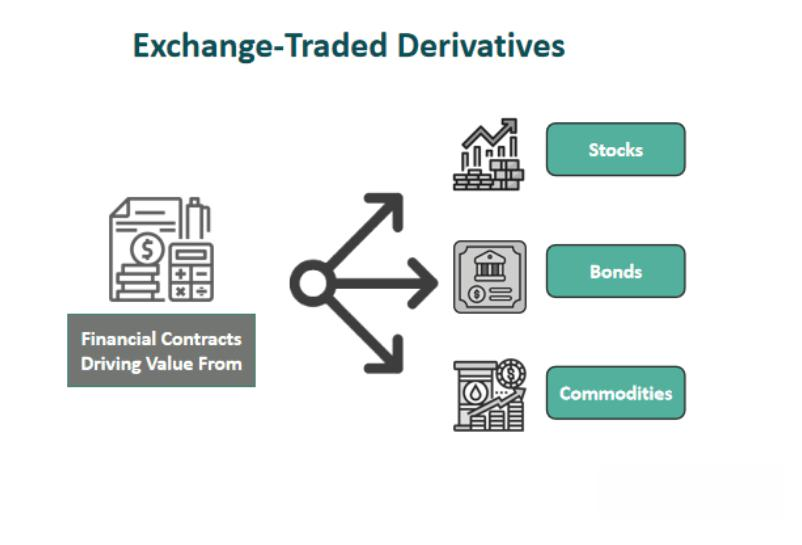

Financial derivatives are intricate financial instruments whose values stem from underlying assets, indices, or interest rates. These instruments play a pivotal role in modern finance, providing tools for hedging risks, speculating on future market movements, and enhancing capital efficiency. This article provides an in-depth examination of derivatives, with a spotlight on the derivative market, OTC derivatives, and algorithmic trading. Derivatives have evolved significantly, particularly with the rise of over-the-counter (OTC) derivatives, which have transformed financial risk management practices by allowing for more tailored and flexible risk mitigation strategies.

Algorithmic trading, or algo trading, has emerged as a critical player in the derivatives market, enhancing both the efficiency and volume of trading activities. This technological advancement leverages computer algorithms to execute trades at speeds and volumes unattainable by human traders, thereby increasing market efficiency. As derivatives trading evolves, understanding its dynamics becomes essential for investors, traders, and financial professionals aiming to hedge risks effectively or leverage opportunities.



The advent of OTC derivatives has reshaped traditional risk management frameworks by providing custom solutions to unique financial needs. However, this flexibility also introduces higher counterparty risks and reduced regulatory oversight. As such, a foundational understanding of financial derivatives and their underlying mechanisms is vital for navigating the complex landscape of modern financial markets.

Algorithmic trading further intensifies this complexity by introducing sophisticated methodologies for trade execution. These advancements underscore the importance of staying informed about market dynamics and regulatory developments, enabling market participants to optimally use derivatives to achieve precise financial objectives while managing associated risks efficiently.

## Table of Contents

## Overview of Financial Derivatives

Financial derivatives are sophisticated financial instruments that derive their value from underlying entities, which can include assets such as stocks or bonds, indexes, or interest rates. These instruments allow market participants to gain exposure to a wide array of financial markets without directly owning the underlying assets. Their inherent complexity and dependence on the underlying entities make derivatives a crucial component in modern finance.

The major categories of derivatives include options, futures, forwards, and swaps:

1. **Options**: Options provide the holder the right, but not the obligation, to buy or sell an underlying asset at a predetermined price before or on a certain date. They are often utilized for hedging against price fluctuations or speculating on market movements.

2. **Futures**: These are standardized contracts obligating the buyer to purchase, or the seller to sell, an asset at a predetermined future date and price. Futures are commonly used to hedge risks, especially in commodities, currencies, and indexes.

3. **Forwards**: Similar to futures, forwards are agreements to buy or sell an asset at a specific future date and price. However, forwards are private agreements and are typically customized to the needs of the parties involved.

4. **Swaps**: Swaps involve the exchange of cash flows or other financial instruments between two parties. Common types of swaps include interest rate swaps and currency swaps, which are primarily used to manage exposure to fluctuations in interest rates and currency exchange rates, respectively.

Derivatives serve a variety of functions within the financial system:

- **Hedging Risk**: By locking in prices or rates, derivatives can protect against adverse movements in the underlying asset. For instance, a company expecting to receive future payments in a foreign currency can use currency futures to mitigate exchange rate risk.

- **Speculation**: Traders often use derivatives to speculate on price changes of the underlying asset, aiming for profit. The leverage provided by derivatives allows speculators to amplify price movements.

- **Improving Asset Allocation**: Derivatives facilitate the reallocation of risk and return in an investment portfolio, thereby enhancing returns while controlling for risk.

Both individualized and standardized derivatives play vital roles in the global financial structure. Standardized derivatives, such as exchange-traded futures and options, provide transparency and [liquidity](/wiki/liquidity-risk-premium), while individualized contracts, like OTC derivatives, offer flexibility and customization.

A thorough understanding of derivatives is essential for market participants seeking to capitalize on their benefits while managing the potential risks. With the potential for significant gains also comes the risk of substantial losses, particularly when leverage is involved. As such, mastering the mechanics and strategies associated with derivatives is critical for financial success and stability in the complex landscape of modern finance.

## The Derivative Market: Structure and Dynamics

The derivative market encompasses a wide range of financial instruments categorized into two main groups: exchange-traded derivatives and over-the-counter (OTC) derivatives. This bifurcation provides investors with both standardized and customized options to meet various financial strategies and objectives.

Exchange-traded derivatives are highly standardized contracts that are traded on regulated exchanges. These include futures and options on diverse underlying assets such as commodities, stocks, and indices. The standardized nature of exchange-traded derivatives ensures transparency and liquidity, minimizing counterparty risk for participants. For instance, futures contracts require trading parties to agree on the price of an asset for delivery on a specified date, while options provide the right—but not the obligation—to buy or sell an asset at a predetermined price before expiry.

On the other hand, OTC derivatives are bespoke contracts tailored to the specific requirements of the parties involved. Examples include swaps and forward contracts, which are negotiated directly between parties without the need for an exchange. This customization allows for complex financial arrangements that can cater to specific hedging or investment needs, though it introduces higher counterparty risk due to the lack of a central clearing mechanism.

The growth of the derivative market has been substantial, driven by a combination of financial innovation, the increasing need for risk management strategies, and opportunities for leverage. Investors utilize derivatives to hedge against price [volatility](/wiki/volatility-trading-strategies), speculate on future price movements, and optimize asset allocation within portfolios.

Regulatory frameworks continue to evolve, influencing the structure and operations of the derivative market. Notable reforms, particularly after the 2008 financial crisis, aim to enhance transparency, reduce systemic risk, and improve market integrity. Initiatives such as the introduction of central clearing for certain OTC derivatives and stricter reporting requirements are designed to provide greater oversight and mitigate the risks of opaque transactions.

Overall, the derivative market is an essential component of the global financial system, offering versatile tools for managing risk and leveraging financial positions. As regulatory landscapes shift, market participants must remain vigilant and adaptable to navigate these changes effectively.

## OTC Derivatives: Characteristics and Advantages

OTC derivatives, or over-the-counter derivatives, are private contracts negotiated directly between two parties without the use of an exchange. These contracts offer a significant level of customization, enabling the involved parties to tailor the terms to their specific financial needs and objectives. This flexibility makes OTC derivatives particularly appealing for complex risk management strategies, allowing for the creation of bespoke solutions aimed at achieving particular financial targets.

Common examples of OTC derivatives include forward contracts, swaps, and exotic options. Forward contracts are agreements to buy or sell an asset at a predetermined future date and a specific price. Swaps are contracts through which two parties exchange cash flows or other financial instruments. Exotic options are more complex versions of standard options, featuring unique payoffs or other features that suit specific hedging or investment strategies.

Despite their advantages, OTC derivatives [carry](/wiki/carry-trading) inherent risks. They typically involve higher counterparty risk compared to standardized, exchange-traded derivatives. This is because each party relies on the other to fulfill their contractual obligations, and there is no centralized exchange to guarantee the trade. Furthermore, OTC derivatives often lack the regulatory oversight and transparency associated with listed derivatives, potentially elevating the risk of default.

To mitigate these risks, especially systemic risks that may arise from the interconnectedness of global financial systems, efforts are underway to implement centralized clearing mechanisms for OTC derivatives. Centralized clearing involves a third party, known as a clearinghouse, which acts as an intermediary between the transacting parties. The clearinghouse ensures the completion of transactions by assuming counterparty risk, thereby enhancing the overall stability and transparency of the financial system. These developments are crucial in balancing the flexibility of OTC derivatives with the need for heightened security and regulatory compliance.

## Algo Trading in the Derivatives Market

Algorithmic trading, or algo trading, has transformed the landscape of the derivatives market through the use of advanced computer programs designed to execute trades based on predetermined criteria and sophisticated algorithms. This method of trading leverages the speed and precision of computers to optimize trading strategies and reduce the likelihood of human error, thereby increasing market efficiency.

In the context of the derivatives market, algo trading has been instrumental in enhancing trading activities through various strategies, such as market-making, [arbitrage](/wiki/arbitrage), and trend-following. Market-making algorithms provide liquidity by continuously quoting bid and ask prices, ensuring that trades can be executed swiftly. Arbitrage strategies exploit price discrepancies between related securities to generate profits. For instance, an arbitrage algorithm might identify and act upon price differences between a derivative and its underlying asset across different markets.

A growing aspect of algo trading is its ability to process and analyze vast amounts of data in real-time, enabling traders to make informed decisions swiftly. The integration of [machine learning](/wiki/machine-learning) and [artificial intelligence](/wiki/ai-artificial-intelligence) into trading algorithms has further elevated their sophistication. These technologies allow algorithms to adapt and learn from historical data, improving their predictive accuracy and strategic decision-making over time. For example, a machine learning model could be used to forecast short-term price movements based on patterns identified in financial data.

However, [algorithmic trading](/wiki/algorithmic-trading) is not devoid of risks. Potential market manipulations, such as spoofing or layering, where traders use algorithms to create false market signals, can lead to market distortions. Additionally, the reliance on complex algorithms necessitates robust risk management systems to mitigate dangers associated with technology-driven trades. These systems must be designed to handle the high-speed nature of algo trading, ensuring stability in volatile market conditions.

In summary, algorithmic trading in the derivatives market provides significant advantages in terms of efficiency and strategic execution. As technological advancements continue, particularly in AI and machine learning, the capabilities and roles of algo trading are set to expand, posing both opportunities and challenges for market participants. Traders and institutions must remain vigilant to the inherent risks and commit to ongoing development of risk management practices to safeguard market integrity.

## Comparing Listed and OTC Derivatives

Listed derivatives are financial instruments that have their terms standardized to facilitate trading on regulated exchanges. This standardization results in several key advantages, primarily increased transparency, reduced counterparty risk, and ease of access for investors. The uniform terms help ensure a level playing field where pricing information is publicly available, contributing to market efficiency and liquidity. The centralized clearinghouse involved in exchange-traded derivatives also acts as a counterparty to every trade, which significantly minimizes the default risk traditionally associated with bilateral agreements.

Conversely, OTC (over-the-counter) derivatives are private agreements between parties outside of formal exchanges, allowing for far greater customization to meet specific requirements. This flexibility is particularly valuable for complex or bespoke financial transactions where standardized instruments may not suffice. However, this customization comes at the cost of increased counterparty risk, as the lack of a central clearing mechanism means that the performance of the contract depends on the creditworthiness of the involved parties.

Both listed and OTC derivatives are crucial tools for financial strategizing, fulfilling diverse investor needs and accommodating varied risk profiles. For instance, in portfolio management, derivatives can be used for hedging to mitigate risks or for speculative purposes to capitalize on market movements. The suitability of either type largely hinges on the trader’s specific goals and risk tolerance.

From a regulatory perspective, the transparency found in listed derivatives aligns well with regulatory efforts to enhance market oversight and risk management. The relatively opaque nature of OTC derivatives presents challenges in this regard, though regulatory reforms following the 2008 financial crisis, such as mandates for trade reporting and central clearing for certain OTC derivatives, aim to increase transparency and security in these markets.

Financial professionals must assess several factors when choosing between listed and OTC derivatives, including liquidity concerns, transparency needs, and regulatory implications. Listed derivatives typically offer higher liquidity due to their standardized and widely traded nature, while OTC derivatives, although less liquid, provide tailored solutions for specific financial scenarios. Understanding these distinctions allows investors and professionals to leverage derivatives effectively, balancing the advantages and addressing the inherent risks to achieve their financial objectives.

## Conclusion

Understanding financial derivatives is essential for efficient navigation of modern financial markets. These instruments, including both exchange-traded and OTC derivatives, offer specific advantages but also carry distinct risks that demand careful management. Exchange-traded derivatives benefit from transparency and regulatory oversight, which can reduce counterparty risk, while OTC derivatives provide the customization necessary to meet unique financial strategies but come with increased counterparty risk and less regulatory scrutiny.

The integration of technology, particularly algorithmic trading, is transforming the derivatives market. By employing sophisticated algorithms, market participants can execute trades at unprecedented speeds and scales. This advancement not only creates new opportunities for high-frequency trading but also introduces complexities that require robust risk management strategies. For instance, algorithms that seek arbitrage opportunities must swiftly process vast datasets and navigate market microstructures, which demand both precision and adaptability.

Investors and financial professionals must remain well-informed about the continuous evolution of market dynamics and regulatory frameworks to leverage derivatives optimally. Regulatory bodies worldwide are introducing measures to increase market transparency and reduce systemic risk, particularly in OTC markets. Staying updated on these developments is crucial to align trading strategies with regulatory requirements.

Effective decision-making in the derivatives space can significantly aid in achieving specific financial goals while efficiently managing associated risks. Tools such as Python can be applied to model financial scenarios involving derivatives, as illustrated in the following code snippet:

```python
import numpy as np

# Black-Scholes model for a European call option
def call_option_price(S, K, T, r, sigma):
    d1 = (np.log(S / K) + (r + 0.5 * sigma**2) * T) / (sigma * np.sqrt(T))
    d2 = d1 - sigma * np.sqrt(T)
    call_price = S * norm.cdf(d1) - K * np.exp(-r * T) * norm.cdf(d2)
    return call_price

# Example parameters
S = 100  # Current stock price
K = 105  # Strike price
T = 1.0  # Time to maturity in years
r = 0.05 # Risk-free interest rate
sigma = 0.2 # Volatility

call_price = call_option_price(S, K, T, r, sigma)
print(f"The call option price is: {call_price:.2f}")
```

In summary, a comprehensive understanding of financial derivatives, coupled with technological advancements, empowers investors and professionals to achieve precise financial objectives while effectively managing associated risks. Efficient navigation of this complex landscape necessitates continuous learning and adaptation to a rapidly changing financial environment.

## References & Further Reading

[1]: Hull, J. C. (2018). ["Options, Futures, and Other Derivatives."](https://www.semanticscholar.org/paper/Options%2C-Futures%2C-and-Other-Derivatives-Hull/89bdee500c8623864fc9eb7a471546aa713acc44) Pearson Education.

[2]: Rebonato, R. (1996). ["Interest-Rate Option Models."](https://archive.org/details/interestrateopti0000rebo) John Wiley & Sons.

[3]: Derman, E. (2004). ["My Life as a Quant: Reflections on Physics and Finance."](https://archive.org/details/mylifeasquantref0000derm) Wiley.

[4]: Lewis, M. (2015). ["Flash Boys: A Wall Street Revolt."](https://en.wikipedia.org/wiki/Flash_Boys) W. W. Norton & Company.

[5]: DeGennaro, R. P., & Selgin, G. A. (1999). ["Risk Management and the Derivatives Market."](https://haslam.utk.edu/wp-content/uploads/2021/12/ramon-degennaro-resume.pdf) Federal Reserve Bank of Atlanta Economic Review.