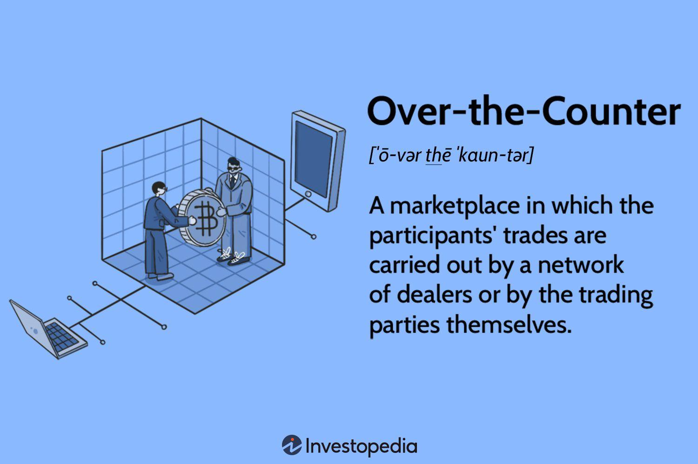

## Table of Contents

## What are over-the-counter derivatives?

Over-the-counter derivatives are financial contracts that are traded directly between two parties, without going through a formal exchange like a stock market. These contracts can be customized to fit the specific needs of the parties involved, which makes them different from standardized contracts traded on exchanges. Common types of over-the-counter derivatives include swaps, options, and forward contracts.

These derivatives are used by businesses and investors to manage risk or to speculate on future price movements of assets like currencies, interest rates, or commodities. For example, a company might use a currency swap to protect against fluctuations in exchange rates, or an investor might use an option to bet on the future price of oil. Because they are not traded on a public exchange, over-the-counter derivatives can be less transparent and carry more risk, but they offer flexibility that can be very useful for specific financial strategies.

## How do over-the-counter derivatives differ from exchange-traded derivatives?

Over-the-counter derivatives and exchange-traded derivatives are two ways to trade financial contracts, but they work differently. Over-the-counter derivatives are deals made directly between two parties, like two friends agreeing on a bet. They can be changed to fit what the two parties want, so they are not standard. This means they can be used for very specific needs, like a company wanting to protect against changes in the price of oil or a currency. Because these deals are made privately, they are not as open to the public, and this can make them riskier.

On the other hand, exchange-traded derivatives are traded on a big, public market, like a stock exchange. These contracts are all the same and cannot be changed. This makes them easier to understand and trade because everyone knows what they are getting. They are also safer because the exchange makes sure the deals are fair and that both sides keep their promises. But, because they are standard, they might not fit everyone's needs as well as over-the-counter derivatives can.

## What are the common types of over-the-counter derivatives?

Over-the-counter derivatives come in different forms, but some of the most common ones are swaps, options, and forward contracts. Swaps are agreements where two parties exchange cash flows or other financial instruments. For example, a company might swap a fixed [interest rate](/wiki/interest-rate-trading-strategies) for a variable one to manage their debt payments better. Options give the buyer the right, but not the obligation, to buy or sell an asset at a set price before a certain date. They can be used to bet on the future price of something or to protect against price changes.

Forward contracts are agreements to buy or sell an asset at a future date for a price agreed upon today. They are often used by businesses to lock in prices for things they need, like raw materials, to avoid price surprises. Each of these types of over-the-counter derivatives can be customized to fit the needs of the people making the deal. This flexibility is what makes them different from the standard contracts you find on public exchanges.

## Who are the typical participants in the OTC derivatives market?

The OTC derivatives market is used by a lot of different people and businesses. Big banks and financial institutions are the main players. They use OTC derivatives to help their clients manage risks or to make money by betting on price changes. These banks often act as the middleman, making deals between buyers and sellers. Hedge funds and other investment firms also play a big role. They use OTC derivatives to try and make money from price movements in things like currencies, interest rates, or commodities.

Companies that aren't in the finance business also use OTC derivatives. For example, a factory might use them to lock in the price of the materials they need, so they don't have to worry about price changes. Airlines might use them to protect against changes in fuel prices. Governments and central banks can use OTC derivatives too, to manage their financial risks or to influence the economy. All these different types of participants make the OTC derivatives market very diverse and active.

## What are the benefits of using over-the-counter derivatives?

Over-the-counter derivatives are really helpful because they can be made to fit what you need. Unlike the standard contracts on big exchanges, you can change OTC derivatives to match your exact situation. This means you can use them for very specific purposes, like protecting against changes in the price of something you need for your business, or betting on future price movements in a way that works for you. This flexibility is a big advantage because it lets you manage your risks or make money in ways that might not be possible with standard contracts.

Another good thing about OTC derivatives is that they let you deal directly with another party. This can be quicker and easier than going through a big exchange. It also means you can keep your deals private, which can be important if you don't want everyone to know what you're doing. Plus, working directly with someone can help you build a relationship and trust, which is useful in the world of finance. So, OTC derivatives offer a lot of benefits in terms of customization, privacy, and direct dealings.

## What are the risks associated with over-the-counter derivatives?

One big risk with over-the-counter derivatives is that they are not traded on a public exchange. This means they are not as open and clear to everyone. It can be hard to know if the person you're dealing with will keep their promises. If they don't, you might lose money. Also, because these deals are private, it can be tough to find someone else to take over the contract if you need to get out of it.

Another risk is that over-the-counter derivatives can be very complex. They can be hard to understand, even for people who work in finance. If you don't fully understand what you're getting into, you might make a bad decision and lose money. Plus, because these contracts can be customized, they might have terms that are not common or expected, which adds to the risk.

Finally, the value of over-the-counter derivatives can change a lot. They are often based on things like interest rates, currency values, or commodity prices, which can go up and down a lot. If the market moves against you, you could lose a lot of money. And because these deals are not backed by an exchange, you might not have the same protections that you would with exchange-traded products.

## How is the pricing of over-the-counter derivatives determined?

The pricing of over-the-counter derivatives is determined by several factors, including the current market value of the underlying asset, the expected future value of that asset, and the time until the contract expires. For example, if you're making a deal about the future price of oil, the current price of oil, what people think oil will be worth later, and how long you have until the deal is done all play a part in deciding the price of the derivative. Other things like interest rates, how much the price of the asset might change, and even how likely it is that the other person will keep their promise can also affect the price.

Because these derivatives are made between two people and not on a public exchange, the price can be changed to fit what both sides want. This means the price can be different from what you might see on a big market. The two people making the deal might negotiate and agree on a price that works for both of them, based on what they know about the market and what they need. This flexibility is one reason people use over-the-counter derivatives, but it also means the price can be harder to figure out and might be more risky.

## What role do credit and counterparty risk play in OTC derivatives?

Credit and counterparty risk are very important in over-the-counter derivatives. When you make a deal directly with someone, there's a chance they might not be able to pay up when it's time. This is called counterparty risk. If the person you're dealing with runs into money problems, they might not be able to keep their end of the deal. This risk is bigger in OTC derivatives because these deals are not backed by a big exchange that can step in and help if someone can't pay.

Because of this risk, people often look at how creditworthy the other person is before making a deal. They might ask for something like a guarantee or collateral to make sure they don't lose money if the other person can't pay. This can make the deal more complicated and might change the price of the derivative. But it's an important part of managing the risks that come with trading over-the-counter derivatives.

## How are over-the-counter derivatives regulated?

Over-the-counter derivatives are watched over by rules and regulations to make sure they are safe and fair. In many countries, big financial organizations like the U.S. Commodity Futures Trading Commission (CFTC) and the Securities and Exchange Commission (SEC) set the rules. These rules are meant to make sure that people trading OTC derivatives are honest and that the market works well. One important rule is that big deals have to be reported to a central place so everyone can see them. This helps keep the market clear and open, which is important because OTC derivatives are private deals between two people.

Another part of the regulation is making sure that people using OTC derivatives can handle the risks. This means they have to show they have enough money or other assets to cover any losses. Also, some big OTC derivative deals have to go through a clearinghouse. A clearinghouse is like a middleman that makes sure both sides of the deal keep their promises. This adds an extra layer of safety to the market. Even with all these rules, OTC derivatives can still be risky, but the regulations help make them safer for everyone involved.

## What impact did the 2008 financial crisis have on the OTC derivatives market?

The 2008 financial crisis had a big impact on the OTC derivatives market. Before the crisis, a lot of banks and companies were using OTC derivatives to make money or protect against risks. But when the crisis hit, many of these deals went wrong. A big reason was that people didn't know how much risk was in the market because OTC derivatives were private deals. This lack of openness made the crisis worse because no one knew how bad things were until it was too late.

After the crisis, governments and financial regulators decided to change the rules to make the OTC derivatives market safer. They made new laws like the Dodd-Frank Act in the U.S., which said that big OTC derivative deals had to be reported to a central place so everyone could see them. They also said that some deals had to go through a clearinghouse, which is like a middleman that makes sure both sides of the deal keep their promises. These changes were meant to make the market more open and safe, so a crisis like the one in 2008 wouldn't happen again.

## How has technology influenced the trading of over-the-counter derivatives?

Technology has changed the way over-the-counter derivatives are traded by making things faster and easier. Now, people can use computers and the internet to make deals quickly, without having to meet face-to-face. Special software helps them see prices and make trades in real-time, which means they can react to changes in the market right away. This has made the market more active and efficient because people can trade more often and with less hassle.

Also, technology has helped make the OTC derivatives market safer and more open. With new systems, all the deals can be recorded and shared with a central place, so everyone can see what's happening. This helps stop people from hiding risky deals and makes it easier for regulators to watch over the market. Plus, technology has made it possible to use things like electronic clearinghouses, which act as a middleman to make sure both sides of a deal keep their promises. This has made the market more trustworthy and less risky for everyone involved.

## What are some advanced strategies used in trading OTC derivatives?

Advanced strategies in trading OTC derivatives often involve using them to manage complex risks or to take advantage of specific market conditions. One common strategy is called a "delta hedge," where traders use options to protect against small changes in the price of an asset. They might buy or sell options to balance out the risk of their other investments. Another strategy is "correlation trading," where traders bet on how different assets will move together. For example, they might use OTC derivatives to profit if they think the price of oil and the value of the dollar will move in opposite directions.

Another advanced strategy is "[volatility](/wiki/volatility-trading-strategies) trading," where traders use OTC derivatives to bet on how much prices will change, rather than which direction they will go. They might buy options that will be worth more if the market becomes more unpredictable. This can be a way to make money in markets that are hard to predict. Finally, some traders use "structured products," which are custom-made OTC derivatives that combine different financial instruments in a single deal. These can be used to create very specific payoffs that fit the trader's goals, like getting a steady income or protecting against a big drop in the market.

## References & Further Reading

[1]: Hull, J. C. (2018). ["Options, Futures, and Other Derivatives."](https://www.semanticscholar.org/paper/Options%2C-Futures%2C-and-Other-Derivatives-Hull/89bdee500c8623864fc9eb7a471546aa713acc44) Pearson Education.

[2]: Rebonato, R. (1996). ["Interest-Rate Option Models."](https://archive.org/details/interestrateopti0000rebo) John Wiley & Sons.

[3]: Derman, E. (2004). ["My Life as a Quant: Reflections on Physics and Finance."](https://archive.org/details/mylifeasquantref0000derm) Wiley.

[4]: Lewis, M. (2015). ["Flash Boys: A Wall Street Revolt."](https://en.wikipedia.org/wiki/Flash_Boys) W. W. Norton & Company.

[5]: DeGennaro, R. P., & Selgin, G. A. (1999). ["Risk Management and the Derivatives Market."](https://haslam.utk.edu/wp-content/uploads/2021/12/ramon-degennaro-resume.pdf) Federal Reserve Bank of Atlanta Economic Review.