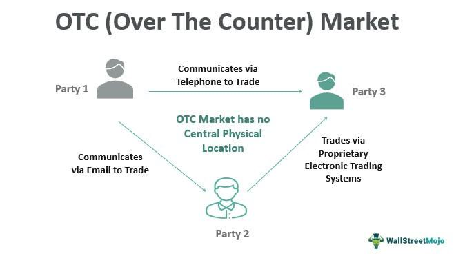

## Table of Contents

## What is an over-the-counter (OTC) market?

An over-the-counter (OTC) market is a place where people can buy and sell things that are not listed on big stock exchanges like the New York Stock Exchange. Instead of trading through a central place, buyers and sellers deal directly with each other. This can include stocks, bonds, and other financial products. OTC markets are often used for smaller companies that are not big enough to be on major exchanges.

These markets can be good for companies that want to raise money without going through the strict rules of big stock exchanges. However, trading in OTC markets can be riskier because there is less information available about the companies, and it can be harder to buy and sell the products quickly. This means that people need to be careful and do their research before they start trading in an OTC market.

## How does an OTC market differ from a traditional stock exchange?

An OTC market is different from a traditional stock exchange because it does not have a central place where all the trading happens. In a traditional stock exchange, like the New York Stock Exchange, all the buying and selling is done through the exchange itself. But in an OTC market, buyers and sellers trade directly with each other. This means that OTC markets can be more flexible and can include a wider variety of things to trade, like stocks from smaller companies that are not big enough to be on a major exchange.

Another big difference is that OTC markets usually have less strict rules than traditional stock exchanges. This can make it easier for smaller companies to raise money, but it also means there is less information available about the companies trading in OTC markets. This can make trading in OTC markets riskier because it's harder to know if you're making a good investment. In a traditional stock exchange, there are more rules and more information, which can make trading safer but also more complicated and expensive for companies.

## What types of securities are typically traded on OTC markets?

OTC markets are home to a wide range of securities that are not listed on major stock exchanges. These include stocks from smaller companies that may not meet the strict requirements of big exchanges. These stocks are often called "penny stocks" because they usually have a low price per share. Besides stocks, OTC markets also trade bonds, especially those issued by smaller or less well-known companies. These bonds might be from municipalities or corporations that are trying to raise money without going through a major exchange.

Another type of security you can find on OTC markets is American Depositary Receipts (ADRs). ADRs represent shares in foreign companies and allow U.S. investors to buy and sell them more easily. OTC markets also see trading in derivatives, like options and futures, which are contracts that get their value from something else, like a stock or a commodity. These securities are often used by investors looking for more complex ways to invest or hedge their risks. Overall, OTC markets offer a lot of variety, but they also come with more risk because there is less information and oversight compared to traditional stock exchanges.

## Who are the main participants in OTC markets?

The main participants in OTC markets include individual investors, who are everyday people looking to buy and sell securities. These investors often trade penny stocks or other small company stocks that are not listed on big exchanges. They might be looking for high returns, even though these investments can be riskier. Brokers and dealers are also key players in OTC markets. They help match buyers and sellers and make sure trades happen smoothly. They earn money from the difference between the buying and selling prices, called the "bid-ask spread."

Institutional investors, like banks and hedge funds, also take part in OTC markets. They might trade large amounts of securities, including bonds and derivatives, to manage their investment portfolios or to hedge against risks. These big investors often have more resources and information than individual investors, which can give them an advantage. Lastly, companies themselves are important participants. They use OTC markets to raise money by issuing stocks or bonds. This is especially helpful for smaller companies that can't meet the strict rules of major stock exchanges.

## How are transactions facilitated in OTC markets?

In OTC markets, transactions are facilitated through a network of brokers and dealers who act as middlemen between buyers and sellers. Unlike traditional stock exchanges, there's no central place where all the trading happens. Instead, these brokers and dealers use phone calls, electronic communication, or special trading platforms to connect people who want to buy and sell securities. They help match buyers with sellers and make sure the trades go through smoothly. They also earn money from the difference between the price they pay to buy a security and the price they sell it for, which is called the "bid-ask spread."

The process starts when an investor, either an individual or an institution, contacts a broker or dealer to buy or sell a security. The broker or dealer then searches for someone on the other side of the trade. This could be another client or another broker or dealer who has the opposite interest. Once they find a match, they negotiate the price and complete the transaction. Because OTC markets are less regulated than big stock exchanges, there might be less information available about the securities being traded, which can make the process riskier but also more flexible.

## What are the advantages of trading in OTC markets?

One big advantage of trading in OTC markets is that they let you buy and sell securities that you can't find on big stock exchanges. This includes stocks from smaller companies, bonds, and even shares in foreign companies through ADRs. This gives investors more choices and the chance to find good deals that might not be available elsewhere. Another plus is that the rules are not as strict in OTC markets. This makes it easier for smaller companies to raise money by selling stocks or bonds without going through the tough process of getting listed on a major exchange.

Another benefit is that OTC markets can be more flexible. Because there's no central place for trading, buyers and sellers can deal directly with each other. This can make it easier to negotiate prices and get trades done quickly. For investors who know what they're doing, this can be a big advantage. Also, OTC markets can offer high returns, especially with penny stocks. While these investments can be riskier, the potential for big profits is there if you pick the right ones.

## What are the risks associated with OTC markets?

Trading in OTC markets can be riskier than trading on big stock exchanges. One big risk is that there is less information available about the companies whose stocks you can buy. This means it's harder to know if a company is a good investment. Without the strict rules of big exchanges, some companies might not share all the important details about their business. This makes it easier for investors to make bad choices and lose money.

Another risk is that it can be harder to buy and sell things in OTC markets. Because there's no central place for trading, it might take longer to find someone who wants to buy or sell the same security. This can make it hard to get out of an investment quickly if you need to. Also, the prices can change a lot because there's less trading happening. This can make the value of your investment go up and down a lot more than it would on a big exchange.

## How is transparency and regulation handled in OTC markets?

In OTC markets, there is less transparency and regulation compared to big stock exchanges. This means that there are fewer rules that companies have to follow when they want to sell their stocks or bonds. Because of this, it can be harder for investors to find out important information about the companies they are thinking about investing in. The companies don't have to share as much about their business, like how much money they are making or how they are doing financially. This lack of information can make it riskier for people to invest in OTC markets because they might not know everything they need to make a good decision.

Even though there are fewer rules, there are still some regulations in place to help protect investors. In the United States, the Financial Industry Regulatory Authority (FINRA) oversees a lot of the trading that happens in OTC markets. They make sure that brokers and dealers follow certain rules and that they are honest with their clients. However, the level of oversight is not as strict as on big stock exchanges, so investors need to be careful and do their own research before they start trading in OTC markets.

## What role do market makers play in OTC markets?

Market makers are really important in OTC markets. They are people or companies that help make sure there are always buyers and sellers for the stocks and bonds that are traded. They do this by always being ready to buy or sell a security at a certain price. This makes it easier for other people to trade because they know they can always find someone to trade with. Market makers earn money from the difference between the price they buy a security for and the price they sell it for, which is called the "bid-ask spread."

Without market makers, it would be harder for people to trade in OTC markets. Because these markets don't have a central place where all the trading happens, it can be tough to find someone who wants to buy or sell the same thing at the same time. Market makers help keep the market running smoothly by always being there to trade. This helps make the market more stable and easier to use for everyone involved.

## How can an investor access OTC markets?

To access OTC markets, an investor needs to open a brokerage account with a firm that offers trading in OTC securities. Many online brokers provide this service, so you can choose one that fits your needs. Once you have an account, you can search for the specific stocks or bonds you want to trade. These might be listed on platforms like the OTC Bulletin Board (OTCBB) or the OTC Markets Group, which help organize and display the available securities.

After finding the security you want, you can place an order through your broker. You'll need to decide if you want to buy or sell, how many shares or bonds you want to trade, and at what price. Your broker will then work to find a matching buyer or seller, often with the help of market makers who help keep the market running smoothly. Keep in mind that trading in OTC markets can be riskier, so it's a good idea to do your research and understand the companies you're investing in before you start trading.

## What are some notable OTC markets around the world?

In the United States, one of the most well-known OTC markets is the OTC Markets Group. It has different levels, like the OTCQX, OTCQB, and Pink markets, which help people know how much information a company shares. The OTCQX is for the best companies with the most information, while the Pink market can have less information and be riskier. Another important OTC market in the U.S. is the OTC Bulletin Board (OTCBB), which shows stocks that are not on big exchanges but still follow some rules.

Outside the U.S., there are also important OTC markets. In Canada, the Canadian Securities Exchange (CSE) is a big one. It's known for having a lot of smaller companies and even some that use new technology like blockchain. In Europe, the London Stock Exchange's Alternative Investment Market (AIM) is a big OTC market where smaller and growing companies can trade their stocks. These markets all help companies that are too small for big exchanges to still raise money and grow.

## How do technological advancements impact OTC markets?

Technological advancements have made a big difference in OTC markets. They have made it easier for people to trade by using computers and the internet. Now, instead of calling a broker on the phone, investors can use online platforms to buy and sell stocks and bonds. This has made OTC markets more accessible to more people. Also, technology has helped create electronic trading systems that make it quicker and easier to match buyers and sellers. This can make the market more efficient and help reduce the time it takes to complete a trade.

Another way technology helps OTC markets is by improving transparency and information sharing. With the internet, companies can share more information about their business online, which can help investors make better choices. Special websites and platforms also help show real-time prices and trading information, which can make the market more open and fair. But, even with these improvements, OTC markets still have less information and fewer rules than big stock exchanges, so investors need to be careful and do their research.

## What are the applications of algo trading in OTC markets?

Algorithmic trading (algo trading) is increasingly being adopted in Over-the-Counter (OTC) markets, enhancing strategy development, risk management, and execution strategies. This adoption is evident among various market participants, including institutional investors, high-frequency trading firms, and retail traders.

Institutional investors, such as mutual funds and pension funds, utilize algorithms to optimize their trading strategies. These algorithms are designed to analyze vast amounts of market data, identify patterns, and execute trades at optimal prices. For instance, a common strategy employed is the Volume Weighted Average Price (VWAP) strategy, which involves executing orders incrementally to minimize market impact and track the daily volume profile of a security. The VWAP is calculated as follows:

$$
\text{VWAP} = \frac{\sum (\text{Price}_i \times \text{Volume}_i)}{\sum \text{Volume}_i}
$$

In OTC markets, where liquidity can vary significantly, institutional investors rely on such algorithms to manage large orders efficiently, ensuring minimum information leakage and reduced transaction costs.

High-frequency trading ([HFT](/wiki/high-frequency-trading-strategies)) firms are another significant user of algo trading in OTC markets. These firms deploy sophisticated algorithms to exploit short-term market inefficiencies by making rapid trades in fractions of a second. HFT algorithms are particularly effective in the foreign exchange ([FX](/wiki/fx-anomaly)) and derivatives segments of the OTC markets, where the lack of a central exchange and continuous trading offer numerous arbitrage and liquidity provision opportunities.

Retail traders also benefit from algo trading in OTC markets, albeit on a smaller scale. Retail traders use platforms that offer algorithmic trading capabilities, allowing them to automate trading strategies based on technical indicators or predefined conditions. This automation enables retail traders to execute trades more efficiently and systematically, reducing emotional bias and improving consistency in strategy execution.

Several case studies highlight the successful application of algo trading in OTC markets. For instance, a [hedge fund](/wiki/hedge-fund-trading-strategies) using an algorithmic strategy to trade OTC derivatives reported a significant reduction in transaction costs and improved risk-adjusted returns by utilizing real-time data analytics and machine learning algorithms to predict price movements. Another example involves a proprietary trading firm employing machine learning models to optimize execution strategies in the OTC FX market, leading to higher trade execution quality and better liquidity management.

Overall, the application of algo trading in OTC markets provides market participants with tools to improve their trading operations, leveraging technological advancements to gain a competitive edge. By harnessing the power of algorithms, traders can navigate the intricacies of OTC markets more effectively, enhancing both performance and management of risks associated with these decentralized trading environments.

## References & Further Reading

[1]: O'Hara, M. (1997). ["Market microstructure theory"](https://www.wiley.com/en-us/Market+Microstructure+Theory-p-9780631207610). Blackwell Publishers.

[2]: Gomber, P., Arndt, B., Lutat, M., & Uhle, T. (2011). ["Highly Automated Trading in the Light of MiFID II."](https://papers.ssrn.com/sol3/papers.cfm?abstract_id=1858626) Journal of Financial Markets and Portfolio Management, 25(3), 313-328.

[3]: Narang, R. K. (2013). ["Inside the Black Box: A Simple Guide to Quantitative and High Frequency Trading"](https://onlinelibrary.wiley.com/doi/book/10.1002/9781118662717). Wiley Trading.

[4]: Bank for International Settlements. (2016). ["Electronic trading in fixed income markets."](https://www.bis.org/publ/mktc07.pdf) Markets Committee.

[5]: Hasbrouck, J. (2007). ["Empirical Market Microstructure: The Institutions, Economics, and Econometrics of Securities Trading"](https://academic.oup.com/book/52241). Oxford University Press.

[6]: Barth, J. R., & Kaufman, G. G. (Eds.). (2015). ["The First Great Financial Crisis of the 21st Century: A Retrospective."](https://www.tandfonline.com/doi/full/10.1080/00213624.2016.1213600) World Scientific Publishing Company.

[7]: Menkveld, A. J. (2013). ["High frequency trading and the new market makers."](https://www.sciencedirect.com/science/article/pii/S1386418113000281) Journal of Financial Markets, 16(4), 712-740.