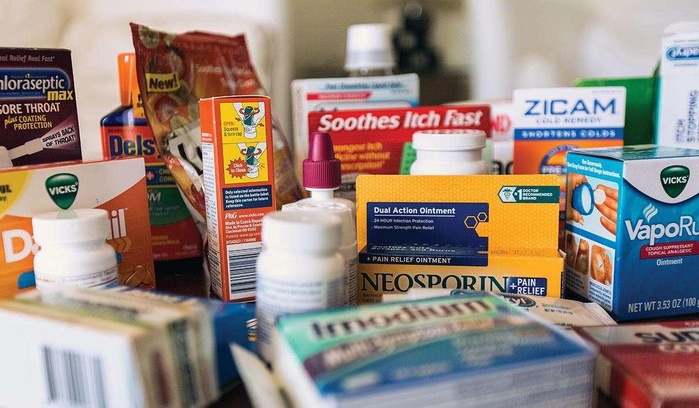

## Table of Contents

## What are over-the-counter medications?

Over-the-counter medications are drugs you can buy without a prescription from a doctor. They are sold in places like pharmacies, supermarkets, and sometimes even convenience stores. These medications are used to treat common health problems, like headaches, colds, allergies, and minor pains. Because they are easy to get, they help people take care of themselves without needing to see a doctor for small issues.

Even though you don't need a prescription, it's important to use over-the-counter medications correctly. Always read the label to know how much to take and how often. Some of these medicines can cause side effects or interact with other drugs you might be taking. If you're unsure about using them, or if your symptoms don't get better, it's a good idea to talk to a healthcare professional.

## How do over-the-counter medications differ from prescription medications?

Over-the-counter medications and prescription medications are different in a few important ways. Over-the-counter medications are medicines you can buy without a doctor's prescription. You can find them in many stores like pharmacies and supermarkets. They are used for common health problems like headaches, colds, and minor pains. On the other hand, prescription medications are stronger and can only be bought with a prescription from a doctor. These are used for more serious health issues or when over-the-counter options don't work.

Another difference is how safe they are to use without a doctor's guidance. Over-the-counter medications are considered safe for most people to use on their own, but it's still important to follow the instructions on the label. Prescription medications, however, need more careful monitoring because they can have stronger effects and more side effects. A doctor will decide if you need a prescription medication and will keep an eye on how you're doing while you take it.

In summary, over-the-counter medications are easier to get and used for common, minor issues, while prescription medications are for more serious conditions and require a doctor's oversight. Both types of medications can be helpful, but it's important to use them correctly and safely.

## What are some common types of over-the-counter medications?

Over-the-counter medications come in many types, each used for different health problems. Pain relievers like ibuprofen and acetaminophen are very common. They help with headaches, muscle aches, and fevers. Antacids like Tums or Maalox are used for heartburn and indigestion. There are also allergy medicines like loratadine or cetirizine that help with sneezing, runny nose, and itchy eyes.

Another type of over-the-counter medication is cough and cold medicine. These can include things like cough syrups, decongestants, and throat lozenges. They help with symptoms like coughing, stuffy nose, and sore throat. You can also find skin treatments like hydrocortisone cream for rashes or itchiness, and anti-fungal creams for things like athlete's foot. These medications are easy to find and can help you feel better without needing to see a doctor.

## What should you consider before taking over-the-counter medications?

Before you take over-the-counter medications, it's important to think about a few things. First, check if the medicine is right for your symptoms. Not all medications work for every problem, so make sure you're picking the right one. Also, think about any other medicines you're taking. Some over-the-counter drugs can interact with other medications, which could be harmful. Always read the label to see if there are any warnings about mixing medicines.

Another thing to consider is if you have any health conditions that might affect how you react to the medicine. For example, if you have high blood pressure, some cold medicines might not be safe for you. It's also a good idea to know how much of the medicine to take and how often. Taking too much can cause problems, so follow the directions carefully. If you're unsure about anything, talking to a pharmacist or a doctor can help you make the best choice for your health.

## How can you safely use over-the-counter medications?

To use over-the-counter medications safely, always read the label first. The label tells you how much to take and how often. It also lists any warnings or side effects you should know about. Make sure the medicine is right for your symptoms. If you're not sure, ask a pharmacist or a doctor. They can help you pick the best medicine for you.

Also, think about any other medicines you're taking. Some over-the-counter drugs can cause problems if you mix them with other medicines. If you have any health conditions, like high blood pressure or diabetes, some medicines might not be safe for you. Always follow the directions on the label carefully. If you take too much, it can be harmful. If you have any questions or if your symptoms don't get better, talk to a healthcare professional.

## What are the potential side effects of over-the-counter medications?

Over-the-counter medications can sometimes cause side effects. These can be different depending on the medicine. For example, pain relievers like ibuprofen might upset your stomach or cause heartburn. Some people might also get headaches or feel dizzy. It's important to read the label to know what side effects might happen and to stop taking the medicine if they get bad.

Allergy medicines like antihistamines can make you feel sleepy or tired. They might also make your mouth dry. Cough and cold medicines can sometimes make your heart beat faster or make you feel nervous. If you notice any side effects that worry you, it's a good idea to talk to a doctor or a pharmacist. They can help you decide if you should keep taking the medicine or try something else.

## Can over-the-counter medications interact with other drugs?

Yes, over-the-counter medications can interact with other drugs. This means they can change how well the other drugs work or cause new side effects. For example, taking certain pain relievers like ibuprofen with blood thinners can increase the risk of bleeding. If you take allergy medicine with a sleeping pill, you might feel very sleepy or dizzy.

It's important to be careful and tell your doctor or pharmacist about all the medicines you are taking. This includes prescription drugs, other over-the-counter medicines, and even vitamins or supplements. They can help you avoid harmful interactions and make sure you're using the medicines safely.

## How do you read and understand the labels on over-the-counter medications?

Reading the label on over-the-counter medications is important to use them safely. Start by looking at the active ingredients. This tells you what's in the medicine that helps with your symptoms. Then, check the directions. They tell you how much to take and how often. Make sure to follow these exactly. The label also has warnings. These are important because they tell you about side effects or if you shouldn't take the medicine if you have certain health problems.

Next, look at the purpose and uses section. This part tells you what the medicine is for, like if it's for headaches or a cold. It's good to make sure the medicine matches your symptoms. The label also has other information like how to store the medicine and what to do if you take too much. If anything on the label is confusing, don't be afraid to ask a pharmacist or doctor for help. They can explain it in a way that's easy to understand.

## What are the regulations governing over-the-counter medications?

Over-the-counter medications are regulated by government agencies to make sure they are safe and work well. In the United States, the Food and Drug Administration (FDA) is in charge of these rules. The FDA checks the ingredients in over-the-counter medicines to make sure they are safe for people to use without a doctor's prescription. They also make sure the labels on the medicines have clear instructions and warnings so people know how to use them correctly.

These regulations help keep people safe by making sure over-the-counter medications are made the right way and are not harmful. The FDA can take a medicine off the market if it finds out it's not safe or if the company making it doesn't follow the rules. This helps protect people who use these medicines to feel better from common health problems.

## How are over-the-counter medications developed and approved?

Over-the-counter medications are developed and approved through a careful process to make sure they are safe and work well. Companies that want to make these medicines do a lot of research first. They test the ingredients and how they work on people. This is called clinical trials. After they think the medicine is ready, they send all their information to the Food and Drug Administration (FDA). The FDA looks at everything to see if the medicine is safe for people to use without a doctor's prescription.

Once the FDA is happy with the medicine, they approve it. But the approval doesn't stop there. The FDA keeps watching the medicine even after it's on store shelves. They want to make sure it stays safe and works well for everyone. If they find out something is wrong, they can take the medicine off the market. This whole process helps make sure that over-the-counter medications are good for people to use when they need them.

## What role do pharmacists play in the use of over-the-counter medications?

Pharmacists play a big role in helping people use over-the-counter medications safely. They know a lot about different medicines and can help you pick the right one for your symptoms. If you're not sure which medicine to use, you can ask a pharmacist, and they'll tell you what might work best. They can also answer questions about how to take the medicine, like how much to use and how often.

Pharmacists also make sure you know about any possible side effects or if the medicine might not be safe for you because of other medicines you're taking or health problems you have. If you're worried about something after you start taking the medicine, you can go back and talk to them. They're there to help you feel better and stay safe.

## What are the latest trends and innovations in over-the-counter medications?

One of the latest trends in over-the-counter medications is the focus on natural and plant-based ingredients. More and more people are looking for medicines that don't have a lot of chemicals. Companies are making products with things like elderberry for colds or turmeric for pain relief. These natural options are becoming popular because people think they might be safer and gentler on the body.

Another trend is the use of technology to make taking medicine easier. There are now apps that help you remember when to take your medicine and even smart pill bottles that remind you. Some over-the-counter medicines also come in new forms, like gummies or dissolvable tablets, which are easier and more fun to take, especially for kids. These innovations help people use over-the-counter medications in a way that fits better with their lives.

## References & Further Reading

[1]: ["Regulatory Framework for the OTC Pharmaceuticals Market in the U.S."](https://www.fda.gov/drugs/cder-small-business-industry-assistance-sbia/small-business-assistance-frequently-asked-questions-regulatory-process-over-counter-otc-drugs) - U.S. Food and Drug Administration (FDA)

[2]: ["The Global OTC Pharmaceutical Market 2021-2028"](https://www.statista.com/outlook/hmo/otc-pharmaceuticals/worldwide) - ReportLinker

[3]: Truby, J., et al. (2021). ["To Regulate or Not to Regulate? Legal Challenges to Conflicting Approaches in Artificial Intelligence & Autonomous Trading."](https://jamanetwork.com/journals/jamanetworkopen/fullarticle/2798133) Computer Law & Security Review.

[4]: ["Algorithmic Trading in the Financial Markets: Understanding the Benefits and Risks"](https://www.investopedia.com/terms/a/algorithmictrading.asp) - CFA Institute

[5]: ["E-commerce in Pharmaceuticals: Opportunities and Challenges"](https://www.grandviewresearch.com/industry-analysis/pharma-e-commerce-market-report) - Pharmaceutical Technology