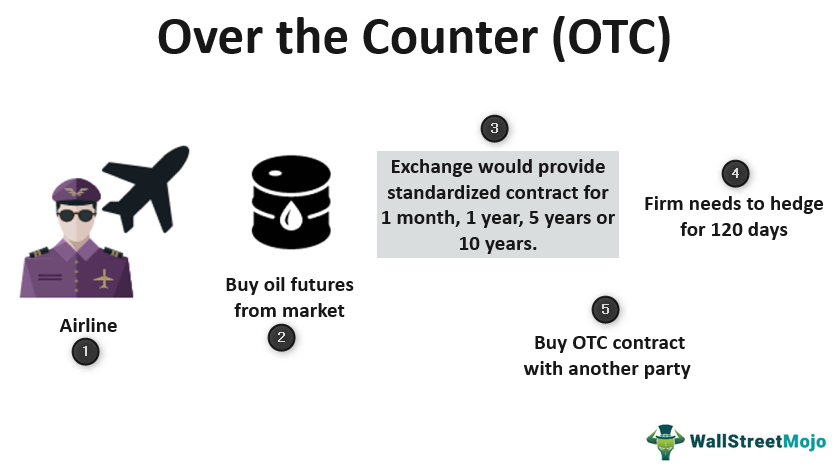

## Table of Contents

## What are Over-The-Counter (OTC) medications?

Over-The-Counter (OTC) medications are drugs that you can buy without a prescription from a doctor. They are available in many places like pharmacies, supermarkets, and sometimes even convenience stores. These medications are used to treat common health problems like headaches, colds, allergies, and minor pains. They are considered safe for most people when used as directed on the package.

OTC medications come in different forms such as pills, liquids, creams, and sprays. Some common examples include pain relievers like ibuprofen and acetaminophen, antacids for heartburn, and antihistamines for allergies. It's important to read the label carefully and follow the instructions to avoid any side effects or interactions with other medicines you might be taking. If you have questions or concerns, it's a good idea to talk to a pharmacist or a doctor.

## How do OTC medications differ from prescription medications?

OTC medications and prescription medications are different in a few important ways. OTC medications are drugs you can buy without a doctor's prescription. They are meant for common health problems like headaches, colds, and minor pains. You can find them in many places like pharmacies and supermarkets. On the other hand, prescription medications need a doctor's prescription. These are for more serious health issues or conditions that need careful monitoring. You can only get them from a pharmacy after a doctor writes a prescription for you.

Another difference is how safe they are thought to be. OTC medications are considered safe for most people when used as the package says. But, prescription medications might have stronger effects or more risks, so a doctor needs to keep an eye on how you're doing. Also, OTC medications usually cost less than prescription medications because you don't need to see a doctor to get them. But, if you're not sure which one to use or if you have other health issues, it's always a good idea to talk to a doctor or pharmacist.

## What types of conditions can OTC medications treat?

OTC medications can help with many common health problems. They are good for things like headaches, fevers, and minor pains. If you have a headache, you can take pain relievers like ibuprofen or acetaminophen. These can also help if you have a fever or if you hurt yourself a little bit.

They are also useful for colds and allergies. If you have a stuffy nose or a cough, you can use cold medicines to feel better. Antihistamines can help if you have allergies and are sneezing a lot or have itchy eyes. There are also medicines for heartburn and upset stomachs, like antacids, that you can buy without a prescription.

Some OTC medications can help with skin problems too. If you have a small cut or a rash, you can use creams or ointments to help it heal. There are also products for things like athlete's foot or minor sunburns. These medications are easy to find and can make you feel better without needing to see a doctor.

## How can I safely use OTC medications?

To use OTC medications safely, always read the label carefully before you take anything. The label will tell you how much to take, how often to take it, and any warnings you should know about. Make sure you follow these instructions exactly. If you take too much or take it too often, you could get sick. Also, check the expiration date to make sure the medicine is still good to use.

It's also important to think about other medicines you might be taking. Some OTC medications can interact with other drugs or even with certain foods. If you're not sure if it's safe to take something, talk to a pharmacist or a doctor. They can help you figure out what's best for you. Remember, just because you can buy it without a prescription doesn't mean it's completely safe for everyone. Always be careful and ask for help if you need it.

## What are the common side effects of OTC medications?

OTC medications can have side effects, just like any other medicine. Common side effects might include things like feeling sleepy, having an upset stomach, or getting a headache. For example, if you take an antihistamine for allergies, you might feel drowsy. Pain relievers like ibuprofen can sometimes cause stomach pain or heartburn. These side effects are usually not serious and go away after you stop taking the medicine.

However, some people might have more serious side effects. If you feel dizzy, have trouble breathing, or get a rash, you should stop taking the medicine and see a doctor right away. It's also important to know that some OTC medications can make other health problems worse. For instance, if you have high blood pressure, certain cold medicines might raise it even more. Always read the label to see if there are any warnings about side effects or interactions with other medicines you're taking.

## How do I read and understand OTC medication labels?

Reading an OTC medication label can help you use the medicine safely. Start by looking at the front of the package. It will show the name of the medicine and what it's used for, like "pain relief" or "cold and flu." Then, turn the package over and find the "Drug Facts" section. This part tells you everything you need to know about the medicine. It lists the active ingredients, which are the parts that make the medicine work, and the inactive ingredients, which help the medicine stay together or taste better.

The "Drug Facts" section also tells you the right dose to take, how often to take it, and how long you should use it. Pay attention to any warnings or side effects listed. The label will say if you should not take the medicine if you have certain health problems or if you're taking other medicines. It's important to follow these instructions carefully. If you're not sure about something on the label, ask a pharmacist or doctor for help. They can explain it in a way that's easy to understand.

## What should I consider before taking multiple OTC medications?

Before you take more than one OTC medication, think about how they might work together. Some medicines can make each other stronger or weaker. For example, if you take a pain reliever and a cold medicine, they might both have the same ingredient like acetaminophen. Taking too much of the same ingredient can be bad for your health. Also, some medicines can cause side effects that might get worse if you take more than one kind. If you feel sleepy from an antihistamine and then take a medicine that also makes you sleepy, you might feel very tired.

It's a good idea to read the labels of all the medicines you're thinking about taking. Look for the active ingredients and any warnings about taking other medicines at the same time. If you're not sure if it's safe to take multiple medicines, talk to a pharmacist or a doctor. They can help you figure out what's safe for you. Remember, just because you can buy these medicines without a prescription doesn't mean they're completely safe for everyone, especially if you take more than one at a time.

## How do OTC medications interact with other drugs or supplements?

OTC medications can sometimes interact with other drugs or supplements you're taking. These interactions can make your medicines work differently or cause side effects. For example, if you take a blood thinner like warfarin and also take an OTC pain reliever like aspirin, it could make the blood thinner work too well and increase your risk of bleeding. Some supplements, like St. John's Wort, can also affect how other medicines work. It's important to know what you're taking and how they might interact.

Always read the labels of your OTC medications to see if there are any warnings about taking them with other drugs or supplements. If you're not sure, it's a good idea to talk to a pharmacist or a doctor. They can help you understand how your medicines might interact and what you can do to stay safe. Remember, even though OTC medications are easy to buy, they can still have serious effects if they interact with other things you're taking.

## What are the regulatory standards for OTC medications?

OTC medications have to follow rules set by the government to make sure they are safe and work well. In the United States, the Food and Drug Administration (FDA) is in charge of these rules. The FDA checks the ingredients in OTC medications to make sure they are safe for people to use without a doctor's help. They also make sure the labels on the medicines tell people how to use them correctly and list any warnings or side effects.

Before an OTC medication can be sold, it has to go through a lot of tests. These tests show that the medicine does what it says it will do and that it's safe for most people. The FDA looks at all this information before they say it's okay to sell the medicine. Even after the medicine is on the market, the FDA keeps watching to make sure it stays safe and works well. If there are any problems, they can take the medicine off the market or change the rules about how it can be used.

## How has the availability of OTC medications evolved over time?

A long time ago, people had to see a doctor to get almost any kind of medicine. But over the years, more and more medicines have become available without a prescription. This started happening more in the 1970s when the FDA in the United States began to let some medicines be sold over the counter. They did this because they found that some medicines were safe enough for people to use on their own without a doctor's help. This made it easier for people to get medicine for common problems like headaches or colds without having to go to the doctor every time.

Today, you can find a lot of different OTC medications in stores. They help with things like pain, allergies, and stomach problems. The number of OTC medications has grown a lot because of new rules and better science. Now, people can take care of many common health issues at home. But even though these medicines are easier to get, it's still important to use them the right way and ask a doctor or pharmacist if you have any questions.

## What are the latest trends in OTC medication development?

The latest trends in OTC medication development focus a lot on making medicines easier to use and more effective. One big trend is making medicines that work faster. For example, some new pain relievers start working in just a few minutes instead of taking half an hour or more. Another trend is making medicines that are easier to take, like chewable tablets or gummies. These are good for people who have trouble swallowing pills. Also, there's a lot of work on making medicines that are better for the environment, like using packaging that can be recycled.

Another trend is using technology to help people use OTC medications better. Some medicines now come with apps that help you remember when to take your medicine and track how you're feeling. There are also smart pill bottles that remind you to take your medicine and can even tell your doctor if you miss a dose. These technologies make it easier for people to take care of their health at home. Overall, the goal is to make OTC medications more convenient, effective, and safe for everyone.

## How can pharmacists and healthcare providers assist with OTC medication use?

Pharmacists and healthcare providers can help a lot when you're using OTC medications. They can explain how to use the medicine the right way. They'll tell you how much to take, how often to take it, and for how long. They can also warn you about any side effects to watch out for. If you're taking other medicines or supplements, they can check if it's safe to take the OTC medicine too. They know a lot about how different medicines work together, so they can help you avoid any bad interactions.

They can also give you advice on which OTC medicine is best for your problem. For example, if you have a headache, they can help you choose between different pain relievers. If you're not sure if you need an OTC medicine or if you should see a doctor, they can guide you. They're there to answer your questions and make sure you're using the medicine safely. So, don't be shy to ask them for help when you're [picking](/wiki/asset-class-picking) out or using OTC medications.

## References & Further Reading

[1]: Bergstra, J., Bardenet, R., Bengio, Y., & Kégl, B. (2011). ["Algorithms for Hyper-Parameter Optimization."](https://papers.nips.cc/paper/4443-algorithms-for-hyper-parameter-optimization) Advances in Neural Information Processing Systems 24. 

[2]: ["Advances in Financial Machine Learning"](https://www.amazon.com/Advances-Financial-Machine-Learning-Marcos/dp/1119482089) by Marcos Lopez de Prado 

[3]: ["Evidence-Based Technical Analysis: Applying the Scientific Method and Statistical Inference to Trading Signals"](https://www.amazon.com/Evidence-Based-Technical-Analysis-Scientific-Statistical/dp/0470008741) by David Aronson 

[4]: ["Machine Learning for Algorithmic Trading"](https://github.com/PacktPublishing/Machine-Learning-for-Algorithmic-Trading-Second-Edition) by Stefan Jansen 

[5]: ["Quantitative Trading: How to Build Your Own Algorithmic Trading Business"](https://www.amazon.com/Quantitative-Trading-Build-Algorithmic-Business/dp/1119800064) by Ernest P. Chan