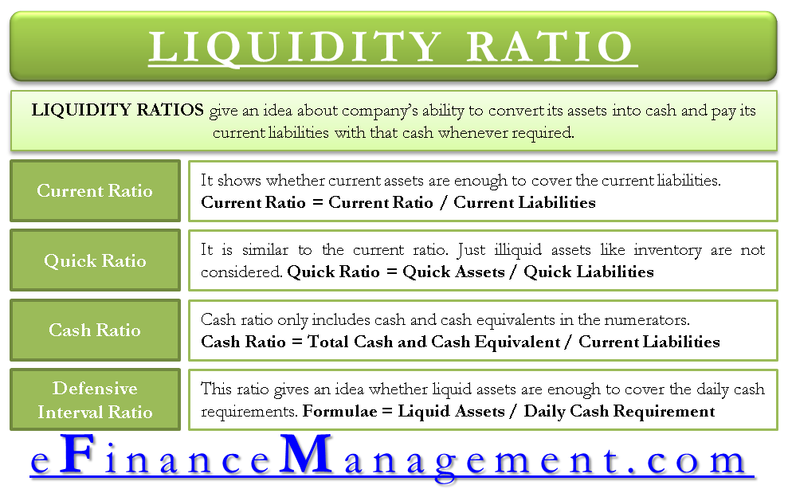

## Table of Contents

## What is the Overall Liquidity Ratio?

The Overall Liquidity Ratio is a financial measure that shows how well a company can pay its short-term debts with its short-term assets. It is important because it helps investors and managers understand if a company has enough cash or assets that can be quickly turned into cash to cover what it owes in the near future.

This ratio is calculated by dividing a company's current assets by its current liabilities. Current assets include things like cash, money in the bank, and items that can be sold quickly, like inventory. Current liabilities are the debts or bills that need to be paid soon, usually within a year. A higher ratio means the company is in a better position to pay its debts, which is a good sign for its financial health.

## Why is the Overall Liquidity Ratio important for businesses?

The Overall Liquidity Ratio is important for businesses because it shows if they can pay their short-term bills on time. This ratio tells a business if it has enough cash or things that can be sold quickly to cover what it owes soon. If the ratio is high, it means the business is in a good spot and can handle its debts without trouble. This makes the business look strong and reliable to people who might want to invest in it or lend it money.

If the Overall Liquidity Ratio is low, it can be a warning sign. It means the business might struggle to pay its bills, which could lead to problems like not being able to buy what it needs to keep running smoothly. This can scare away investors and make it hard for the business to get loans. So, keeping an eye on this ratio helps businesses make smart decisions about managing their money and staying financially healthy.

## How is the Overall Liquidity Ratio calculated?

The Overall Liquidity Ratio is calculated by dividing a company's current assets by its current liabilities. Current assets are things like cash, money in the bank, and items that can be sold quickly, like inventory. Current liabilities are the debts or bills that need to be paid soon, usually within a year. This ratio tells you how many times a company can cover its short-term debts with its short-term assets.

For example, if a company has $100,000 in current assets and $50,000 in current liabilities, the Overall Liquidity Ratio would be $100,000 divided by $50,000, which equals 2. This means the company can cover its short-term debts twice over with its current assets. A higher ratio, like this one, shows that the company is in a good position to pay its bills on time.

## What are the components that make up the Overall Liquidity Ratio?

The Overall Liquidity Ratio is made up of two main parts: current assets and current liabilities. Current assets are things a company owns that can be turned into cash quickly, like money in the bank, cash, and things they can sell right away, like their inventory. These are important because they help the company pay bills that are due soon.

Current liabilities are the debts or bills that a company needs to pay in the near future, usually within a year. This includes things like money they owe to suppliers, short-term loans, and other bills that are coming up. By comparing current assets to current liabilities, the Overall Liquidity Ratio shows if a company has enough quick cash or sellable items to cover what it owes soon.

## Can you explain the difference between liquidity and solvency in the context of the Overall Liquidity Ratio?

Liquidity and solvency are two important ideas in finance, but they are different. Liquidity is about how easily a company can turn its assets into cash to pay its short-term bills. The Overall Liquidity Ratio helps us see this by comparing a company's current assets, like cash and things they can sell quickly, to its current liabilities, which are the bills due soon. If the ratio is high, it means the company can easily pay its short-term debts, which is good for its day-to-day operations.

Solvency, on the other hand, is about a company's ability to pay all its debts, both short-term and long-term, over time. It looks at the bigger picture of a company's financial health. While liquidity focuses on the immediate future, solvency is concerned with whether a company can keep going and meet all its financial obligations in the long run. The Overall Liquidity Ratio doesn't tell us about solvency directly, but a company that struggles with liquidity might also have solvency issues if it can't fix its short-term problems.

## What is considered a good Overall Liquidity Ratio?

A good Overall Liquidity Ratio is usually between 1.5 and 3. This means a company has enough cash and things it can sell quickly to pay its short-term bills at least one and a half times over. If the ratio is higher than 3, it might mean the company is not using its money well because it's holding onto too much cash or things it could sell. But if the ratio is lower than 1, it's a warning sign that the company might not be able to pay its bills on time.

Different industries might have different ideas about what a good ratio is. For example, a store that sells things might need a higher ratio because it has a lot of inventory it can sell quickly. But a company that provides services might be okay with a lower ratio because it doesn't need as much cash on hand. So, it's important to look at what's normal for the industry when deciding if a company's Overall Liquidity Ratio is good or not.

## How does the Overall Liquidity Ratio compare to other liquidity ratios like the Current Ratio and Quick Ratio?

The Overall Liquidity Ratio, often just called the Current Ratio, is a measure that tells us how well a company can pay its short-term debts with its short-term assets. It's calculated by dividing current assets by current liabilities. This ratio includes all current assets, like cash, money in the bank, and things that can be sold quickly, like inventory. The Quick Ratio, also known as the Acid-Test Ratio, is a bit stricter. It looks at how well a company can pay its short-term debts, but it doesn't include inventory in the calculation. The Quick Ratio only counts the most liquid assets, like cash and money that can be gotten quickly, and divides that by current liabilities.

While the Overall Liquidity Ratio (or Current Ratio) gives a broad view of a company's ability to pay its bills, the Quick Ratio gives a more conservative view by leaving out inventory. This is because inventory might not be as easy to turn into cash quickly. So, the Quick Ratio is a tougher test of a company's liquidity. Both ratios are important, but they tell us slightly different things about a company's financial health. A company might have a good Current Ratio but a lower Quick Ratio, which could mean it relies a lot on inventory to stay liquid.

## What are the limitations of using the Overall Liquidity Ratio to assess a company's financial health?

The Overall Liquidity Ratio, or Current Ratio, has some limitations when used to assess a company's financial health. One big issue is that it treats all current assets the same, even though some are easier to turn into cash than others. For example, cash is very easy to use to pay bills, but inventory might take time to sell. If a company has a lot of inventory, its Current Ratio might look good, but it might not really be able to pay its bills quickly if it can't sell that inventory fast enough.

Another limitation is that the Current Ratio doesn't tell us anything about a company's long-term financial health. It only looks at short-term assets and liabilities, so it can't tell us if a company has enough money to pay off all its debts over time. A company might have a good Current Ratio but still have big problems with long-term debt. Also, different industries might need different levels of liquidity, so what's a good Current Ratio in one industry might not be good in another. This means you need to look at other financial measures and consider the industry to get a full picture of a company's financial health.

## How can changes in the Overall Liquidity Ratio over time be interpreted?

Changes in the Overall Liquidity Ratio over time can tell us a lot about a company's financial health. If the ratio is going up, it means the company is getting better at paying its short-term bills. This could happen because the company is making more money, or because it's managing its money better. It's a good sign that the company is in a stronger position and can handle its debts well.

If the Overall Liquidity Ratio is going down, it might mean the company is having a harder time paying its bills. This could be because it's not making as much money, or because it's taking on more debt. A lower ratio might be a warning sign that the company needs to be careful and maybe look at ways to improve its cash flow. It's important to look at why the ratio is changing and what the company is doing about it to understand what's really going on.

## In what ways can a company improve its Overall Liquidity Ratio?

A company can improve its Overall Liquidity Ratio by making more money quickly. One way to do this is by selling more of its products or services. When a company sells more, it gets more cash, which boosts its current assets. Another way is by collecting money from customers faster. If customers pay their bills sooner, the company has more cash on hand to use for paying its own bills. Also, the company can try to get rid of old inventory by offering sales or discounts, turning those items into cash faster.

Another way to improve the ratio is by cutting down on short-term debts. A company can do this by paying off its bills faster or by negotiating with suppliers to extend the time they have to pay. If a company can delay paying its bills without hurting its relationships with suppliers, it can keep more cash on hand. The company can also look at its spending and see if there are any costs it can cut down, like reducing unnecessary expenses. By managing its money better, a company can improve its Overall Liquidity Ratio and be in a better position to handle its debts.

## How does industry type affect the interpretation of the Overall Liquidity Ratio?

Different industries have different needs for cash and short-term assets, so what's a good Overall Liquidity Ratio can change from one industry to another. For example, a store that sells things might need a higher ratio because it has a lot of inventory it can sell quickly. This kind of business needs to make sure it has enough cash to buy new products and pay its bills on time. On the other hand, a company that provides services, like a law firm, might be okay with a lower ratio because it doesn't need as much cash on hand. It gets paid for its services regularly and doesn't have to worry about keeping a lot of inventory.

Because of these differences, it's important to compare a company's Overall Liquidity Ratio to others in the same industry. If a company's ratio is much lower than the average for its industry, it might mean it's having trouble managing its money. But if the ratio is much higher, it could mean the company is not using its cash efficiently. By understanding what's normal for the industry, we can get a better idea of whether a company's financial health is good or if it needs to make some changes.

## What advanced analytical techniques can be used to enhance the predictive power of the Overall Liquidity Ratio?

To make the Overall Liquidity Ratio more useful for predicting a company's financial future, we can use some advanced ways of looking at data. One way is to use trend analysis, which means watching how the ratio changes over time. By doing this, we can see if the company is getting better or worse at paying its bills. We can also use something called regression analysis to see how the ratio connects to other important numbers, like how much money the company makes or how much debt it has. This can help us guess what the ratio might be in the future based on these other numbers.

Another way to make the Overall Liquidity Ratio more helpful is by using something called ratio analysis in a group. This means looking at the ratio along with other ratios, like the Quick Ratio and the Cash Ratio, to get a full picture of the company's money situation. We can also use something called [machine learning](/wiki/machine-learning) to find patterns in the data that we might not see otherwise. Machine learning can help us make better guesses about what might happen to the company's liquidity in the future. By using these advanced ways of looking at data, we can get a better idea of whether the company will be able to pay its bills on time and stay healthy financially.

## What are Liquidity Ratios?

Liquidity ratios are financial metrics employed to assess a company's ability to meet its short-term obligations with its current assets. These ratios are critical in evaluating a firm's operational efficiency and financial stability. The primary liquidity ratios are the current ratio, quick ratio, and overall liquidity ratio, each providing insights into different aspects of a company's financial health.

The **current ratio** is calculated by dividing a company's current assets by its current liabilities:

$$
\text{Current Ratio} = \frac{\text{Current Assets}}{\text{Current Liabilities}}
$$

This ratio indicates whether a company possesses sufficient resources to cover its short-term liabilities and is a standard measure of short-term financial health.

The **quick ratio**, also known as the acid-test ratio, refines the current ratio by excluding inventory from current assets, thus providing a more stringent measure of [liquidity](/wiki/liquidity-risk-premium). The quick ratio is calculated as follows:

$$
\text{Quick Ratio} = \frac{\text{Current Assets} - \text{Inventory}}{\text{Current Liabilities}}
$$

This ratio is particularly useful in industries where inventory may not easily convert to cash, offering a clearer picture of a company's immediate liquidity.

The **overall liquidity ratio** considers the broader spectrum of liquidity by encompassing cash and equivalents, marketable securities, and other short-term assets. This ratio highlights the firm's capacity to maintain liquidity amidst volatile market conditions and unforeseen financial downturns.

In highly volatile trading environments, these ratios become indispensable indicators of financial health. They enable businesses and investors to make informed decisions by assessing the availability of liquid assets to satisfy immediate liabilities. Analyzing these ratios helps identify potential liquidity problems, ensuring that a company can navigate turbulent markets effectively and capitalize on new opportunities. 

Liquidity ratios are vital tools for internal and external stakeholders, aiding in risk assessment and strategic planning. As financial markets continue to evolve, maintaining awareness and understanding of these ratios remains crucial for sustaining business viability and competitiveness.

## What is the significance in business finance?

In business finance, liquidity ratios offer critical insights into a company's operational efficiency and financial stability. These ratios, which include the current ratio and quick ratio, express a firm’s ability to meet its short-term obligations using its most liquid assets. By providing a snapshot of a company's liquidity position, they help identify potential financial vulnerabilities or strengths.

Businesses possessing strong liquidity ratios are typically more equipped to withstand economic downturns. In such scenarios, cash flow may become constrained, and companies that can promptly meet their liabilities without resorting to additional borrowing or asset liquidation demonstrate resilience. For instance, a business with a current ratio greater than one has more current assets than current liabilities, indicating it can cover its liabilities at due time. This capability not only helps in navigating economic downturns but also allows businesses to seize new opportunities, such as expansion or investment in innovation, which less liquid competitors may not afford.

Additionally, financial analysts utilize liquidity ratios to evaluate risk and inform strategic decision-making processes. A quick ratio, for example, which measures a company’s ability to pay its current liabilities without relying on the sale of inventory, provides analysts with a clearer picture of the company's immediate financial health. A higher quick ratio generally signifies a favorable position in terms of managing short-term debts.

To further illustrate, consider the calculation of these ratios. The current ratio is calculated as:

$$
\text{Current Ratio} = \frac{\text{Current Assets}}{\text{Current Liabilities}}
$$

Meanwhile, the quick ratio, which excludes inventory from current assets, is determined as:

$$
\text{Quick Ratio} = \frac{\text{Current Assets} - \text{Inventory}}{\text{Current Liabilities}}
$$

These formulas show that liquidity ratios are straightforward yet powerful tools, enabling analysts to make informed evaluations about a company's risk profile and operational efficiency. 

For companies aiming to attract investment or secure loans, presenting strong liquidity ratios can be particularly beneficial. It reassures stakeholders and creditors of the company's capacity to honor its short-term commitments, ultimately supporting strategic growth and stability efforts. As such, understanding and maintaining optimal liquidity ratios is an essential element of business finance strategy.

## What are Liquidity Ratios in Financial Analysis?

Liquidity ratios are a critical tool in financial analysis, offering insights into a company's ability to meet its short-term obligations. These ratios are crucial for assessing whether a company maintains adequate short-term solvency and can seamlessly manage its operational expenses. The fundamental premise of liquidity ratios is to compare a company’s current assets against its current liabilities, thus determining the immediate financial well-being of the organization.

Key liquidity ratios frequently analyzed include the current ratio and the quick ratio. The current ratio is defined as:

$$
\text{Current Ratio} = \frac{\text{Current Assets}}{\text{Current Liabilities}}
$$

This ratio provides a basic indication of a company's capacity to cover its short-term debts with its existing assets. A current ratio greater than 1 suggests that the company has more current assets than current liabilities, highlighting a stronger financial position.

The quick ratio, sometimes called the acid-test ratio, refines this assessment by excluding inventory from current assets. It is calculated as follows:

$$
\text{Quick Ratio} = \frac{\text{Current Assets} - \text{Inventory}}{\text{Current Liabilities}}
$$

This ratio offers a more conservative view by focusing on the most liquid assets, thereby providing a stricter test of short-term financial resilience.

In practice, analysts not only calculate these ratios but also compare them against industry benchmarks. This benchmarking process helps assess whether a company’s liquidity is in line with, above, or below industry norms. For instance, a higher than average liquidity ratio may suggest a robust capacity to cover liabilities, while a lower ratio might signal potential liquidity risks.

Furthermore, trends in liquidity ratios over time offer valuable insights into the company’s financial trajectory. By examining these trends, analysts can identify patterns of improving or declining liquidity, assess the effectiveness of management strategies, and anticipate potential financial challenges. Trend analysis is also a critical input for forecasting future financial conditions and making informed investment decisions.

In conclusion, liquidity ratios are indispensable for evaluating a company's short-term financial health. Their application in financial analysis goes beyond mere calculation, involving continuous comparison against industry standards and longitudinal assessment to build a comprehensive understanding of a company's financial dynamics.

## References & Further Reading

[1]: ["Liquidity and Asset Prices"](https://pages.stern.nyu.edu/~lpederse/papers/LiquidityAssetPricing.pdf) by Yakov Amihud, Haim Mendelson, and Lasse Heje Pedersen

[2]: Hull, J. C. (2018). ["Options, Futures, and Other Derivatives"](https://www.semanticscholar.org/paper/Options%2C-Futures%2C-and-Other-Derivatives-Hull/89bdee500c8623864fc9eb7a471546aa713acc44). Pearson.

[3]: Black, F., & Scholes, M. (1973). ["The Pricing of Options and Corporate Liabilities"](https://www.cs.princeton.edu/courses/archive/fall09/cos323/papers/black_scholes73.pdf). Journal of Political Economy, 81(3), 637-654.

[4]: Fabozzi, F. J., & Markowitz, H. M. (2011). ["The Theory and Practice of Investment Management"](https://onlinelibrary.wiley.com/doi/book/10.1002/9781118267028), Wiley.

[5]: Harris, L. (2003). ["Trading and Exchanges: Market Microstructure for Practitioners"](https://www.amazon.com/Trading-Exchanges-Market-Microstructure-Practitioners/dp/0195144708). Oxford University Press.