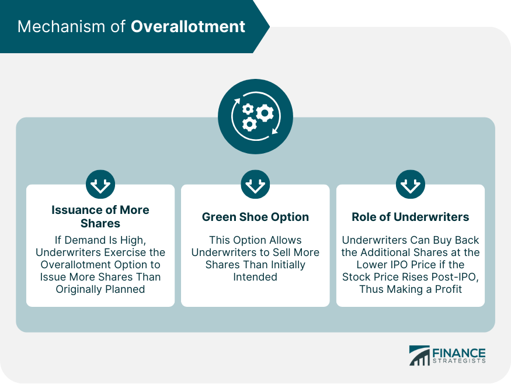

## Table of Contents

## What is overallotment in financial markets?

Overallotment is a practice in the financial markets where an underwriter, usually an investment bank, sells more shares of a new stock issue than what the issuing company initially planned to offer. This extra amount of shares, typically up to 15% more, is called the overallotment or "greenshoe" option. The underwriter does this to meet high demand from investors and to stabilize the stock price after it starts trading.

If the stock price goes up after the initial public offering (IPO), the underwriter can buy more shares from the issuing company at the original price and sell them at the higher market price. This helps the underwriter make more money and also helps keep the stock price from rising too quickly. If the stock price goes down, the underwriter can buy back the extra shares they sold, which helps support the stock price and prevents it from falling too much.

## How does overallotment work in an initial public offering (IPO)?

When a company wants to go public and sell its shares for the first time, it works with an underwriter, usually a big bank, to handle the process. The underwriter helps decide how many shares to sell and at what price. Sometimes, the underwriter thinks there might be a lot of people wanting to buy the shares, so they use something called an overallotment option, or greenshoe option. This means they can sell up to 15% more shares than the company originally planned. This extra amount helps make sure everyone who wants to buy shares can get some, and it also helps keep the price of the shares from going up too fast right away.

After the shares start trading, the underwriter watches the price closely. If the price goes up, they can buy more shares from the company at the original price and sell them at the higher market price. This makes more money for the underwriter and helps keep the price from rising too quickly. If the price goes down, the underwriter can buy back the extra shares they sold. This helps support the price and keeps it from falling too much. So, overallotment is a way to manage the stock price and make sure the IPO goes smoothly.

## What is the purpose of an overallotment option?

The main purpose of an overallotment option, also known as a greenshoe option, is to help manage the demand and price of a company's shares during an initial public offering (IPO). When a company goes public, it wants to make sure that there are enough shares for everyone who wants to buy them. The overallotment option allows the underwriter, usually a bank, to sell up to 15% more shares than the company originally planned. This extra amount helps meet the high demand from investors and prevents the share price from going up too quickly right after the IPO.

After the shares start trading, the underwriter uses the overallotment option to keep the price stable. If the share price goes up, the underwriter can buy more shares from the company at the original price and sell them at the higher market price. This not only makes more money for the underwriter but also helps keep the price from rising too fast. If the share price goes down, the underwriter can buy back the extra shares they sold, which helps support the price and prevents it from falling too much. So, the overallotment option is a tool to make sure the IPO goes smoothly and the share price stays stable.

## Who typically exercises the overallotment option?

The overallotment option, also called the greenshoe option, is usually used by the underwriter. The underwriter is a bank or a financial company that helps a business sell its shares to the public for the first time. When a company wants to go public, it works with an underwriter to figure out how many shares to sell and at what price. If the underwriter thinks a lot of people will want to buy the shares, they might decide to use the overallotment option. This means they can sell up to 15% more shares than the company originally planned.

After the shares start trading, the underwriter keeps an eye on the price. If the price goes up, the underwriter can buy more shares from the company at the original price and then sell them at the higher market price. This makes more money for the underwriter and helps keep the price from going up too fast. If the price goes down, the underwriter can buy back the extra shares they sold. This helps keep the price from dropping too much. So, the underwriter uses the overallotment option to help manage the price and make sure the IPO goes smoothly.

## What is the difference between overallotment and greenshoe option?

Overallotment and greenshoe option are actually the same thing, just with different names. When a company wants to go public and sell its shares for the first time, it works with a bank called an underwriter. The underwriter helps figure out how many shares to sell and at what price. Sometimes, the underwriter thinks a lot of people will want to buy the shares, so they use an overallotment or greenshoe option. This means they can sell up to 15% more shares than the company originally planned. This extra amount helps meet the high demand and keeps the price from going up too fast right away.

After the shares start trading, the underwriter watches the price closely. If the price goes up, the underwriter can buy more shares from the company at the original price and sell them at the higher market price. This makes more money for the underwriter and helps keep the price from rising too quickly. If the price goes down, the underwriter can buy back the extra shares they sold. This helps support the price and keeps it from falling too much. So, the overallotment or greenshoe option is a tool used by the underwriter to manage the stock price and make sure the IPO goes smoothly.

## How does overallotment affect the stock price?

Overallotment, or the greenshoe option, helps keep the stock price steady when a company goes public. When a company wants to sell its shares for the first time, they work with a bank called an underwriter. The underwriter might think a lot of people will want to buy the shares, so they can sell up to 15% more shares than the company planned. This extra amount helps make sure there are enough shares for everyone who wants to buy them and stops the price from going up too fast right away.

After the shares start trading, the underwriter keeps an eye on the price. If the price goes up, the underwriter can buy more shares from the company at the original price and sell them at the higher market price. This makes more money for the underwriter and also helps keep the price from rising too quickly. If the price goes down, the underwriter can buy back the extra shares they sold. This helps support the price and keeps it from falling too much. So, overallotment is a way to manage the stock price and make sure the IPO goes smoothly.

## What are the risks associated with overallotment for issuers?

When a company goes public and uses overallotment, there are some risks they need to think about. One big risk is that if the stock price goes down after the IPO, the company might have to sell more shares to the underwriter at a lower price than they wanted. This can mean less money for the company because they're selling shares for less than they hoped. Also, if the underwriter buys back the extra shares to support the price, it might make the company look like it's not doing well, which can hurt its reputation.

Another risk is that if the stock price goes up a lot, the underwriter might make more money than the company expected. This can make the company feel like they didn't get a fair deal because the underwriter is making a lot of money from the extra shares. It's important for the company to work closely with the underwriter to understand these risks and make sure they're okay with how the overallotment might affect their IPO.

## What are the benefits of overallotment for underwriters?

Overallotment, or the greenshoe option, is really helpful for underwriters when they help a company go public. It lets them sell more shares than the company planned, up to 15% more. This is good because if a lot of people want to buy the shares, the underwriter can make sure everyone gets some. It also means the underwriter can make more money. If the stock price goes up after the IPO, the underwriter can buy more shares from the company at the original price and sell them at the higher market price. This makes them extra profit.

Another benefit is that overallotment helps the underwriter keep the stock price stable. If the price starts to go down after the IPO, the underwriter can buy back the extra shares they sold. This helps support the price and stops it from falling too much. By doing this, the underwriter can show that they are in control and can manage the stock well. This can make investors feel more confident in the stock and the IPO process. So, overallotment is a useful tool for underwriters to manage demand, make more money, and keep the stock price steady.

## Can you explain the regulatory framework governing overallotment?

Overallotment, or the greenshoe option, is used when a company goes public and sells its shares for the first time. It's allowed by rules set by groups like the U.S. Securities and Exchange Commission (SEC). The SEC makes sure that companies and banks follow the rules when they do an IPO. The overallotment option lets the bank, called the underwriter, sell up to 15% more shares than the company planned. This helps meet high demand and keeps the stock price from going up too fast right away.

The rules say that the underwriter has to tell everyone about the overallotment option before the IPO happens. They have to write it in the company's prospectus, which is a document that tells people about the company and the IPO. The underwriter also has to follow rules about how they can buy and sell the extra shares. They have to do it in a way that's fair and doesn't trick people. So, the regulatory framework makes sure that overallotment is used the right way and helps the IPO go smoothly.

## How is the overallotment option priced?

The overallotment option, also called the greenshoe option, is priced the same as the other shares in the initial public offering (IPO). When a company goes public and sells its shares for the first time, it works with a bank called an underwriter. They decide together how much each share will cost. The underwriter can then sell up to 15% more shares than the company planned, and these extra shares are sold at the same price as the original shares.

If the stock price goes up after the IPO, the underwriter can buy more shares from the company at the original price and sell them at the higher market price. This helps the underwriter make more money. If the stock price goes down, the underwriter can buy back the extra shares they sold at the market price, which might be lower than the original price. This helps support the stock price and keeps it from falling too much. So, the overallotment option is always priced the same as the other shares in the IPO, which makes things fair and clear for everyone involved.

## What historical examples illustrate the use of overallotment?

One famous example of overallotment happened when Google went public in 2004. Google wanted to sell shares to the public for the first time, and they worked with banks to help them do it. The banks thought a lot of people would want to buy Google's shares, so they used the overallotment option. This meant they could sell more shares than Google planned, up to 15% more. When Google's shares started trading, the price went up a lot. The banks bought more shares from Google at the original price and sold them at the higher market price, making extra money and helping keep the price from going up too fast.

Another example is when Visa went public in 2008. Visa also used overallotment because they thought there would be high demand for their shares. The banks sold more shares than Visa planned, and when the stock price went up after the IPO, the banks made more money by buying shares at the original price and selling them at the higher market price. This helped keep the stock price stable and made sure there were enough shares for everyone who wanted to buy them. These examples show how overallotment can help manage demand and keep the stock price steady during an IPO.

## How do market conditions influence the decision to use an overallotment option?

Market conditions play a big role in deciding whether to use an overallotment option during an initial public offering (IPO). If the market is doing well and a lot of people are interested in buying new shares, the underwriter might think there will be high demand for the company's stock. In this case, they might decide to use the overallotment option to sell more shares than the company planned. This helps make sure there are enough shares for everyone who wants to buy them and can also help the underwriter make more money if the stock price goes up after the IPO.

On the other hand, if the market is not doing so well or if there is less interest in new stocks, the underwriter might be more cautious about using the overallotment option. They might worry that selling too many shares could make the stock price go down even more. So, they would only use the overallotment option if they are sure there is enough demand to support the extra shares. This way, they can help keep the stock price stable and manage the IPO more smoothly.

## References & Further Reading

[1]: ["The Economics of IPO Stabilization, Syndicates, and Post-IPO Performance"](https://www.academia.edu/14147874/The_Economics_of_IPO_Stabilisation_Syndicates_and_Naked_Shorts) by Aggarwal, R. (2000). Journal of Finance, 55(3), 1075-1103.

[2]: ["Advances in Financial Machine Learning"](https://www.amazon.com/Advances-Financial-Machine-Learning-Marcos/dp/1119482089) by Marcos Lopez de Prado

[3]: Aggarwal, R. (2003). ["Allocation of Initial Public Offerings and Flipping Activity."](https://www.sciencedirect.com/science/article/pii/S0304405X02002507)00276-4) Journal of Financial Economics, 68(1), 111-135.

[4]: ["Quantitative Trading: How to Build Your Own Algorithmic Trading Business"](https://www.amazon.com/Quantitative-Trading-Build-Algorithmic-Business/dp/1119800064) by Ernest P. Chan

[5]: Riordan, R., & Storkenmaier, A. (2012). ["Latency, Liquidity and Price Discovery"](https://www.sciencedirect.com/science/article/pii/S1386418112000237). Journal of Financial Markets, 15(4), 416-437.

[6]: ["Machine Learning for Algorithmic Trading"](https://www.amazon.com/Machine-Learning-Algorithmic-Trading-alternative/dp/1839217715) by Stefan Jansen

[7]: Busaba, W. Y., Benveniste, L. M., & Guo, R. (2001). ["The Option to Withdraw IPOs during the Premarket"](https://papers.ssrn.com/sol3/papers.cfm?abstract_id=1122524). Journal of Financial Economics, 60(1), 73-102.