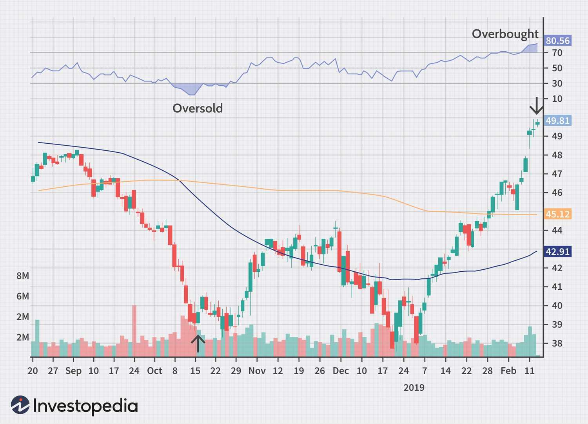

The landscape of stock market investment has transformed dramatically with the advent of modern technology, offering investors a suite of strategies to enhance their financial returns. Once a domain dominated by traditional trading floors and manual processes, the market has witnessed a technological revolution that enables both novice and expert investors to engage with the stock market more effectively and efficiently.

This article navigates the essential components of successful investment in the stock market, focusing on investment strategies, stock market analysis, identifying overbought stocks, and the burgeoning field of algorithmic trading. These elements form the cornerstone of an informed investment approach, allowing market participants to navigate the complexities of financial markets.



Understanding these concepts is crucial as they provide the tools necessary for crafting investment strategies that can withstand the ebb and flow of market conditions. Investment strategies vary widely, catering to different risk appetites and objectives, from conservative value investing to aggressive growth-oriented approaches. Stock market analysis further enhances these strategies by providing insights into market trends and stock valuation, employing both technical and fundamental analysis methods.

Furthermore, the recognition of overbought stocks—stocks that have experienced rapid price increases—is crucial for risk management. Such stocks often signal potential price corrections, necessitating timely exit strategies. The rise of algorithmic trading has introduced sophisticated means of executing trades with speed and precision, leveraging algorithms to analyze large data sets and automate trading decisions.

This comprehensive guide aims to equip investors with the knowledge required to make informed, strategic decisions. By adapting to market dynamics with well-crafted investment strategies, investors can not only optimize their returns but also safeguard their portfolios against market volatility. As the investment ecosystem continues to evolve, staying informed is essential for success in the ever-changing world of stock market investment.

## Table of Contents

## Investment Strategies: An Overview

Investment strategies are essential for navigating the complexities of the stock market, as they directly influence the potential outcomes of investors' ventures. These strategies are designed to align with varying risk appetites and market conditions, catering to diverse financial objectives and circumstances.

One of the most enduring strategies is value investing, which involves identifying undervalued stocks that have strong fundamentals. Value investors seek stocks trading below their intrinsic value, often determined through rigorous [fundamental analysis](/wiki/fundamental-analysis). This approach can present opportunities for significant returns when the market corrects its undervaluation. In contrast, growth investing focuses on companies expected to grow at an above-average rate compared to their industry or the market. Growth investors typically emphasize companies with high potential for earnings expansion, even if their stocks are not currently undervalued.

Diversification is a crucial element across numerous investment strategies, serving as a risk management tool to spread potential losses across various asset classes, industries, or geographic regions. By holding a diverse portfolio, investors can mitigate risks associated with individual stock [volatility](/wiki/volatility-trading-strategies), thereby maximizing their return potential over time. For example, a diversified portfolio might include a mix of stocks, bonds, and international assets to reduce exposure to any single market downturn.

Tailoring investment strategies to individual financial goals involves assessing personal finance conditions, risk tolerance, and time horizons. For instance, a young investor with a longer time horizon may opt for aggressive growth strategies, while a retiree may prioritize income stability through dividend-paying stocks.

Fundamental and technical analysis tools are indispensable in executing these investment strategies. Fundamental analysis involves examining financial statements, industry conditions, and economic factors to assess a stock's intrinsic value. Conversely, technical analysis leverages historical price data and chart patterns to forecast future price movements. Investors often utilize technical indicators such as moving averages, the Relative Strength Index (RSI), and Bollinger Bands to guide their trade timing and strategy adjustments.

Integrating both fundamental and technical analysis can offer a more comprehensive understanding of market opportunities, allowing investors to craft well-informed strategies tailored to meet their financial aspirations. By combining these analytical frameworks, investors can increase their chances of identifying lucrative opportunities and mitigating potential risks, ultimately leading to a more robust and successful investment journey.

## Stock Market Analysis: Techniques and Tools

Stock market analysis is integral to making informed investment choices, offering insights into market trends and stock performance. Two primary methodologies used for this purpose are technical analysis and fundamental analysis, each serving distinct roles in evaluating stocks.

**Technical Analysis**

Technical analysis leverages charts and indicators to forecast future price movements by examining historical price and [volume](/wiki/volume-trading-strategy) data. Traders and analysts use various tools, such as the Relative Strength Index (RSI) and Bollinger Bands, to detect potential buying or selling opportunities. 

- **Relative Strength Index (RSI)** is a momentum oscillator that measures the speed and change of price movements. RSI values range from 0 to 100 and are typically used to identify overbought or oversold conditions. An RSI above 70 suggests that a stock may be overbought, while a reading below 30 indicates a possible oversold condition.

- **Bollinger Bands** consist of a middle band (a simple moving average) and two outer bands, which are standard deviations away from the middle band. They adapt to volatility changes in the market; when prices hit the upper band, a stock might be overbought, while approaching the lower band may signal overselling.

The primary strength of technical analysis is its ability to identify short-term trading opportunities. However, it has limitations, such as being less effective in predicting long-term trends and being prone to false signals, particularly in volatile markets.

**Fundamental Analysis**

Fundamental analysis assesses a stock's intrinsic value by evaluating economic factors, company financials, and market conditions. This approach aims to determine whether a stock is undervalued or overvalued compared to its intrinsic worth.

- Analysts scrutinize factors such as revenue, earnings, return on equity, and profit margins. For instance, the price-to-earnings (P/E) ratio—a common valuation metric—compares a company’s current share price to its per-share earnings, assisting in evaluating whether a stock is fairly priced.

- Economic indicators, including GDP growth rates, inflation, and interest rates, are also considered to understand the broader environment impacting the stock's performance.

The strength of fundamental analysis lies in its long-term perspective, helping investors make decisions based on fundamental value rather than market sentiment. However, it requires comprehensive research and a deep understanding of the market, which can be time-consuming and complex.

**Combining Technical and Fundamental Analysis**

Understanding the strengths and limitations of each method is crucial for investors. By combining technical and fundamental analysis, investors can cultivate more robust strategies. For example, they might use fundamental analysis to select stocks with strong growth prospects and technical analysis to time their entry and [exit](/wiki/exit-strategy) points effectively. This integrated approach allows for a more comprehensive evaluation of investment opportunities, potentially leading to better-informed and more profitable decisions. 

In conclusion, mastering both technical and fundamental analysis positions investors advantageously within the stock market, enabling them to capitalize on diverse opportunities.

## Overbought Stocks: Identification and Implications

Overbought stocks refer to securities that have experienced a significant increase in buying interest, causing their prices to rise to levels beyond their intrinsic value. This condition typically signals that a stock is overvalued in the short term, increasing the likelihood of a price correction. Investors aiming to identify overbought stocks often rely on technical indicators, with the Relative Strength Index (RSI) being one of the most widely used tools.

The RSI is a [momentum](/wiki/momentum) oscillator that measures the speed and change of price movements, ranging from 0 to 100. Typically, a stock is considered overbought when the RSI exceeds 70. The formula for calculating RSI is:

$$

\text{RSI} = 100 - \frac{100}{1 + \frac{\text{Average Gain}}{\text{Average Loss}}} 
$$

This indicator provides crucial insights into whether the stock price is likely to revert or undergo a correction, offering a valuable signal for investors to potentially adjust their positions.

Owning overbought stocks carries certain risks, primarily the risk of price correction. A price correction can occur when the excessive upward movement of the stock price is unsustainable, leading to a subsequent decline as selling pressure increases. Investors must be vigilant of these risks to prevent significant financial setbacks.

To manage investments in overbought stocks effectively, investors can employ several strategies. Timing exits is crucial; investors should consider selling or reducing holdings when a stock reaches overbought levels indicated by the RSI or other technical signals. Additionally, evaluating broader market signals, such as macroeconomic indicators or sector-specific trends, can further inform exit strategies, allowing investors to minimize potential losses.

Balancing the opportunities and risks associated with overbought stocks necessitates informed and timely decision-making. While such stocks can further appreciate in price, driven by continued market momentum and speculation, the inherent volatility demands close monitoring. Investors should be prepared to act swiftly to align their portfolios with their risk tolerance and investment goals.

In conclusion, understanding the characteristics of overbought stocks and the implications of their price movements is vital for making informed investment decisions. By leveraging technical analysis tools like the RSI and maintaining a strategic approach to managing exits, investors can navigate the complexities of overbought market conditions.

## Algorithmic Trading: Revolution in Market Dynamics

Algorithmic trading, often referred to as algo trading, utilizes computer algorithms to make trading decisions at high speed and precision. These algorithms can process vast amounts of market data in seconds, identifying patterns and executing trades far more efficiently than human traders.

One of the primary strategies employed in [algorithmic trading](/wiki/algorithmic-trading) is [arbitrage](/wiki/arbitrage). Arbitrage involves taking advantage of price discrepancies in different markets or financial instruments. An algorithm detects these discrepancies and executes simultaneous buy and sell orders to profit from the difference. This strategy requires a platform that minimizes latency, ensuring trades are completed before market conditions change.

Another prevalent strategy is trend-following, which relies on identifying and capitalizing on market trends. Algorithms analyze historical price data, applying statistical methods to detect potential upward or downward trends. Once a trend is identified, the algorithm automatically executes trades in the trend's direction, potentially increasing profitability by staying in sync with market movements.

High-frequency trading ([HFT](/wiki/high-frequency-trading-strategies)) is a subset of algorithmic trading characterized by a high turnover rate and the execution of numerous trades within microseconds. HFT strategies massively depend on the speed of execution, relying on algorithms to place trades across various markets to capitalize on minute price differences. Despite its potential for profit, HFT has been scrutinized for contributing to market volatility.

The benefits of algorithmic trading are clear: increased execution speed, elimination of human error, and the ability to backtest strategies using historical data. These advantages, however, come with challenges. The impact of algorithmic trading on market dynamics is significant; it can contribute to increased volatility and reduced [liquidity](/wiki/liquidity-risk-premium) in certain circumstances. Moreover, regulators express concerns about market fairness and the potential for market manipulation through algorithmic strategies.

Understanding algorithmic trading equips investors with insights into market behavior and uncovers potential investment strategies. As algorithms manage a growing proportion of trading volumes, they shape price movements and liquidity in ways that can offer investment opportunities, especially for those who can interpret the underlying signals these algorithms generate.

Investors looking to incorporate algorithmic trading into their strategies should consider both the technological requirements and regulatory implications. Proficiency in programming languages, access to real-time market data, and robust algorithm testing are essential. Furthermore, investors must stay abreast of evolving regulations governing algorithmic trading to ensure compliance and mitigate risks associated with its implementation.

## Integrating Strategies for Optimal Investment

The integration of traditional investment strategies with technological advancements, such as algorithmic trading, has opened new avenues for optimizing stock market investments. This fusion enables investors to harness the strengths of both approaches, creating opportunities to develop robust investment portfolios that can navigate dynamic market environments.

By utilizing market analysis tools, investors can effectively align their strategies with current market conditions and technological capabilities. In practice, this involves a comprehensive assessment of market trends, asset performance, and economic indicators. For example, combining technical analysis, which includes studying price charts and market patterns, with the speed and efficiency of algorithmic trading enables more precise entry and exit points in trades. The use of automated systems can process vast amounts of data at an incredible pace, identifying opportunities that might not be visible through traditional analysis alone. Python, with its rich libraries such as Pandas and NumPy, is frequently employed to streamline the analysis and trading processes. Here is an example of how Python can analyze moving averages to inform trading decisions:

```python
import pandas as pd
import numpy as np

# Example DataFrame with stock prices
data = {'Date': pd.date_range(start='1/1/2022', periods=100),
        'Close': np.random.rand(100) * 100}
df = pd.DataFrame(data)

# Calculate moving averages
df['SMA_20'] = df['Close'].rolling(window=20).mean()
df['SMA_50'] = df['Close'].rolling(window=50).mean()

# Determine buy/sell signals
df['Signal'] = np.where(df['SMA_20'] > df['SMA_50'], 'Buy', 'Sell')

print(df[['Date', 'Close', 'SMA_20', 'SMA_50', 'Signal']].tail())
```

Effective integration of these strategies also necessitates diversification. This involves spreading investments across various asset classes to reduce risk exposure. For instance, an investor might use algorithmic trading to capitalize on short-term market inefficiencies in equities while employing value investing principles for long-term investments in bonds or real estate. This strategy can cushion against market volatility, thereby safeguarding the investor's capital.

To stay ahead of market trends, it is imperative for investors to continuously update and refine their strategies. This involves keeping abreast of technological advancements, regulatory changes, and evolving market conditions. The landscape of financial markets is constantly changing, with new technologies and methods rapidly transforming how trades are executed and investments are managed. By continuously learning and adapting to these changes, investors can enhance their competitive edge and foster long-term success.

Ultimately, the ability to blend traditional investment strategies with modern technological tools empowers investors to create a diversified and adaptive portfolio. This approach not only capitalizes on the inherent strengths of each method but also positions investors to better respond to the ever-evolving dynamics of the stock market.

## Conclusion

The integration of investment strategies, stock market analysis, overbought stock identification, and algorithmic trading serves as a robust framework for enhancing investment outcomes. By effectively combining these elements, investors can make more informed decisions, leveraging both traditional methodologies and modern technological advancements. Staying informed and flexible is crucial, as the dynamic nature of the stock market demands adaptability and the continuous application of diverse strategies.

This article has equipped investors with valuable insights into the complexity of stock market investment. By understanding different strategies, investors can navigate market fluctuations and potential pitfalls effectively. The key lies in integrating these strategies harmoniously, allowing investors to optimize returns and minimize risks. As such, staying updated with market developments and evolving techniques enhances one's ability to respond proactively to changes.

Future-proofing investment strategies necessitates continuous learning and adaptation. With technological advancements like algorithmic trading becoming more prevalent, keeping abreast of these developments ensures that investors remain competitive. The ability to adapt to new tools and changing market conditions will be a hallmark of successful investors in the future.

Investors are encouraged to explore these strategies further to refine their approaches and achieve their financial goals. By adopting a comprehensive and flexible framework, they can better position themselves to capitalize on opportunities in the ever-changing stock market landscape. Continuous learning and strategic adaptation are essential for sustained success and achieving desired financial outcomes.

## References & Further Reading

[1]: ["Advances in Financial Machine Learning"](https://www.amazon.com/Advances-Financial-Machine-Learning-Marcos/dp/1119482089) by Marcos Lopez de Prado

[2]: ["Quantitative Trading: How to Build Your Own Algorithmic Trading Business"](https://www.amazon.com/Quantitative-Trading-Build-Algorithmic-Business/dp/1119800064) by Ernest P. Chan

[3]: ["Evidence-Based Technical Analysis: Applying the Scientific Method and Statistical Inference to Trading Signals"](https://www.amazon.com/Evidence-Based-Technical-Analysis-Scientific-Statistical/dp/0470008741) by David Aronson

[4]: Bergstra, J., Bardenet, R., Bengio, Y., & Kégl, B. (2011). ["Algorithms for Hyper-Parameter Optimization."](https://dl.acm.org/doi/10.5555/2986459.2986743) Advances in Neural Information Processing Systems 24.

[5]: ["Machine Learning for Algorithmic Trading"](https://github.com/stefan-jansen/machine-learning-for-trading) by Stefan Jansen