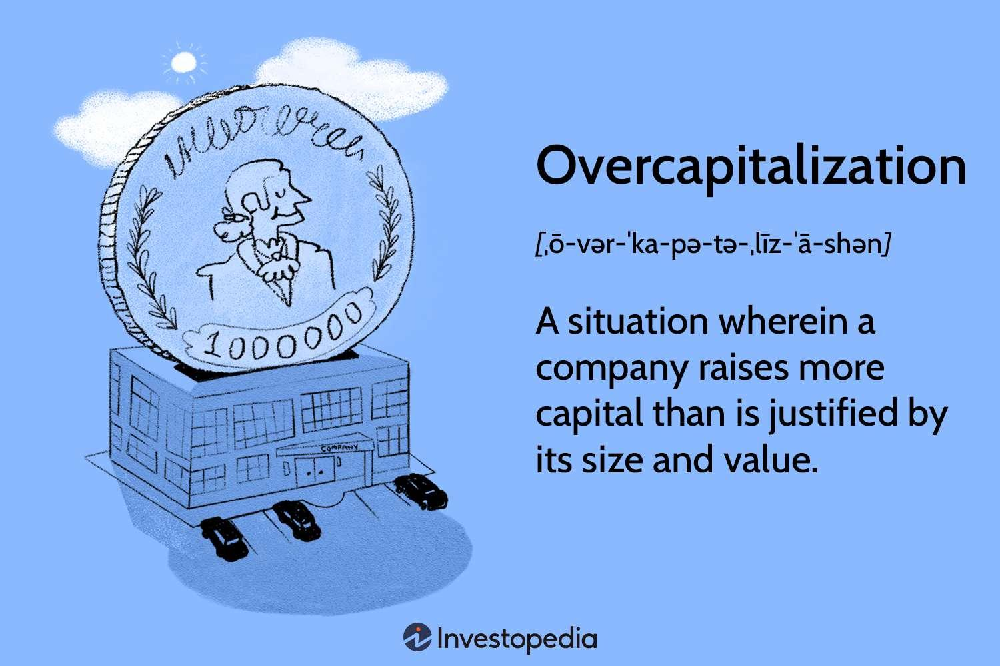

## Table of Contents

## What is overcapitalization?

Overcapitalization happens when a company has more money invested in it than it can earn back. This can happen if a company borrows too much money or issues too many stocks. When a company is overcapitalized, it might struggle to pay back its debts or give returns to its shareholders. This can make the company less valuable and can lead to financial problems.

For example, if a company takes out a big loan to buy new equipment, but the equipment doesn't help the company make more money, the company might not be able to pay back the loan. This is a problem because the company now has more debt than it can handle. Overcapitalization can lead to lower profits, and in some cases, the company might even go bankrupt if it can't fix the problem.

## What are the common causes of overcapitalization?

Overcapitalization often happens when a company raises too much money through loans or by selling stocks. This can happen if the company thinks it needs more money to grow or to buy new things, like machines or buildings. But if these new things don't help the company make more money, the company ends up with too much debt or too many shareholders to pay back. For example, a company might borrow a lot of money to expand, but if the expansion doesn't bring in enough new customers, the company can't pay back the loans.

Another cause of overcapitalization is when a company's earnings drop, but its costs stay the same or go up. This can happen if the market changes and people stop buying the company's products, or if the costs of running the business increase. When this happens, the company still has to pay back its debts and give returns to its shareholders, but it doesn't have enough money coming in to do so. This mismatch between what the company earns and what it owes can lead to overcapitalization.

Sometimes, overcapitalization can also happen because of poor management decisions. If the people running the company make bad choices about how to spend the company's money, like investing in projects that don't pay off, the company can end up with too much capital tied up in unprofitable ventures. This can make it hard for the company to meet its financial obligations and can lead to serious financial problems.

## How does overcapitalization affect a company's financial health?

Overcapitalization can hurt a company's financial health a lot. When a company has more money invested in it than it can earn back, it struggles to pay back its debts and give returns to its shareholders. This can make the company's value go down. If the company borrowed money to buy new things, like machines or buildings, but these things don't help the company make more money, the company ends up with too much debt. This can lead to lower profits and can make it hard for the company to keep running smoothly.

If a company's earnings drop but its costs stay the same or go up, overcapitalization can make things even worse. The company still has to pay back its debts and give returns to its shareholders, but it doesn't have enough money coming in to do so. This mismatch between what the company earns and what it owes can lead to serious financial problems. In some cases, if the company can't fix the problem, it might even go bankrupt. Overcapitalization can also happen because of poor management decisions, like investing in projects that don't pay off, which can tie up the company's money in unprofitable ventures and further harm its financial health.

## Can you provide examples of companies that have experienced overcapitalization?

One example of a company that experienced overcapitalization is General Motors (GM). Before the 2008 financial crisis, GM had taken on a lot of debt to expand its operations and buy new factories. But when the economy slowed down, people stopped buying as many cars. GM's earnings dropped, but it still had to pay back its big loans. This made it hard for GM to keep up with its financial obligations, and in 2009, the company had to declare bankruptcy.

Another example is the telecommunications company WorldCom. In the late 1990s and early 2000s, WorldCom borrowed a lot of money to grow its business and buy other companies. But the new businesses didn't bring in enough money to cover the costs of the loans. WorldCom's earnings were not enough to pay back its debts, and in 2002, the company filed for bankruptcy. It was one of the largest corporate bankruptcies in U.S. history at the time.

## What are the signs that a company might be overcapitalized?

One sign that a company might be overcapitalized is if it has a lot of debt but its earnings are not growing. If a company borrowed a lot of money to buy new things like machines or buildings, but these things are not helping the company make more money, it can be a problem. The company still has to pay back its loans, but if its earnings are not enough to cover the costs, it might struggle to meet its financial obligations.

Another sign is if the company's stock price is going down. When investors see that a company has too much debt and not enough earnings, they might sell their stocks, which makes the stock price drop. This can make it harder for the company to raise more money by selling stocks in the future. If a company is having trouble paying dividends to its shareholders because it has too much debt, that's another sign of overcapitalization. These signs can show that a company is in financial trouble and needs to fix its problems before they get worse.

## How can overcapitalization impact shareholders?

Overcapitalization can hurt shareholders a lot. When a company has too much debt and not enough earnings, it might not be able to pay dividends to its shareholders. Dividends are like a share of the company's profits that shareholders get. If the company can't pay dividends, shareholders don't get any money back from their investment. This can make shareholders unhappy and they might decide to sell their stocks.

When shareholders sell their stocks because they are worried about the company's financial health, the stock price can go down. A lower stock price means that the value of the shareholders' investment goes down too. If the company's problems get really bad and it goes bankrupt, shareholders might lose all their money. So, overcapitalization can make shareholders lose money and feel less confident about the company's future.

## What strategies can companies use to avoid overcapitalization?

Companies can avoid overcapitalization by being careful about how much money they borrow or raise from selling stocks. They should only take on debt if they are sure they can use the money to make more money. For example, if a company wants to buy new machines, it should make sure those machines will help it make more products and earn more money. If the company's earnings are not growing, it should not borrow more money or sell more stocks, because that can lead to overcapitalization.

Another way to avoid overcapitalization is by keeping costs under control. If a company's earnings drop, it should try to cut costs so it can still pay back its debts and give returns to shareholders. This might mean reducing expenses like salaries or rent, or finding cheaper ways to do things. Good management is also important. The people running the company should make smart decisions about where to spend money, so they don't invest in projects that don't pay off. By being careful with money and managing costs well, companies can avoid the problems that come with overcapitalization.

## How does overcapitalization differ from undercapitalization?

Overcapitalization happens when a company has too much money invested in it compared to what it can earn back. This can happen if a company borrows too much money or sells too many stocks. When a company is overcapitalized, it might struggle to pay back its debts or give returns to its shareholders. This can make the company less valuable and can lead to financial problems. For example, if a company takes out a big loan to buy new equipment, but the equipment doesn't help the company make more money, the company might not be able to pay back the loan.

Undercapitalization is the opposite problem. It happens when a company doesn't have enough money to run its business well. This can happen if a company doesn't borrow enough money or doesn't sell enough stocks. When a company is undercapitalized, it might not have enough money to buy the things it needs, like machines or buildings. This can make it hard for the company to grow and can lead to financial problems too. For example, if a company needs new equipment to make more products but can't afford it, the company might not be able to meet customer demand and could lose money.

## What role does market analysis play in preventing overcapitalization?

Market analysis helps companies understand what people want to buy and how much they are willing to pay. By doing market analysis, a company can figure out if it's a good idea to spend money on new things like machines or buildings. If the market analysis shows that people will buy more products because of the new things, then it might be a good investment. But if the market analysis shows that people won't buy more products, then the company should not spend the money. This way, market analysis helps prevent overcapitalization by making sure the company only spends money on things that will help it make more money.

If a company doesn't do market analysis, it might make bad decisions about where to spend its money. For example, a company might think it's a good idea to borrow a lot of money to expand, but if it doesn't check the market first, it might find out later that people don't want to buy the new products. This can lead to overcapitalization because the company has too much debt and not enough earnings to pay it back. By using market analysis, a company can avoid these problems and make smarter choices about how to use its money.

## How can financial ratios help in identifying overcapitalization?

Financial ratios can help show if a company is overcapitalized by looking at how much debt it has compared to how much money it is making. One important ratio is the debt-to-equity ratio, which compares the company's total debt to its total equity. If this ratio is very high, it means the company has a lot of debt compared to what shareholders have invested. This can be a sign of overcapitalization because the company might struggle to pay back its loans if its earnings are not growing. Another useful ratio is the interest coverage ratio, which shows if the company's earnings are enough to pay the interest on its debt. If this ratio is low, it means the company's earnings are not enough to cover its interest payments, which can also be a sign of overcapitalization.

Another ratio that can help identify overcapitalization is the return on assets (ROA) ratio. This ratio measures how well a company is using its assets to make money. If the ROA is low, it means the company's assets are not helping it earn enough money, which can be a problem if the company has a lot of debt. By looking at these ratios, a company can see if it has too much debt and not enough earnings, which are key signs of overcapitalization. Using financial ratios helps companies keep an eye on their financial health and make better decisions about how to manage their money.

## What are the long-term effects of overcapitalization on a company's growth?

Overcapitalization can really hurt a company's growth in the long run. When a company has too much debt and not enough earnings, it might not have enough money to invest in new projects or expand its business. This can make it hard for the company to grow because it can't buy new machines or open new stores. If the company's stock price goes down because of overcapitalization, it might also be harder to raise more money by selling stocks. This can slow down the company's growth even more because it doesn't have the money it needs to get bigger.

In the long term, overcapitalization can also make it hard for a company to stay competitive. If the company can't invest in new technology or improve its products because it's too busy paying back its debts, other companies might get ahead. This can make the company lose customers and fall behind in the market. If the problem gets really bad, the company might even go bankrupt, which would stop its growth completely. So, overcapitalization can make it very hard for a company to grow and stay strong in the long run.

## How do economic cycles influence the occurrence of overcapitalization?

Economic cycles can make overcapitalization more likely to happen. During good times, when the economy is growing, companies might feel confident and borrow a lot of money to expand their business. They might think that the good times will last forever and that they will be able to pay back their loans easily. But if the economy slows down and people stop buying as much, the company's earnings might drop. If the company still has to pay back a lot of debt but doesn't have enough money coming in, it can become overcapitalized.

When the economy goes into a recession, overcapitalization can become a big problem. Companies that borrowed a lot of money during the good times might find it hard to pay back their loans when their earnings go down. This can make their financial situation worse and can lead to lower profits or even bankruptcy. So, economic cycles can make overcapitalization more likely because companies might take on too much debt during good times and then struggle to pay it back when the economy turns bad.

## References & Further Reading

[1]: Bergstra, J., Bardenet, R., Bengio, Y., & Kégl, B. (2011). ["Algorithms for Hyper-Parameter Optimization."](https://dl.acm.org/doi/10.5555/2986459.2986743) Advances in Neural Information Processing Systems 24.

[2]: ["Advances in Financial Machine Learning"](https://www.amazon.com/Advances-Financial-Machine-Learning-Marcos/dp/1119482089) by Marcos Lopez de Prado

[3]: ["Evidence-Based Technical Analysis: Applying the Scientific Method and Statistical Inference to Trading Signals"](https://books.google.com/books/about/Evidence_Based_Technical_Analysis.html?id=MeoJAQAAMAAJ) by David Aronson

[4]: ["Machine Learning for Algorithmic Trading"](https://github.com/stefan-jansen/machine-learning-for-trading) by Stefan Jansen

[5]: ["Quantitative Trading: How to Build Your Own Algorithmic Trading Business"](https://www.amazon.com/Quantitative-Trading-Build-Algorithmic-Business/dp/1119800064) by Ernest P. Chan