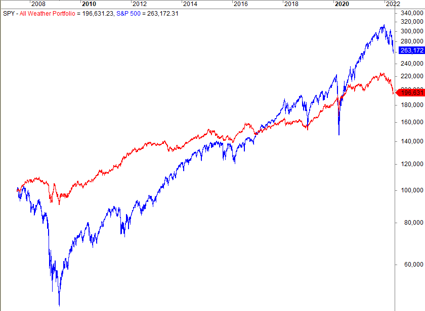

Overcast weather refers to a state where the sky is predominantly covered by clouds, typically resulting in minimal sunlight reaching the Earth's surface. This condition is characterized by a complete or near-complete coverage of clouds, leading to subdued and diffused lighting conditions. In weather forecasting, understanding overcast conditions is crucial as they can influence a variety of atmospheric and environmental factors, such as temperature regulation, visibility, and precipitation patterns. These elements play a fundamental role in both short-term weather predictions and long-term climate modeling.

Algorithmic trading represents a significant advancement in trading mechanisms, relying on complex algorithms and large datasets to execute trades with precision and speed. This approach leverages the computational power to analyze market conditions, historical data, and other variables to make informed trading decisions. Algorithmic trading has become a dominant strategy in financial markets, with algorithms capable of processing vast amounts of information much more quickly than human traders.



The intersection between weather conditions, particularly overcast skies, and algorithmic trading presents unique opportunities and challenges. Weather can exert a substantial psychological and emotional influence on market participants, affecting behaviors and trading patterns in often subtle but significant ways. Cloud cover and gloomy weather might contribute to more cautious trading, possibly impacting market volatility and liquidity. Therefore, understanding these weather-related influences is crucial for developing more robust trading algorithms that can anticipate and respond to market fluctuations.

The purpose of this article is to explore the connections between overcast weather conditions and algorithmic trading, examining how meteorological data can be integrated into trading strategies to potentially enhance performance. By investigating this interplay, we aim to shed light on innovative approaches that combine weather forecasts with algorithmic models, paving the way for sophisticated trading solutions that consider a broader array of influential factors.

## Table of Contents

## Understanding Overcast Weather Patterns

Overcast weather is characterized by a complete or nearly complete coverage of the sky by clouds, resulting in minimal direct sunlight reaching the earth's surface. This condition typically occurs when the cloud cover exceeds 90%, leading to a uniform layer of clouds, often consisting of stratus or nimbostratus formations. Overcast weather is generally associated with a dull, gray appearance of the sky, reduced visibility, and the potential for precipitation, although rain is not always present. 

The influence of overcast conditions on market sentiment and trading behavior has been a subject of interest within behavioral finance. The psychological impact of weather on human emotions is well-documented, and overcast days are often perceived as dull or depressing, potentially leading to more cautious, risk-averse behavior among traders. The mood hypothesis suggests that negative mood induced by gloomy weather may lead to less optimistic forecasts and decision-making, affecting market activity and trading volumes.

Historical data and studies investigating weather's impact on financial markets provide insights into the correlation between overcast weather and market performance. A notable study by Hirshleifer and Shumway (2003) examined the relationship between cloud cover and stock returns across several major international exchanges. The study found a significant negative correlation, suggesting that higher levels of cloud cover, corresponding with overcast conditions, were associated with lower daily stock returns. This pattern supports the notion that weather-induced mood changes can have measurable effects on financial markets.

Further research by Cao and Wei (2005) expanded on these findings by analyzing the impacts of both cloud cover and temperature on stock returns. The study concluded that cloud cover and temperature independently and jointly exerted significant effects on stock market returns, reinforcing the hypothesis that weather conditions, including overcast, could influence investor behavior and market outcomes. These findings highlight the importance of considering non-economic factors, such as weather, in understanding market dynamics and developing trading strategies.

## The Role of Cloud Cover in Financial Markets

Cloud cover, an essential aspect of weather conditions, exerts substantial influence on financial markets by affecting the psychological and emotional states of traders. Numerous studies have suggested a correlation between weather patterns, specifically overcast conditions, and trading behavior. This phenomenon is rooted in the cognitive biases and emotional responses humans exhibit in response to their environment.

Overcast weather can instill a sense of gloominess that may lead traders to become more risk-averse. This cautious behavior is often a consequence of the psychological tendency known as the "affect heuristic," where individuals rely on their current emotional state to make decisions. Under cloudy conditions, negative moods could potentially prevail, inducing a preference for safer investments rather than riskier assets. For instance, a trader feeling less optimistic due to gloomy weather might opt for bonds or other conservative investments rather than equities or other volatile financial products.

Research has put forth evidence supporting the link between weather conditions and market performance. A notable study by Hirshleifer and Shumway (2003) found that stock market returns were significantly correlated with sunshine in major cities around the world. They demonstrated that sunshine, representing clear weather, often led to positive or high returns while cloudy or overcast conditions led to either negative or lower market returns. These findings highlight the impact of weather-induced emotional states on economic decisions, although the extent and nature of this influence can vary.

Further analyses in behavioral finance highlight that overcast weather might exacerbate cognitive biases such as loss aversion, where the pain of losses significantly outweighs the pleasure of equivalent gains, prompting traders to avoid losses at greater costs. The potential for cautious trading behavior under such emotional and cognitive influences underscores the complexity of financial decision-making and the subtle, yet meaningful, role that weather factors, like cloud cover, can play in shaping market dynamics. Therefore, understanding these psychological aspects is crucial for developing robust trading strategies that anticipate and mitigate the influence of weather-induced biases.

## Algorithmic Trading: An Overview

Algorithmic trading, often referred to as algo trading, represents a revolutionary approach in modern financial markets. It involves using computer programs and algorithms to execute trades at speeds and frequencies that are impossible for human traders. This method leverages the computational power to assess vast datasets rapidly, allowing traders to exploit small price movements across various markets. The growth of [algorithmic trading](/wiki/algorithmic-trading) has been paralleled by advancements in technology, data availability, and market access, making it a prominent player in today's financial landscape.

At its core, an algorithm in trading is a set of precise instructions or rules designed to perform a specific task. These rules might stipulate buying or selling based on complex mathematical models or data-driven insights. Key to these processes is the ability of algorithms to process large datasets, identifying patterns and signals that may influence market movements. This capability is crucial in today’s markets, where access to vast amounts of real-time data can give traders a significant edge.

The advantages of algorithmic trading are multifaceted. One primary benefit is the ability to execute trades at very high speeds, with minimal human intervention. This speed is crucial, as even milliseconds can be the difference between profit and loss in high-frequency trading ([HFT](/wiki/high-frequency-trading-strategies)). Additionally, algorithms can operate continuously, monitoring multiple markets and assets simultaneously. This non-stop operation increases the chance of identifying profitable opportunities, irrespective of time zones or market conditions.

Moreover, algorithmic trading allows for the removal of emotional biases from trading decisions. Human traders can be swayed by fear, greed, or excitement, which can lead to irrational decisions. Algorithms, however, comply rigorously with their set rules, ensuring that trading decisions are made logically and consistently. This consistency is particularly advantageous in volatile market conditions, where rapid changes can provoke strong emotional reactions from human traders.

Despite these advantages, algorithmic trading is not without its limitations. One major concern is the risk of overfitting, where an algorithm is tailored too closely to historical data and performs poorly under different conditions. This risk highlights the importance of thorough [backtesting](/wiki/backtesting) and the use of robust models that can adapt to changing market environments. Additionally, algorithmic systems are dependent on technology; any glitch or latency in execution can lead to significant financial loss.

Another critical limitation is market impact. Large trades executed by algorithms can influence the price of the traded asset, particularly in less liquid markets. This price impact can detract from the potential profits of the trade. Furthermore, the increasing presence of algorithmic trading has contributed to market complexity and has raised concerns about market stability during times of stress. Flash crashes, for example, have been partially attributed to the behaviors of automated systems executing trades en masse.

In conclusion, while algorithmic trading offers remarkable efficiencies and advantages in managing large datasets and executing trades efficiently, it also presents challenges that need careful consideration and management. The balance between exploiting technological advantages and maintaining market stability is intricate and requires continual advancements in both financial theory and technology.

## Integrating Weather Data into Trading Algorithms

Integrating weather data into trading algorithms presents a unique opportunity to enhance market analysis and decision-making processes. By embedding meteorological information, specifically overcast indicators, algorithms can better predict market behavior influenced by climatic conditions.

### Potential Avenues for Incorporating Weather Data

A basic approach to integrating weather data involves using publicly available datasets from meteorological organizations, such as the National Weather Service or the European Centre for Medium-Range Weather Forecasts. These datasets provide comprehensive weather information, including cloud cover levels, which can be parsed and interpreted through [machine learning](/wiki/machine-learning) models. For instance, algorithms can be designed to recognize patterns between overcast conditions and asset [volatility](/wiki/volatility-trading-strategies), leveraging historical data on market reactions to similar weather events.

Advanced techniques might involve satellite data, providing real-time and precise cloud coverage metrics. This granularity allows traders to make timely adjustments to their portfolios, mitigating risks associated with unexpected market shifts caused by persistent overcast conditions.

### Innovative Approaches in Predictive Modeling

Machine learning offers various methods to utilize weather data for predictive modeling. Neural networks, particularly [long short](/wiki/equity-long-short)-term memory (LSTM) networks, are well-suited to handling time-series data and capturing potential dependencies between weather changes and market trends. By training on datasets that encompass both market and weather variables, such networks can predict future market movements with higher precision.

Consider a hypothetical model defined in Python using TensorFlow:

```python
import tensorflow as tf
from tensorflow.keras.models import Sequential
from tensorflow.keras.layers import LSTM, Dense

# Example model
model = Sequential()
model.add(LSTM(units=50, return_sequences=True, input_shape=(X_train.shape[1], 1)))
model.add(LSTM(units=50))
model.add(Dense(units=1))  # Single output for market price prediction

model.compile(optimizer='adam', loss='mean_squared_error')
```

This model could take cloud cover data as an input feature, structured into sequences representing changes over time, to output predicted market prices.

### Examples of Trading Edge Provided by Weather Integration

A notable example of weather-integrated trading is an agricultural commodities trader using forecast data. For instance, prolonged overcast conditions affecting major corn-producing areas can influence supply forecasts and hence the market prices of corn futures. By anticipating these shifts using weather pattern recognition, traders can gain a competitive edge.

Another case includes energy markets, where overcast conditions can affect solar power production, impacting electricity prices. Traders utilizing weather data can optimize their trading strategies based on forecasted power supply levels, thus maximizing returns or minimizing losses.

These examples underscore the necessity of integrating versatile and capacious datasets that consider weather variations, leading to more informed and potentially more profitable trading decisions. As computational and data-handling capabilities improve, the ability to incorporate and act upon such diverse data sources will likely become more accessible and effective for a broader range of traders.

## Case Studies and Examples

Overcast weather conditions have the potential to influence trading outcomes due to their impact on market sentiment, decision-making, and trading behavior. This section explores real-life case studies and examples of how trading firms have navigated these meteorological factors, providing insights into their successes and challenges.

One notable instance is the use of weather-induced sentiment analysis by a [hedge fund](/wiki/hedge-fund-trading-strategies) that sought to leverage overcast conditions as part of its trading strategy. The firm incorporated natural language processing (NLP) techniques to analyze social media sentiment data that could correlate with weather patterns. By assessing public mood related to poor weather conditions, the firm aimed to anticipate market movements driven by collective sentiment. This approach provided a marginal edge in predicting short-term market fluctuations, [earning](/wiki/earning-announcement) the firm modest returns during periods of sustained overcast weather. However, it required careful calibration and constant adjustment to maintain its effectiveness.

Another case involves a proprietary trading firm that experimented with integrating overcast indicators into their algorithmic trading models. The firm utilized machine learning algorithms to backtest historical weather data against stock performance, particularly focusing on sectors like retail and energy that are sensitive to weather. The firm found that overcast weather correlated with reduced consumer activity, affecting retail stock prices negatively. By incorporating these findings into their trading strategies, they were able to adjust their positions in sectors directly influenced by weather conditions. Despite these successes, the firm faced significant challenges in disentangling weather impact from other market variables, emphasizing the complexity of isolating specific factors in trading models.

Learning from the experiences of traders and analysts, it is evident that integrating weather data into trading strategies offers both opportunities and hurdles. One key insight is the necessity for robust data analytics infrastructure. Successful firms often employ advanced statistical models and machine learning techniques to process vast amounts of environmental data alongside traditional market data. Additionally, continuous monitoring and real-time analysis capabilities are essential to respond swiftly to changing weather conditions.

Another lesson is the importance of sector-specific analysis. Different industries respond variably to weather conditions, and thus, trading models must be tailored to account for these nuances. For instance, utility companies may see fluctuating demand based on weather changes, whereas technology firms might be less immediately impacted. Traders who customize their strategies based on sectoral sensitivities to overcast conditions often achieve more precise predictions and better risk management.

Finally, a balanced approach is crucial. While leveraging overcast conditions can provide a trading edge, over-reliance on weather data can lead to skewed results, especially if other critical market influencers are overlooked. A successful strategy often involves integrating weather data with other economic indicators, technical analysis, and market sentiment assessments to create a more comprehensive trading framework.

In conclusion, while overcast conditions and weather-based strategies can influence trading outcomes, their integration into financial models requires diligent analysis, adaptive strategies, and a nuanced understanding of sector-specific dynamics. These case studies and examples demonstrate the potential of harnessing weather data in trading while highlighting the challenges and considerations that firms must navigate.

## Challenges and Considerations

Integrating weather factors such as overcast conditions into algorithmic trading models presents unique challenges. Financial markets are complex, influenced by myriad factors beyond just weather. This complexity poses significant challenges in ensuring that weather data is accurately interpreted within trading algorithms.

## Challenges of Integration

Weather data's contribution to predictive financial modeling is often nonlinear and nonuniform. The behavior of asset prices is predominantly influenced by fundamental and technical factors, making weather's influence more subtle and harder to quantify. The integration of weather data must, therefore, contend with the challenge of distinguishing genuine correlations from mere coincidences.

Consider, for example, the development of a trading algorithm: 

```python
def weather_influenced_trading_decision(weather_data):
    # Placeholder function for predicting trading decisions based on weather data
    if weather_data.is_overcast():
        return "Cautious"
    else:
        return "Aggressive"
```

In this simplified model, the decision to adopt a cautious or aggressive trading stance is solely based on overcast conditions. In practice, however, numerous variables interact to determine optimal trading strategies. Thus, isolating weather effects necessitates robust statistical validation to avoid the pitfalls of data overfitting.

## Limitations and Potential Pitfalls

One significant limitation of relying on weather data excessively is the risk of spurious correlations. Financial markets can be influenced by unexpected geopolitical, economic, or technological events that weather factors cannot capture. Over-reliance on weather predictions could also lead to misinterpretations of market sentiment.

Additionally, algorithmic sensitivity to inaccurate weather forecasts poses a risk. Forecast inaccuracies can arise from limitations in data granularity or regional weather anomalies that are not adequately represented in global datasets.

## Ethical Considerations and Regulatory Issues

Trading algorithms that incorporate weather data must comply with existing regulatory standards. Regulators such as the Securities and Exchange Commission (SEC) in the U.S. are increasingly scrutinizing algorithmic trading to prevent market manipulation and ensure transparency.

Ethically, trading strategies that leverage proprietary weather data could create informational asymmetries, giving undue advantage to those with access to sophisticated weather analytics. It raises the question of market fairness and the potential marginalization of smaller market participants who lack resources to exploit such data effectively.

In conclusion, while integrating weather data into trading models offers potential advantages, it also necessitates overcoming substantial challenges. Traders must be mindful of the complexities and ethical implications of such integrations, ensuring balanced strategies that are robust to both market dynamics and regulatory standards.

## Future Prospects

The integration of weather forecasting with algorithmic trading is poised for significant advancement due to technological innovations and increasing recognition of climate impacts on financial markets. As computational capabilities and data analytics techniques continue to evolve, the capacity to harness weather data for trading decisions is expected to grow.

One of the primary technological avenues enhancing this integration is the advancement of machine learning algorithms. These algorithms can process vast amounts of weather data, allowing for sophisticated pattern recognition and predictive modeling. For instance, machine learning models can analyze historical weather conditions in conjunction with market data to predict correlations between overcast skies and trading behaviors. This capability is particularly relevant as models such as neural networks become more complex, potentially uncovering non-linear relationships between weather phenomena and market trends.

In parallel with algorithmic advancements, improvements in meteorological data collection are crucial. The deployment of satellites and IoT-enabled weather sensors provides granular, real-time data, enhancing forecast accuracy. Traders can utilize this detailed data to refine models, possibly incorporating conditions such as temperature, humidity, and cloud cover into trading algorithms. An example might involve Python code using libraries like NumPy or pandas to ingest and process large datasets to find actionable insights:

```python
import pandas as pd
import numpy as np

# Load weather and market data
weather_data = pd.read_csv('weather_data.csv')
market_data = pd.read_csv('market_data.csv')

# Preprocess and merge datasets based on date
data = pd.merge(weather_data, market_data, on='date')

# Example correlation calculation
correlation_matrix = data.corr()

# Identify patterns and build predictive models
# This could involve Machine Learning libraries such as scikit-learn or TensorFlow
```

Additionally, advancements in climate modeling present new possibilities for traders. As climate change results in more frequent and intense weather events, accurate long-term forecasts become integral to strategic planning. Traders might look to incorporate these insights into risk management strategies, hedging against weather-induced market volatility. This approach requires a multidisciplinary perspective, integrating climate science with financial acumen, to anticipate the financial impacts of global climatic shifts.

Future strategies could also involve the development of bespoke weather derivatives, financial instruments tailored to hedge against specific weather risks. Such instruments would enable market participants to protect portfolios from adverse conditions stemming from anomalies like extended overcast periods.

In summary, the future of combining weather forecasting with algorithmic trading holds promising potential. As technologies further develop, their integration will foster innovative strategies, helping traders navigate the complexities of financial markets influenced by environmental dynamics. This evolution encourages continued exploration, seeking robust methods to adapt to the rapidly changing global climate landscape.

## Conclusion

The potential impact of overcast weather on algorithmic trading is significant and multifaceted. As algorithmic trading systems continue to evolve, incorporating a broader range of data inputs has become crucial for optimizing trading strategies. Overcast conditions, as a subset of weather patterns, can influence market behavior by affecting the mood and decision-making processes of traders. This association is rooted in behavioral finance, which acknowledges that external factors like weather can shift investor sentiment, potentially leading to risk aversion during gloomy days.

The importance of multi-dimensional analysis in trading strategies cannot be overstated. A comprehensive approach that includes weather data allows traders and their algorithms to adapt to variables that traditional models may overlook. By understanding and predicting potential shifts in market dynamics due to overcast conditions, traders can enhance the robustness of their strategies, adjusting for mood-driven market fluctuations that might otherwise lead to suboptimal decisions.

Encouraging further exploration and innovation at the intersection of weather and finance is essential. Integration of advanced technologies such as machine learning and [artificial intelligence](/wiki/ai-artificial-intelligence) can facilitate the analysis of massive datasets, including real-time weather information. As climate change continues to alter weather patterns globally, traders equipped with tools that harness these data effectively can gain a competitive edge. Future efforts should focus on refining weather-based predictive models and developing new algorithmic strategies that leverage environmental insights, potentially transforming the landscape of financial markets.

## References & Further Reading

[1]: Hirshleifer, D., & Shumway, T. (2003). ["Good day sunshine: Stock returns and the weather."](https://www.jstor.org/stable/3094570) The Journal of Finance, 58(3), 1009-1032.

[2]: Cao, M., & Wei, J. (2005). ["Stock market returns: A note on temperature anomaly."](https://www.sciencedirect.com/science/article/pii/S0378426604001293) Economics Letters, 86(2), 229-235.

[3]: ["Advances in Financial Machine Learning"](https://www.amazon.com/Advances-Financial-Machine-Learning-Marcos/dp/1119482089) by Marcos Lopez de Prado

[4]: ["Machine Learning for Algorithmic Trading"](https://github.com/stefan-jansen/machine-learning-for-trading) by Stefan Jansen

[5]: ["Quantitative Trading: How to Build Your Own Algorithmic Trading Business"](https://www.amazon.com/Quantitative-Trading-Build-Algorithmic-Business/dp/1119800064) by Ernest P. Chan