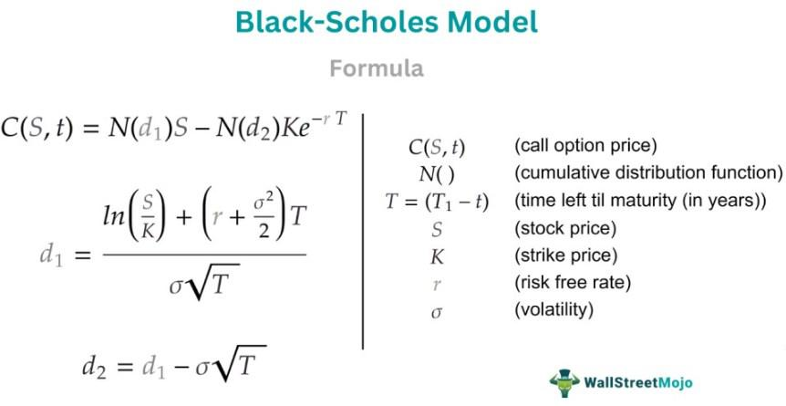

In the world of financial derivatives, the Black-Scholes Model stands out as a cornerstone for options pricing. Developed to provide a systematic approach to determine the fair value of options, this model has significantly influenced both theoretical finance and practical trading strategies. The core principle of the Black-Scholes Model is its method to calculate options prices using market variables such as current stock prices, strike prices, risk-free interest rates, the time to expiration, and volatility. It assumes that markets are efficient and that asset prices follow a lognormal distribution, enabling a risk-neutral valuation method that simplifies the complex dynamics of options pricing into a manageable formula.

This article will explore how the Black-Scholes Model operates, its benefits and limitations, and its integration with algorithmic trading strategies. Understanding these facets of the model is crucial for traders and risk managers, as it helps in formulating strategies that can predict option prices, manage risk, and leverage automated trading technologies. The model’s adaptability to algorithmic trading has further solidified its importance, allowing traders to execute strategies based on real-time data and predefined criteria.



We'll also look at the practical applications of the model in today's volatile financial markets. The model's assumptions, although sometimes not fully aligning with real-world conditions, provide a baseline that enhances market transparency and efficiency. Despite advancements in alternative models that address its limitations, the Black-Scholes Model remains a pivotal tool for traders intent on enhancing their strategies and managing risks more effectively.

## Table of Contents

## History of the Black-Scholes Model

The Black-Scholes Model, a pioneering achievement in financial economics, was introduced in 1973 by economists Fischer Black and Myron Scholes. Their groundbreaking work, later expanded by Robert Merton, provided a systematic framework for pricing options, a type of financial derivative. Options give traders the right, but not the obligation, to buy or sell an asset at a predetermined price on or before a particular expiration date. Before the development of the Black-Scholes Model, options pricing lacked a standardized and mathematically rigorous approach, causing inconsistencies and inefficiencies in financial markets.

The model's introduction was a revolution in financial theory and practice, transforming how traders and institutions understood and managed financial derivatives. It is based on a specific set of assumptions, including constant volatility, the lognormal distribution of prices, and frictionless markets. Although some of these assumptions may not perfectly align with real-world conditions, the model's ability to estimate the theoretical value of options is both instructive and practically valuable.

The Black-Scholes formula calculates the prices of European call and put options, which can only be exercised at expiration. This contrasts with American options, which can be exercised at any time before expiration. The formula considers variables such as the current stock price, the option's strike price, the risk-free interest rate, the time to expiration, and the asset's volatility. Its analytical framework has not only provided a means for valuation but also fundamentally influenced other fields, notably the evolution of algorithmic trading strategies.

One of the seminal papers detailing the model, "The Pricing of Options and Corporate Liabilities," was published in the Journal of Political Economy in 1973. Myron Scholes and Robert Merton received the 1997 Nobel Prize in Economic Sciences for their contributions to the lattice of financial economics, although Fischer Black had unfortunately passed away at the time. Their work significantly shaped the financial landscape, providing the foundational block upon which subsequent theories and models were constructed.

In practice, the Black-Scholes Model has become a central component of modern financial trading systems, often integrated into algorithmic and high-frequency trading platforms. It allows for the rapid assessment and real-time decision-making processes crucial to contemporary trading operations. The model's influence extends beyond mere options pricing; it impacts risk management and strategic planning across various financial activities and products.

## How the Black-Scholes Model Works

The Black-Scholes Model is a mathematical framework used to determine the theoretical price of European-style options, which can only be exercised at expiration. The model takes into account five key inputs: the current price of the underlying asset, the option's strike price, the risk-free [interest rate](/wiki/interest-rate-trading-strategies), the time remaining until expiration, and the asset's [volatility](/wiki/volatility-trading-strategies).

### Core Assumptions

The model assumes that the underlying asset's price follows a stochastic process known as a geometric Brownian motion, which implies that price movements are continuous and present a lognormal distribution. This assumption helps in determining the probability distribution of future asset prices. Additionally, the model employs the concept of risk-neutral valuation, whereby all investors are indifferent to risk. This allows for pricing without considering investors' risk preferences, simplifying the calculation of an option's present value.

### Mathematical Formulation

The Black-Scholes formula for the price of a European call option is given by:

$$
C = S_t \cdot N(d_1) - X \cdot e^{-rT} \cdot N(d_2)
$$

For a European put option, the formula is:

$$
P = X \cdot e^{-rT} \cdot N(-d_2) - S_t \cdot N(-d_1)
$$

Where:
- $C$ and $P$ are the call and put option prices, respectively.
- $S_t$ is the current price of the underlying asset.
- $X$ is the option's strike price.
- $r$ is the risk-free interest rate.
- $T$ is the time to expiration in years.
- $N(\cdot)$ represents the cumulative distribution function of the standard normal distribution.
- $d_1$ and $d_2$ are calculated as follows:

$$
d_1 = \frac{\ln(S_t/X) + (r + \sigma^2/2)T}{\sigma\sqrt{T}}
$$

$$
d_2 = d_1 - \sigma\sqrt{T}
$$

Here, $\sigma$ is the volatility of the underlying asset.

### Insights from the Model

Despite its inherent complexities, the Black-Scholes Model provides valuable insights into the behavior of option pricing. By breaking down the components of the model, traders can discern the impact of each individual [factor](/wiki/factor-investing) on the price of an option. This understanding is crucial in environments where market factors are dynamic, influencing the model's inputs continuously. Additionally, the model highlights the relationship between volatility and option premiums, underscoring the importance of accurate volatility estimation in pricing options effectively.

Overall, while the Black-Scholes Model requires certain assumptions that may not always hold in practice, it remains an essential tool for gaining a deeper understanding of options pricing and for making informed trading decisions.

## Black-Scholes Formula

The Black-Scholes Formula is foundational in determining the theoretical price of European call and put options. The formula is defined through a set of mathematical equations that involve key market variables. 

The calculations begin with the determination of two critical variables, $d_1$ and $d_2$, which are pivotal in assessing option prices. These variables are computed using the following equations:

$$

d_1 = \frac{\ln(\frac{S}{K}) + (r + \frac{\sigma^2}{2})T}{\sigma \sqrt{T}} 
$$

$$

d_2 = d_1 - \sigma \sqrt{T} 
$$

where:
- $S$ is the current stock price
- $K$ is the strike price
- $T$ is the time to expiration (in years)
- $r$ is the risk-free interest rate
- $\sigma$ is the volatility of the stock's returns
- $\ln$ represents the natural logarithm

These parameters allow the model to compute the cumulative standard normal distribution values $N(d_1)$ and $N(d_2)$, which are essential for calculating the option prices:

For a European call option, the formula is:

$$

C = S \cdot N(d_1) - K \cdot e^{-rT} \cdot N(d_2) 
$$

For a European put option, the formula becomes:

$$

P = K \cdot e^{-rT} \cdot N(-d_2) - S \cdot N(-d_1) 
$$

where:
- $C$ is the call option price
- $P$ is the put option price
- $e$ is the base of the natural logarithm

**Application in Decision-Making**

Traders utilize these formulas to assess whether options are over or under-priced in the market, thus informing buy or sell decisions. Additionally, these calculations can be automated using programming languages such as Python, allowing for complex financial analyses and the development of trading strategies. Here's a basic Python function to calculate call and put option prices using the Black-Scholes Formula:

```python
from math import exp, log, sqrt
from scipy.stats import norm

def black_scholes(S, K, T, r, sigma, option_type='call'):
    d1 = (log(S / K) + (r + sigma**2 / 2) * T) / (sigma * sqrt(T))
    d2 = d1 - sigma * sqrt(T)

    if option_type == 'call':
        return S * norm.cdf(d1) - K * exp(-r * T) * norm.cdf(d2)
    elif option_type == 'put':
        return K * exp(-r * T) * norm.cdf(-d2) - S * norm.cdf(-d1)

# Example usage
S = 100  # Current stock price
K = 100  # Strike price
T = 1    # Time to expiration in years
r = 0.05 # Risk-free rate
sigma = 0.2 # Volatility

call_price = black_scholes(S, K, T, r, sigma, 'call')
put_price = black_scholes(S, K, T, r, sigma, 'put')

print(f"Call Option Price: {call_price}")
print(f"Put Option Price: {put_price}")
```

This method facilitates quick and precise option pricing, aiding traders in executing informed trading decisions based on quantitative insights.

## Volatility Skew and Its Impact

The Black-Scholes Model assumes constant volatility, a simplification that often fails to match observed market behavior. Volatility skew, or the pattern of implied volatilities varying with different strike prices and expirations, highlights this discrepancy. Typically, the skew is characterized by higher implied volatilities for options that are deep in-the-money or out-of-the-money compared to at-the-money options. This phenomenon is largely attributed to market inefficiencies, investor behavior, and the potential for extreme market movements, which are not accounted for by the constant volatility assumption in the Black-Scholes framework.

Volatility skew impacts options pricing by deviating from the model's predictions, often leading to mispricing if the skew is not considered. This mispricing presents both challenges and opportunities for traders. On one hand, models not accounting for the skew may result in inaccurate valuations, increasing risk. On the other hand, understanding the nature of volatility skew can provide traders with strategic opportunities to capitalize on these pricing anomalies.

To address volatility skew, alternative models have been developed. One such model is the Stochastic Volatility Model, which incorporates randomness into volatility itself. The Heston Model, a common stochastic volatility model, introduces a mean-reverting process for volatility, allowing it to fluctuate over time. Another approach is the Local Volatility Model, as proposed by Bruno Dupire, which implies that the volatility is a function of both the current stock price and time. This offers a closer fit to the observed market prices of options.

These alternative models aim to provide a more realistic representation of market dynamics by integrating variable volatility measures, thus improving pricing accuracy. For practitioners, adapting these models often involves implementing numerical methods, such as the Finite Difference Method, Monte Carlo Simulations, or the use of Python libraries such as QuantLib, to simulate complex option pricing scenarios effectively. By accommodating the volatility skew, these refined models enhance the robustness of trading strategies, offering a better alignment with empirical data and helping traders manage risk more effectively in volatile markets.

## Benefits and Limitations of the Model

The Black-Scholes Model enhances transparency and efficiency in options pricing by providing a standardized methodology. It facilitates a common framework for traders, analysts, and financial institutions to calculate the fair value of options, contributing to more consistent decision-making across markets. This standardization is crucial in a financial environment that often operates on complex and variable pricing mechanisms.

One of the key advantages of the Black-Scholes Model is its formulaic approach, which relies on well-defined variables: current stock price, strike price, time to expiration, risk-free interest rate, and volatility. The resulting clarity helps market participants engage in more informed trading, as they can calculate theoretical option prices using these known inputs.

However, the Black-Scholes Model is built on several assumptions that may not align with real-world conditions. A primary assumption is constant volatility, which is rarely the case in dynamic financial markets. In reality, volatility can fluctuate due to various factors, including market news, economic data releases, and changing investor sentiment. This variability can lead to discrepancies between theoretical and actual option prices, impacting the model's accuracy.

Another assumption is the lognormal distribution of asset prices. The model presumes that asset prices follow a geometric Brownian motion with continuous returns, which implies a lognormal distribution. However, empirical evidence suggests that asset returns often exhibit skewness and kurtosis, deviating from the lognormal distribution. Such deviations can lead to pricing errors, particularly for options with long expiration dates or those close to being in-the-money or out-of-the-money.

Recognizing these limitations is vital for traders. By understanding the model's constraints, they can complement it with additional risk management strategies and alternative models, such as the Heston model or stochastic volatility models, to capture market nuances more effectively. Furthermore, traders can employ sensitivity metrics, like the "Greeks," to assess how changes in underlying assumptions impact option values, thereby refining their pricing strategies.

In summary, while the Black-Scholes Model remains an invaluable tool for standardizing options pricing, its assumptions necessitate cautious application and the incorporation of supplementary models and techniques to adapt to real-world market dynamics.

## Integration with Algorithmic Trading

The Black-Scholes Model is widely integrated into [algorithmic trading](/wiki/algorithmic-trading) systems, providing a robust framework for automating trading strategies. This integration optimizes decision-making through quantitative analysis, leveraging the model's formula to assess the fair value of options in real-time. By relying on the Black-Scholes Model, traders can systematically evaluate market conditions and apply predefined trading strategies that enhance efficiency and accuracy.

Python and other programming languages such as C++ or Java are predominantly used to implement the Black-Scholes formula in algorithmic trading platforms. Python, with its rich ecosystem of financial libraries like NumPy, SciPy, and Pandas, offers tools that facilitate the implementation and real-time execution of the Black-Scholes formula. For example, the formula for calculating the price of a European call option using Python is outlined below:

```python
from scipy.stats import norm
import numpy as np

def black_scholes_call(S, K, T, r, sigma):
    """
    Calculate the Black-Scholes price of a European call option.

    S : float : Current stock price
    K : float : Option strike price
    T : float : Time to expiration in years
    r : float : Risk-free interest rate
    sigma : float : Volatility of the underlying stock

    Returns the call option price.
    """
    d1 = (np.log(S / K) + (r + 0.5 * sigma ** 2) * T) / (sigma * np.sqrt(T))
    d2 = d1 - sigma * np.sqrt(T)
    call_price = S * norm.cdf(d1) - K * np.exp(-r * T) * norm.cdf(d2)
    return call_price
```

This integration into algorithmic trading systems allows for the continuous processing of market data, enabling traders to execute trades based on the dynamically computed values of options. The use of such models ensures rapid execution and alignment with market movements, thereby increasing the potential for profit while limiting exposure to risk. Moreover, the capacity to back-test and refine these strategies using historical data enables traders to ascertain the effectiveness of their trading models, facilitating ongoing strategy optimization in ever-volatile financial markets.

## Conclusion

The Black-Scholes Model persists as a crucial component of financial markets, offering a structured methodology for valuing options. Despite its foundational assumptions, such as constant volatility and a lognormal distribution of asset prices, which may not always reflect real-world conditions, its analytical framework remains highly influential. The model's simplifications enable practitioners to achieve a baseline understanding of option pricing dynamics, facilitating informed decision-making in complex financial environments.

The integration of the Black-Scholes Model with modern algorithmic trading is a testament to its continued applicability. By incorporating the model into algorithmic strategies, traders can automate decision-making processes, leveraging its quantitative outputs to optimize trade execution. The formula's elements, integrated within trading algorithms, allow traders to adjust quickly to market volatility by using real-time data to price options and manage portfolios efficiently.

Understanding the nuances of the Black-Scholes Model enables traders to refine their strategies and improve risk management. This comprehension is vital as market conditions deviate from the model's assumptions, prompting traders to employ the model as a foundational tool while adapting to anomalies through additional quantitative measures. Furthermore, the synergy between the Black-Scholes Model and algorithmic trading underscores its role not just as an academic artifact but as a dynamic instrument in achieving competitive edge and efficiency in financial markets. By embracing the model's insights and integrating them with modern technology, traders can navigate more effectively through the volatile and unpredictable landscape of today's financial markets.

## References & Further Reading

Black, F., & Scholes, M. (1973). "The Pricing of Options and Corporate Liabilities." Journal of Political Economy, 81(3), 637-654. This foundational paper lays out the original formulation of the Black-Scholes Model, providing the theoretical basis for options pricing.

Merton, R. C. (1973). "Theory of Rational Option Pricing." The Bell Journal of Economics and Management Science, 4(1), 141-183. Merton extends the Black-Scholes framework, incorporating continuous-time models and risk-neutral valuation, critical for understanding derivative pricing mechanisms.

Hull, J. C. (2017). "Options, Futures, and Other Derivatives." Pearson Education. This textbook is a comprehensive resource that covers the Black-Scholes Model and expands on various derivative instruments, market structures, and risk management techniques.

Wilmott, P. (2006). "Paul Wilmott Introduces Quantitative Finance." John Wiley & Sons. This book provides an accessible introduction to quantitative finance, including detailed discussions on the Black-Scholes Model and its applications in trading strategies.

Gatheral, J. (2006). "The Volatility Surface: A Practitioner’s Guide." Wiley Finance. This practitioner’s guide examines the volatility surface, exploring deviations from Black-Scholes assumptions such as volatility skew, and introduces alternative models for more accurate pricing and risk assessment.

