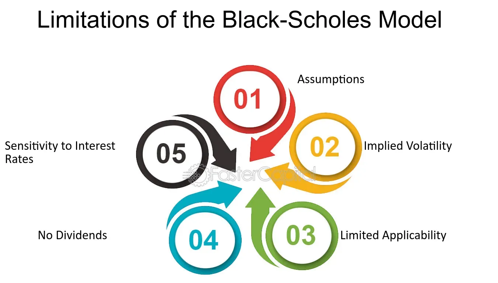

## Table of Contents

## What is the Black-Scholes model and why is it important in finance?

The Black-Scholes model is a mathematical formula used to calculate the value of options, which are financial contracts that give the buyer the right, but not the obligation, to buy or sell an asset at a certain price before a specific date. The model was developed by economists Fischer Black and Myron Scholes in 1973, and it's based on factors like the price of the underlying asset, the option's strike price, time until expiration, risk-free interest rate, and the asset's volatility. By using these inputs, the Black-Scholes model helps investors determine what an option should be worth, making it easier to decide whether to buy or sell an option.

The Black-Scholes model is important in finance because it revolutionized the way options are priced and traded. Before its introduction, pricing options was more of a guesswork, and the market was less efficient. The model brought a systematic approach to option valuation, which helped increase transparency and liquidity in the options market. This made it easier for investors to hedge their investments and manage risk. Today, the Black-Scholes model is still widely used by traders and financial analysts, although it has been refined and adapted over time to account for real-world complexities.

## What are the main assumptions of the Black-Scholes model?

The Black-Scholes model makes several key assumptions to simplify the complex world of finance. One main assumption is that the price of the underlying asset follows a lognormal distribution, meaning it can only go up or down in a predictable way over time. Another assumption is that there are no transaction costs or taxes when buying or selling options. The model also assumes that the risk-free interest rate and the volatility of the underlying asset are constant and known, which means they don't change over the life of the option.

Another important assumption is that the market is efficient, meaning all available information is already reflected in the asset's price. This means that no one can consistently predict future price movements better than anyone else. The model also assumes that the option can be exercised only at expiration, not before, which is known as a European option. These assumptions help make the math easier, but they don't always match the real world perfectly. Despite these limitations, the Black-Scholes model is still very useful for understanding and pricing options.

## How do real-world market conditions differ from the assumptions of the Black-Scholes model?

Real-world market conditions often don't match the assumptions of the Black-Scholes model. For example, the model assumes that the price of the underlying asset follows a predictable pattern, but in reality, stock prices can jump suddenly due to news or events that are hard to predict. Also, the model says that the volatility of the asset stays the same over time, but in the real world, volatility can change a lot. Sometimes the market can be calm, and other times it can be very turbulent.

Another difference is that the Black-Scholes model assumes there are no costs or taxes when trading options, but in reality, there are always costs involved, like broker fees and taxes. The model also assumes that the risk-free interest rate stays the same, but interest rates can go up and down based on what's happening in the economy. Lastly, the model only works for options that can be used at the end of their life, but many options can be used before that, which is not accounted for in the model. Even though these differences exist, the Black-Scholes model is still a useful tool for understanding how options are priced.

## What are some common limitations of the Black-Scholes model?

The Black-Scholes model has some big limitations because it makes assumptions that don't always match what happens in real markets. One big problem is that it thinks stock prices move smoothly and predictably, but in the real world, prices can jump suddenly because of news or events. It also assumes that how much a stock's price might change, called volatility, stays the same over time. But in real life, volatility can go up and down a lot, making the model less accurate.

Another limitation is that the Black-Scholes model doesn't account for things like trading costs and taxes, which are always part of real trading. It also assumes that the interest rate you can earn without risk stays the same, but interest rates can change based on what's happening in the economy. Plus, the model only works well for options that you can use at the end of their life, but many options can be used before that, which the model doesn't consider. Even with these limitations, the Black-Scholes model is still useful for understanding how options are priced.

## How can the Black-Scholes model be adjusted to account for dividends?

The Black-Scholes model can be adjusted to account for dividends by changing the formula a bit. Dividends are payments that companies make to their shareholders, and they can affect the price of a stock. When a company pays a dividend, the stock price usually drops by the amount of the dividend on the day it's paid. To account for this in the Black-Scholes model, you can subtract the present value of the expected dividends from the stock price before you use it in the formula. This way, the model will give a more accurate price for the option.

This adjustment makes the Black-Scholes model more useful for stocks that pay dividends. Without this change, the model would overestimate the price of the option because it wouldn't take into account the drop in stock price due to dividends. By including the effect of dividends, the model becomes more realistic and helps investors make better decisions about buying or selling options on stocks that pay dividends.

## What is the impact of transaction costs on the Black-Scholes model, and how can it be mitigated?

The Black-Scholes model doesn't think about the costs of buying and selling options, like broker fees and taxes. These costs can make a big difference in how much money you make or lose when trading options. If you don't account for these costs, you might think an option is a good deal when it's not, because the costs can eat into your profits.

To make the Black-Scholes model more realistic and useful, you can add these transaction costs to the model. One way to do this is by subtracting the costs from the option's price that the model gives you. This way, you get a better idea of what the option is really worth to you after you pay the costs. By including transaction costs, you can make better decisions about whether to buy or sell an option, and avoid surprises that could hurt your wallet.

## How does the Black-Scholes model handle the volatility smile, and what alternative models address this issue?

The Black-Scholes model assumes that the volatility of the underlying asset is constant, but in the real world, traders often see something called the "volatility smile." This means that the implied volatility of options changes with different strike prices, making a smile-shaped curve on a graph. The Black-Scholes model doesn't account for this, so it can give inaccurate prices for options, especially when the market shows a strong volatility smile. To handle this, traders might adjust the volatility input manually based on what they see in the market, but this doesn't solve the problem completely.

To better deal with the volatility smile, other models have been developed. One popular alternative is the Heston model, which allows volatility to change over time and be influenced by the asset's price. This makes it more flexible and able to capture the volatility smile better than the Black-Scholes model. Another option is the local volatility model, which adjusts volatility based on both the asset's price and time, giving a more detailed picture of how volatility behaves. These models are more complex but can provide more accurate option prices when the volatility smile is a big factor in the market.

## What are stochastic volatility models and how do they improve upon the Black-Scholes model?

Stochastic volatility models are a type of financial model that lets the volatility of an asset change over time in a random way. Unlike the Black-Scholes model, which assumes that volatility stays the same, stochastic volatility models say that volatility can go up and down unpredictably. This makes them more realistic because in the real world, how much a stock's price might change can vary a lot. One popular stochastic volatility model is the Heston model, which not only lets volatility change over time but also connects it to the asset's price. This means that if the stock price goes up or down a lot, the volatility might change too.

These models improve upon the Black-Scholes model by better capturing what happens in real markets. The Black-Scholes model can't explain the "volatility smile," which is when options with different strike prices have different implied volatilities. Stochastic volatility models, like the Heston model, can show this smile because they let volatility change in a more realistic way. This makes them better at pricing options, especially when the market is showing a strong volatility smile. By using these models, traders and investors can get a more accurate idea of what options are really worth, helping them make better decisions.

## How can jump diffusion models be used to overcome limitations of the Black-Scholes model?

Jump diffusion models are another way to make the Black-Scholes model better. These models add sudden jumps in the price of the asset, which can happen because of big news or events. The Black-Scholes model thinks that stock prices move smoothly and predictably, but in real life, they can jump suddenly. By adding these jumps, jump diffusion models can give a more accurate picture of how prices might change. This makes them better at pricing options, especially when the market might see big sudden changes.

These models help fix a big problem with the Black-Scholes model, which is that it doesn't account for sudden big price changes. Jump diffusion models let you include the chance of these jumps happening, making the model more realistic. By using jump diffusion models, traders and investors can get a better idea of what options are really worth, especially in markets where big news or events can cause sudden price changes. This can help them make smarter decisions about buying or selling options.

## What role does the local volatility model play in addressing the shortcomings of the Black-Scholes model?

The local volatility model helps fix some problems with the Black-Scholes model by letting the volatility change based on the price of the asset and how much time is left until the option expires. The Black-Scholes model thinks that volatility stays the same no matter what, but in the real world, volatility can change a lot. The local volatility model makes things more realistic by saying that if the stock price goes up or down a lot, the volatility might change too. This way, it can better match what happens in the market.

This model is really helpful because it can explain something called the "volatility smile," which the Black-Scholes model can't do. The volatility smile is when options with different strike prices have different implied volatilities, making a smile shape on a graph. By letting volatility change based on the asset's price and time, the local volatility model can show this smile better. This makes it more accurate for pricing options, especially when the market shows a strong volatility smile. So, traders and investors can use the local volatility model to get a better idea of what options are really worth.

## How do machine learning and artificial intelligence approaches enhance the Black-Scholes model's predictive capabilities?

Machine learning and [artificial intelligence](/wiki/ai-artificial-intelligence) can make the Black-Scholes model better at predicting option prices by learning from lots of past data. These smart computer programs can find patterns in how stock prices and options have moved in the past, even if those patterns are really hard to see. By using this information, [machine learning](/wiki/machine-learning) can help the Black-Scholes model give more accurate prices for options. It can also help the model understand things like the "volatility smile" better, which is when options with different prices have different levels of risk. This makes the model more useful for traders who want to know what options are really worth.

These advanced methods can also help the Black-Scholes model keep up with changing markets. Instead of sticking to old assumptions like constant volatility, machine learning can update the model as new information comes in. This means the model can adapt to new trends and sudden changes in the market. By using machine learning and AI, the Black-Scholes model can become more flexible and give better predictions, helping investors make smarter choices about buying and selling options.

## What advanced numerical methods are used to solve the partial differential equations associated with modifications to the Black-Scholes model?

When we want to make the Black-Scholes model better by adding things like changing volatility or sudden price jumps, we need to solve some tricky math problems called partial differential equations. To do this, people use advanced numerical methods like the finite difference method. This method breaks down the problem into smaller pieces and solves it step by step on a computer. It's like solving a big puzzle by working on little parts of it at a time. The finite difference method is good at handling the complex equations that come from adding more realistic features to the Black-Scholes model, making it more accurate for pricing options.

Another method that's used is the Monte Carlo simulation. This method works by running lots of pretend scenarios to see how the option's price might change. It's like playing out many different futures to see what might happen. Monte Carlo simulations are great for dealing with the randomness and sudden changes that can happen in the real world. They can help the Black-Scholes model account for things like the volatility smile and other complex market behaviors. By using these advanced numerical methods, we can make the Black-Scholes model more realistic and useful for traders and investors.

## How does the Black-Scholes Model work?

The Black-Scholes Model is a mathematical framework used to determine the theoretical price of European-style options, which can only be exercised at expiration. The model takes into account five key inputs: the current price of the underlying asset, the option's strike price, the risk-free [interest rate](/wiki/interest-rate-trading-strategies), the time remaining until expiration, and the asset's [volatility](/wiki/volatility-trading-strategies).

### Core Assumptions

The model assumes that the underlying asset's price follows a stochastic process known as a geometric Brownian motion, which implies that price movements are continuous and present a lognormal distribution. This assumption helps in determining the probability distribution of future asset prices. Additionally, the model employs the concept of risk-neutral valuation, whereby all investors are indifferent to risk. This allows for pricing without considering investors' risk preferences, simplifying the calculation of an option's present value.

### Mathematical Formulation

The Black-Scholes formula for the price of a European call option is given by:

$$
C = S_t \cdot N(d_1) - X \cdot e^{-rT} \cdot N(d_2)
$$

For a European put option, the formula is:

$$
P = X \cdot e^{-rT} \cdot N(-d_2) - S_t \cdot N(-d_1)
$$

Where:
- $C$ and $P$ are the call and put option prices, respectively.
- $S_t$ is the current price of the underlying asset.
- $X$ is the option's strike price.
- $r$ is the risk-free interest rate.
- $T$ is the time to expiration in years.
- $N(\cdot)$ represents the cumulative distribution function of the standard normal distribution.
- $d_1$ and $d_2$ are calculated as follows:

$$
d_1 = \frac{\ln(S_t/X) + (r + \sigma^2/2)T}{\sigma\sqrt{T}}
$$

$$
d_2 = d_1 - \sigma\sqrt{T}
$$

Here, $\sigma$ is the volatility of the underlying asset.

### Insights from the Model

Despite its inherent complexities, the Black-Scholes Model provides valuable insights into the behavior of option pricing. By breaking down the components of the model, traders can discern the impact of each individual [factor](/wiki/factor-investing) on the price of an option. This understanding is crucial in environments where market factors are dynamic, influencing the model's inputs continuously. Additionally, the model highlights the relationship between volatility and option premiums, underscoring the importance of accurate volatility estimation in pricing options effectively.

Overall, while the Black-Scholes Model requires certain assumptions that may not always hold in practice, it remains an essential tool for gaining a deeper understanding of options pricing and for making informed trading decisions.

## What is the Black-Scholes Formula?

The Black-Scholes Formula is foundational in determining the theoretical price of European call and put options. The formula is defined through a set of mathematical equations that involve key market variables. 

The calculations begin with the determination of two critical variables, $d_1$ and $d_2$, which are pivotal in assessing option prices. These variables are computed using the following equations:

$$

d_1 = \frac{\ln(\frac{S}{K}) + (r + \frac{\sigma^2}{2})T}{\sigma \sqrt{T}} 
$$

$$

d_2 = d_1 - \sigma \sqrt{T} 
$$

where:
- $S$ is the current stock price
- $K$ is the strike price
- $T$ is the time to expiration (in years)
- $r$ is the risk-free interest rate
- $\sigma$ is the volatility of the stock's returns
- $\ln$ represents the natural logarithm

These parameters allow the model to compute the cumulative standard normal distribution values $N(d_1)$ and $N(d_2)$, which are essential for calculating the option prices:

For a European call option, the formula is:

$$

C = S \cdot N(d_1) - K \cdot e^{-rT} \cdot N(d_2) 
$$

For a European put option, the formula becomes:

$$

P = K \cdot e^{-rT} \cdot N(-d_2) - S \cdot N(-d_1) 
$$

where:
- $C$ is the call option price
- $P$ is the put option price
- $e$ is the base of the natural logarithm

**Application in Decision-Making**

Traders utilize these formulas to assess whether options are over or under-priced in the market, thus informing buy or sell decisions. Additionally, these calculations can be automated using programming languages such as Python, allowing for complex financial analyses and the development of trading strategies. Here's a basic Python function to calculate call and put option prices using the Black-Scholes Formula:

```python
from math import exp, log, sqrt
from scipy.stats import norm

def black_scholes(S, K, T, r, sigma, option_type='call'):
    d1 = (log(S / K) + (r + sigma**2 / 2) * T) / (sigma * sqrt(T))
    d2 = d1 - sigma * sqrt(T)

    if option_type == 'call':
        return S * norm.cdf(d1) - K * exp(-r * T) * norm.cdf(d2)
    elif option_type == 'put':
        return K * exp(-r * T) * norm.cdf(-d2) - S * norm.cdf(-d1)

# Example usage
S = 100  # Current stock price
K = 100  # Strike price
T = 1    # Time to expiration in years
r = 0.05 # Risk-free rate
sigma = 0.2 # Volatility

call_price = black_scholes(S, K, T, r, sigma, 'call')
put_price = black_scholes(S, K, T, r, sigma, 'put')

print(f"Call Option Price: {call_price}")
print(f"Put Option Price: {put_price}")
```

This method facilitates quick and precise option pricing, aiding traders in executing informed trading decisions based on quantitative insights.

## References & Further Reading

Black, F., & Scholes, M. (1973). "The Pricing of Options and Corporate Liabilities." Journal of Political Economy, 81(3), 637-654. This foundational paper lays out the original formulation of the Black-Scholes Model, providing the theoretical basis for options pricing.

Merton, R. C. (1973). "Theory of Rational Option Pricing." The Bell Journal of Economics and Management Science, 4(1), 141-183. Merton extends the Black-Scholes framework, incorporating continuous-time models and risk-neutral valuation, critical for understanding derivative pricing mechanisms.

Hull, J. C. (2017). "Options, Futures, and Other Derivatives." Pearson Education. This textbook is a comprehensive resource that covers the Black-Scholes Model and expands on various derivative instruments, market structures, and risk management techniques.

Wilmott, P. (2006). "Paul Wilmott Introduces Quantitative Finance." John Wiley & Sons. This book provides an accessible introduction to quantitative finance, including detailed discussions on the Black-Scholes Model and its applications in trading strategies.

Gatheral, J. (2006). "The Volatility Surface: A Practitioner’s Guide." Wiley Finance. This practitioner’s guide examines the volatility surface, exploring deviations from Black-Scholes assumptions such as volatility skew, and introduces alternative models for more accurate pricing and risk assessment.

