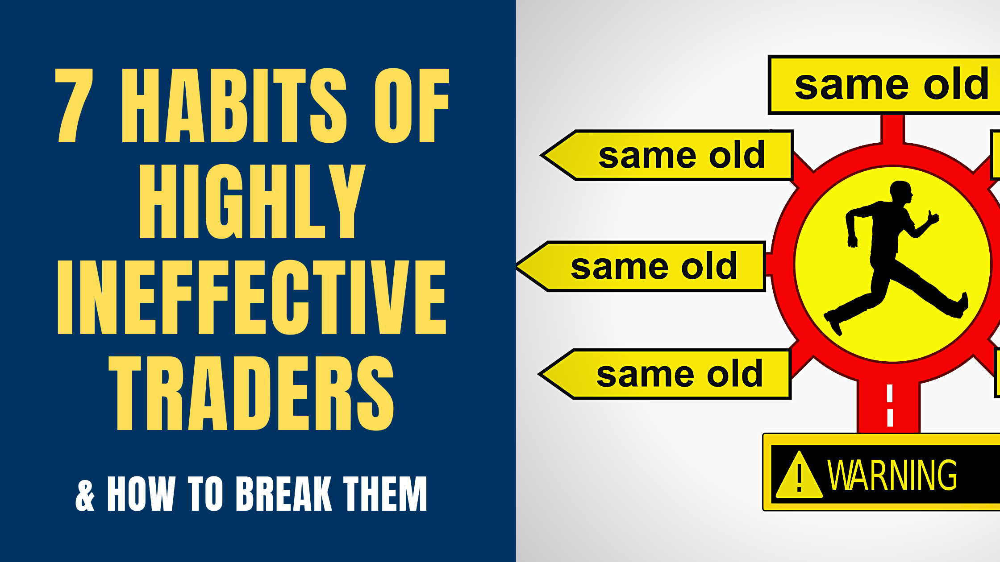

## Table of Contents

## What are common bad trading habits among beginners?

Many beginners in trading often fall into the trap of overtrading. They think that making lots of trades will help them make more money quickly. But this can lead to big losses because they don't take the time to think about each trade carefully. Overtrading can also make them feel stressed and tired, which can make them make even worse decisions.

Another common bad habit is not having a clear plan. Beginners might jump into trades without knowing why they are doing it or what they hope to achieve. This can lead to chasing after quick profits or following tips from others without understanding the risks. Having a plan helps traders stay focused and make better decisions based on their goals and the information they have.

Lastly, many beginners let their emotions control their trading. They might get too excited when they make money and take bigger risks, or they might get scared and sell too soon when the market goes down. It's important to stay calm and stick to the plan, even when things get tough. Emotional trading can lead to big mistakes and losing money.

## How can a beginner identify their own bad trading habits?

A beginner can identify their own bad trading habits by keeping a trading journal. This means writing down every trade they make, why they made it, and how they felt at the time. By looking back at their journal, they can see if they are making the same mistakes over and over, like trading too much or not sticking to their plan. They can also see if their emotions are affecting their decisions, like feeling too excited or too scared.

Another way to spot bad habits is to set clear goals and rules for trading. If a beginner finds themselves breaking these rules often, it's a sign of a bad habit. For example, if they set a rule to only trade at certain times but keep trading outside those times, that's a habit they need to fix. By comparing what they planned to do with what they actually did, they can see where they are going wrong and work on improving.

Talking to other traders or joining a trading community can also help. Other people can give feedback on what they see as bad habits. Sometimes, it's hard to see our own mistakes, but others might notice things we don't. By listening to advice and being open to changing, a beginner can break their bad trading habits and become better at trading.

## What are the basic rules a beginner should follow to improve their trading?

A beginner should start by making a clear trading plan. This means deciding what they want to achieve, how much money they are willing to risk, and what kind of trades they will make. Sticking to this plan helps them stay focused and avoid making quick decisions based on emotions. It's also important to set rules for when to buy and sell, and to follow these rules even when the market is moving a lot.

Another key rule is to manage risk carefully. This means not putting all their money into one trade and using tools like stop-loss orders to limit losses. Beginners should only risk a small part of their money on each trade, usually no more than 1-2%. This helps them stay in the game even if they lose a few trades. It's also good to learn about the markets they are trading in and to keep learning new things to get better over time.

Lastly, beginners should keep a trading journal to track their progress and learn from their mistakes. Writing down why they made each trade, what happened, and how they felt can help them see patterns in their behavior. This way, they can spot bad habits like trading too much or letting emotions control their decisions. By reviewing their journal regularly, they can make changes to improve their trading and become more successful.

## How can intermediate traders recognize when they are deviating from their trading plan?

Intermediate traders can recognize when they are deviating from their trading plan by regularly reviewing their trades and comparing them to their plan. They should check if they are sticking to the entry and [exit](/wiki/exit-strategy) points they set, and if they are following their risk management rules. If they find themselves making trades outside of these guidelines, it's a sign that they are not sticking to their plan. For example, if they planned to only trade certain stocks but start trading others, or if they are risking more money than they set out to, these are clear signs of deviation.

Another way to spot deviation is by paying attention to their emotions. If they feel more stressed or excited than usual during trades, it might mean they are not following their plan. Emotions like fear or greed can push traders to make decisions that don't align with their strategy. By keeping a trading journal and noting down their feelings during each trade, intermediate traders can see if emotional responses are causing them to stray from their plan. Regularly reviewing this journal helps them stay on track and make adjustments to improve their trading discipline.

## What strategies can intermediate traders use to reinforce good trading habits?

Intermediate traders can reinforce good trading habits by setting clear, achievable goals and sticking to them. They should regularly review their trading plan and make sure each trade fits with their strategy. If they find themselves making trades that don't match their plan, they need to stop and think about why. By setting small, reachable goals, like trading a certain number of times a week or sticking to their risk limits, they can build good habits over time. Celebrating small wins and learning from mistakes helps them stay motivated and on track.

Another way to reinforce good habits is by keeping a detailed trading journal. Writing down every trade, the reason for making it, and how they felt during the process helps traders see patterns in their behavior. If they notice they're often feeling stressed or excited, they can work on managing their emotions better. Reviewing the journal regularly allows them to see if they're sticking to their plan and where they need to improve. Over time, this practice helps them become more disciplined and consistent in their trading.

## How can an intermediate trader set up a system to monitor and correct bad habits?

An intermediate trader can set up a system to monitor and correct bad habits by using a trading journal. They should write down every trade they make, including the reasons for entering and exiting the trade, and how they felt during the process. By reviewing this journal regularly, they can spot patterns in their behavior, like trading too often or letting emotions control their decisions. If they see they are making the same mistakes over and over, they can work on changing these habits. For example, if they notice they often trade out of boredom, they can set strict trading times and stick to them.

Another part of the system is setting clear goals and rules for trading. Intermediate traders should define what they want to achieve and create rules for when to buy and sell. They can use tools like stop-loss orders to manage risk and stick to their plan. If they find themselves breaking these rules, it's a sign they need to correct their habits. They can set reminders or use software to alert them when they're about to break a rule. By regularly checking if they are meeting their goals and following their rules, they can make adjustments to stay on the right path and improve their trading over time.

## What psychological barriers do expert traders face when trying to overcome bad habits?

Expert traders often face psychological barriers when trying to overcome bad habits, one of which is overconfidence. They might have had a lot of success in the past, so they start to think they can't make mistakes. This can make them ignore their trading plan and take bigger risks than they should. When they lose money, it can be hard for them to admit they were wrong and go back to following their plan. Overcoming this barrier means being humble and always remembering that no one is perfect, even if they are good at trading.

Another psychological barrier is the fear of missing out, or FOMO. Expert traders might see other people making money quickly and want to join in, even if it doesn't fit with their trading strategy. This can lead them to make trades they shouldn't, hoping to get the same quick profits. It's hard to stick to a plan when it feels like everyone else is doing better. To overcome FOMO, expert traders need to trust their own strategy and remember that slow and steady progress is often better than trying to chase quick wins.

## How can expert traders develop and maintain discipline in their trading practices?

Expert traders can develop and maintain discipline in their trading practices by sticking to a well-defined trading plan. This means they should clearly write down their goals, the rules for when to buy and sell, and how much risk they are willing to take. By following this plan closely, they can avoid making quick decisions based on emotions or the fear of missing out. If they find themselves breaking their rules, they need to stop and think about why. Over time, this helps them build a habit of disciplined trading, which leads to more consistent results.

Another way expert traders can maintain discipline is by keeping a detailed trading journal. They should write down every trade they make, why they made it, and how they felt during the process. By looking back at their journal regularly, they can see if they are sticking to their plan or if they are letting bad habits take over. If they notice they are often feeling stressed or overconfident, they can work on managing their emotions better. This practice helps them stay focused and disciplined, even when the market is moving a lot or they are facing losses.

## What advanced techniques can expert traders use to ensure adherence to trading rules?

Expert traders can use advanced techniques like automated trading systems to help them stick to their trading rules. These systems can be set up to follow the trader's plan exactly, making trades based on the rules they have set without letting emotions get in the way. For example, if a trader has a rule to sell a stock when it drops to a certain price, the system will do it automatically. This helps the trader stay disciplined because the computer does the work, and the trader doesn't have to make quick decisions in the heat of the moment.

Another technique is using performance analytics and feedback loops. Expert traders can use software to track their trades and see how well they are following their rules. This software can give them reports that show if they are sticking to their plan or if they are breaking their rules. By looking at these reports regularly, traders can see where they need to improve and make changes to their habits. This helps them stay disciplined because they can see the results of their actions and work on getting better over time.

## How can traders at any level use technology to help overcome bad trading habits?

Traders at any level can use technology to help overcome bad trading habits by using trading software that keeps track of their trades and gives them feedback. This software can show them if they are sticking to their trading plan or if they are breaking their rules. For example, if a trader often trades too much, the software can alert them when they are about to make another trade and remind them to slow down. By seeing their habits clearly, traders can work on changing them and become more disciplined.

Another way technology helps is through automated trading systems. These systems can be set up to follow a trader's plan exactly, making trades based on the rules they have set without letting emotions get in the way. If a trader has a rule to sell a stock when it drops to a certain price, the system will do it automatically. This helps traders stay disciplined because the computer does the work, and they don't have to make quick decisions in the heat of the moment. Using technology like this can help traders at any level stick to their plan and overcome bad habits.

## What role does continuous learning and adaptation play in overcoming bad trading habits?

Continuous learning and adaptation are very important for traders who want to overcome bad trading habits. By always learning new things about the market and trading strategies, traders can see where they are going wrong and fix their habits. For example, if a trader learns about a new way to manage risk, they might realize they have been risking too much money on each trade. By learning and trying new things, traders can find better ways to trade and avoid making the same mistakes over and over.

Adapting to changes in the market is also key to overcoming bad habits. The market is always changing, and what worked before might not work now. Traders need to be ready to change their plans and habits to fit the new situation. If a trader keeps using the same old strategy even when it's not working, they might keep losing money. By staying flexible and willing to learn, traders can break bad habits and become better at trading over time.

## How can traders create a supportive environment that encourages adherence to trading rules?

Traders can create a supportive environment by joining a trading community or finding a mentor. Being around other traders who follow good habits can help them stay on track. They can share their trading plans and get feedback from others. If they start to break their rules, someone in the community might notice and remind them to stick to their plan. A mentor can also give them advice and help them see where they are going wrong. This support makes it easier for traders to stay disciplined and follow their trading rules.

Another way to create a supportive environment is by setting up a good trading space at home. This means having a quiet place where they can focus on their trades without distractions. They can use tools like trading software to help them stick to their plan. For example, they can set alerts to remind them of their rules or use automated systems to make trades for them. By making their trading space calm and organized, traders can think clearly and make better decisions. This helps them avoid bad habits and follow their trading rules more easily.

## References & Further Reading

[1]: Bergstra, J., Bardenet, R., Bengio, Y., & Kégl, B. (2011). ["Algorithms for Hyper-Parameter Optimization."](https://dl.acm.org/doi/10.5555/2986459.2986743) Advances in Neural Information Processing Systems 24.

[2]: ["Advances in Financial Machine Learning"](https://www.amazon.com/Advances-Financial-Machine-Learning-Marcos/dp/1119482089) by Marcos Lopez de Prado

[3]: ["Evidence-Based Technical Analysis: Applying the Scientific Method and Statistical Inference to Trading Signals"](https://www.amazon.com/Evidence-Based-Technical-Analysis-Scientific-Statistical/dp/0470008741) by David Aronson

[4]: ["Machine Learning for Algorithmic Trading"](https://github.com/stefan-jansen/machine-learning-for-trading) by Stefan Jansen

[5]: ["Quantitative Trading: How to Build Your Own Algorithmic Trading Business"](https://www.amazon.com/Quantitative-Trading-Build-Algorithmic-Business/dp/1119800064) by Ernest P. Chan