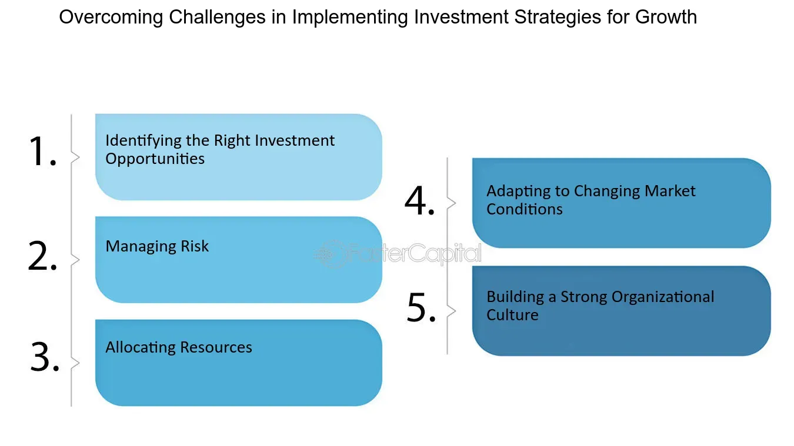

## Table of Contents

## What are common obstacles faced by beginners in investment strategies?

Beginners in investment strategies often face the challenge of understanding the complex language and concepts of the financial world. They might feel overwhelmed by terms like stocks, bonds, mutual funds, and ETFs. It's easy to get confused by all the different options and not know where to start. This lack of knowledge can make them hesitant to take the first step into investing, which is a big obstacle.

Another common issue is the fear of losing money. Many beginners are scared to invest because they worry about making a bad choice and losing their savings. This fear can lead to inaction or making overly safe investments that don't grow their money much. It's important for new investors to learn about risk and how to manage it, but this can be hard when they're just starting out.

Lastly, beginners often struggle with setting clear investment goals and sticking to a plan. Without a clear idea of what they want to achieve, it's easy to get distracted by short-term market changes or to follow the latest investment trends without thinking them through. Developing a disciplined approach to investing takes time and practice, which can be frustrating for someone new to the game.

## How can a novice investor identify and assess potential risks in their investment portfolio?

A novice investor can start by looking at the different types of investments they have. Each type of investment, like stocks, bonds, or real estate, comes with its own set of risks. For example, stocks can go up and down a lot, which means they're riskier but can also offer bigger rewards. Bonds are usually safer but might not grow as much. By understanding what each investment does, a beginner can see which ones might be riskier. They can also think about how much money they're putting into each type of investment. If too much money is in one risky area, it might be a good idea to spread it out more.

Another way to assess risk is by looking at how the investments have done in the past. This doesn't tell the future, but it can give a clue about how stable an investment might be. For example, if a stock has gone up and down a lot over the last few years, it might keep doing that. A novice investor can also use tools like risk assessment calculators found on many investment websites. These tools ask questions about the investments and give a score on how risky they are. By using these tools and looking at past performance, a beginner can get a better idea of the risks in their portfolio and make smarter choices.

## What are some basic tools or resources a beginner can use to overcome investment obstacles?

One helpful tool for beginners is a robo-advisor. A robo-advisor is a computer program that helps you invest your money. It asks you questions about your goals and how much risk you're okay with, then it picks investments for you. This makes it easier because you don't need to know everything about investing right away. The robo-advisor does the hard work for you, and it's usually cheaper than hiring a human advisor.

Another good resource is educational websites and apps. Websites like Investopedia and apps like Acorns offer a lot of free information. They explain things in simple terms and can help you learn about different investments. They also have tools like calculators that can help you see how much money you might make or lose. By using these resources, you can slowly build your knowledge and feel more confident about investing.

Lastly, joining online communities or forums can be really helpful. Places like Reddit's r/investing or Bogleheads let you talk to other people who are also learning about investing. You can ask questions, share your experiences, and get advice from people who have been investing for a while. It's a great way to learn from others and feel supported as you start your investment journey.

## How does diversification help in overcoming investment obstacles, and how can it be implemented effectively?

Diversification is a big word that just means spreading your money around in different types of investments. It helps overcome investment obstacles by reducing the risk of losing a lot of money all at once. If you put all your money in one thing, like one company's stock, and that company does badly, you could lose a lot. But if you spread your money across different stocks, bonds, and maybe even real estate, a problem with one won't hurt your whole investment plan. This way, you can sleep better at night knowing that your money is safer.

To implement diversification effectively, start by figuring out what you want to achieve with your investments. Are you saving for a house, retirement, or just trying to grow your money? Once you know your goals, you can decide how much risk you're okay with. Then, you can spread your money across different types of investments. A good rule of thumb is to not put more than 5-10% of your money in any one investment. You can also use funds like mutual funds or ETFs, which already have a mix of different investments inside them. This makes it easier to diversify without having to pick each investment yourself.

## What psychological barriers might an intermediate investor encounter, and how can they be addressed?

Intermediate investors often face psychological barriers like overconfidence. After some success, they might think they know everything about investing and start taking bigger risks. This can lead to big losses if they're not careful. To address this, it's important for them to remember that the market can be unpredictable. They should keep learning and maybe even talk to a financial advisor to get a second opinion before making big moves. Staying humble and recognizing that there's always more to learn can help them avoid the pitfalls of overconfidence.

Another common barrier is loss aversion, where the fear of losing money makes them hold onto losing investments for too long, hoping they'll bounce back. This can prevent them from cutting their losses and moving on to better opportunities. To overcome this, intermediate investors need to set clear rules for when to sell an investment, like if it drops by a certain percentage. By sticking to these rules, they can make more rational decisions and not let emotions guide their actions. It's also helpful to regularly review their portfolio and remind themselves that it's okay to take small losses to avoid bigger ones in the long run.

## How can an investor use market analysis to better navigate and overcome investment challenges?

Market analysis helps investors understand what's going on in the world of investing. By looking at things like stock prices, economic reports, and news events, investors can see trends and patterns. This can help them make smarter choices about when to buy or sell investments. For example, if market analysis shows that a certain industry is doing well, an investor might decide to put more money into stocks from that industry. On the other hand, if the analysis shows that the economy might be heading into a downturn, an investor might choose to be more cautious and move some money into safer investments like bonds.

Using market analysis also helps investors stay calm during times when the market is going up and down a lot. When everyone else is panicking, an investor who has done their homework can see that these ups and downs are normal and not get too worried. They can stick to their plan and not make quick decisions based on fear. By regularly doing market analysis, an investor can feel more confident and in control, which makes it easier to overcome the challenges that come with investing.

## What advanced strategies can be employed to mitigate risks associated with volatile markets?

One advanced strategy to handle the ups and downs of the market is called hedging. Hedging is like buying insurance for your investments. You can use things like options or futures to protect your money. For example, if you own a stock that you think might go down, you can buy an option that lets you sell it at a certain price. This way, if the stock does go down, you won't lose as much money. Hedging can be a bit complicated, but it's a powerful way to keep your investments safe when the market is acting wild.

Another strategy is called dollar-cost averaging. Instead of putting all your money into the market at once, you spread it out over time. You invest the same amount of money at regular intervals, like every month. This means you buy more shares when prices are low and fewer when prices are high. Over time, this can help you pay less on average for your investments. Dollar-cost averaging is a good way to take some of the guesswork out of investing and reduce the risk of putting all your money in at the wrong time.

## How do regulatory changes impact investment strategies, and what can an expert do to adapt?

Regulatory changes can have a big impact on investment strategies. When the government changes the rules, it can affect how much money you make or lose. For example, if new taxes are put on certain investments, they might not be as good as they used to be. Or if the government makes new rules about what companies have to do, it can change how those companies do in the market. This means investors need to keep an eye on what's happening with laws and regulations so they can adjust their plans.

An expert investor can adapt to these changes by staying informed and being ready to change their strategy. They can read news and reports about new laws and think about how these laws might affect their investments. If a new rule makes an investment less good, they might decide to sell it and put their money somewhere else. They can also talk to other experts or financial advisors to get different ideas on how to handle the changes. By being flexible and always learning, an expert can keep their investments strong even when the rules change.

## What role does technological advancement play in overcoming investment obstacles, and how can it be leveraged?

Technological advancement has made a big difference in helping people overcome investment obstacles. With new tools and apps, it's easier for people to learn about investing and manage their money. For example, there are apps that let you invest with just a few dollars, so you don't need a lot of money to start. Also, there are websites and tools that explain investing in simple terms, which helps people who are just starting out. Technology also lets you keep an eye on your investments all the time, so you can see what's happening and make quick decisions if you need to.

To make the most of these technological advancements, investors can use different tools to help them. For example, robo-advisors can pick investments for you based on what you want and how much risk you're okay with. This can save time and help you make better choices. There are also tools like stock screeners that help you find good investments by looking at a lot of data quickly. By using these technologies, investors can learn more, make better decisions, and feel more confident about their investments.

## How can an expert investor use alternative investments to diversify and reduce risk?

An expert investor can use alternative investments to spread their money around and lower their risk. Alternative investments are things like real estate, commodities, hedge funds, and private equity. These are different from regular investments like stocks and bonds. By putting some money into these alternatives, an expert can protect their money if the stock market goes down. For example, if stocks are doing badly, real estate might still be doing well. This way, the investor's whole portfolio doesn't go down at the same time.

To use alternative investments effectively, an expert needs to understand how they work and how much risk they come with. Some alternative investments, like hedge funds, can be riskier but might offer bigger rewards. Others, like real estate, can be more stable but take longer to grow. The expert can choose a mix of these investments based on their goals and how much risk they're okay with. By carefully [picking](/wiki/asset-class-picking) and balancing these alternatives, they can make their overall investment plan stronger and less likely to be hurt by problems in just one area.

## What are the best practices for reviewing and adjusting an investment strategy in response to unforeseen obstacles?

When unexpected problems come up, it's important to look at your investment plan and make changes if needed. Start by checking your investments to see how they're doing. Look at things like how much money you're making or losing, and how much risk you're taking. If something big happens, like a big drop in the market or a new law, think about how it might affect your plan. You might need to sell some investments that are doing badly or buy new ones that are a better fit for the new situation. It's also a good idea to talk to a financial advisor or other experts to get their advice on what to do.

Making changes to your investment strategy should be done carefully and with a clear plan. Don't make quick decisions based on fear or excitement. Instead, take a step back and think about your long-term goals. Are you still on track to reach them? If not, what small changes can you make to get back on track? Sometimes, it might be better to wait and see how things go before making big moves. By staying calm and sticking to your plan, you can handle unexpected obstacles better and keep your investments strong over time.

## How can an investor balance short-term gains with long-term investment goals while overcoming various obstacles?

Balancing short-term gains with long-term investment goals can be tough, especially when you face different obstacles. One way to do this is by setting clear goals for both the short and long term. For the short term, you might want to make some quick money, so you could put a small part of your money into investments that can go up and down a lot, like certain stocks. But, you should keep most of your money in safer investments that will grow slowly over time, like index funds or bonds. This way, you can try to make some quick money without risking too much of your long-term savings.

Another important thing is to stay disciplined and not let emotions guide your decisions. When the market goes up and down a lot, it's easy to get scared and sell your investments, or get too excited and buy too much. Instead, stick to your plan and keep checking your investments to make sure they're still helping you reach your goals. If something big happens, like a market crash or a new law, take a deep breath and think about how it might affect your plan. You might need to make some small changes, but don't let short-term problems make you forget about your long-term goals. By staying focused and making smart choices, you can balance short-term gains with long-term success.

## What are Investment Strategies to Overcome Barriers?

Diversification is a fundamental strategy to mitigate risk and enhance returns in investing. By spreading investments across various asset classes such as stocks, bonds, and Exchange-Traded Funds (ETFs), investors can reduce their exposure to the [volatility](/wiki/volatility-trading-strategies) of a single asset. This strategy is based on the principle that different asset classes often react differently to the same economic event; thus, when one asset class underperforms, another may perform well, balancing the overall portfolio performance. For instance, while stocks might be volatile, bonds generally offer more stability, and ETFs provide a mixture of the two.

Long-term investment planning is crucial for aligning investment actions with financial goals. This approach discourages reactionary behavior to short-term market fluctuations, which can often lead to suboptimal decisions. By focusing on long-term objectives, investors can maintain a disciplined approach, avoiding the pitfalls of making impulsive decisions based on market volatility. A classic representation of this is the power of compounding, where reinvested earnings lead to growth over time, illustrated by the formula:

$$
A = P \left(1 + \frac{r}{n}\right)^{nt}
$$

where $A$ is the amount of money accumulated after n years, including interest, $P$ is the principal amount, $r$ is the annual interest rate, and $n$ is the number of times that interest is compounded per year.

Educating oneself about market dynamics is paramount for improving decision-making and boosting investor confidence. Familiarity with market mechanisms, economic indicators, and financial instruments empowers individuals to make informed choices. Resources for education range from online courses and financial news to seminars and workshops, enabling investors to gain insights into investment strategies and risk management techniques.

Overall, employing these strategies can significantly contribute to overcoming financial barriers in investing, leading to more effective and rewarding investment outcomes. Continuous learning and the adaptation of investment approaches remain crucial as market conditions evolve.

 to Algorithmic Trading

Algorithmic trading leverages advanced computer algorithms to automate the decision-making and execution of trades in financial markets. These algorithms are designed to follow predefined criteria—such as timing, price, or trade [volume](/wiki/volume-trading-strategy)—to implement trading strategies systematically. By executing trades based on a set algorithm, this approach helps remove the emotional biases that often plague human traders, thus promoting a disciplined investment paradigm.

The core advantage of [algorithmic trading](/wiki/algorithmic-trading) is its ability to process and analyze large volumes of data rapidly, providing a competitive edge in the fast-paced environment of financial markets. High-frequency trading ([HFT](/wiki/high-frequency-trading-strategies)), a subset of algorithmic trading, showcases the speed and efficacy of algorithms by making split-second transactions that would be impossible for human traders to perform manually. Algorithmic systems can handle complex calculations and multiple variables, ensuring that the timing of trades is optimized for maximum profitability.

For instance, an algorithm might be designed to execute a trade when a stock's moving average crosses a particular threshold, a signal interpreted as a buy or sell opportunity. By adhering strictly to algorithmic logic, trades can occur almost instantaneously as conditions are met, thus capitalizing on market efficiencies. Financial markets are characterized by rapid information flow and dynamic pricing, making the ability to react promptly a significant advantage.

Algorithmic trading also plays a crucial role in mitigating trading costs. By eliminating the inefficiencies inherent in human trading, algorithms reduce the impact of slippage—a discrepancy between the expected price of a trade and the actual executed price. Moreover, the automation of processes allows for simultaneous execution across different markets, facilitating [arbitrage](/wiki/arbitrage) strategies that exploit price differentials without manual intervention.

The strategic application of algorithmic trading requires an understanding of various technical and quantitative aspects. Algorithms often incorporate elements such as statistical analysis, historical data [backtesting](/wiki/backtesting), and real-time data feeds to make informed trading decisions. While algorithms are not infallible and require regular updates and oversight, their utilization represents a significant advancement in investment practices, offering investors a tool to enhance precision and reduce errors in trade execution.

## What are some popular algorithmic trading strategies?

Algorithmic trading, a paradigm shift in the investment domain, utilizes advanced computer programs to implement strategies based on quantitative models. Among the plethora of strategies, the Trend-Following, Arbitrage, and Mean Reversion strategies stand out due to their efficacy and theoretical underpinnings.

### Trend-Following Strategy

The trend-following strategy capitalizes on the [momentum](/wiki/momentum) of market trends. This strategy is predicated on the assumption that assets which have been moving in a certain direction will continue to move in that direction. Trend followers employ indicators like moving averages to pinpoint trends. A simple moving average (SMA) or an exponential moving average (EMA) can be calculated as follows:

$$
\text{SMA}(t) = \frac{\sum_{i=0}^{N-1} P(t-i)}{N}
$$

where $P(t)$ is the price at time $t$, and $N$ is the period of the moving average.

Python provides seamless utilities for implementing such strategies. For instance, using the Pandas library, one can easily compute the EMA:

```python
import pandas as pd

data['EMA'] = data['Close'].ewm(span=20, adjust=False).mean()
```

This code snippet calculates the EMA over a 20-day span, offering insights into the trend dynamics.

### Arbitrage Strategy

Arbitrage strategies aim to exploit price discrepancies of the same asset across different markets. These discrepancies can result from market inefficiencies and provide risk-free profit opportunities. Triangular arbitrage, commonly seen in [forex](/wiki/forex-system) markets, is a classic example. It involves three currency pairs and assumes that discrepancies will be corrected, thus generating a profit without any market exposure.

The viability of arbitrage strategies, however, hinges on high-speed execution. Technological advancements have introduced high-frequency trading (HFT), enabling rapid execution of trades and nullifying price gaps that exist only for split seconds.

### Mean Reversion Strategy

The mean reversion strategy is grounded in the assumption that an asset's price will revert to its historical mean over time. This implies that deviations from the average are temporary. Investors who subscribe to this strategy might use statistical measures such as the Bollinger Bands, which define price levels around a moving average, to identify deviation extent.

A mathematical representation of mean reversion can be illustrated by the Ornstein-Uhlenbeck process, a stochastic differential equation often used to model this behavior:

$$
dX_t = \theta (\mu - X_t) dt + \sigma dW_t
$$

where $\theta$ is the rate of reversion, $\mu$ is the long-term mean, $\sigma$ is the volatility, and $dW_t$ is a Wiener process.

This approach often favors liquid markets where asset prices reflect prevalent information and tend to revert to established levels.

In conclusion, algorithmic trading strategies like trend-following, arbitrage, and mean reversion are powerful tools in modern finance. These strategies leverage quantitative methods and technological advancements to seek advantages in various market conditions. Understanding their intricacies enables traders to optimize their investment activities and harness the full potential of algorithmic trading.

## References & Further Reading

[1]: "Advances in Financial Machine Learning" by Marcos Lopez de Prado, available at [Amazon](https://www.amazon.com/Advances-Financial-Machine-Learning-Marcos/dp/1119482089).

[2]: J. Bergstra, R. Bardenet, Y. Bengio, & B. Kégl (2011). "Algorithms for Hyper-Parameter Optimization." Available at [NIPS Proceedings](https://dl.acm.org/doi/10.5555/2986459.2986743).

[3]: "Evidence-Based Technical Analysis: Applying the Scientific Method and Statistical Inference to Trading Signals" by David Aronson, available at [Wiley](https://www.amazon.com/Evidence-Based-Technical-Analysis-Scientific-Statistical/dp/0470008741).

[4]: "Machine Learning for Algorithmic Trading" by Stefan Jansen, available at [Amazon](https://www.amazon.com/Machine-Learning-Algorithmic-Trading-alternative/dp/1839217715).

[5]: "Quantitative Trading: How to Build Your Own Algorithmic Trading Business" by Ernest P. Chan, available at [Amazon](https://www.amazon.com/Quantitative-Trading-Build-Algorithmic-Business/dp/0470284889).